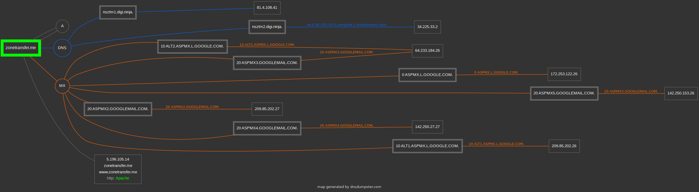

# Information Gathering

> ## ⚡ Prerequisites
>
> - Basic familiarity with Linux
> - Basic familiarity with web technologies
>
> ## 📕 Learning Objectives
>
> - Differences between **active** and **passive** information gathering
> - Perform passive and active information gathering with various tools and resources
>

**Information gathering** (***Reconnaissance***) is the initial stage of any penetration test and one of the most important phase.

- It involves finding out as much information as possible about a targeted individual, website, company or system.
- The more information a pentester has on a **target**, the more successful and easier the latter stages of a pentest will be. It depends on the **scope** of the penetration test too.
- `E.g.1` - Pentest on a Website: web technology, vulnerabilities, IP address of the hosting server.
- `E.g.2` - Pentest on a public facing assets and some internal systems, there can be more attack vectors:
  - gain access to the internal network through the public facing web server (one **access vector**)
  - during the info-gathering phase, learn more about the company employees (names, email addresses, credentials), getting this important information (useful for exploitation or initial access) by using phishing attacks, malicious attachments via email (another **access vector**)


## Passive Information Gathering Introduction

**Passive information gathering** involves *obtaining as much data as possible without actively interacting with the target*. 

- The pentester uses what's available on the Internet.
- `E.g.` - Website: utilizing publicly accessible information and resources of that particular website, through the browser, public IP address of the webserver hosting that website, etc.

### What passive information?

- IP addresses, DNS, domain names and domain ownership
- Email addresses, social media profiles
- Web technologies, subdomains

## Active Information Gathering Introduction

**Active information gathering** involves *obtaining as much information as possible by actively engaging with the target*.

- ❗***An authorization is required to conduct active information gathering.***
- The target will be aware of the attacker's engagement.
- `E.g.` - Website: perform a port scan of the webserver IP address (found with passive info gathering) using **`nmap`** tool to identify the open ports and running services. Identify exploitable vulnerabilities on those services and consequently access the web server.

### What active information?

- Open ports, internal network/organization infrastructure
- Enumeration target info

### Code of conduct

> 📌 From the [The Pentester's Code of Conduct - by Sherri Davidoff](https://www.lmgsecurity.com/the-pentesters-code-of-conduct-rules-that-keep-everyone-safe/)
>
> - **Know your scope.**
> - **Do not exceed your scope.**
> - **Take responsibility.**
> - **Only hack when under signed contract.**
> - **Verify your targets** well in advance of the start of an engagement, and have the list in writing.
> - **Do a thorough and complete job.**
> - **Take careful notes.**
> - **Upload your evidence to a central repository as** soon as you can.
> - **Know your client.**
> - **Communicate** with your teammates, your client, and your project managers.
> - **Know your limitations and do not exceed them.**
> - **Treat all others with respect.**
> - **Own your mistakes.**
> - **Include your best suggestions for a solution when reporting a problem.**
> - **Google first, then ask questions.**
> - **Share your knowledge.**
> - **Above all, exercise common sense.**

------

## Passive Information Gathering

### Website Reconnaissance & Footprinting

- **Footprinting** is like reconnaissance, with more important information about a particular target.

| What to look for in a Website? |
| :----------------------------- |
| IP addresses of the web server |
| Hidden directories             |
| Names, Email addresses         |
| Phone numbers                  |
| Physical Addresses             |
| Web technologies               |

**`E.g.`** - Passive Reconnaissance on [hackersploit.org](https://hackersploit.org/):

- **`host`** command

```bash
host hackersploit.org
    hackersploit.org has address 188.114.97.7
    hackersploit.org has address 188.114.96.7
    hackersploit.org has IPv6 address 2a06:98c1:3121::7
    hackersploit.org has IPv6 address 2a06:98c1:3120::7
    hackersploit.org mail is handled by 0 _dc-mx.2c2a3526b376.hackersploit.org.
```

- 2 IP addresses found - the website is behind Cloudflare proxy.
  - Check the [DNSLytics Report](https://dnslytics.com/domain/hackersploit.org) too.
- Social Links at the bottom of the main page:


- **`robots.txt`** file - [https://hackersploit.org/robots.txt](https://hackersploit.org/robots.txt)
  - Avoid having the site indexed by search engines by using the "Disallow" feature, which lets the site owner designate which file or folder not to index.
  - **`/wp-content`** indicates that the website is running Wordpress


- **`sitemap.xml`** file - [https://hackersploit.org/sitemap.xml](https://hackersploit.org/sitemap.xml)
  - Used to provide search engines with an organized way of indexing the website.
  - List of site pages, categories, author, etc


- Broswer add-ons for **Web Technology footprinting**:
  - [Wappalyzer](https://www.wappalyzer.com/) - find out the technology stack of the website


- **`whatweb`** command


- Download the entire website, for analyzing the source code for example:
  - [HTTrack](https://www.httrack.com/)

```bash
sudo apt install httrack
# Open from start menu "WebHTTrack Website Copier", opening up the web instance
```


### Whois Enumeration

- **[Whois](https://g.co/kgs/YizQVp)** lookups are used to identify information regarding a particular domain.
  - Date of registration, Owner, Registrar, Owner Email address, etc
  - **`WHOIS`** *is a query and response protocol that is widely used for querying databases that store the registered users or assignees of an Internet resource, such as a domain name, an IP address block or an autonomous system, but is also used for a wider range of other information.* - [Whois - Wikipedia](https://en.wikipedia.org/wiki/WHOIS)
- **`whois`** command


- [who.is](https://who.is/whois/hackersploit.org) site
- [domaintools.com](https://whois.domaintools.com/hackersploit.org) site


### Website Footprinting with Netcraft

- **[Netcraft](https://www.netcraft.com/internet-data-mining/)** *provides internet security services for a large number of use cases, including cybercrime detection and disruption, application testing and PCI scanning.*
  - It collates previous information identified with other tools and outputs an easy to read format.
- [Netcraft - Hackersploit.org](https://sitereport.netcraft.com/?url=https://hackersploit.org) - check the information needed for the pentest:
  - Background
  - Network: domain IP address, Nameserver, Domain registrar, IP delegation
  - SSL/TLS Certificate: Issuer, Validity, Transparency, vulnerabilities
  - Hosting History
  - Web Trackers
  - Site Technology: Server-Side, Client-Side, Frameworks, etc


### DNS Reconnaissance

- DNS Recon is used to identify DNS records associated to a domain, like A record, IP address, mail server IP.
- [**`dnsrecon`**](https://github.com/darkoperator/dnsrecon) tool - a Python script that provides the ability to perform NS/DNS Records Enumeration, records lookup, subdomain brute force, etc.


```bash
dnsrecon -d hackersploit.org
# It responds with the NameServer addresses (NS)
# A record - IPv4 address of the website
# AAAA record - IPv6 addresses
# MX record - mail server address
# TXT record - domain/site verification or other values (SPF ...)
```


- [dnsdumpster.com](https://dnsdumpster.com/) site
  - discover hosts related to a domain
  - map the domain in a graph `.png` image or `.xlsx` file.




### WAF

- **W**eb **A**pplication **F**irewall (**`WAF`**) detection with [wafw00f](https://github.com/EnableSecurity/wafw00f). It does the following:
  - *Sends a normal HTTP request and analyses the response; this identifies a number of WAF solutions.*
  - *If that is not successful, it sends a number of (potentially malicious) HTTP requests and uses simple logic to deduce which WAF it is.*
  - *If that is also not successful, it analyses the responses previously returned and uses another simple algorithm to guess if a WAF or security solution is actively responding to our attacks.*


```bash
wafw00f -l
# List all WAFs that it is able to detect
```


```bash
# -a option
wafw00f hackertube.net -a
wafw00f zonetransfer.me -a
```


- This would be definitely tested within the *active information gathering* phase with a port scan on the webserver IP address.

### Subdomain Enumeration with Sublist3r

- To identify the subdomains of a specific domain in a passive way, **publicly available resources and databases** can be utilized.
- [**`sublist3r`**](https://github.com/aboul3la/Sublist3r) tool - a Python tool that enumerate subdomains of websites using OSINT (**O**pen-**S**ource **Int**eligence).
  - this example is NOT active enumeration - is is passive (using public available resources)
  - it enumerates subdomains using search engines (Google, Yaoo, Bing ...) and other tools (Netcraft, Virustotal, DNSdumpster, ReverseDNS, ThreatCrowd).


```bash
sudo apt install sublist3r

sublist3r -d hackersploit.com
sublist3r -d hackersploit.com -e google,yahoo
sublist3r -d hackersploit.com -o hs_sub_enum.txt
# Find hackersploit.com subdomains and save the results to a text file
```


### Google Dorks

- 

### Email Harvesting

### Leaked Password Databases

------

## Active Information Gathering

### DNS Zone Transfers

### Host Discovery with Nmap

### Port Scanning With Nmap
