# Information Gathering

> #### ⚡ Prerequisites
>
> * Basic familiarity with Linux
> * Basic familiarity with web technologies
>
> #### 📕 Learning Objectives
>
> * Differences between **active** and **passive** information gathering
> * Perform passive and active information gathering with various tools and resources

🗒️ **Information gathering** (_**Reconnaissance**_) is the initial stage of any penetration test and one of the most important phase.

* It involves finding out as much information as possible about a targeted individual, website, company or system.
* The more information a pentester has on a **target**, the more successful and easier the latter stages of a pentest will be. It depends on the **scope** of the penetration test too.
* `E.g.1` - Pentest on a Website: web technology, vulnerabilities, IP address of the hosting server.
* `E.g.2` - Pentest on a public facing assets and some internal systems, there can be more attack vectors:
  * gain access to the internal network through the public facing web server (one **access vector**)
  * during the info-gathering phase, learn more about the company employees (names, email addresses, credentials), getting this important information (useful for exploitation or initial access) by using phishing attacks, malicious attachments via email (another **access vector**)

## Passive Information Gathering Introduction

🗒️ [**Passive information gathering**](1-info-gathering.md#passive-information-gathering) involves _obtaining as much data as possible without actively interacting with the target_.

* The pentester uses what's available on the Internet.
* `E.g.` - Website: utilizing publicly accessible information and resources of that particular website, through the browser, public IP address of the webserver hosting that website, etc.

### What passive information?

* IP addresses, DNS, domain names and domain ownership
* Email addresses, social media profiles
* Web technologies, subdomains

## Active Information Gathering Introduction

🗒️ [**Active information gathering**](1-info-gathering.md#active-information-gathering) involves _obtaining as much information as possible by actively engaging with the target_.

> ❗_**An authorization is required to conduct active information gathering.**_

* The target will be aware of the attacker's engagement.
* `E.g.` - Website: perform a port scan of the webserver IP address (found with passive info gathering) using **`nmap`** tool to identify the open ports and running services. Identify exploitable vulnerabilities on those services and consequently access the web server.

### What active information?

* Open ports, internal network/organization infrastructure
* Enumeration target info

### Code of conduct

> 📌 From the [The Pentester's Code of Conduct - by Sherri Davidoff](https://www.lmgsecurity.com/the-pentesters-code-of-conduct-rules-that-keep-everyone-safe/)
>
> * **Know your scope.**
> * **Do not exceed your scope.**
> * **Take responsibility.**
> * **Only hack when under signed contract.**
> * **Verify your targets** well in advance of the start of an engagement, and have the list in writing.
> * **Do a thorough and complete job.**
> * **Take careful notes.**
> * **Upload your evidence to a central repository as** soon as you can.
> * **Know your client.**
> * **Communicate** with your teammates, your client, and your project managers.
> * **Know your limitations and do not exceed them.**
> * **Treat all others with respect.**
> * **Own your mistakes.**
> * **Include your best suggestions for a solution when reporting a problem.**
> * **Google first, then ask questions.**
> * **Share your knowledge.**
> * **Above all, exercise common sense.**
>
> 🚩🔬 [zonetransfer.me](https://digi.ninja/projects/zonetransferme.php) domain will be utilized for training purposes and examples.

***

## Passive Information Gathering

### Website Reconnaissance & Footprinting

🗒️ **Footprinting** is like reconnaissance, with more important information about a particular target.

| What to look for in a Website? |
| ------------------------------ |
| IP addresses of the web server |
| Hidden directories             |
| Names, Email addresses         |
| Phone numbers                  |
| Physical Addresses             |
| Web technologies               |

**`E.g.`** - Passive Reconnaissance on [hackersploit.org](https://hackersploit.org/):

> **`host`** command

```bash
host hackersploit.org
    hackersploit.org has address 188.114.97.7
    hackersploit.org has address 188.114.96.7
    hackersploit.org has IPv6 address 2a06:98c1:3121::7
    hackersploit.org has IPv6 address 2a06:98c1:3120::7
    hackersploit.org mail is handled by 0 _dc-mx.2c2a3526b376.hackersploit.org.
```

* 2 IP addresses found - the website is behind Cloudflare proxy.
  * Check the [DNSLytics Report](https://dnslytics.com/domain/hackersploit.org) too.
* Social Links at the bottom of the main page:


> **`robots.txt`** file - [https://hackersploit.org/robots.txt](https://hackersploit.org/robots.txt)

* Avoid having the site indexed by search engines by using the "Disallow" feature, which lets the site owner designate which file or folder not to index.
* **`/wp-content`** indicates that the website is running Wordpress

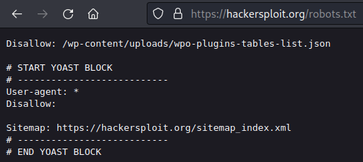

> **`sitemap.xml`** file - [https://hackersploit.org/sitemap.xml](https://hackersploit.org/sitemap.xml)

* Used to provide search engines with an organized way of indexing the website.
* List of site pages, categories, author, etc

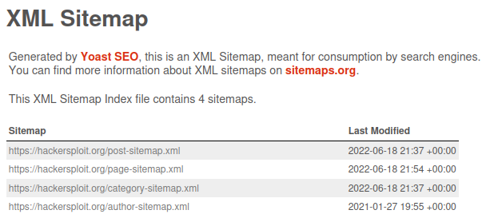

> Broswer add-ons for **Web Technology footprinting**:

* [Wappalyzer](https://www.wappalyzer.com/) - find out the technology stack of the website


> [**`whatweb`**](https://github.com/urbanadventurer/WhatWeb) command

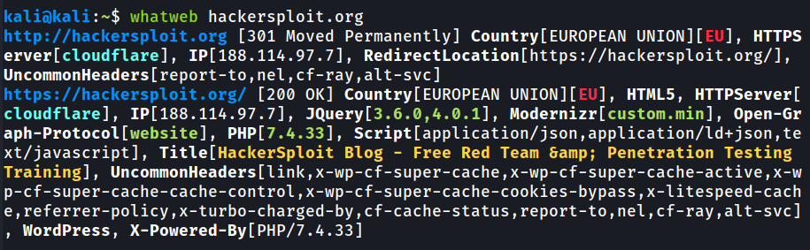

> Download the entire website, for analyzing the source code for example:

* [HTTrack](https://www.httrack.com/)

```bash
sudo apt install httrack
# Open from start menu "WebHTTrack Website Copier", opening up the web instance
```

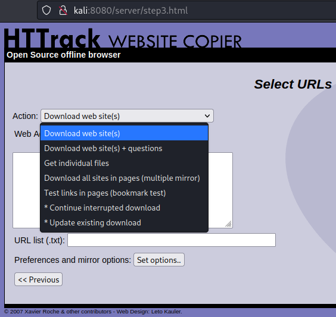

### Whois Enumeration

[**Whois**](https://g.co/kgs/YizQVp) lookups are used to identify information regarding a particular domain.

* Date of registration, Owner, Registrar, Owner Email address, etc
* **`WHOIS`** _is a query and response protocol that is widely used for querying databases that store the registered users or assignees of an Internet resource, such as a domain name, an IP address block or an autonomous system, but is also used for a wider range of other information._ - [Whois - Wikipedia](https://en.wikipedia.org/wiki/WHOIS)

> **`whois`** command

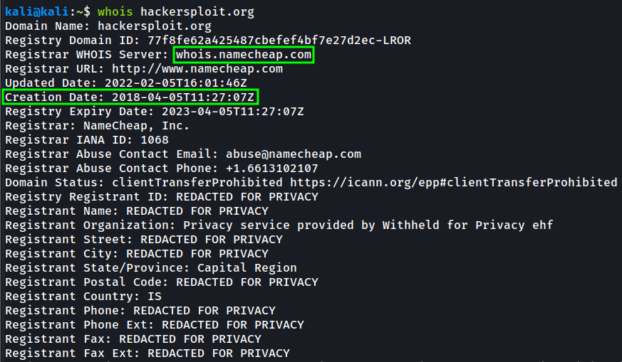

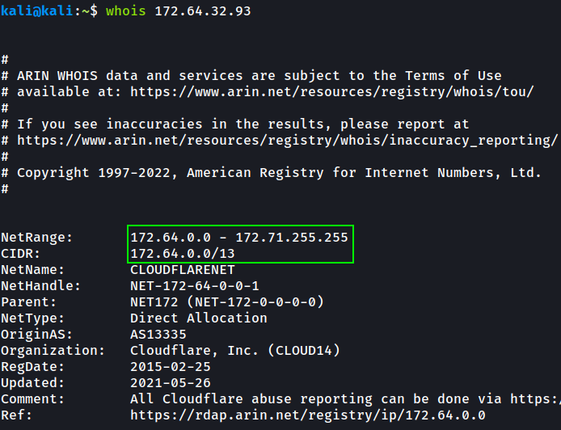

* [**who.is**](https://who.is/whois/hackersploit.org) site
* [**domaintools.com**](https://whois.domaintools.com/hackersploit.org) site

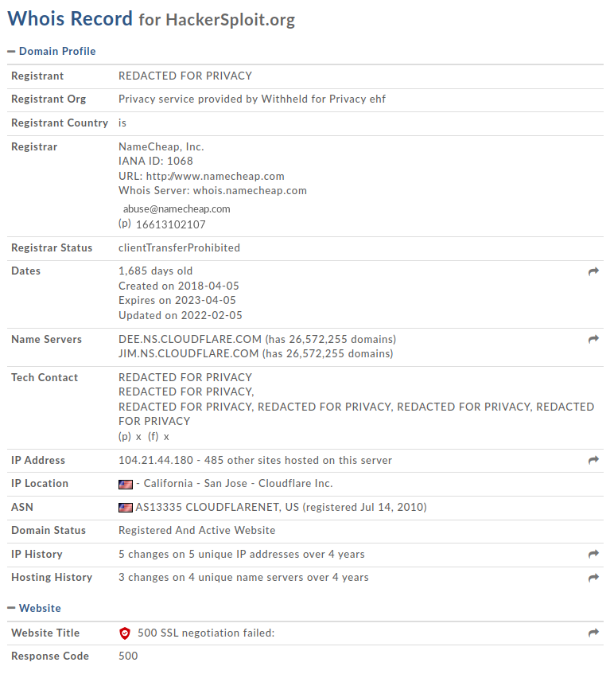

### Website Footprinting with Netcraft

> [**Netcraft**](https://www.netcraft.com/internet-data-mining/) _provides internet security services for a large number of use cases, including cybercrime detection and disruption, application testing and PCI scanning._

* It collates previous information identified with other tools and outputs an easy to read format.

**`E.g.`** - [Netcraft - Hackersploit.org](https://sitereport.netcraft.com/?url=https://hackersploit.org) - check the information needed for the pentest:

* Background
* Network: domain IP address, Nameserver, Domain registrar, IP delegation
* SSL/TLS Certificate: Issuer, Validity, Transparency, vulnerabilities
* Hosting History
* Web Trackers
* Site Technology: Server-Side, Client-Side, Frameworks, etc


### DNS Reconnaissance

🗒️ **DNS Recon** is used to _identify DNS records associated to a domain_, like A record, IP address, mail server IP.

> [**`dnsrecon`**](https://github.com/darkoperator/dnsrecon) tool - a Python script that provides the ability to perform NS/DNS Records Enumeration, records lookup, subdomain brute force, etc.

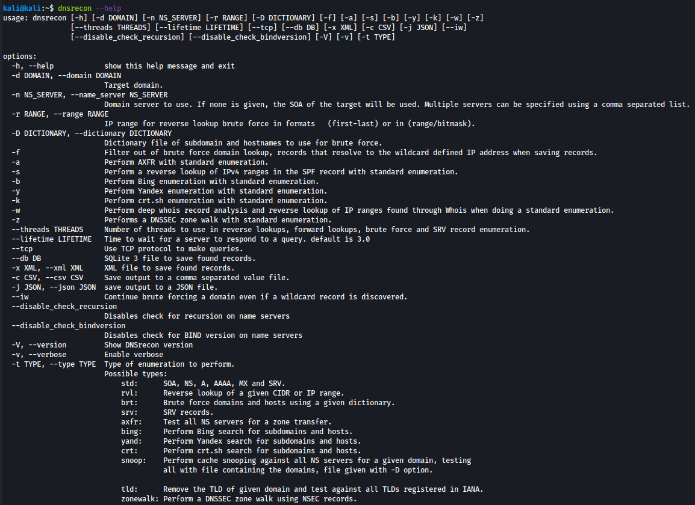

```bash
dnsrecon -d hackersploit.org
# It responds with the NameServer addresses (NS)
# A record - IPv4 address of the website
# AAAA record - IPv6 addresses
# MX record - mail server address
# TXT record - domain/site verification or other values (SPF ...)
```

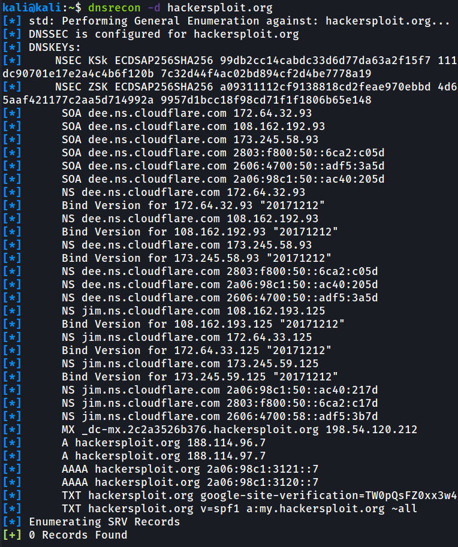

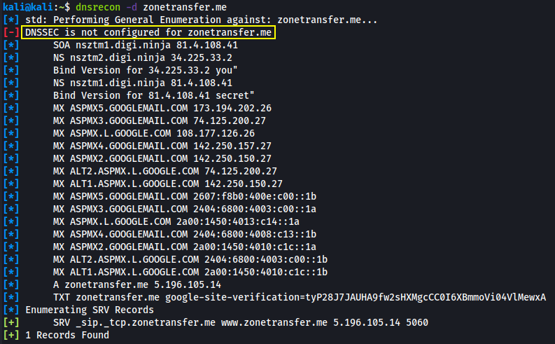

> [**dnsdumpster.com**](https://dnsdumpster.com/) site

* discover hosts related to a domain
* map the domain in a graph `.png` image or `.xlsx` file.

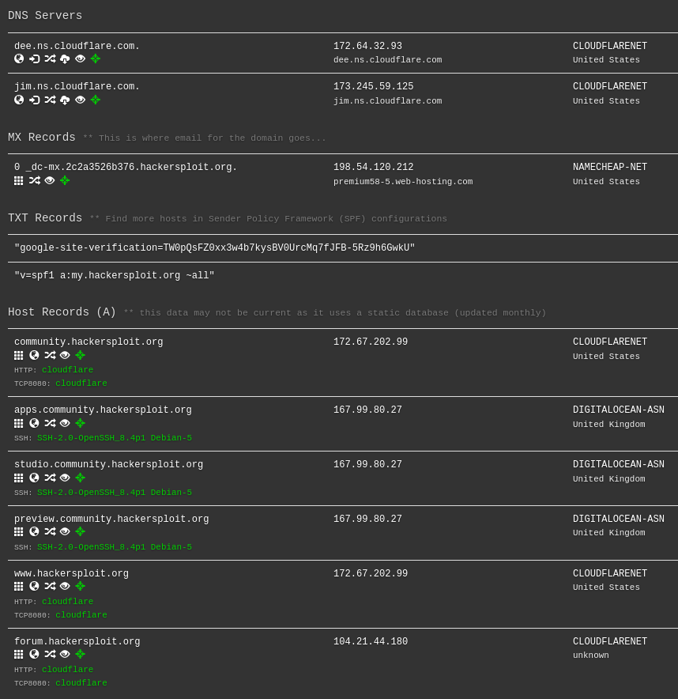

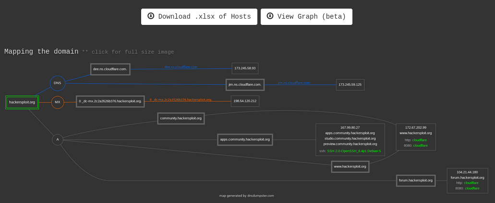

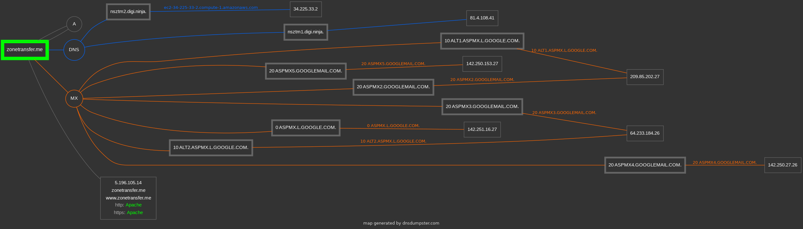

### WAF

> **W**eb **A**pplication **F**irewall (**`WAF`**) detection with [**`wafw00f`**](https://github.com/EnableSecurity/wafw00f).

It does the following:

* _Sends a normal HTTP request and analyses the response; this identifies a number of WAF solutions._
* _If that is not successful, it sends a number of (potentially malicious) HTTP requests and uses simple logic to deduce which WAF it is._
* _If that is also not successful, it analyses the responses previously returned and uses another simple algorithm to guess if a WAF or security solution is actively responding to our attacks._

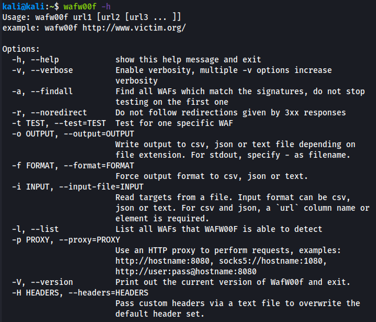

```bash
wafw00f -l
# List all WAFs that it is able to detect
```

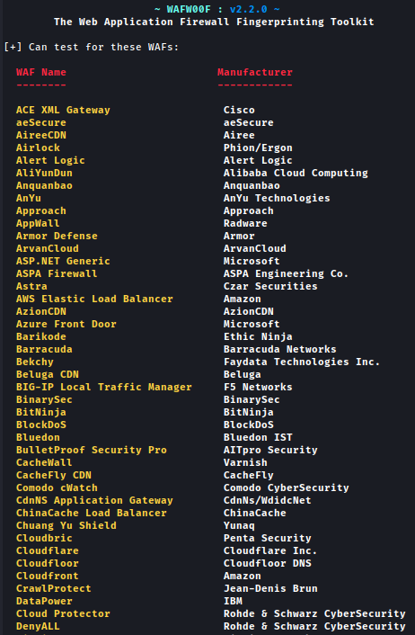

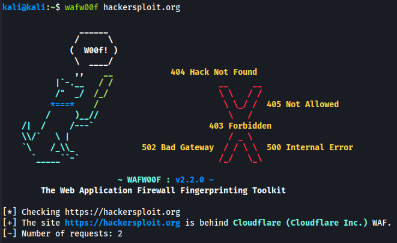

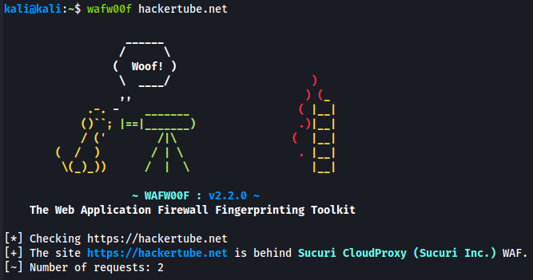

```bash
# -a option
wafw00f hackertube.net -a
wafw00f zonetransfer.me -a
```

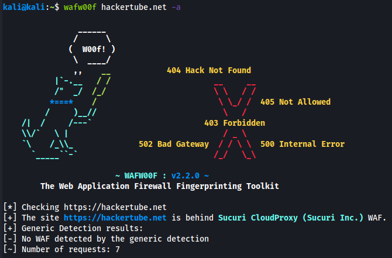

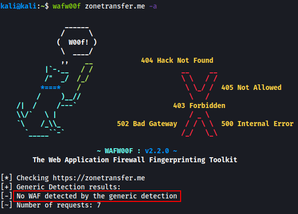

* This would be definitely tested within the _active information gathering_ phase with a port scan on the webserver IP address.

### Subdomain Enumeration with Sublist3r

To identify the subdomains of a specific domain in a passive way, **publicly available resources and databases** can be utilized.

> [**`sublist3r`**](https://github.com/aboul3la/Sublist3r) tool - a Python tool that enumerate subdomains of websites using OSINT (**O**pen-**S**ource **Int**eligence).

* this example is NOT active enumeration - is is passive (using public available resources)
* it enumerates subdomains using search engines (Google, Yaoo, Bing ...) and other tools (Netcraft, Virustotal, DNSdumpster, ReverseDNS, ThreatCrowd).

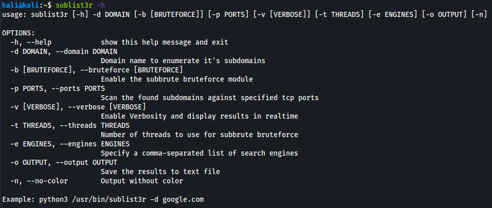

```bash
sudo apt install sublist3r

sublist3r -d hackersploit.com
sublist3r -d hackersploit.com -e google,yahoo
sublist3r -d hackersploit.com -o hs_sub_enum.txt
# Find hackersploit.com subdomains and save the results to a text file
```

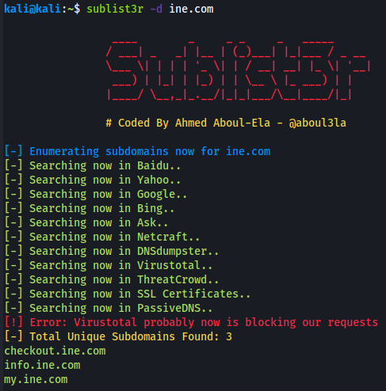

### Google Dorks

🗒️ **Google Dorking**/Hacking can be utilized to identify public information pertinent to a target.

* Search filters for specific subdomains, files, etc using [google.com](https://www.google.com/).
* First try to directly search for the specific domain and look for useful information.


> **`site:`**

* limit all results to the particular domain/site
* shows subdomains for that particular domain

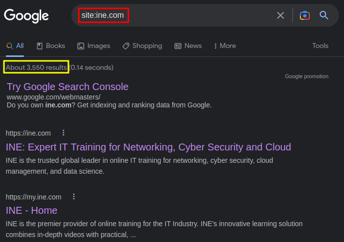

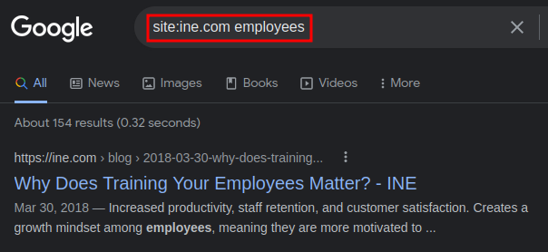

> **`inurl:`**

* look for specific results within the website title/URL
* **`e.g.`** - `inurl:admin` , etc.

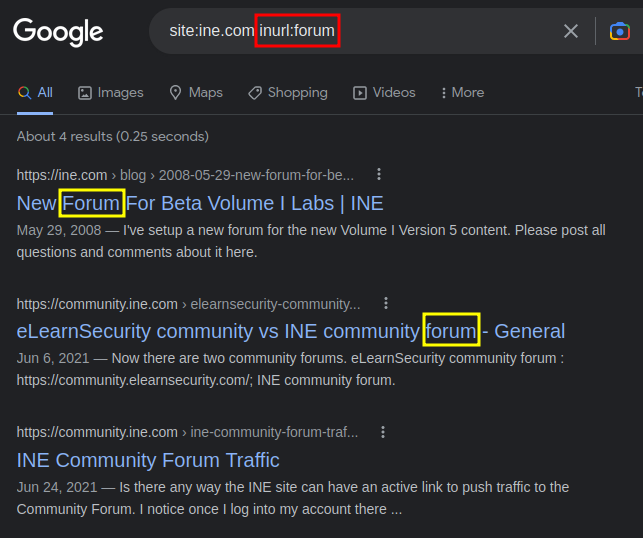

> **`site:*.site.com`**

* show **subdomains** (indexed by Google) for a particular domain
* usually they are exposed subdomains
  * sometimes unintended exposed subdomains

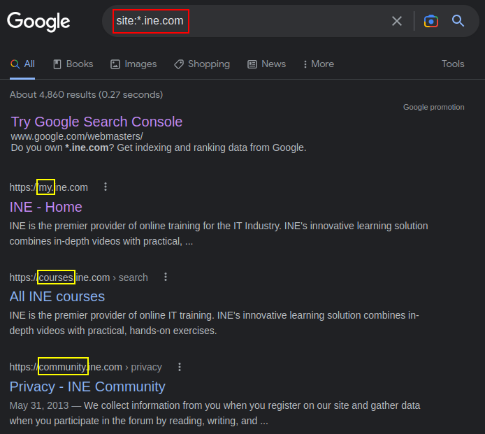

> **`intitle:`**

* limit the results to subdomains with a specific word in the site title

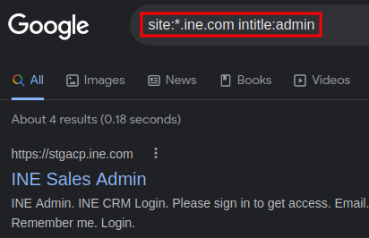

> **`filetype:`**

* limit the results to a file type in the URL
* make the search query a bit more specific

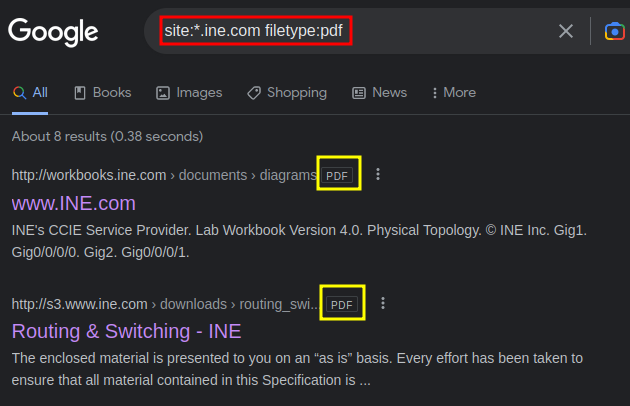

> **`intitle:index of`**

* look for sites with **directory listing** enabled, searching for _**index of**_
* common web servers vulnerability/misconfiguration (against security)
* directory listing allows users to see the content of the directory

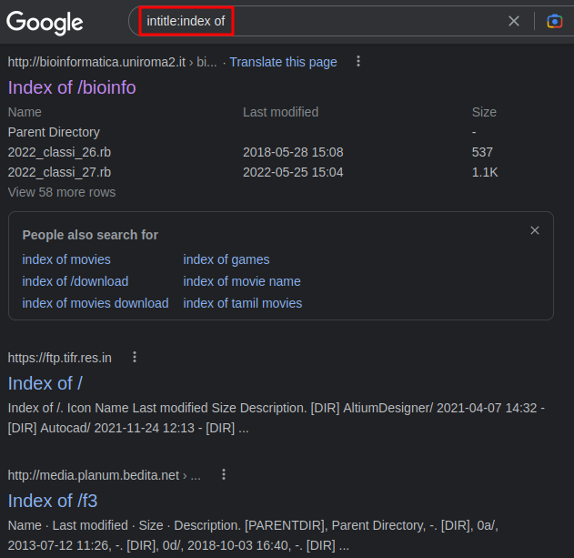

> **`cache:`**

* shows the cached website


> * Other Google dorking examples:
>   * **`inurl:auth_user_file.txt`**
>   * **`inurl:passwd.txt`**
>   * **`inurl:wp-config.bak`**

[**Google Hacking Database - exploit-db.com**](https://www.exploit-db.com/google-hacking-database)

* use it to search for Dorks by Category to find potentially unsecured files

.png>)

[**Wayback Machine**](https://archive.org/web/)

* a digital archive by the Internet Archive
* captures/snapshots web pages over time
* check earlier version of websites
* on older versions of the websites there can be useful **sensitive information** leaked

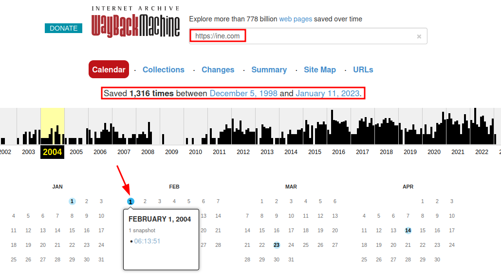

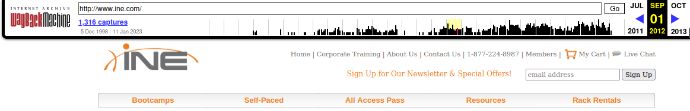

### Email Harvesting

> [**`theHarvester`**](https://github.com/laramies/theHarvester) tool - an open-source Python tool that performs OSINT gathering to help determine a domain's external threat landscape.

* used to enumerate the emails (names, IPs, URLs, subdomains) belonging to a domain target, using **publicly available resources and databases**.
* check the GitHub repository for more information on the [Passive](https://github.com/laramies/theHarvester#passive) and [Active](https://github.com/laramies/theHarvester#active) information gathering and [Installation](https://github.com/laramies/theHarvester/wiki/Installation).
* In this case the tool is used for Email Harvesting.

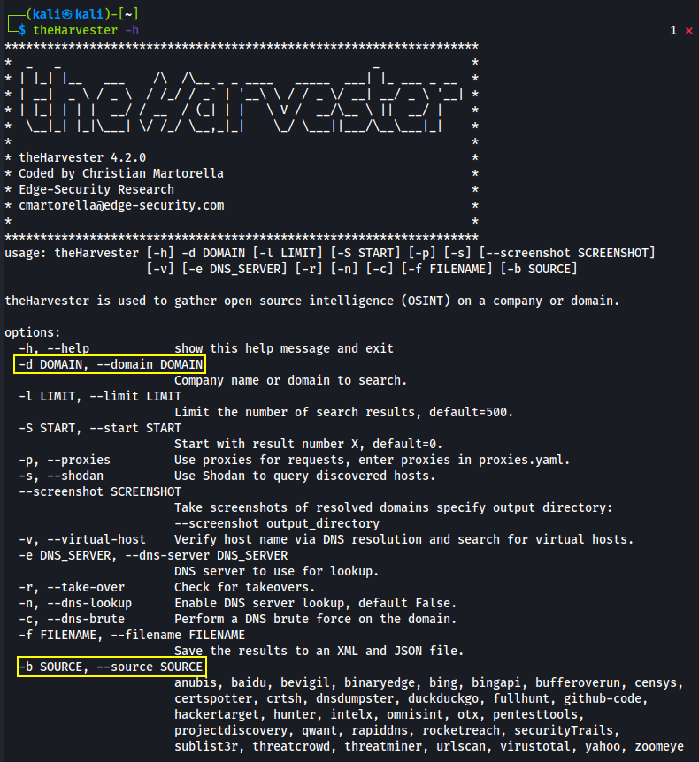

```bash
# Pre-installed on Kali Linux.
theHarvester -d hackersploit.org
theHarvester -d hackersploit.org -b dnsdumpster,duckduckgo,crtsh
# It finds some subdomains
```

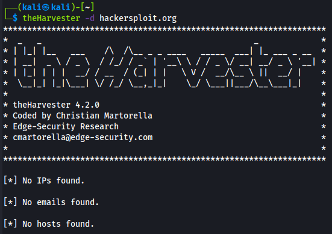

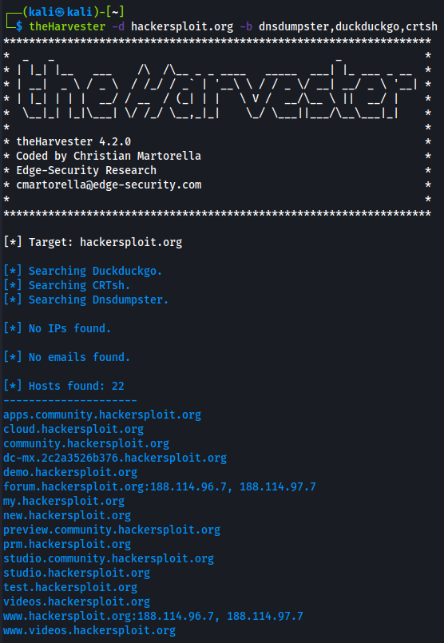

```bash
theHarvester -d zonetransfer.me -b all
```

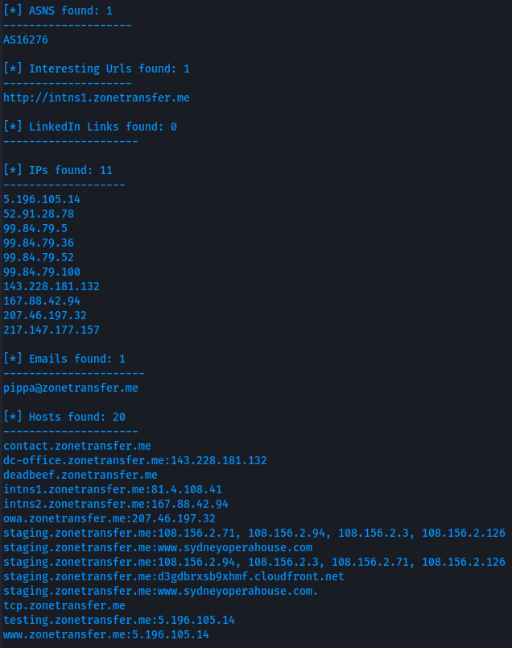

* _Emails could be used to send phishing email with malicious attachments during an attack._

### Leaked Password Databases

Email or account passwords can be potentially found and used for a **password spray attack** = use the discovered passwords and test them for authentication on many other services (_not part of Passive info gathering_).

* Leaked online password databases can be utilized, usually coming from a site data breach containing the users credentials.

> [**haveibeenpwned.com**](https://haveibeenpwned.com/) site by [Troy Hunt](https://www.troyhunt.com/)

* safe, reliable, no signup
* insert the found target email in the site to check for data breaches
* for older emails there is a greater chance of finding data breaches!

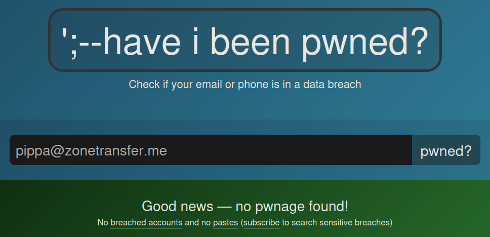

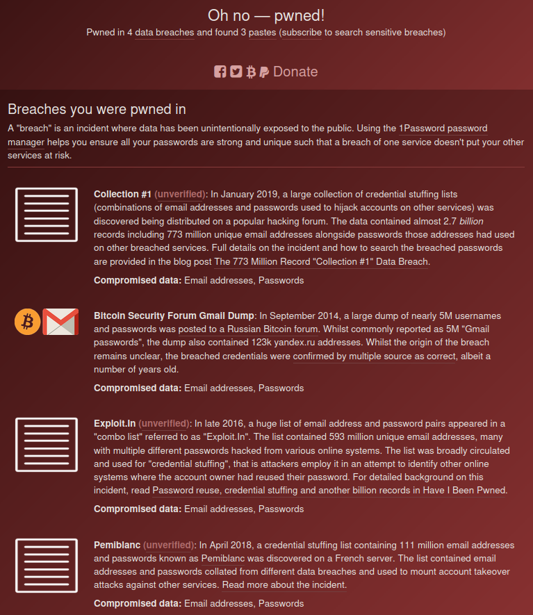

***

## Active Information Gathering

### DNS Zone Transfers

> 🗒️ Check my basic DNS theory notes [here](../penetration-testing-prerequisites/networking.md#dns).
>
> 📌 More in depth explanations about DNS can be found at the [Cloudflare Learning Center](https://www.cloudflare.com/learning/dns/what-is-dns/).
>
> 🔬 **Training list**: Check some PentesterAcademy/INE [DNS Network Pentesting Labs](https://attackdefense.com/listing?labtype=network-pentesting\&subtype=network-pentesting-dns) (`subscription required`)

* Most common types of DNS:

| Record Type | Description                                                              |
| :---------: | ------------------------------------------------------------------------ |
|    **A**    | Holds/Resolves the IPv4 address of a domain/hostname                     |
|   **AAAA**  | Holds/Resolves the IPv6 address of a domain/hostname                     |
|  **CNAME**  | Used for domain aliases, forwards one domain/subdomain to another domain |
|    **MX**   | Resolves a domain to a mail server                                       |
|   **TXT**   | Used for admin text notes, often used for email security                 |
|    **NS**   | Reference to the domains name server                                     |
|   **SOA**   | Stores admin information about a domain (domain authority)               |
|  **HINFO**  | Host information                                                         |
|   **SRV**   | Specific services records                                                |
|   **PTR**   | Resolves an IP address to a hostname - reverse lookups                   |

🗒️ _Enumerating DNS records_ for a particular domain is done through a procedure known as **DNS Interrogation**.

* Probe a DNS server to provide additional records and information (domain IP address, subdomains, mail server addresses, etc)

To obtain more records from a DNS server with regards to a particular domain, **DNS Zone Transfers** may be useful:

* A **zone transfer** occurs when a system admin may want to _copy or transfer zone files_ (containing domain records) from one DNS server to another.
* _This functionality can be abused by attackers when left misconfigured, to copy the zone file from the primary DNS to another DNS server._
* It can give penetration testers a complete picture of the network architecture of an organization and internal network addresses may be found.

An IP address can be mapped to a local (or external) specific domain name using the **`/etc/hosts`** file:

```bash
# Before DNS, the O.S. would use the host file for DNS resolution:
sudo nano /etc/hosts
    127.0.0.1       localhost
    127.0.1.1       kali

    # The following lines are desirable for IPv6 capable hosts
    ::1     localhost ip6-localhost ip6-loopback
    ff02::1 ip6-allnodes
    ff02::2 ip6-allrouters
    
    # IP ADDRESS    # Domain Names
```

* **`E.g.`** - [**`ZoneTransfer.me`**](https://digi.ninja/projects/zonetransferme.php) can be utilized for educational purposes

**Passive reconnaissance** [here](1-info-gathering.md#dns-reconnaissance) - using `dnsdumpster.com`, `dnsrecon`

```bash
[-] DNSSEC is not configured for zonetransfer.me
[*] 	 SOA nsztm1.digi.ninja 81.4.108.41
[*] 	 NS nsztm1.digi.ninja 81.4.108.41
[*] 	 Bind Version for 81.4.108.41 secret"
[*] 	 NS nsztm2.digi.ninja 34.225.33.2
[*] 	 Bind Version for 34.225.33.2 you"
[*] 	 MX ASPMX4.GOOGLEMAIL.COM 142.251.8.27
[*] 	 MX ASPMX5.GOOGLEMAIL.COM 173.194.202.26
[*] 	 MX ALT2.ASPMX.L.GOOGLE.COM 74.125.200.27
[*] 	 MX ASPMX3.GOOGLEMAIL.COM 74.125.200.26
[*] 	 MX ALT1.ASPMX.L.GOOGLE.COM 142.250.150.26
[*] 	 MX ASPMX2.GOOGLEMAIL.COM 142.250.150.27
[*] 	 MX ASPMX.L.GOOGLE.COM 108.177.119.27
[*] 	 MX ASPMX4.GOOGLEMAIL.COM 2404:6800:4008:c15::1b
[*] 	 MX ASPMX5.GOOGLEMAIL.COM 2607:f8b0:400e:c00::1b
[*] 	 MX ALT2.ASPMX.L.GOOGLE.COM 2404:6800:4003:c00::1b
[*] 	 MX ASPMX3.GOOGLEMAIL.COM 2404:6800:4003:c00::1a
[*] 	 MX ALT1.ASPMX.L.GOOGLE.COM 2a00:1450:4010:c1c::1a
[*] 	 MX ASPMX2.GOOGLEMAIL.COM 2a00:1450:4010:c1c::1b
[*] 	 MX ASPMX.L.GOOGLE.COM 2a00:1450:4013:c07::1a
[*] 	 A zonetransfer.me 5.196.105.14
[*] 	 TXT zonetransfer.me google-site-verification=tyP28J7JAUHA9fw2sHXMgcCC0I6XBmmoVi04VlMewxA
[*] Enumerating SRV Records
[+] 	 SRV _sip._tcp.zonetransfer.me www.zonetransfer.me 5.196.105.14 5060
```

**Active reconnaissance**

> [**`dnsenum`**](https://www.kali.org/tools/dnsenum/) tool - a multithread Perl script to enumerate DNS information of a domain and to discover non-contiguous ip blocks

* enumerate public DNS records
* perform automatic DNS zone transfer
* perform DNS brute force on subdomains

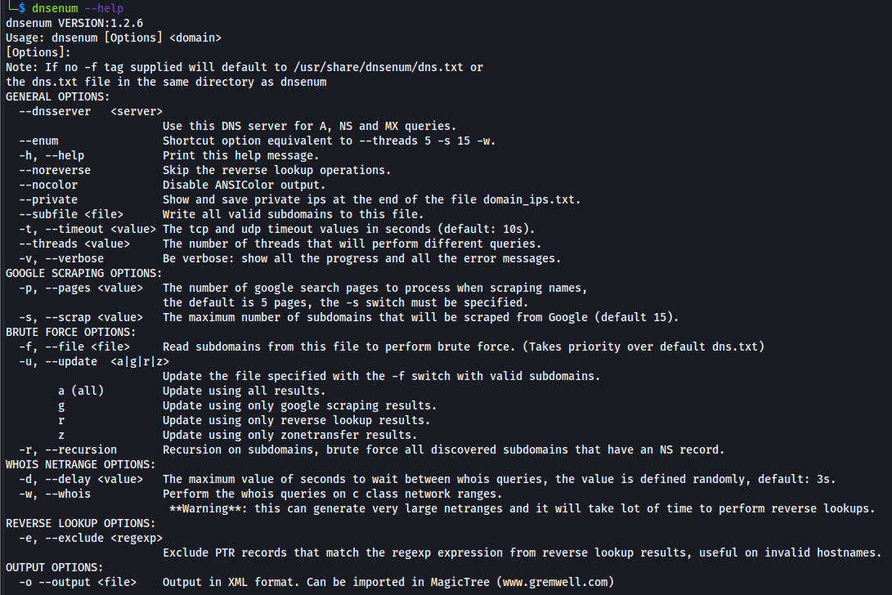

* The two name server of ZoneTransfer.me are **`nsztm1.digi.ninja`** and **`nsztm2.digi.ninja`**
  * DNS Zone transfer functionality must be ON on the Name Servers.
  * Identify subdomains and internal IP addresses from the Zone Transfer results.

_Check comments below_

```bash
dnsenum zonetransfer.me

    dnsenum VERSION:1.2.6
    -----   zonetransfer.me   -----

	# PASSIVE RECON
    Host s addresses:
    __________________
    zonetransfer.me.        	5	IN	A	5.196.105.14
	# ^^ Web server IP address ^^
	
    Name Servers:
    ______________
    nsztm2.digi.ninja.      	5	IN	A	34.225.33.2
    nsztm1.digi.ninja.      	5	IN	A	81.4.108.41

    Mail (MX) Servers:
    ___________________
    ALT2.ASPMX.L.GOOGLE.COM.	5	IN	A	74.125.200.27
    ASPMX4.GOOGLEMAIL.COM.  	5	IN	A	142.251.8.26
    ASPMX.L.GOOGLE.COM.     	5	IN	A	108.177.119.27
    ASPMX2.GOOGLEMAIL.COM.  	5	IN	A	142.250.150.27
    ALT1.ASPMX.L.GOOGLE.COM.	5	IN	A	142.250.150.26
    ASPMX3.GOOGLEMAIL.COM.  	5	IN	A	74.125.200.27
    ASPMX5.GOOGLEMAIL.COM.  	5	IN	A	173.194.202.26

	# ACTIVE RECON
    Trying Zone Transfers and getting Bind Versions:
    _________________________________________________
    Trying Zone Transfer for zonetransfer.me on nsztm1.digi.ninja ...
    # Provides all the records stored on the NS nsztm1.digi.ninja
    # Try to access the interesting ones
    
    zonetransfer.me.	7200	IN	SOA	nsztm1.digi.ninja. robin.digi.ninja. 2019100801 172800 900 1209600 3600
    zonetransfer.me.	300	IN	HINFO	"Casio fx-700G" "Windows XP"
    zonetransfer.me.	301	IN	TXT	"google-site-verification=tyP28J7JAUHA9fw2sHXMgcCC0I6XBmmoVi04VlMewxA"
    zonetransfer.me.	7200	IN	MX	0 ASPMX.L.GOOGLE.COM.
    zonetransfer.me.	7200	IN	MX	10 ALT1.ASPMX.L.GOOGLE.COM.
    zonetransfer.me.	7200	IN	MX	10 ALT2.ASPMX.L.GOOGLE.COM.
    zonetransfer.me.	7200	IN	MX	20 ASPMX2.GOOGLEMAIL.COM.
    zonetransfer.me.	7200	IN	MX	20 ASPMX3.GOOGLEMAIL.COM.
    zonetransfer.me.	7200	IN	MX	20 ASPMX4.GOOGLEMAIL.COM.
    zonetransfer.me.	7200	IN	MX	20 ASPMX5.GOOGLEMAIL.COM.
    zonetransfer.me.	7200	IN	A	5.196.105.14
    zonetransfer.me.	7200	IN	NS	nsztm1.digi.ninja.
    zonetransfer.me.	7200	IN	NS	nsztm2.digi.ninja.
    _acme-challenge.zonetransfer.me. 301 IN	TXT	"6Oa05hbUJ9xSsvYy7pApQvwCUSSGgxvrbdizjePEsZI"
    _sip._tcp.zonetransfer.me. 14000 IN	SRV	0 0 5060 www.zonetransfer.me.
    14.105.196.5.IN-ADDR.ARPA.zonetransfer.me. 7200	IN PTR www.zonetransfer.me.
    
    # Some subdomains (found actively):
    asfdbauthdns.zonetransfer.me. 7900 IN	AFSDB	1 asfdbbox.zonetransfer.me.
    asfdbbox.zonetransfer.me. 7200	IN	A	127.0.0.1
    asfdbvolume.zonetransfer.me. 7800 IN	AFSDB	1 asfdbbox.zonetransfer.me.
    
    # If not external, the IP could be an internal DNS Record = Security issue
    canberra-office.zonetransfer.me. 7200 IN A	202.14.81.230
    cmdexec.zonetransfer.me. 300	IN	TXT	"; ls"
    contact.zonetransfer.me. 2592000 IN	TXT	"Remember to call or email Pippa on +44 123 4567890 or pippa@zonetransfer.me when making DNS changes"
    dc-office.zonetransfer.me. 7200	IN	A	143.228.181.132
    deadbeef.zonetransfer.me. 7201	IN	AAAA	dead:beaf::
    dr.zonetransfer.me.	300	IN	LOC	53 20 56.558 N 1 38 33.526 W 0.00m 1m 10000m 10m
    DZC.zonetransfer.me.	7200	IN	TXT	"AbCdEfG"
    email.zonetransfer.me.	2222	IN	NAPTR	1 1 "P" "E2U+email" "" email.zonetransfer.me.zonetransfer.me.
    email.zonetransfer.me.	7200	IN	A	74.125.206.26
    Hello.zonetransfer.me.	7200	IN	TXT	"Hi to Josh and all his class"
    home.zonetransfer.me.	7200	IN	A	127.0.0.1
    Info.zonetransfer.me.	7200	IN	TXT	"ZoneTransfer.me service provided by Robin Wood - robin@digi.ninja. See http://digi.ninja/projects/zonetransferme.php for more information."
    internal.zonetransfer.me. 300	IN	NS	intns1.zonetransfer.me.
    internal.zonetransfer.me. 300	IN	NS	intns2.zonetransfer.me.
    intns1.zonetransfer.me.	300	IN	A	81.4.108.41
    intns2.zonetransfer.me.	300	IN	A	167.88.42.94
    # ^^ Pay ATTENTION to internal pointing addresses ^^
    
    office.zonetransfer.me.	7200	IN	A	4.23.39.254
    ipv6actnow.org.zonetransfer.me.	7200 IN	AAAA	2001:67c:2e8:11::c100:1332
    owa.zonetransfer.me.	7200	IN	A	207.46.197.32
    robinwood.zonetransfer.me. 302	IN	TXT	"Robin Wood"
    rp.zonetransfer.me.	321	IN	RP	robin.zonetransfer.me. robinwood.zonetransfer.me.
    sip.zonetransfer.me.	3333	IN	NAPTR	2 3 "P" "E2U+sip" "!^.*$!sip:customer-service@zonetransfer.me!" .
    sqli.zonetransfer.me.	300	IN	TXT	"' or 1=1 --"
    sshock.zonetransfer.me.	7200	IN	TXT	"() { :]}; echo ShellShocked"
    staging.zonetransfer.me. 7200	IN	CNAME	www.sydneyoperahouse.com.
    # ^^ Try this redirection on a browser. If it fails maybe it is an internal record.
    
    alltcpportsopen.firewall.test.zonetransfer.me. 301 IN A	127.0.0.1
    testing.zonetransfer.me. 301	IN	CNAME	www.zonetransfer.me.
    vpn.zonetransfer.me.	4000	IN	A	174.36.59.154
    www.zonetransfer.me.	7200	IN	A	5.196.105.14
    xss.zonetransfer.me.	300	IN	TXT	"'>alert('Boo')"
    zonetransfer.me.	7200	IN	SOA	nsztm1.digi.ninja. robin.digi.ninja. 2019100801 172800 900 1209600 3600
    Trying Zone Transfer for zonetransfer.me on nsztm2.digi.ninja ... 
    [...]

    Brute forcing with /usr/share/dnsenum/dns.txt:
    # Used primarily to find subdomains
    _______________________________________________
    office.zonetransfer.me.       	5	IN	A		4.23.39.254
    owa.zonetransfer.me.          	5	IN	A		207.46.197.32
    staging.zonetransfer.me.      	5	IN	CNAME	www.sydneyoperahouse.com.
    www.sydneyoperahouse.com.     	5	IN	CNAME	d3gdbrxsb9xhmf.cloudfront.net.
    d3gdbrxsb9xhmf.cloudfront.net.	5	IN	A		13.224.103.62
    d3gdbrxsb9xhmf.cloudfront.net.	5	IN	A		13.224.103.26
    d3gdbrxsb9xhmf.cloudfront.net.	5	IN	A		13.224.103.84
    d3gdbrxsb9xhmf.cloudfront.net.	5	IN	A		13.224.103.17
    vpn.zonetransfer.me.          	5	IN	A		174.36.59.154
    www.zonetransfer.me.          	5	IN	A		5.196.105.14

    zonetransfer.me class C netranges:
    ___________________________________
     4.23.39.0/24
     5.196.105.0/24
     174.36.59.0/24
     207.46.197.0/24

    Performing reverse lookup on 1024 ip addresses:
    ________________________________________________
    0 results out of 1024 IP addresses.

    zonetransfer.me ip blocks:
    ___________________________
    
    done.
```

* `dnsenum` can fail if zone transfer is disabled (e.g. Cloudflare NS)

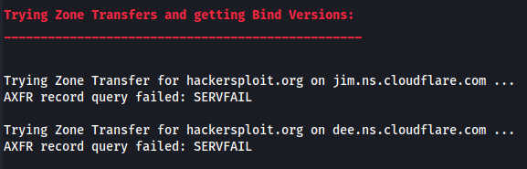

> [**`dig`**](https://linuxize.com/post/how-to-use-dig-command-to-query-dns-in-linux/) tool - query DNS name servers

* [_**AXFR zone transfers**_](https://www.cloudns.net/blog/zone-transfer-zone-file-domain-namespace/) _are the full DNS zone transfers of all DNS data. The Primary DNS server sends the whole zone file that contains all the DNS records to the Secondary DNS servers. This assures that the secondary DNS server is well synced. It will have all the latest changes that were made to the Master DNS zone._

```bash
dig axfr @nsztm1.digi.ninja zonetransfer.me 
# axfr is the zone transfer switch
```

> * [Zone Transfer Online Test](https://hackertarget.com/zone-transfer/)
> * [Linux and Unix dig Command Examples - by Vivek Gite](https://www.cyberciti.biz/faq/linux-unix-dig-command-examples-usage-syntax/)

> [**`fierce`**](https://github.com/mschwager/fierce) tool - a semi-lightweight scanner that helps locate non-contiguous IP space and hostnames against specified domains, using DNS primarily

```bash
fierce --domain zonetransfer.me

    NS: nsztm2.digi.ninja. nsztm1.digi.ninja.
    SOA: nsztm1.digi.ninja. (81.4.108.41)
    Zone: failure
    Wildcard: failure
    Found: email.zonetransfer.me. (74.125.206.26)
    Nearby:
    {'74.125.206.21': 'wk-in-f21.1e100.net.',
	[...]
     '74.125.206.31': 'wk-in-f31.1e100.net.'}
    Found: home.zonetransfer.me. (127.0.0.1)
    Found: office.zonetransfer.me. (4.23.39.254)
    Found: owa.zonetransfer.me. (207.46.197.32)
```

> ✍️ "Zone transfers are rare these days, but they give us the keys to the DNS castle." [fierce - Geeksforgeeks](https://www.geeksforgeeks.org/fierce-dns-reconnaissance-tool-for-locating-non-contiguous-ip-space/)

### Host Discovery with Nmap

> [**`nmap`**](https://nmap.org/) - open source security tool for network exploration, security scanning and auditing.

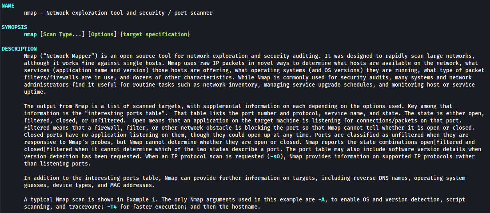

```bash
nmap -h
    Nmap 7.93 ( https://nmap.org )
    Usage: nmap [Scan Type(s)] [Options] {target specification}
    TARGET SPECIFICATION:
      Can pass hostnames, IP addresses, networks, etc.
      Ex: scanme.nmap.org, microsoft.com/24, 192.168.0.1; 10.0.0-255.1-254
      -iL <inputfilename>: Input from list of hosts/networks
      -iR <num hosts>: Choose random targets
      --exclude <host1[,host2][,host3],...>: Exclude hosts/networks
      --excludefile <exclude_file>: Exclude list from file
    HOST DISCOVERY:
      -sL: List Scan - simply list targets to scan
      -sn: Ping Scan - disable port scan
      -Pn: Treat all hosts as online -- skip host discovery
      -PS/PA/PU/PY[portlist]: TCP SYN/ACK, UDP or SCTP discovery to given ports
      -PE/PP/PM: ICMP echo, timestamp, and netmask request discovery probes
      -PO[protocol list]: IP Protocol Ping
      -n/-R: Never do DNS resolution/Always resolve [default: sometimes]
      --dns-servers <serv1[,serv2],...>: Specify custom DNS servers
      --system-dns: Use OS''s DNS resolver
      --traceroute: Trace hop path to each host
    SCAN TECHNIQUES:
      -sS/sT/sA/sW/sM: TCP SYN/Connect()/ACK/Window/Maimon scans
      -sU: UDP Scan
      -sN/sF/sX: TCP Null, FIN, and Xmas scans
      --scanflags <flags>: Customize TCP scan flags
      -sI <zombie host[:probeport]>: Idle scan
      -sY/sZ: SCTP INIT/COOKIE-ECHO scans
      -sO: IP protocol scan
      -b <FTP relay host>: FTP bounce scan
    PORT SPECIFICATION AND SCAN ORDER:
      -p <port ranges>: Only scan specified ports
        Ex: -p22; -p1-65535; -p U:53,111,137,T:21-25,80,139,8080,S:9
      --exclude-ports <port ranges>: Exclude the specified ports from scanning
      -F: Fast mode - Scan fewer ports than the default scan
      -r: Scan ports sequentially - don''t randomize
      --top-ports <number>: Scan <number> most common ports
      --port-ratio <ratio>: Scan ports more common than <ratio>
    SERVICE/VERSION DETECTION:
      -sV: Probe open ports to determine service/version info
      --version-intensity <level>: Set from 0 (light) to 9 (try all probes)
      --version-light: Limit to most likely probes (intensity 2)
      --version-all: Try every single probe (intensity 9)
      --version-trace: Show detailed version scan activity (for debugging)
    SCRIPT SCAN:
      -sC: equivalent to --script=default
      --script=<Lua scripts>: <Lua scripts> is a comma separated list of
               directories, script-files or script-categories
      --script-args=<n1=v1,[n2=v2,...]>: provide arguments to scripts
      --script-args-file=filename: provide NSE script args in a file
      --script-trace: Show all data sent and received
      --script-updatedb: Update the script database.
      --script-help=<Lua scripts>: Show help about scripts.
               <Lua scripts> is a comma-separated list of script-files or
               script-categories.
    OS DETECTION:
      -O: Enable OS detection
      --osscan-limit: Limit OS detection to promising targets
      --osscan-guess: Guess OS more aggressively
    TIMING AND PERFORMANCE:
      Options which take <time> are in seconds, or append 'ms' (milliseconds),
      's' (seconds), 'm' (minutes), or 'h' (hours) to the value (e.g. 30m).
      -T<0-5>: Set timing template (higher is faster)
      --min-hostgroup/max-hostgroup <size>: Parallel host scan group sizes
      --min-parallelism/max-parallelism <numprobes>: Probe parallelization
      --min-rtt-timeout/max-rtt-timeout/initial-rtt-timeout <time>: Specifies
          probe round trip time.
      --max-retries <tries>: Caps number of port scan probe retransmissions.
      --host-timeout <time>: Give up on target after this long
      --scan-delay/--max-scan-delay <time>: Adjust delay between probes
      --min-rate <number>: Send packets no slower than <number> per second
      --max-rate <number>: Send packets no faster than <number> per second
    FIREWALL/IDS EVASION AND SPOOFING:
      -f; --mtu <val>: fragment packets (optionally w/given MTU)
      -D <decoy1,decoy2[,ME],...>: Cloak a scan with decoys
      -S <IP_Address>: Spoof source address
      -e <iface>: Use specified interface
      -g/--source-port <portnum>: Use given port number
      --proxies <url1,[url2],...>: Relay connections through HTTP/SOCKS4 proxies
      --data <hex string>: Append a custom payload to sent packets
      --data-string <string>: Append a custom ASCII string to sent packets
      --data-length <num>: Append random data to sent packets
      --ip-options <options>: Send packets with specified ip options
      --ttl <val>: Set IP time-to-live field
      --spoof-mac <mac address/prefix/vendor name>: Spoof your MAC address
      --badsum: Send packets with a bogus TCP/UDP/SCTP checksum
    OUTPUT:
      -oN/-oX/-oS/-oG <file>: Output scan in normal, XML, s|<rIpt kIddi3,
         and Grepable format, respectively, to the given filename.
      -oA <basename>: Output in the three major formats at once
      -v: Increase verbosity level (use -vv or more for greater effect)
      -d: Increase debugging level (use -dd or more for greater effect)
      --reason: Display the reason a port is in a particular state
      --open: Only show open (or possibly open) ports
      --packet-trace: Show all packets sent and received
      --iflist: Print host interfaces and routes (for debugging)
      --append-output: Append to rather than clobber specified output files
      --resume <filename>: Resume an aborted scan
      --noninteractive: Disable runtime interactions via keyboard
      --stylesheet <path/URL>: XSL stylesheet to transform XML output to HTML
      --webxml: Reference stylesheet from Nmap.Org for more portable XML
      --no-stylesheet: Prevent associating of XSL stylesheet w/XML output
    MISC:
      -6: Enable IPv6 scanning
      -A: Enable OS detection, version detection, script scanning, and traceroute
      --datadir <dirname>: Specify custom Nmap data file location
      --send-eth/--send-ip: Send using raw ethernet frames or IP packets
      --privileged: Assume that the user is fully privileged
      --unprivileged: Assume the user lacks raw socket privileges
      -V: Print version number
      -h: Print this help summary page.
    EXAMPLES:
      nmap -v -A scanme.nmap.org
      nmap -v -sn 192.168.0.0/16 10.0.0.0/8
      nmap -v -iR 10000 -Pn -p 80
    SEE THE MAN PAGE (https://nmap.org/book/man.html) FOR MORE OPTIONS AND EXAMPLES
```

* **`E.g.`** - Discover all the devices on a target network using a **ping sweep** (ping scan) with Nmap.
  * `-sn` option - Ping Scan (ping sweep), disable port scan. It finds the responding hosts. **-sn** consist of:
    * an ICMP echo request
    * a TCP SYN to port 443
    * a TCP ACK to port 80
    * an ICMP default timestamp
    * `-sn` must be run as `sudo`

```bash
# Check your network IP subnet
ip -br -c a
lo               UNKNOWN        127.0.0.1/8 ::1/128 
eth0             DOWN           
eth1             UP             192.168.31.128/24 fe80::20c:29ff:fe3a:6a12/64
# Current local subnet network is 192.168.31.0/24

sudo nmap -sn 192.168.31.0/24
    Starting Nmap 7.93 ( https://nmap.org ) at 2023-01-20 15:46 CET
    Nmap scan report for 192.168.31.2 # Default Gateway IP
    Host is up (0.00021s latency).
    MAC Address: 00:50:56:F3:CD:3F (VMware) # MAC Address of the manufacturer
    Nmap scan report for 192.168.31.133 # Ubuntu VM IP
    Host is up (0.00013s latency).
    MAC Address: 00:0C:29:C9:89:DE (VMware)
    Nmap scan report for 192.168.31.254 # Vmware DHCP server IP
    Host is up (0.00013s latency).
    MAC Address: 00:50:56:E7:B4:64 (VMware)
    Nmap scan report for 192.168.31.128 # current Kali VM IP
    Host is up.
    Nmap done: 256 IP addresses (4 hosts up) scanned in 2.01 seconds
# Only 4 devices are up
```

* Copy the found IPs for future references and move on to the [port scan phase](1-info-gathering.md#port-scanning-with-nmap) on each of them.

```
192.168.31.2
192.168.31.128
192.168.31.133
192.168.31.254
```

> [**`netdiscover`**](https://www.kali.org/tools/netdiscover/) - an active/passive ARP discovering tool

* _it utilizes ARP requests_

```bash
netdiscover -h 
    Netdiscover 0.10 [Active/passive ARP reconnaissance tool]
    Written by: Jaime Penalba <jpenalbae@gmail.com>
    Usage: netdiscover [-i device] [-r range | -l file | -p] [-m file] [-F filter] [-s time] [-c count] [-n node] [-dfPLNS]
      -i device: your network device
      -r range: scan a given range instead of auto scan. 192.168.6.0/24,/16,/8
      -l file: scan the list of ranges contained into the given file
      -p passive mode: do not send anything, only sniff
      -m file: scan a list of known MACs and host names
      -F filter: customize pcap filter expression (default: "arp")
      -s time: time to sleep between each ARP request (milliseconds)
      -c count: number of times to send each ARP request (for nets with packet loss)
      -n node: last source IP octet used for scanning (from 2 to 253)
      -d ignore home config files for autoscan and fast mode
      -f enable fastmode scan, saves a lot of time, recommended for auto
      -P print results in a format suitable for parsing by another program and stop after active scan
      -L similar to -P but continue listening after the active scan is completed
      -N Do not print header. Only valid when -P or -L is enabled.
      -S enable sleep time suppression between each request (hardcore mode)
    If -r, -l or -p are not enabled, netdiscover will scan for common LAN addresses.
```

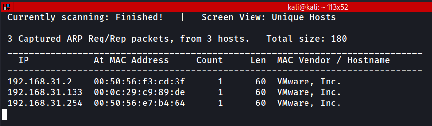

> 📌 [Nmap Command Examples](https://www.cyberciti.biz/networking/nmap-command-examples-tutorials/)

### Port Scanning With Nmap

> 🔬 **Training list**: PentesterAcademy [Windows Recon - Host Discovery](https://attackdefense.com/listing?labtype=windows-recon\&subtype=windows-recon-host-discovery) (`subscription required`)

Use **`nmap`** to identify open ports and the respective running services on a target system.

* _Enumerate as much information as possible_
* **`E.g.`** - perform post scanning on TCP and UDP ports, using a few techniques

```bash
# Default nmap scan on 1000 most commonly used TCP ports
nmap <TARGET_IP>
```

### Lab with Nmap

> 🔬 [Nmap Host Discovery LAB](https://attackdefense.com/challengedetails?cid=2219)

* Windows systems will typically block ICMP ping probes, resulting in a "host down" response from the **`nmap`** command.

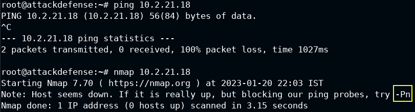

> **`-Pn`** option - **skip host discovery** (skip `ping`)

```bash
nmap -Pn <TARGET_IP>
```

```bash
# Nmap scan report:
Not shown: 993 filtered ports
PORT      STATE SERVICE
80/tcp    open  http # Webserver
135/tcp   open  msrpc
139/tcp   open  netbios-ssn # SMB
445/tcp   open  microsoft-ds # SMB
3389/tcp  open  ms-wbt-server # RDP
# ^^ Windows O.S. recognizable ports/services
49154/tcp open  unknown
49155/tcp open  unknown
```

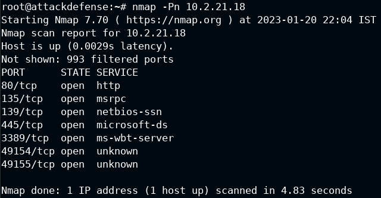

* Try to access the webserver with a browser:

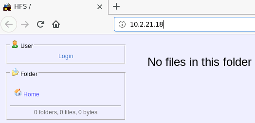

> **`-p-`** - Scan the entire range of TCP ports (**65535 ports**)

* the scan will take longer

```bash
nmap -Pn -p- <TARGET_IP>
```

> **`-p- <PORTS_LIST>`** - Scan a specific or more TCP **ports**:

* if a port state is **filtered** it means the port is _blocked by a firewall_ or _closed_

```bash
# Port 80 only scan
nmap -Pn -p 80 <TARGET_IP>

# Custom list of ports scan
nmap -Pn -p 80,445,3389 <TARGET_IP>

# Custom ports range scan
nmap -Pn -p1-2000 <TARGET_IP>

# Filtered/blocked/closed port
nmap -Pn -p 8080 <TARGET_IP>
    PORT     STATE    SERVICE
    8080/tcp filtered http-proxy
```

> **`-F`** - **fast mode**, scan 100 of the most commonly used ports **`-v`** - increase **verbosity**, see background scanning info

```bash
nmap -Pn -F <TARGET_IP> -v
```

```bash
# Nmap fast scan verbose report:
Starting Nmap 7.70 ( https://nmap.org ) at 2023-01-20 22:44 IST
Initiating Parallel DNS resolution of 1 host. at 22:44
Completed Parallel DNS resolution of 1 host. at 22:44, 0.00s elapsed
Initiating SYN Stealth Scan at 22:44
Scanning 10.4.24.170 [100 ports]
Discovered open port 139/tcp on 10.4.24.170
Discovered open port 445/tcp on 10.4.24.170
Discovered open port 135/tcp on 10.4.24.170
Discovered open port 80/tcp on 10.4.24.170
Discovered open port 3389/tcp on 10.4.24.170
Discovered open port 49155/tcp on 10.4.24.170
Discovered open port 49154/tcp on 10.4.24.170
Completed SYN Stealth Scan at 22:44, 1.69s elapsed (100 total ports)
Nmap scan report for 10.4.24.170
Host is up (0.0090s latency).
Not shown: 93 filtered ports
PORT      STATE SERVICE
80/tcp    open  http
135/tcp   open  msrpc
139/tcp   open  netbios-ssn
445/tcp   open  microsoft-ds
3389/tcp  open  ms-wbt-server
49154/tcp open  unknown
49155/tcp open  unknown

Read data files from: /usr/bin/../share/nmap
Nmap done: 1 IP address (1 host up) scanned in 1.78 seconds
           Raw packets sent: 193 (8.492KB) | Rcvd: 7 (308B)
```

> **`-sU`** - **UDP scan**

* always try to do a UDP port scan (DNS service, etc). Default `nmap` scan performs only TCP scans.

```bash
nmap -Pn -sU <TARGET_IP>
```

> **`-sV`** - probe open ports to determine **service/version** info

```bash
nmap -Pn -F -sV <TARGET_IP>
```

```bash
# Nmap fast and services scan report:
Not shown: 93 filtered ports
PORT      STATE SERVICE            VERSION
80/tcp    open  http               HttpFileServer httpd 2.3
135/tcp   open  msrpc              Microsoft Windows RPC
139/tcp   open  netbios-ssn        Microsoft Windows netbios-ssn
445/tcp   open  microsoft-ds       Microsoft Windows Server 2008 R2 - 2012 microsoft-ds
3389/tcp  open  ssl/ms-wbt-server?
49154/tcp open  msrpc              Microsoft Windows RPC
49155/tcp open  msrpc              Microsoft Windows RPC
Service Info: OSs: Windows, Windows Server 2008 R2 - 2012; CPE: cpe:/o:microsoft:windows
```

> **`-O`** - **Operating System detection**, based on the open ports and running services

* sometimes is not accurate
* _a penetration tester can start to identify specific O.S. version vulnerabilities and exploits_

```bash
sudo nmap -Pn -F -sV -O <TARGET_IP>
```

```bash
Warning: OSScan results may be unreliable because we could not find at least 1 open and 1 closed port
Device type: general purpose
Running: Microsoft Windows 2012
OS CPE: cpe:/o:microsoft:windows_server_2012
OS details: Microsoft Windows Server 2012
Service Info: OSs: Windows, Windows Server 2008 R2 - 2012; CPE: cpe:/o:microsoft:windows
```

> **`-sC`** - default `nmap` **script scan**

* under each service, `nmap` will run a series of scripts based on the service

```bash
nmap -Pn -F -sV -O -sC <TARGET_IP>
```

```bash
PORT      STATE SERVICE            VERSION
80/tcp    open  http               HttpFileServer httpd 2.3
# Webserver scripts
|_http-favicon: Unknown favicon MD5: 759792EDD4EF8E6BC2D1877D27153CB1
| http-methods: 
|_  Supported Methods: GET HEAD POST
|_http-server-header: HFS 2.3
|_http-title: HFS /
135/tcp   open  msrpc              Microsoft Windows RPC
139/tcp   open  netbios-ssn        Microsoft Windows netbios-ssn
445/tcp   open  microsoft-ds       Microsoft Windows Server 2008 R2 - 2012 microsoft-ds
3389/tcp  open  ssl/ms-wbt-server?
| ssl-cert: Subject: commonName=http-server
| Issuer: commonName=http-server
| Public Key type: rsa
| Public Key bits: 2048
| Signature Algorithm: sha256WithRSAEncryption
| Not valid before: 2023-01-19T16:57:55
| Not valid after:  2023-07-21T16:57:55
| MD5:   cbb9 8b92 dda3 30f7 bd3d 1ac3 56c4 dc23
|_SHA-1: 2d00 389f 6f30 e78a fdd1 010c b94e 7f85 92b3 4802
49154/tcp open  msrpc              Microsoft Windows RPC
49155/tcp open  msrpc              Microsoft Windows RPC
Warning: OSScan results may be unreliable because we could not find at least 1 open and 1 closed port
Device type: general purpose
Running: Microsoft Windows 2012
OS CPE: cpe:/o:microsoft:windows_server_2012
OS details: Microsoft Windows Server 2012
Uptime guess: 0.022 days (since Fri Jan 20 22:27:42 2023)
TCP Sequence Prediction: Difficulty=257 (Good luck!)
IP ID Sequence Generation: Incremental
Service Info: OSs: Windows, Windows Server 2008 R2 - 2012; CPE: cpe:/o:microsoft:windows

# SMB scripts
Host script results:
| smb-security-mode:
|   account_used: guest
|   authentication_level: user
|   challenge_response: supported
|_  message_signing: disabled (dangerous, but default)
| smb2-security-mode:
|   2.02:
|_    Message signing enabled but not required
| smb2-time:
|   date: 2023-01-20 22:58:03
|_  start_date: 2023-01-20 22:27:50

NSE: Script Post-scanning.
Initiating NSE at 22:58
Completed NSE at 22:58, 0.00s elapsed
Initiating NSE at 22:58
Completed NSE at 22:58, 0.00s elapsed
Read data files from: /usr/bin/../share/nmap
OS and Service detection performed. Please report any incorrect results at https://nmap.org/submit/ .
Nmap done: 1 IP address (1 host up) scanned in 120.19 seconds
           Raw packets sent: 236 (12.952KB) | Rcvd: 14 (716B)
```

> **`-A`** - **Aggressive scan**: OS detection, version detection, script scanning (`-sV` + `-O` + `-sC`)

```bash
nmap -Pn -F -A <TARGET_IP>
```

> **`-T#`** - `nmap` **Timing templates** - optimize and speed up scanning (higher is faster)

* `-T0` - _paranoid_ (possible IDS evasion, slow)
* `-T1` - _sneaky_ (possible IDS evasion, slow)
* `-T2` - _polite_ (less bandwidth and target machine resources, slow)
* `-T3` - _normal_ (default scan)
* `-T4` - _aggressive_ (reasonably fast, modern and reliable network)
* `-T5` - _insane_ (extraordinarily fast network)
* the lower the number the slower the scan

```bash
nmap -Pn -F -T5 -sV -O -sC <TARGET_IP> -v
```

> **`-oN`** - output the report into three main formats

```bash
# Output the scan results, as displayed into the terminal, into a file
nmap -Pn -F <TARGET_IP> -oN outputfile.txt
```

```bash
# Output the scan results into an XML file
nmap -Pn -F <TARGET_IP> -oX outputfile.xml
```

***
