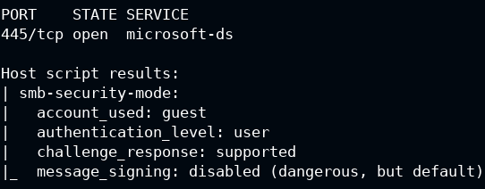

# Enumeration

> #### ⚡ Prerequisites
>
> * Basic familiarity with Linux and networks concepts
> * Footprinting and Scanning
>
> #### 📕 Learning Objectives
>
> * Purpose of service enumeration
> * Enumeration on common and uncommon services and protocols
>
> #### 🔬 Training list - PentesterAcademy Labs
>
> `subscription required`
>
> - [SMB Servers Win Recon](https://attackdefense.pentesteracademy.com/listing?labtype=windows-recon&subtype=windows-recon-smb)
> - [SMB Servers Network Recon](https://attackdefense.pentesteracademy.com/listing?labtype=network-recon&subtype=recon-smb)
> - [FTP Servers Linux Recon](https://attackdefense.pentesteracademy.com/listing?labtype=linux-security-recon&subtype=recon-ftp)
> - [SSH Servers Network Recon](https://attackdefense.pentesteracademy.com/listing?labtype=network-recon&subtype=recon-ssh)
> - [IIS Servers Win Recon](https://attackdefense.pentesteracademy.com/listing?labtype=windows-recon&subtype=windows-recon-iis)
> - [Webservers Network Recon](https://attackdefense.pentesteracademy.com/listing?labtype=network-recon&subtype=recon-webserver)
> - [SQL Databases Linux Recon](https://attackdefense.pentesteracademy.com/listing?labtype=linux-security-recon&subtype=linux-security-recon-sqldbs)
> - [SQL Databases Network Recon](https://attackdefense.pentesteracademy.com/listing?labtype=network-recon&subtype=recon-sqldb)
> - [MSSQL Servers Win Recon](https://attackdefense.pentesteracademy.com/listing?labtype=windows-recon&subtype=windows-recon-mssql)

A **server** is a computer program or device that provides a **service** to another computer program and its user, also known as the **client**. It accepts and responds to request made over a network. The term _server_ can refer to a physical machine, a virtual machine or to software performing server services.

It can run various operating systems like Windows Server, Linux Server, macOS Server.

Servers need to be accessed remotely by multiple clients, so the server must _open_ and accept connections on the listening _port_ of the service.

Open port service bugs and vulnerabilities could expose the entire server to attackers.

Common services are:

* `SMB`
* `FTP`
* `SSH`
* `HTTP`
* `MYSQL`

🗒️ **Enumeration** is a critical phase in a pentest, used to identify information about in-scope assets, discovering potential attack vectors and vulnerabilities.


## SMB

**`SMB`** (**S**erver **M**essage **B**lock) - a network file and resource sharing protocol based on a _client-server_ model.

There are many variants of the SMB protocol like SMBv1, CIFS, SMBv2, SMBv2.1, SMBv3, and so on.

- `e.g.` Windows mapping and sharing drives as letter, uses SMB

Usually SMB can be found on ports `139` or `445` and `nmap` service and scripts enumeration (**`-sV`**, **`-sC`**) can find more info about the O.S. version.

After finding SMB through port scanning, gather more information with `nmap`.

```bash
sudo nmap -sV -sC -O <TARGET_IP>
```

### Lab

>  🔬 [Windows Recon: SMB Nmap Scripts](https://attackdefense.pentesteracademy.com/challengedetailsnoauth?cid=2222)
>
>  Target IP: `10.2.24.25`

```bash
ping 10.2.24.25
nmap 10.2.24.25

PORT      STATE SERVICE
135/tcp   open  msrpc
139/tcp   open  netbios-ssn
445/tcp   open  microsoft-ds
3389/tcp  open  ms-wbt-server
49152/tcp open  unknown
49153/tcp open  unknown
49154/tcp open  unknown
49155/tcp open  unknown
49167/tcp open  unknown
```

- SMB port `445` is open, use a specific [nmap script](https://nmap.org/nsedoc/scripts/smb-protocols.html) to list the *SMB server supported protocols and dialects*:

```bash
nmap -p445 --script smb-protocols 10.2.24.25
```

```bash
Host script results:
| smb-protocols: 
|   dialects: 
|     NT LM 0.12 (SMBv1) [dangerous, but default]
|     2.02
|     2.10
|     3.00
|_    3.02
```


- Find SMB security level with another [nmap script](https://nmap.org/nsedoc/scripts/smb-security-mode.html):

```bash
nmap -p445 --script smb-security-mode 10.2.24.25
```

```bash
Host script results:
| smb-security-mode: 
|   account_used: guest
|   authentication_level: user
|   challenge_response: supported
|_  message_signing: disabled (dangerous, but default)
```



- 


## FTP

## SSH

## HTTP

## MYSQL
