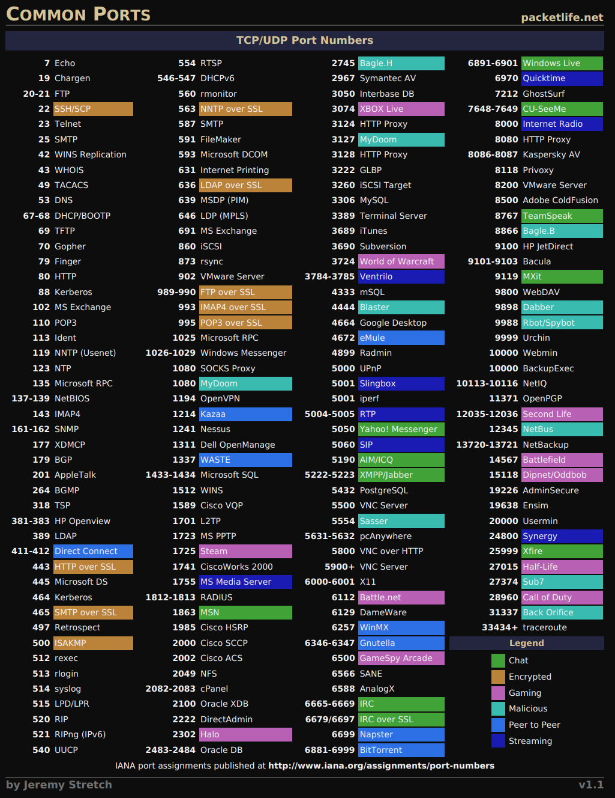

# Enumeration

> ### ⚡ Prerequisites
>
> * Basic familiarity with Linux and networks concepts
> * Footprinting and Scanning
>
> ### 📕 Learning Objectives
>
> * Purpose of service enumeration
> * Enumeration on common and uncommon services and protocols

A **server** is a computer program or device that provides a **service** to another computer program and its user, also known as the **client**. It accepts and responds to request made over a network. The term *server* can refer to a physical machine, a virtual machine or to software performing server services.

It can run various operating systems like Windows Server, Linux Server, macOS Server.

Servers need to be accessed remotely by multiple clients, so the server must *open* and accept connections on the listening *port* of the service.

Open port service bugs and vulnerabilities could expose the entire server to attackers.

Common services are:

- `SMB`
- `FTP`
- `SSH`
- `HTTP`
- `MYSQL`

🗒️ **Enumeration** is a critical phase in a pentest, used to identify information about in-scope assets, discovering potential attack vectors and vulnerabilities.

## SMB

**`SMB`** (**S**erver **M**essage **B**lock) - a network file and resource sharing protocol based on a *client-server* model.

There are many variants of the SMB protocol like SMBv1, CIFS, SMBv2, SMBv2.1, SMBv3, and so on.

Usually SMB can be found on ports `139` or `445` and `nmap ` service and scripts enumeration (**`-sV`**, **`-sC`**) can find more info about the O.S. version.

## FTP

## SSH

## HTTP

## MYSQL

