# Enumeration

> #### ⚡ Prerequisites
>
> * Basic familiarity with Linux and networks concepts
> * Footprinting and Scanning
>
> #### 📕 Learning Objectives
>
> * Purpose of service enumeration
> * Enumeration on common and uncommon services and protocols
>
> #### 🔬 Training list - PentesterAcademy/INE Labs
>
> `subscription required`
>
> - [SMB Servers Win Recon](https://attackdefense.pentesteracademy.com/listing?labtype=windows-recon&subtype=windows-recon-smb)
> - [SMB Servers Network Recon](https://attackdefense.pentesteracademy.com/listing?labtype=network-recon&subtype=recon-smb)
> - [FTP Servers Linux Recon](https://attackdefense.pentesteracademy.com/listing?labtype=linux-security-recon&subtype=recon-ftp)
> - [SSH Servers Network Recon](https://attackdefense.pentesteracademy.com/listing?labtype=network-recon&subtype=recon-ssh)
> - [IIS Servers Win Recon](https://attackdefense.pentesteracademy.com/listing?labtype=windows-recon&subtype=windows-recon-iis)
> - [Webservers Network Recon](https://attackdefense.pentesteracademy.com/listing?labtype=network-recon&subtype=recon-webserver)
> - [SQL Databases Linux Recon](https://attackdefense.pentesteracademy.com/listing?labtype=linux-security-recon&subtype=linux-security-recon-sqldbs)
> - [SQL Databases Network Recon](https://attackdefense.pentesteracademy.com/listing?labtype=network-recon&subtype=recon-sqldb)
> - [MSSQL Servers Win Recon](https://attackdefense.pentesteracademy.com/listing?labtype=windows-recon&subtype=windows-recon-mssql)

A **server** is a computer program or device that provides a **service** to another computer program and its user, also known as the **client**. It accepts and responds to request made over a network. The term _server_ can refer to a physical machine, a virtual machine or to software performing server services.

It can run various operating systems like Windows Server, Linux Server, macOS Server.

Servers need to be accessed remotely by multiple clients, so the server must _open_ and accept connections on the listening _port_ of the service.

Open port service bugs and vulnerabilities could expose the entire server to attackers.

Common services are:

* `SMB`
* `FTP`
* `SSH`
* `HTTP`
* `MYSQL`

🗒️ **Enumeration** is a critical phase in a pentest, used to identify information about in-scope assets, discovering potential attack vectors and vulnerabilities.


## SMB

**`SMB`** (**S**erver **M**essage **B**lock) - a network file and resource sharing protocol based on a _client-server_ model.

There are many variants of the SMB protocol like SMBv1, CIFS, SMBv2, SMBv2.1, SMBv3, and so on.

- `e.g.` Windows mapping and sharing drives as letter, uses SMB

Usually SMB can be found on ports `139` or `445` and `nmap` service and scripts enumeration (**`-sV`**, **`-sC`**) can find more info about the O.S. version.

After finding SMB through port scanning, gather more information with `nmap`.

```bash
sudo nmap -sV -sC -O <TARGET_IP>
```

### Lab 1

>  🔬 [Windows Recon: SMB Nmap Scripts](https://attackdefense.pentesteracademy.com/challengedetailsnoauth?cid=2222)
>
>  - Target IP: `10.2.24.25`
>  - Enumeration of SMB protocol dialects, security level information, active sessions, Windows users and shares, domains, services.

```bash
ping 10.2.24.25
nmap 10.2.24.25

PORT      STATE SERVICE
135/tcp   open  msrpc
139/tcp   open  netbios-ssn
445/tcp   open  microsoft-ds
3389/tcp  open  ms-wbt-server
49152/tcp open  unknown
49153/tcp open  unknown
49154/tcp open  unknown
49155/tcp open  unknown
49167/tcp open  unknown
```

- SMB port `445` is open, use a specific [nmap script](https://nmap.org/nsedoc/scripts/smb-protocols.html) to list the *SMB server supported protocols and dialects*

```bash
nmap -p445 --script smb-protocols 10.2.24.25
```

```bash
Host script results:
| smb-protocols: 
|   dialects: 
|     NT LM 0.12 (SMBv1) [dangerous, but default]
|     2.02
|     2.10
|     3.00
|_    3.02
```


- Find [SMB security level](https://nmap.org/nsedoc/scripts/smb-security-mode.html) with another nmap script

```bash
nmap -p445 --script smb-security-mode 10.2.24.25
```

```bash
Host script results:
| smb-security-mode: 
|   account_used: guest
|   authentication_level: user
|   challenge_response: supported
|_  message_signing: disabled (dangerous, but default)
```

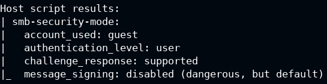

- Enumerate [SMB logged in users](https://nmap.org/nsedoc/scripts/smb-enum-sessions.html)

```bash
nmap -p445 --script smb-enum-sessions 10.2.24.25
```

```bash
# nmap logged in as the "guest" account
Host script results:
| smb-enum-sessions: 
|   Users logged in
|_    WIN-OMCNBKR66MN\bob since <unknown>
# bob is logged in without any credentials, since the "guest login" is enabled
```

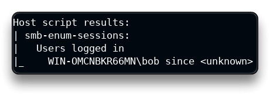

- Use the provided user and password to enumerate the same login sessions

```bash
nmap -p445 --script smb-enum-sessions --script-args smbusername=administrator,smbpassword=smbserver_771 10.2.24.25
```

```bash
Host script results:
| smb-enum-sessions: 
|   Users logged in
|     WIN-OMCNBKR66MN\bob since 2023-02-13T20:37:26
|   Active SMB sessions
|_    ADMINISTRATOR is connected from \\10.10.24.4 for [just logged in, it's probably you], idle for [not idle]
```

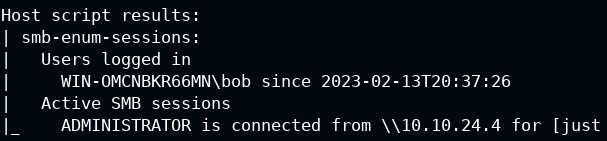

- Enumerate [SMB shares](https://nmap.org/nsedoc/scripts/smb-enum-shares.html) with a *guest* user

```bash
nmap -p445 --script smb-enum-shares 10.2.24.25
```

```bash
Host script results:
| smb-enum-shares: 
|   account_used: guest
|   \\10.2.24.25\ADMIN$: 
|     Type: STYPE_DISKTREE_HIDDEN
|     Comment: Remote Admin
|     Anonymous access: <none>
|     Current user access: <none>
|   \\10.2.24.25\C: 
|     Type: STYPE_DISKTREE
|     Comment: 
|     Anonymous access: <none>
|     Current user access: READ
|   \\10.2.24.25\C$: 
|     Type: STYPE_DISKTREE_HIDDEN
|     Comment: Default share
|     Anonymous access: <none>
|     Current user access: <none>
|   \\10.2.24.25\D$: 
|     Type: STYPE_DISKTREE_HIDDEN
|     Comment: Default share
|     Anonymous access: <none>
|     Current user access: <none>
|   \\10.2.24.25\Documents: 
|     Type: STYPE_DISKTREE
|     Comment: 
|     Anonymous access: <none>
|     Current user access: READ
|   \\10.2.24.25\Downloads: 
|     Type: STYPE_DISKTREE
|     Comment: 
|     Anonymous access: <none>
|     Current user access: READ
|   \\10.2.24.25\IPC$: 
|     Type: STYPE_IPC_HIDDEN
|     Comment: Remote IPC
|     Anonymous access: <none>
|     Current user access: READ/WRITE
|   \\10.2.24.25\print$: 
|     Type: STYPE_DISKTREE
|     Comment: Printer Drivers
|     Anonymous access: <none>
|_    Current user access: READ
```

> **`IPC$`** ([`null session connection`](https://learn.microsoft.com/en-us/troubleshoot/windows-server/networking/inter-process-communication-share-null-session)) - with this session, Windows lets guest *anonymous users enumerate the names of domain accounts and network shares*.

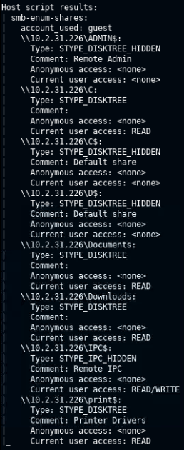

- Enumerate SMB shares with an *authenticated* user (administrator account)

```bash
nmap -p445 --script smb-enum-shares --script-args smbusername=administrator,smbpassword=smbserver_771 10.2.24.25
```

```bash
Host script results:
| smb-enum-shares: 
|   account_used: administrator
|   \\10.2.24.25\ADMIN$: 
|     Type: STYPE_DISKTREE_HIDDEN
|     Comment: Remote Admin
|     Users: 0
|     Max Users: <unlimited>
|     Path: C:\Windows
|     Anonymous access: <none>
|     Current user access: READ/WRITE
|   \\10.2.24.25\C: 
|     Type: STYPE_DISKTREE
|     Comment: 
|     Users: 0
|     Max Users: <unlimited>
|     Path: C:\
|     Anonymous access: <none>
|     Current user access: READ
|   \\10.2.24.25\C$: 
|     Type: STYPE_DISKTREE_HIDDEN
|     Comment: Default share
|     Users: 0
|     Max Users: <unlimited>
|     Path: C:\
|     Anonymous access: <none>
|     Current user access: READ/WRITE
|   \\10.2.24.25\D$: 
|     Type: STYPE_DISKTREE_HIDDEN
|     Comment: Default share
|     Users: 0
|     Max Users: <unlimited>
|     Path: D:\
|     Anonymous access: <none>
|     Current user access: READ/WRITE
|   \\10.2.24.25\Documents: 
|     Type: STYPE_DISKTREE
|     Comment: 
|     Users: 0
|     Max Users: <unlimited>
|     Path: C:\Users\Administrator\Documents
|     Anonymous access: <none>
|     Current user access: READ
|   \\10.2.24.25\Downloads: 
|     Type: STYPE_DISKTREE
|     Comment: 
|     Users: 0
|     Max Users: <unlimited>
|     Path: C:\Users\Administrator\Downloads
|     Anonymous access: <none>
|     Current user access: READ
|   \\10.2.24.25\IPC$: 
|     Type: STYPE_IPC_HIDDEN
|     Comment: Remote IPC
|     Users: 1
|     Max Users: <unlimited>
|     Path: 
|     Anonymous access: <none>
|     Current user access: READ/WRITE
|   \\10.2.24.25\print$: 
|     Type: STYPE_DISKTREE
|     Comment: Printer Drivers
|     Users: 0
|     Max Users: <unlimited>
|     Path: C:\Windows\system32\spool\drivers
|     Anonymous access: <none>
|_    Current user access: READ/WRITE
```

> The authenticated user, the **administrator** in this case, has **Read & Write** privileges to the entire `C$` (and `D$`) drive.

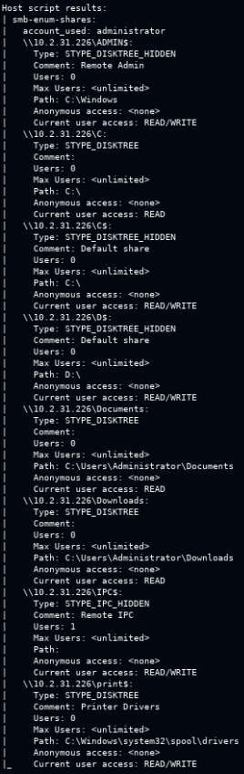

- Enumerate [Windows users](https://nmap.org/nsedoc/scripts/smb-enum-users.html)

```bash
nmap -p445 --script smb-enum-users --script-args smbusername=administrator,smbpassword=smbserver_771 10.2.24.25
```

```bash
Host script results:
| smb-enum-users: 
|   WIN-OMCNBKR66MN\Administrator (RID: 500)
|     Description: Built-in account for administering the computer/domain
|     Flags:       Password does not expire, Normal user account
|   WIN-OMCNBKR66MN\bob (RID: 1010)
|     Flags:       Password does not expire, Normal user account
|   WIN-OMCNBKR66MN\Guest (RID: 501)
|     Description: Built-in account for guest access to the computer/domain
|_    Flags:       Password does not expire, Password not required, Normal user account
```

> Three users are present with some dangerous *flags* and misconfigurations.
>
> - `Guest` user - *no password expiration, password not required, normal user account*
> - `Administrator`, `bob` - *no password expiration*


- Get some [server statistics](https://nmap.org/nsedoc/scripts/smb-server-stats.html)

```bash
nmap -p445 --script smb-server-stats --script-args smbusername=administrator,smbpassword=smbserver_771 10.2.24.25
```

```bash
Host script results:
| smb-server-stats: 
|   Server statistics collected since 2023-02-13T20:37:19 (40m18s):
|     94675 bytes (39.15 b/s) sent, 80383 bytes (33.24 b/s) received
|_    34 failed logins, 7 permission errors, 0 system errors, 0 print jobs, 35 files opened
```


- Enumerate [system domains](https://nmap.org/nsedoc/scripts/smb-enum-domains.html) and policies

```bash
nmap -p445 --script smb-enum-domains--script-args smbusername=administrator,smbpassword=smbserver_771 10.2.24.25
```

```bash
Host script results:
| smb-enum-domains: 
|   WIN-OMCNBKR66MN
|     Groups: WinRMRemoteWMIUsers__
|     Users: Administrator, bob, Guest
|     Creation time: 2013-08-22T14:47:57
|     Passwords: min length: n/a; min age: n/a days; max age: 42 days; history: n/a passwords
|     Properties: Complexity requirements exist # Important
|     Account lockout disabled
|   Builtin
|     Groups: Access Control Assistance Operators, Administrators, Backup Operators, Certificate Service DCOM Access, Cryptographic Operators, Distributed COM Users, Event Log Readers, Guests, Hyper-V Administrators, IIS_IUSRS, Network Configuration Operators, Performance Log Users, Performance Monitor Users, Power Users, Print Operators, RDS Endpoint Servers, RDS Management Servers, RDS Remote Access Servers, Remote Desktop Users, Remote Management Users, Replicator, Users
|     Users: n/a
|     Creation time: 2013-08-22T14:47:57
|     Passwords: min length: n/a; min age: n/a days; max age: 42 days; history: n/a passwords
|_    Account lockout disabled
```

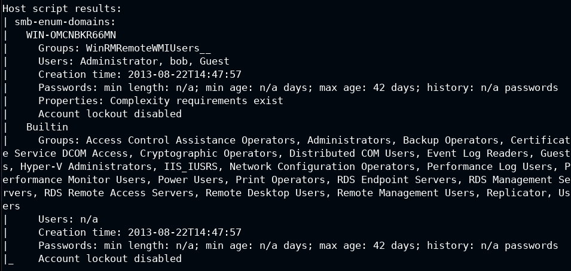

- Enumerate [available groups](https://nmap.org/nsedoc/scripts/smb-enum-groups.html)

```bash
nmap -p445 --script smb-enum-groups--script-args smbusername=administrator,smbpassword=smbserver_771 10.2.24.25
```

```bash
Host script results:
| smb-enum-groups: 
|   Builtin\Administrators (RID: 544): Administrator, bob
|   Builtin\Users (RID: 545): bob
|   Builtin\Guests (RID: 546): Guest
|   Builtin\Power Users (RID: 547): <empty>
|   Builtin\Print Operators (RID: 550): <empty>
|   Builtin\Backup Operators (RID: 551): <empty>
|   Builtin\Replicator (RID: 552): <empty>
|   Builtin\Remote Desktop Users (RID: 555): bob
|   Builtin\Network Configuration Operators (RID: 556): <empty>
|   Builtin\Performance Monitor Users (RID: 558): <empty>
|   Builtin\Performance Log Users (RID: 559): <empty>
|   Builtin\Distributed COM Users (RID: 562): <empty>
|   Builtin\IIS_IUSRS (RID: 568): <empty>
|   Builtin\Cryptographic Operators (RID: 569): <empty>
|   Builtin\Event Log Readers (RID: 573): <empty>
|   Builtin\Certificate Service DCOM Access (RID: 574): <empty>
|   Builtin\RDS Remote Access Servers (RID: 575): <empty>
|   Builtin\RDS Endpoint Servers (RID: 576): <empty>
|   Builtin\RDS Management Servers (RID: 577): <empty>
|   Builtin\Hyper-V Administrators (RID: 578): <empty>
|   Builtin\Access Control Assistance Operators (RID: 579): <empty>
|   Builtin\Remote Management Users (RID: 580): <empty>
|_  WIN-OMCNBKR66MN\WinRMRemoteWMIUsers__ (RID: 1000): <empty>

# "bob" has administrator privileges too
```

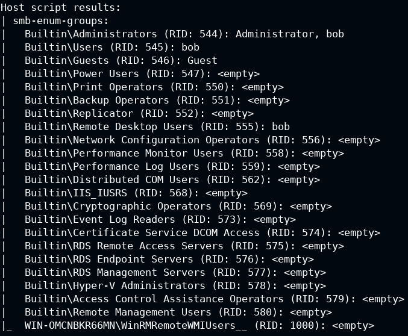

- Enumerate [services](https://nmap.org/nsedoc/scripts/smb-enum-services.html) on the target machine

```bash
nmap -p445 --script smb-enum-services --script-args smbusername=administrator,smbpassword=smbserver_771 10.2.24.25
```

```bash
PORT    STATE SERVICE
445/tcp open  microsoft-ds
| smb-enum-services: 
|   AmazonSSMAgent: 
|     display_name: Amazon SSM Agent
|     state: 
|       SERVICE_RUNNING
|       SERVICE_PAUSED
|       SERVICE_CONTINUE_PENDING
|       SERVICE_PAUSE_PENDING
|     type: 
|       SERVICE_TYPE_WIN32
|       SERVICE_TYPE_WIN32_OWN_PROCESS
|     controls_accepted: 
|       SERVICE_CONTROL_CONTINUE
|       SERVICE_CONTROL_NETBINDADD
|       SERVICE_CONTROL_INTERROGATE
|       SERVICE_CONTROL_NETBINDENABLE
|       SERVICE_CONTROL_PARAMCHANGE
|       SERVICE_CONTROL_STOP
	[...]
|   TrustedInstaller: 
|     display_name: Windows Modules Installer
|     state: 
|       SERVICE_RUNNING
|       SERVICE_PAUSED
|       SERVICE_CONTINUE_PENDING
|       SERVICE_PAUSE_PENDING
|     type: 
|       SERVICE_TYPE_WIN32
|       SERVICE_TYPE_WIN32_OWN_PROCESS
|     controls_accepted: 
|       SERVICE_CONTROL_CONTINUE
|       SERVICE_CONTROL_NETBINDADD
|       SERVICE_CONTROL_NETBINDENABLE
|       SERVICE_CONTROL_STOP
|   vds: 
|     display_name: Virtual Disk
|     state: 
|       SERVICE_RUNNING
|       SERVICE_PAUSED
|       SERVICE_CONTINUE_PENDING
|       SERVICE_PAUSE_PENDING
|     type: 
|       SERVICE_TYPE_WIN32
|       SERVICE_TYPE_WIN32_OWN_PROCESS
|     controls_accepted: 
|       SERVICE_CONTROL_CONTINUE
|       SERVICE_CONTROL_NETBINDADD
|       SERVICE_CONTROL_NETBINDENABLE
|_      SERVICE_CONTROL_STOP
```


- Retrieve useful information from all the shared folders, running the [`ls` command](https://nmap.org/nsedoc/scripts/smb-ls.html) on all of them

```bash
nmap -p445 --script smb-enum-shares,smb-ls --script-args smbusername=administrator,smbpassword=smbserver_771 10.2.24.25
```

```bash
Host script results:
| smb-enum-shares: 
|   account_used: administrator
|   \\10.2.24.25\ADMIN$: 
|     Type: STYPE_DISKTREE_HIDDEN
|     Comment: Remote Admin
|     Users: 0
|     Max Users: <unlimited>
|     Path: C:\Windows
|     Anonymous access: <none>
|     Current user access: READ/WRITE
	[...]
|   \\10.2.24.25\print$: 
|     Type: STYPE_DISKTREE
|     Comment: Printer Drivers
|     Users: 0
|     Max Users: <unlimited>
|     Path: C:\Windows\system32\spool\drivers
|     Anonymous access: <none>
|_    Current user access: READ/WRITE
| smb-ls: Volume \\10.2.24.25\ADMIN$
|   maxfiles limit reached (10)
| SIZE   TIME                 FILENAME
| <DIR>  2013-08-22T13:36:16  .
| <DIR>  2013-08-22T13:36:16  ..
| <DIR>  2013-08-22T15:39:31  ADFS
| <DIR>  2013-08-22T15:39:31  ADFS\ar
| <DIR>  2013-08-22T15:39:31  ADFS\bg
| <DIR>  2013-08-22T15:39:31  ADFS\cs
| <DIR>  2013-08-22T15:39:31  ADFS\da
| <DIR>  2013-08-22T15:39:31  ADFS\de
| <DIR>  2013-08-22T15:39:31  ADFS\el
| <DIR>  2013-08-22T15:39:31  ADFS\en
| 
| 
| Volume \\10.2.24.25\C
|   maxfiles limit reached (10)
| SIZE   TIME                 FILENAME
| <DIR>  2013-08-22T15:39:30  PerfLogs
| <DIR>  2013-08-22T13:36:16  Program Files
| <DIR>  2014-05-17T10:36:57  Program Files\Amazon
| <DIR>  2013-08-22T13:36:16  Program Files\Common Files
| <DIR>  2014-10-15T05:58:49  Program Files\DIFX
| <DIR>  2013-08-22T15:39:31  Program Files\Internet Explorer
| <DIR>  2014-07-10T18:40:15  Program Files\Update Services
| <DIR>  2020-08-12T04:13:47  Program Files\Windows Mail
| <DIR>  2013-08-22T15:39:31  Program Files\Windows NT
| <DIR>  2013-08-22T15:39:31  Program Files\WindowsPowerShell
| 
| 
| Volume \\10.2.24.25\C$
|   maxfiles limit reached (10)
| SIZE   TIME                 FILENAME
| <DIR>  2013-08-22T15:39:30  PerfLogs
| <DIR>  2013-08-22T13:36:16  Program Files
| <DIR>  2014-05-17T10:36:57  Program Files\Amazon
| <DIR>  2013-08-22T13:36:16  Program Files\Common Files
| <DIR>  2014-10-15T05:58:49  Program Files\DIFX
| <DIR>  2013-08-22T15:39:31  Program Files\Internet Explorer
| <DIR>  2014-07-10T18:40:15  Program Files\Update Services
| <DIR>  2020-08-12T04:13:47  Program Files\Windows Mail
| <DIR>  2013-08-22T15:39:31  Program Files\Windows NT
| <DIR>  2013-08-22T15:39:31  Program Files\WindowsPowerShell
| 
| 
| Volume \\10.2.24.25\Documents
| SIZE   TIME                 FILENAME
| <DIR>  2020-09-10T09:50:27  .
| <DIR>  2020-09-10T09:50:27  ..
| 
| 
| Volume \\10.2.24.25\Downloads
| SIZE   TIME                 FILENAME
| <DIR>  2020-09-10T09:50:27  .
| <DIR>  2020-09-10T09:50:27  ..
| 
| 
| Volume \\10.2.24.25\print$
|   maxfiles limit reached (10)
| SIZE    TIME                 FILENAME
| <DIR>   2013-08-22T15:39:31  .
| <DIR>   2013-08-22T15:39:31  ..
| <DIR>   2013-08-22T15:39:31  color
| 1058    2013-08-22T06:54:44  color\D50.camp
| 1079    2013-08-22T06:54:44  color\D65.camp
| 797     2013-08-22T06:54:44  color\Graphics.gmmp
| 838     2013-08-22T06:54:44  color\MediaSim.gmmp
| 786     2013-08-22T06:54:44  color\Photo.gmmp
| 822     2013-08-22T06:54:44  color\Proofing.gmmp
| 218103  2013-08-22T06:54:44  color\RSWOP.icm
|_
```

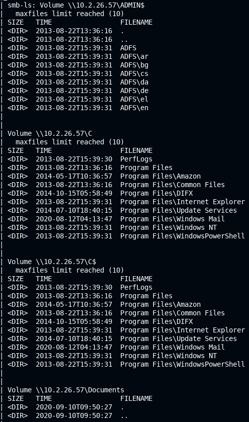

### Lab 2

>  🔬 [Windows Recon: SMBMap](https://attackdefense.pentesteracademy.com/challengedetails?cid=2221)
>
>  - Target IP: `10.2.21.233`
>  - Use of [`smbmap`](https://www.kali.org/tools/smbmap/) to enumerate samba shares and permissions. Upload, download, delete files

```bash
ping 10.2.21.233
nmap 10.2.21.233

PORT      STATE SERVICE
135/tcp   open  msrpc
139/tcp   open  netbios-ssn
445/tcp   open  microsoft-ds
3389/tcp  open  ms-wbt-server
49152/tcp open  unknown
49153/tcp open  unknown
49154/tcp open  unknown
49155/tcp open  unknown
49165/tcp open  unknown
```

- SMB port `445` is open, list the SMB protocols

```bash
nmap -p445 --script smb-protocols 10.2.21.233
```

```bash
Host script results:
| smb-protocols: 
|   dialects: 
|     NT LM 0.12 (SMBv1) [dangerous, but default]
|     2.02
|     2.10
|     3.00
|_    3.02
```

- Enumerate the target machine with **`smbmap`**

```bash
smbmap -u guest -p "" -d . -H 10.2.21.233
```

```bash
[+] Guest session   IP: 10.2.21.233:445   Name: 10.2.21.233                                       
  Disk       Permissions   Comment
  ----       -----------   -------
  ADMIN$     NO ACCESS	   Remote Admin
  C          NO ACCESS	   
  C$         NO ACCESS	   Default share
  D$         NO ACCESS	   Default share
  Documents  NO ACCESS	   
  Downloads  NO ACCESS	   
  IPC$       READ ONLY	   Remote IPC
  print$     READ ONLY	   Printer Drivers
```

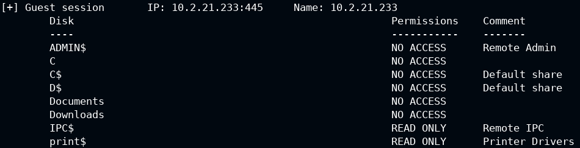

- Login with administrator and enumerate with `smbmap`

```bash
smbmap -u administrator -p smbserver_771 -d . -H 10.2.21.233
```

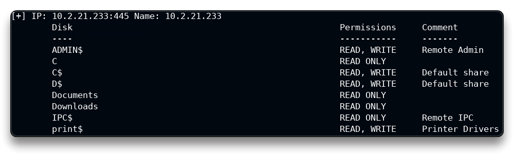

- Run a command using the smbmap `-x` option

```bash
smbmap -u administrator -p smbserver_771 -H 10.2.21.233 -x 'ipconfig'
```

> ❗ ***R**emote **C**ode **E**xecution* (**`RCE`**) can be achieved through SMB!

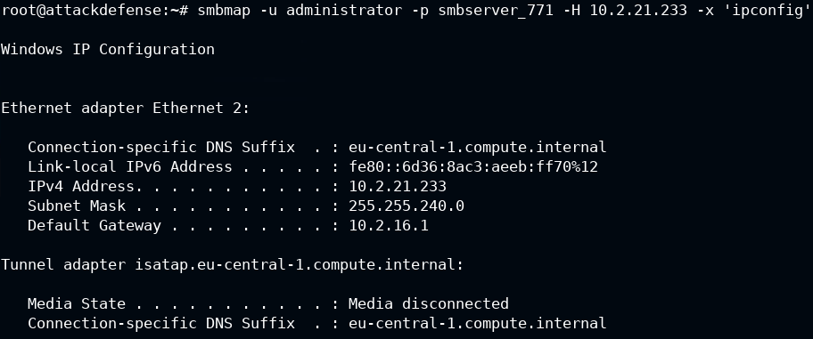

- List all drives with `-L` option

```bash
smbmap -u administrator -p 'smbserver_771' -H 10.2.21.233 -L
```

```bash
[+] Host 10.2.21.233 Local Drives: C:\ D:\
[+] Host 10.2.21.233 Net Drive(s):
	No mapped network drives
```

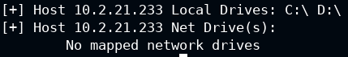

- List directory contents with `-r` option

```bash
smbmap -u administrator -p 'smbserver_771' -H 10.2.21.233 -r 'C$'
```

```bash
[+] IP: 10.2.21.233:445	Name: 10.2.21.233                                       
        Disk                                                  	Permissions	Comment
	----                                                  	-----------	-------
	C$                                                	READ, WRITE	
	.\C$\*
	dr--r--r--                0 Sat Sep  5 13:26:00 2020	$Recycle.Bin
	fw--w--w--           398356 Wed Aug 12 10:47:41 2020	bootmgr
	fr--r--r--                1 Wed Aug 12 10:47:40 2020	BOOTNXT
	dr--r--r--                0 Wed Aug 12 10:47:41 2020	Documents and Settings
	fr--r--r--               32 Mon Dec 21 21:27:10 2020	flag.txt
	fr--r--r--       8589934592 Tue Feb 14 03:15:53 2023	pagefile.sys
	dr--r--r--                0 Wed Aug 12 10:49:32 2020	PerfLogs
	dw--w--w--                0 Wed Aug 12 10:49:32 2020	Program Files
	dr--r--r--                0 Sat Sep  5 14:35:45 2020	Program Files (x86)
	dr--r--r--                0 Sat Sep  5 14:35:45 2020	ProgramData
	dr--r--r--                0 Sat Sep  5 09:16:57 2020	System Volume Information
	dw--w--w--                0 Sat Dec 19 11:14:55 2020	Users
	dr--r--r--                0 Tue Feb 14 03:30:25 2023	Windows
```


- Upload a sample file to the `C:\` drive

```bash
touch sample_backdoor
```

```bash
smbmap -u administrator -p 'smbserver_771' -H 10.2.21.233 --upload '/root/sample_backdoor' 'C$\sample_backdoor'
```

```bash
[+] Starting upload: /root/sample_backdoor (0 bytes)
[+] Upload complete
```

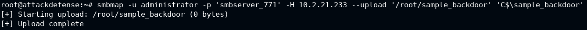

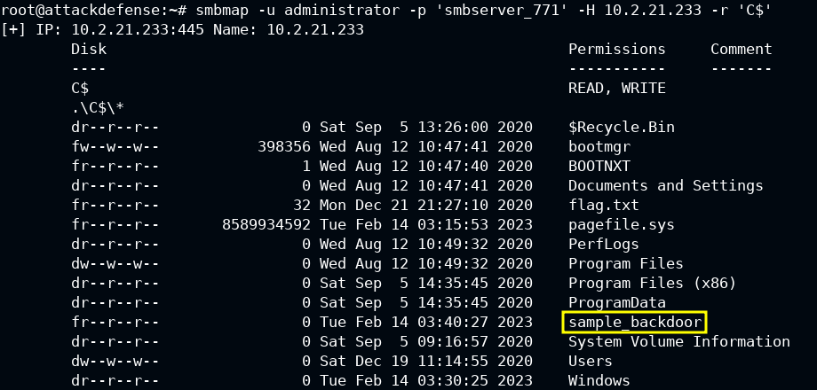

- Download a file, the flag file in this case

```bash
smbmap -u administrator -p 'smbserver_771' -H 10.2.21.233 --download 'C$\flag.txt'
```

```bash
[+] Starting download: C$\flag.txt (32 bytes)
[+] File output to: /root/10.2.21.233-C_flag.txt

cat 10.2.21.233-C_flag.txt
```

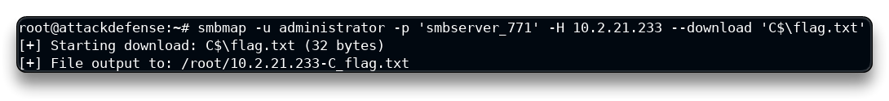

<details>
<summary>Reveal Flag: 🚩</summary>

`25f492dbef8453cdca69a173a75790f0`

</details>

------

## FTP


## SSH


## HTTP


## MYSQL

