# SMB Enum

**`SMB`** (**S**erver **M**essage **B**lock) - a network file and resource sharing protocol based on a _client-server_ model.

There are many variants of the SMB protocol like SMBv1, CIFS, SMBv2, SMBv2.1, SMBv3, and so on.

- `e.g.` Windows mapping and sharing drives as letter, uses SMB

Usually SMB can be found on ports `139` or `445` and `nmap` service and scripts enumeration (**`-sV`**, **`-sC`**) can find more info about the O.S. version.

After finding SMB through port scanning, gather more information with `nmap`.

```bash
sudo nmap -sV -sC -O <TARGET_IP>
```

## Lab 1

>  🔬 [Windows Recon: SMB Nmap Scripts](https://attackdefense.pentesteracademy.com/challengedetailsnoauth?cid=2222)
>
>  - Target IP: `10.2.24.25`
>  - Enumeration of SMB protocol dialects, security level information, active sessions, Windows users and shares, domains, services.

```bash
ping 10.2.24.25
nmap 10.2.24.25

PORT      STATE SERVICE
135/tcp   open  msrpc
139/tcp   open  netbios-ssn
445/tcp   open  microsoft-ds
3389/tcp  open  ms-wbt-server
49152/tcp open  unknown
49153/tcp open  unknown
49154/tcp open  unknown
49155/tcp open  unknown
49167/tcp open  unknown
```

- SMB port `445` is open, use a specific [nmap script](https://nmap.org/nsedoc/scripts/smb-protocols.html) to list the *SMB server supported protocols and dialects*

```bash
nmap -p445 --script smb-protocols 10.2.24.25
```

```bash
Host script results:
| smb-protocols: 
|   dialects: 
|     NT LM 0.12 (SMBv1) [dangerous, but default]
|     2.02
|     2.10
|     3.00
|_    3.02
```

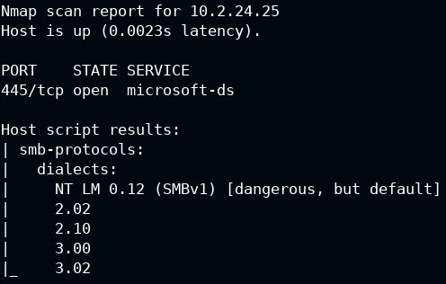

- Find [SMB security level](https://nmap.org/nsedoc/scripts/smb-security-mode.html) with another nmap script

```bash
nmap -p445 --script smb-security-mode 10.2.24.25
```

```bash
Host script results:
| smb-security-mode: 
|   account_used: guest
|   authentication_level: user
|   challenge_response: supported
|_  message_signing: disabled (dangerous, but default)
```


- Enumerate [SMB logged in users](https://nmap.org/nsedoc/scripts/smb-enum-sessions.html)

```bash
nmap -p445 --script smb-enum-sessions 10.2.24.25
```

```bash
# nmap logged in as the "guest" account
Host script results:
| smb-enum-sessions: 
|   Users logged in
|_    WIN-OMCNBKR66MN\bob since <unknown>
# bob is logged in without any credentials, since the "guest login" is enabled
```


- Use the provided user and password to enumerate the same login sessions

```bash
nmap -p445 --script smb-enum-sessions --script-args smbusername=administrator,smbpassword=smbserver_771 10.2.24.25
```

```bash
Host script results:
| smb-enum-sessions: 
|   Users logged in
|     WIN-OMCNBKR66MN\bob since 2023-02-13T20:37:26
|   Active SMB sessions
|_    ADMINISTRATOR is connected from \\10.10.24.4 for [just logged in, it's probably you], idle for [not idle]
```


- Enumerate [SMB shares](https://nmap.org/nsedoc/scripts/smb-enum-shares.html) with a *guest* user

```bash
nmap -p445 --script smb-enum-shares 10.2.24.25
```

```bash
Host script results:
| smb-enum-shares: 
|   account_used: guest
|   \\10.2.24.25\ADMIN$: 
|     Type: STYPE_DISKTREE_HIDDEN
|     Comment: Remote Admin
|     Anonymous access: <none>
|     Current user access: <none>
|   \\10.2.24.25\C: 
|     Type: STYPE_DISKTREE
|     Comment: 
|     Anonymous access: <none>
|     Current user access: READ
|   \\10.2.24.25\C$: 
|     Type: STYPE_DISKTREE_HIDDEN
|     Comment: Default share
|     Anonymous access: <none>
|     Current user access: <none>
|   \\10.2.24.25\D$: 
|     Type: STYPE_DISKTREE_HIDDEN
|     Comment: Default share
|     Anonymous access: <none>
|     Current user access: <none>
|   \\10.2.24.25\Documents: 
|     Type: STYPE_DISKTREE
|     Comment: 
|     Anonymous access: <none>
|     Current user access: READ
|   \\10.2.24.25\Downloads: 
|     Type: STYPE_DISKTREE
|     Comment: 
|     Anonymous access: <none>
|     Current user access: READ
|   \\10.2.24.25\IPC$: 
|     Type: STYPE_IPC_HIDDEN
|     Comment: Remote IPC
|     Anonymous access: <none>
|     Current user access: READ/WRITE
|   \\10.2.24.25\print$: 
|     Type: STYPE_DISKTREE
|     Comment: Printer Drivers
|     Anonymous access: <none>
|_    Current user access: READ
```

> **`IPC$`** ([`null session connection`](https://learn.microsoft.com/en-us/troubleshoot/windows-server/networking/inter-process-communication-share-null-session)) - with this session, Windows lets guest *anonymous users enumerate the names of domain accounts and network shares*.

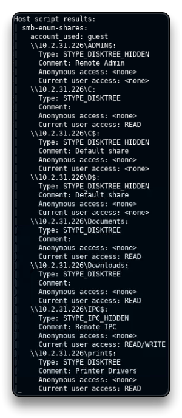

- Enumerate SMB shares with an *authenticated* user (administrator account)

```bash
nmap -p445 --script smb-enum-shares --script-args smbusername=administrator,smbpassword=smbserver_771 10.2.24.25
```

```bash
Host script results:
| smb-enum-shares: 
|   account_used: administrator
|   \\10.2.24.25\ADMIN$: 
|     Type: STYPE_DISKTREE_HIDDEN
|     Comment: Remote Admin
|     Users: 0
|     Max Users: <unlimited>
|     Path: C:\Windows
|     Anonymous access: <none>
|     Current user access: READ/WRITE
|   \\10.2.24.25\C: 
|     Type: STYPE_DISKTREE
|     Comment: 
|     Users: 0
|     Max Users: <unlimited>
|     Path: C:\
|     Anonymous access: <none>
|     Current user access: READ
|   \\10.2.24.25\C$: 
|     Type: STYPE_DISKTREE_HIDDEN
|     Comment: Default share
|     Users: 0
|     Max Users: <unlimited>
|     Path: C:\
|     Anonymous access: <none>
|     Current user access: READ/WRITE
|   \\10.2.24.25\D$: 
|     Type: STYPE_DISKTREE_HIDDEN
|     Comment: Default share
|     Users: 0
|     Max Users: <unlimited>
|     Path: D:\
|     Anonymous access: <none>
|     Current user access: READ/WRITE
|   \\10.2.24.25\Documents: 
|     Type: STYPE_DISKTREE
|     Comment: 
|     Users: 0
|     Max Users: <unlimited>
|     Path: C:\Users\Administrator\Documents
|     Anonymous access: <none>
|     Current user access: READ
|   \\10.2.24.25\Downloads: 
|     Type: STYPE_DISKTREE
|     Comment: 
|     Users: 0
|     Max Users: <unlimited>
|     Path: C:\Users\Administrator\Downloads
|     Anonymous access: <none>
|     Current user access: READ
|   \\10.2.24.25\IPC$: 
|     Type: STYPE_IPC_HIDDEN
|     Comment: Remote IPC
|     Users: 1
|     Max Users: <unlimited>
|     Path: 
|     Anonymous access: <none>
|     Current user access: READ/WRITE
|   \\10.2.24.25\print$: 
|     Type: STYPE_DISKTREE
|     Comment: Printer Drivers
|     Users: 0
|     Max Users: <unlimited>
|     Path: C:\Windows\system32\spool\drivers
|     Anonymous access: <none>
|_    Current user access: READ/WRITE
```

> The authenticated user, the **administrator** in this case, has **Read & Write** privileges to the entire `C$` (and `D$`) drive.

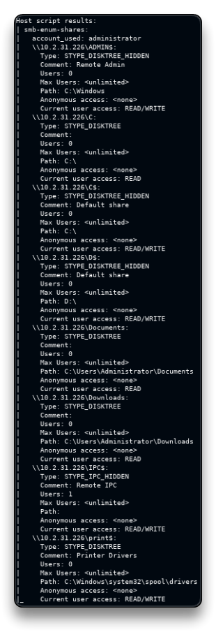

- Enumerate [Windows users](https://nmap.org/nsedoc/scripts/smb-enum-users.html)

```bash
nmap -p445 --script smb-enum-users --script-args smbusername=administrator,smbpassword=smbserver_771 10.2.24.25
```

```bash
Host script results:
| smb-enum-users: 
|   WIN-OMCNBKR66MN\Administrator (RID: 500)
|     Description: Built-in account for administering the computer/domain
|     Flags:       Password does not expire, Normal user account
|   WIN-OMCNBKR66MN\bob (RID: 1010)
|     Flags:       Password does not expire, Normal user account
|   WIN-OMCNBKR66MN\Guest (RID: 501)
|     Description: Built-in account for guest access to the computer/domain
|_    Flags:       Password does not expire, Password not required, Normal user account
```

> Three users are present with some dangerous *flags* and misconfigurations.
>
> - `Guest` user - *no password expiration, password not required, normal user account*
> - `Administrator`, `bob` - *no password expiration*

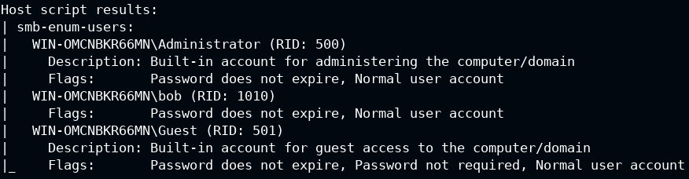

- Get some [server statistics](https://nmap.org/nsedoc/scripts/smb-server-stats.html)

```bash
nmap -p445 --script smb-server-stats --script-args smbusername=administrator,smbpassword=smbserver_771 10.2.24.25
```

```bash
Host script results:
| smb-server-stats: 
|   Server statistics collected since 2023-02-13T20:37:19 (40m18s):
|     94675 bytes (39.15 b/s) sent, 80383 bytes (33.24 b/s) received
|_    34 failed logins, 7 permission errors, 0 system errors, 0 print jobs, 35 files opened
```

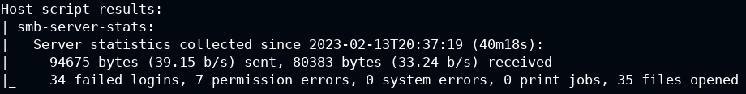

- Enumerate [system domains](https://nmap.org/nsedoc/scripts/smb-enum-domains.html) and policies

```bash
nmap -p445 --script smb-enum-domains--script-args smbusername=administrator,smbpassword=smbserver_771 10.2.24.25
```

```bash
Host script results:
| smb-enum-domains: 
|   WIN-OMCNBKR66MN
|     Groups: WinRMRemoteWMIUsers__
|     Users: Administrator, bob, Guest
|     Creation time: 2013-08-22T14:47:57
|     Passwords: min length: n/a; min age: n/a days; max age: 42 days; history: n/a passwords
|     Properties: Complexity requirements exist # Important
|     Account lockout disabled
|   Builtin
|     Groups: Access Control Assistance Operators, Administrators, Backup Operators, Certificate Service DCOM Access, Cryptographic Operators, Distributed COM Users, Event Log Readers, Guests, Hyper-V Administrators, IIS_IUSRS, Network Configuration Operators, Performance Log Users, Performance Monitor Users, Power Users, Print Operators, RDS Endpoint Servers, RDS Management Servers, RDS Remote Access Servers, Remote Desktop Users, Remote Management Users, Replicator, Users
|     Users: n/a
|     Creation time: 2013-08-22T14:47:57
|     Passwords: min length: n/a; min age: n/a days; max age: 42 days; history: n/a passwords
|_    Account lockout disabled
```


- Enumerate [available groups](https://nmap.org/nsedoc/scripts/smb-enum-groups.html)

```bash
nmap -p445 --script smb-enum-groups--script-args smbusername=administrator,smbpassword=smbserver_771 10.2.24.25
```

```bash
Host script results:
| smb-enum-groups: 
|   Builtin\Administrators (RID: 544): Administrator, bob
|   Builtin\Users (RID: 545): bob
|   Builtin\Guests (RID: 546): Guest
|   Builtin\Power Users (RID: 547): <empty>
|   Builtin\Print Operators (RID: 550): <empty>
|   Builtin\Backup Operators (RID: 551): <empty>
|   Builtin\Replicator (RID: 552): <empty>
|   Builtin\Remote Desktop Users (RID: 555): bob
|   Builtin\Network Configuration Operators (RID: 556): <empty>
|   Builtin\Performance Monitor Users (RID: 558): <empty>
|   Builtin\Performance Log Users (RID: 559): <empty>
|   Builtin\Distributed COM Users (RID: 562): <empty>
|   Builtin\IIS_IUSRS (RID: 568): <empty>
|   Builtin\Cryptographic Operators (RID: 569): <empty>
|   Builtin\Event Log Readers (RID: 573): <empty>
|   Builtin\Certificate Service DCOM Access (RID: 574): <empty>
|   Builtin\RDS Remote Access Servers (RID: 575): <empty>
|   Builtin\RDS Endpoint Servers (RID: 576): <empty>
|   Builtin\RDS Management Servers (RID: 577): <empty>
|   Builtin\Hyper-V Administrators (RID: 578): <empty>
|   Builtin\Access Control Assistance Operators (RID: 579): <empty>
|   Builtin\Remote Management Users (RID: 580): <empty>
|_  WIN-OMCNBKR66MN\WinRMRemoteWMIUsers__ (RID: 1000): <empty>

# "bob" has administrator privileges too
```

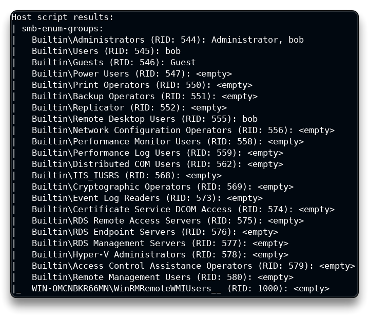

- Enumerate [services](https://nmap.org/nsedoc/scripts/smb-enum-services.html) on the target machine

```bash
nmap -p445 --script smb-enum-services --script-args smbusername=administrator,smbpassword=smbserver_771 10.2.24.25
```

```bash
PORT    STATE SERVICE
445/tcp open  microsoft-ds
| smb-enum-services: 
|   AmazonSSMAgent: 
|     display_name: Amazon SSM Agent
|     state: 
|       SERVICE_RUNNING
|       SERVICE_PAUSED
|       SERVICE_CONTINUE_PENDING
|       SERVICE_PAUSE_PENDING
|     type: 
|       SERVICE_TYPE_WIN32
|       SERVICE_TYPE_WIN32_OWN_PROCESS
|     controls_accepted: 
|       SERVICE_CONTROL_CONTINUE
|       SERVICE_CONTROL_NETBINDADD
|       SERVICE_CONTROL_INTERROGATE
|       SERVICE_CONTROL_NETBINDENABLE
|       SERVICE_CONTROL_PARAMCHANGE
|       SERVICE_CONTROL_STOP
	[...]
|   TrustedInstaller: 
|     display_name: Windows Modules Installer
|     state: 
|       SERVICE_RUNNING
|       SERVICE_PAUSED
|       SERVICE_CONTINUE_PENDING
|       SERVICE_PAUSE_PENDING
|     type: 
|       SERVICE_TYPE_WIN32
|       SERVICE_TYPE_WIN32_OWN_PROCESS
|     controls_accepted: 
|       SERVICE_CONTROL_CONTINUE
|       SERVICE_CONTROL_NETBINDADD
|       SERVICE_CONTROL_NETBINDENABLE
|       SERVICE_CONTROL_STOP
|   vds: 
|     display_name: Virtual Disk
|     state: 
|       SERVICE_RUNNING
|       SERVICE_PAUSED
|       SERVICE_CONTINUE_PENDING
|       SERVICE_PAUSE_PENDING
|     type: 
|       SERVICE_TYPE_WIN32
|       SERVICE_TYPE_WIN32_OWN_PROCESS
|     controls_accepted: 
|       SERVICE_CONTROL_CONTINUE
|       SERVICE_CONTROL_NETBINDADD
|       SERVICE_CONTROL_NETBINDENABLE
|_      SERVICE_CONTROL_STOP
```

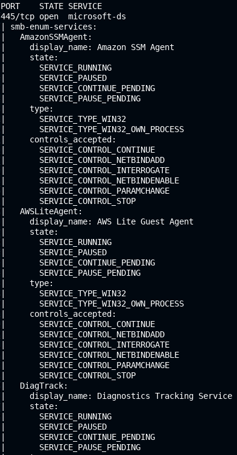

- Retrieve useful information from all the shared folders, running the [`ls` command](https://nmap.org/nsedoc/scripts/smb-ls.html) on all of them

```bash
nmap -p445 --script smb-enum-shares,smb-ls --script-args smbusername=administrator,smbpassword=smbserver_771 10.2.24.25
```

```bash
Host script results:
| smb-enum-shares: 
|   account_used: administrator
|   \\10.2.24.25\ADMIN$: 
|     Type: STYPE_DISKTREE_HIDDEN
|     Comment: Remote Admin
|     Users: 0
|     Max Users: <unlimited>
|     Path: C:\Windows
|     Anonymous access: <none>
|     Current user access: READ/WRITE
	[...]
|   \\10.2.24.25\print$: 
|     Type: STYPE_DISKTREE
|     Comment: Printer Drivers
|     Users: 0
|     Max Users: <unlimited>
|     Path: C:\Windows\system32\spool\drivers
|     Anonymous access: <none>
|_    Current user access: READ/WRITE
| smb-ls: Volume \\10.2.24.25\ADMIN$
|   maxfiles limit reached (10)
| SIZE   TIME                 FILENAME
| <DIR>  2013-08-22T13:36:16  .
| <DIR>  2013-08-22T13:36:16  ..
| <DIR>  2013-08-22T15:39:31  ADFS
| <DIR>  2013-08-22T15:39:31  ADFS\ar
| <DIR>  2013-08-22T15:39:31  ADFS\bg
| <DIR>  2013-08-22T15:39:31  ADFS\cs
| <DIR>  2013-08-22T15:39:31  ADFS\da
| <DIR>  2013-08-22T15:39:31  ADFS\de
| <DIR>  2013-08-22T15:39:31  ADFS\el
| <DIR>  2013-08-22T15:39:31  ADFS\en
| 
| 
| Volume \\10.2.24.25\C
|   maxfiles limit reached (10)
| SIZE   TIME                 FILENAME
| <DIR>  2013-08-22T15:39:30  PerfLogs
| <DIR>  2013-08-22T13:36:16  Program Files
| <DIR>  2014-05-17T10:36:57  Program Files\Amazon
| <DIR>  2013-08-22T13:36:16  Program Files\Common Files
| <DIR>  2014-10-15T05:58:49  Program Files\DIFX
| <DIR>  2013-08-22T15:39:31  Program Files\Internet Explorer
| <DIR>  2014-07-10T18:40:15  Program Files\Update Services
| <DIR>  2020-08-12T04:13:47  Program Files\Windows Mail
| <DIR>  2013-08-22T15:39:31  Program Files\Windows NT
| <DIR>  2013-08-22T15:39:31  Program Files\WindowsPowerShell
| 
| 
| Volume \\10.2.24.25\C$
|   maxfiles limit reached (10)
| SIZE   TIME                 FILENAME
| <DIR>  2013-08-22T15:39:30  PerfLogs
| <DIR>  2013-08-22T13:36:16  Program Files
| <DIR>  2014-05-17T10:36:57  Program Files\Amazon
| <DIR>  2013-08-22T13:36:16  Program Files\Common Files
| <DIR>  2014-10-15T05:58:49  Program Files\DIFX
| <DIR>  2013-08-22T15:39:31  Program Files\Internet Explorer
| <DIR>  2014-07-10T18:40:15  Program Files\Update Services
| <DIR>  2020-08-12T04:13:47  Program Files\Windows Mail
| <DIR>  2013-08-22T15:39:31  Program Files\Windows NT
| <DIR>  2013-08-22T15:39:31  Program Files\WindowsPowerShell
| 
| 
| Volume \\10.2.24.25\Documents
| SIZE   TIME                 FILENAME
| <DIR>  2020-09-10T09:50:27  .
| <DIR>  2020-09-10T09:50:27  ..
| 
| 
| Volume \\10.2.24.25\Downloads
| SIZE   TIME                 FILENAME
| <DIR>  2020-09-10T09:50:27  .
| <DIR>  2020-09-10T09:50:27  ..
| 
| 
| Volume \\10.2.24.25\print$
|   maxfiles limit reached (10)
| SIZE    TIME                 FILENAME
| <DIR>   2013-08-22T15:39:31  .
| <DIR>   2013-08-22T15:39:31  ..
| <DIR>   2013-08-22T15:39:31  color
| 1058    2013-08-22T06:54:44  color\D50.camp
| 1079    2013-08-22T06:54:44  color\D65.camp
| 797     2013-08-22T06:54:44  color\Graphics.gmmp
| 838     2013-08-22T06:54:44  color\MediaSim.gmmp
| 786     2013-08-22T06:54:44  color\Photo.gmmp
| 822     2013-08-22T06:54:44  color\Proofing.gmmp
| 218103  2013-08-22T06:54:44  color\RSWOP.icm
|_
```


## Lab 2

>  🔬 [Windows Recon: SMBMap](https://attackdefense.pentesteracademy.com/challengedetails?cid=2221)
>
>  - Target IP: `10.2.21.233`
>  - Use of [`smbmap`](https://www.kali.org/tools/smbmap/) to enumerate samba shares and permissions. Upload, download, delete files

```bash
ping 10.2.21.233
nmap 10.2.21.233

PORT      STATE SERVICE
135/tcp   open  msrpc
139/tcp   open  netbios-ssn
445/tcp   open  microsoft-ds
3389/tcp  open  ms-wbt-server
49152/tcp open  unknown
49153/tcp open  unknown
49154/tcp open  unknown
49155/tcp open  unknown
49165/tcp open  unknown
```

- SMB port `445` is open, list the SMB protocols

```bash
nmap -p445 --script smb-protocols 10.2.21.233
```

```bash
Host script results:
| smb-protocols: 
|   dialects: 
|     NT LM 0.12 (SMBv1) [dangerous, but default]
|     2.02
|     2.10
|     3.00
|_    3.02
```

- Enumerate the target machine with **`smbmap`**

```bash
smbmap -u guest -p "" -d . -H 10.2.21.233
```

```bash
[+] Guest session   IP: 10.2.21.233:445   Name: 10.2.21.233                                       
  Disk       Permissions   Comment
  ----       -----------   -------
  ADMIN$     NO ACCESS	   Remote Admin
  C          NO ACCESS	   
  C$         NO ACCESS	   Default share
  D$         NO ACCESS	   Default share
  Documents  NO ACCESS	   
  Downloads  NO ACCESS	   
  IPC$       READ ONLY	   Remote IPC
  print$     READ ONLY	   Printer Drivers
```

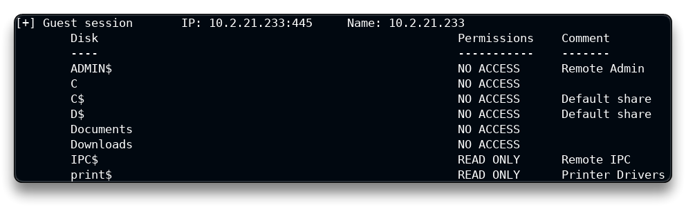

- Login with administrator and enumerate with `smbmap`

```bash
smbmap -u administrator -p smbserver_771 -d . -H 10.2.21.233
```

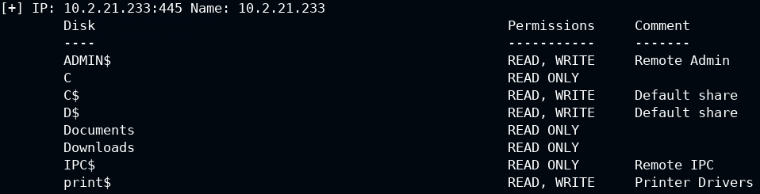

- Run a command using the smbmap `-x` option

```bash
smbmap -u administrator -p smbserver_771 -H 10.2.21.233 -x 'ipconfig'
```

> ❗ ***R**emote **C**ode **E**xecution* (**`RCE`**) can be achieved through SMB!


- List all drives with `-L` option

```bash
smbmap -u administrator -p 'smbserver_771' -H 10.2.21.233 -L
```

```bash
[+] Host 10.2.21.233 Local Drives: C:\ D:\
[+] Host 10.2.21.233 Net Drive(s):
	No mapped network drives
```


- List directory contents with `-r` option

```bash
smbmap -u administrator -p 'smbserver_771' -H 10.2.21.233 -r 'C$'
```

```bash
[+] IP: 10.2.21.233:445	Name: 10.2.21.233                                       
        Disk                                                  	Permissions	Comment
	----                                                  	-----------	-------
	C$                                                	READ, WRITE	
	.\C$\*
	dr--r--r--                0 Sat Sep  5 13:26:00 2020	$Recycle.Bin
	fw--w--w--           398356 Wed Aug 12 10:47:41 2020	bootmgr
	fr--r--r--                1 Wed Aug 12 10:47:40 2020	BOOTNXT
	dr--r--r--                0 Wed Aug 12 10:47:41 2020	Documents and Settings
	fr--r--r--               32 Mon Dec 21 21:27:10 2020	flag.txt
	fr--r--r--       8589934592 Tue Feb 14 03:15:53 2023	pagefile.sys
	dr--r--r--                0 Wed Aug 12 10:49:32 2020	PerfLogs
	dw--w--w--                0 Wed Aug 12 10:49:32 2020	Program Files
	dr--r--r--                0 Sat Sep  5 14:35:45 2020	Program Files (x86)
	dr--r--r--                0 Sat Sep  5 14:35:45 2020	ProgramData
	dr--r--r--                0 Sat Sep  5 09:16:57 2020	System Volume Information
	dw--w--w--                0 Sat Dec 19 11:14:55 2020	Users
	dr--r--r--                0 Tue Feb 14 03:30:25 2023	Windows
```

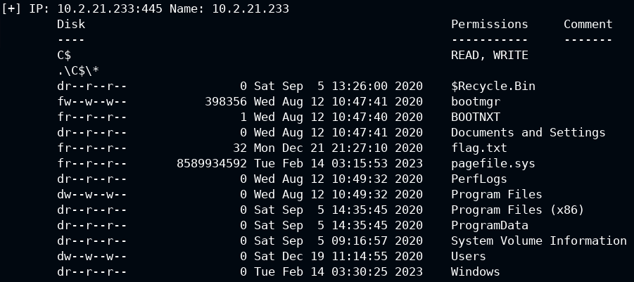

- Upload a sample file to the `C:\` drive

```bash
touch sample_backdoor
```

```bash
smbmap -u administrator -p 'smbserver_771' -H 10.2.21.233 --upload '/root/sample_backdoor' 'C$\sample_backdoor'
```

```bash
[+] Starting upload: /root/sample_backdoor (0 bytes)
[+] Upload complete
```

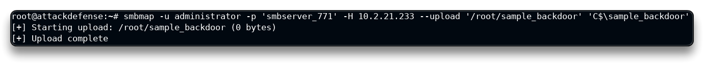

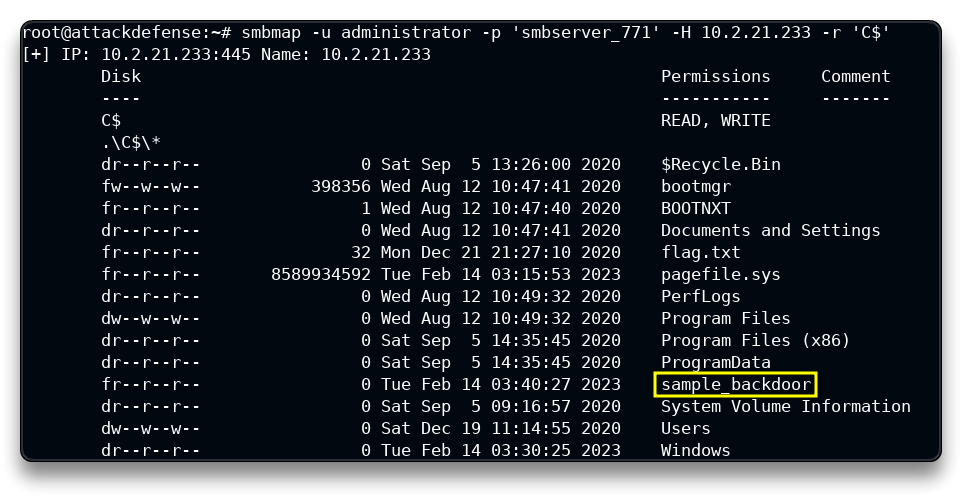

- Download a file, the flag file in this case

```bash
smbmap -u administrator -p 'smbserver_771' -H 10.2.21.233 --download 'C$\flag.txt'
```

```bash
[+] Starting download: C$\flag.txt (32 bytes)
[+] File output to: /root/10.2.21.233-C_flag.txt

cat 10.2.21.233-C_flag.txt
```

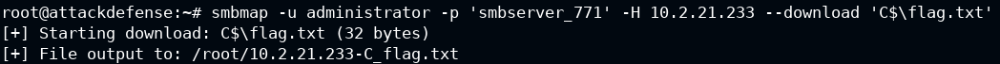

<details>
<summary>Reveal Flag: 🚩</summary>


`25f492dbef8453cdca69a173a75790f0`

</details>

## Lab 3

>  🔬 [Samba Recon: Basics 1](https://attackdefense.pentesteracademy.com/challengedetails?cid=553)
>
>  - Target IP: `192.28.157.3`
>  - Linux SMB (**`smbd`**) enumeration

```bash
ip -br -c a
```

```bash
lo               UNKNOWN        127.0.0.1/8 
ip_vti0@NONE     DOWN           
eth0@if107852    UP             10.1.0.13/16 
eth1@if107855    UP             192.28.157.2/24
```

- Target IP is `192.28.157.3`

```bash
nmap 192.28.157.3
```

```bash
139/tcp open  netbios-ssn
445/tcp open  microsoft-ds
# Service is not specific
```

```bash
nmap -sV -p 139,445 192.28.157.3
```

```bash
PORT    STATE SERVICE     VERSION
139/tcp open  netbios-ssn Samba smbd 3.X - 4.X (workgroup: RECONLABS)
445/tcp open  netbios-ssn Samba smbd 3.X - 4.X (workgroup: RECONLABS)
MAC Address: 02:42:C0:1C:9D:03 (Unknown)
Service Info: Host: SAMBA-RECON
# Enumeration of the 139, 445 ports services
```

> 📌 Default `smbd` TCP used ports are `139`, `445`. Workgroup name of samba server is `RECONLABS`.

```bash
nmap -sU --top-ports 25 --open 192.28.157.3
```

```bash
137/udp open          netbios-ns
138/udp open|filtered netbios-dgm
```

> 📌  Default `nmbd` UDP used ports are `137`, `138`

```bash
nmap --script smb-os-discovery -p 445 192.28.157.3
```

```bash
Host script results:
| smb-os-discovery: 
|   OS: Windows 6.1 (Samba 4.3.11-Ubuntu)
|   Computer name: victim-1
|   NetBIOS computer name: SAMBA-RECON\x00
|   Domain name: \x00
|   FQDN: victim-1
|_  System time: 2023-02-14T15:33:34+00:00
```

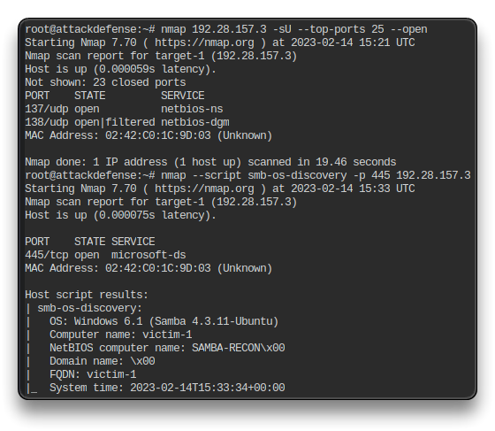

> 📌 Version of samba server is `Samba 4.3.11-Ubuntu`. NetBIOS computer name is `SAMBA-RECON`.

### metasploit

- Use the [**`Metasploit Framework`**](https://www.metasploit.com/) and its [**`msfconsole`**](https://www.offensive-security.com/metasploit-unleashed/msfconsole/) interface tool to enumerate samba version.

```bash
msfconsole
```

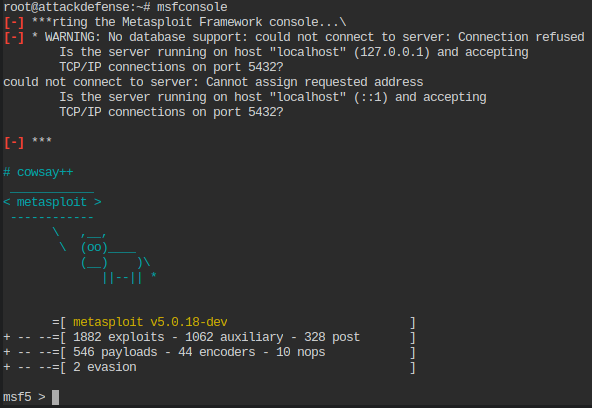

```bash
use auxiliary/scanner/smb/smb_version 
set RHOSTS 192.28.157.3
	RHOSTS => 192.28.157.3
exploit

    [*] 192.28.157.3:445      - Host could not be identified: Windows 6.1 (Samba 4.3.11-Ubuntu)
    [*] 192.28.157.3:445      - Scanned 1 of 1 hosts (100% complete)
    [*] Auxiliary module execution completed
```

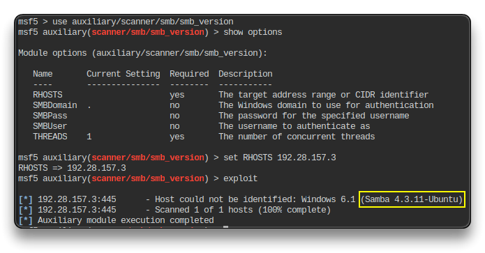

### nmblookup

> **`nmblookup`** - *NetBIOS over TCP/IP client used to lookup NetBIOS names*

```bash
nmblookup -A 192.28.157.3
```

```bash
Looking up status of 192.28.157.3
        SAMBA-RECON     <00> -         H <ACTIVE> 
        SAMBA-RECON     <03> -         H <ACTIVE> 
        SAMBA-RECON     <20> -         H <ACTIVE> 
        ..__MSBROWSE__. <01> - <GROUP> H <ACTIVE> 
        RECONLABS       <00> - <GROUP> H <ACTIVE> 
        RECONLABS       <1d> -         H <ACTIVE> 
        RECONLABS       <1e> - <GROUP> H <ACTIVE> 

        MAC Address = 00-00-00-00-00-00
```

### smbclient

> [**`smbclient`**](https://www.samba.org/samba/docs/current/man-html/smbclient.1.html) - *ftp-like client to access SMB/CIFS resources on servers*

```bash
smbclient -L 192.28.157.3 -N
```

```bash
# -L = list available services
# -N = no password prompt

        Sharename       Type      Comment
        ---------       ----      -------
        public          Disk      
        john            Disk      
        aisha           Disk      
        emma            Disk      
        everyone        Disk      
        IPC$            IPC       IPC Service (samba.recon.lab)
Reconnecting with SMB1 for workgroup listing.

        Server               Comment
        ---------            -------

        Workgroup            Master
        ---------            -------
        RECONLABS            SAMBA-RECON
```

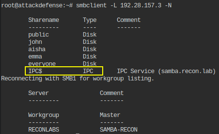

### rpcclient

> [**`rpcclient`**](https://www.samba.org/samba/docs/current/man-html/rpcclient.1.html) - tool for executing client side MS-RPC functions

```bash
rpcclient -U "" -N 192.28.157.3
```


<details>
<summary>Reveal Flag - The NetBIOS computer name is: 🚩</summary>

`SAMBA-RECON`

</details>

## Lab 4

>  🔬 [Samba Recon: Basics 2](https://attackdefense.pentesteracademy.com/challengedetails?cid=554)
>
>  - Target IP: `192.230.128.3`
>  - Linux SMB enumeration

```bash
ip -br -c a
```

```bash
eth0@if108144    UP             10.1.0.6/16 
eth1@if108147    UP             192.230.128.2/24 
```

- Target IP is `192.230.128.3`

```bash
nmap 192.230.128.3
```

```bash
139/tcp open  netbios-ssn
445/tcp open  microsoft-ds
```

```bash
rpcclient -U "" -N 192.230.128.3
```

```bash
rpcclient $> srvinfo
        SAMBA-RECON    Wk Sv PrQ Unx NT SNT samba.recon.lab
        platform_id     :       500
        os version      :       6.1
        server type     :       0x809a03
```

> 📌 OS Version of samba server is `6.1`.

### enum4linux

> [**`enum4linux`**](https://labs.portcullis.co.uk/tools/enum4linux/) - tool for enumerating data from Windows and Samba hosts

```bash
enum4linux -o 192.230.128.3
```

```bash
 ========================== 
|    Target Information    |
 ========================== 
Target ........... 192.230.128.3
RID Range ........ 500-550,1000-1050
Username ......... ''
Password ......... ''
Known Usernames .. administrator, guest, krbtgt, domain admins, root, bin, none

 ===================================================== 
|    Enumerating Workgroup/Domain on 192.230.128.3    |
 ===================================================== 
[+] Got domain/workgroup name: RECONLABS

 ====================================== 
|    Session Check on 192.230.128.3    |
 ====================================== 
[+] Server 192.230.128.3 allows sessions using username '', password ''

 ============================================ 
|    Getting domain SID for 192.230.128.3    |
 ============================================ 
Domain Name: RECONLABS
Domain Sid: (NULL SID)
[+] Can't determine if host is part of domain or part of a workgroup

 ======================================= 
|    OS information on 192.230.128.3    |
 ======================================= 
Use of uninitialized value $os_info in concatenation (.) or string at ./enum4linux.pl line 464.
[+] Got OS info for 192.230.128.3 from smbclient: 
[+] Got OS info for 192.230.128.3 from srvinfo:
        SAMBA-RECON    Wk Sv PrQ Unx NT SNT samba.recon.lab
        platform_id     :       500
        os version      :       6.1
        server type     :       0x809a03
```

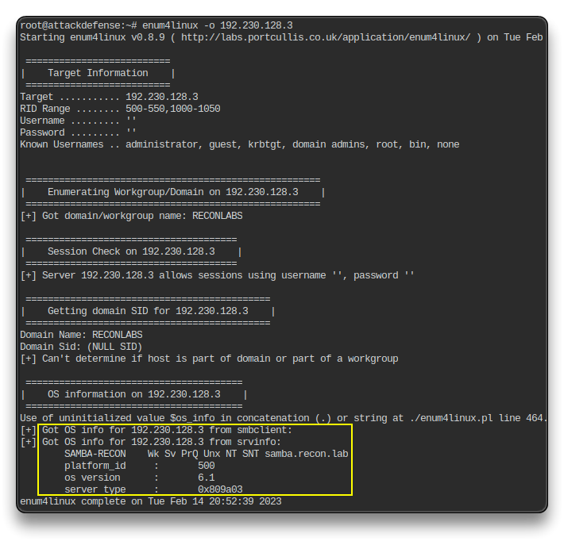

- Find samba server description

```bash
smbclient -L 192.230.128.3 -N
```

```bash
  Sharename       Type      Comment
  ---------       ----      -------
  public          Disk      
  john            Disk      
  aisha           Disk      
  emma            Disk      
  everyone        Disk      
  IPC$            IPC       IPC Service (samba.recon.lab)
Reconnecting with SMB1 for workgroup listing.
  Server               Comment
  ---------            -------

  Workgroup            Master
  ---------            -------
  RECONLABS            SAMBA-RECON
```

> 📌 Samba server description is  `samba.recon.lab`

```bash
nmap -p445 --script smb-protocols 192.230.128.3
```

```bash
Host script results:
| smb-protocols: 
|   dialects: 
|     NT LM 0.12 (SMBv1) [dangerous, but default]
|     2.02
|     2.10
|     3.00
|     3.02
|_    3.11
```

> 📌 NTLM 0.12 (SMBv1) dialects supported

```bash
msfconsole
```

```bash
use auxiliary/scanner/smb/smb2 
set RHOSTS 192.230.128.3
	RHOSTS => 192.230.128.3
exploit

    [+] 192.230.128.3:445     - 192.230.128.3 supports SMB 2 [dialect 255.2] and has been online for 3700245 hours
    [*] 192.230.128.3:445     - Scanned 1 of 1 hosts (100% complete)
    [*] Auxiliary module execution completed
```

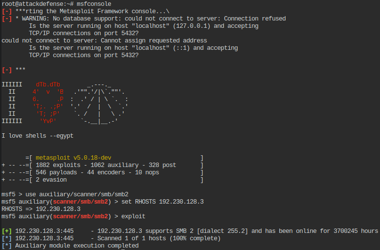

> 📌 [SMB2](https://www.rapid7.com/db/modules/auxiliary/scanner/smb/smb2/) is supported and has been online for 3700245 hours

- List all Samba server users with various techniques/tools

```bash
msfconsole
```

```bash
use auxiliary/scanner/smb/smb_enumusers
set RHOSTS 192.230.128.3
	RHOSTS => 192.230.128.3
exploit

    [+] 192.230.128.3:139     - SAMBA-RECON [ john, elie, aisha, shawn, emma, admin ] ( LockoutTries=0 PasswordMin=5 )
    [*] 192.230.128.3:        - Scanned 1 of 1 hosts (100% complete)
    [*] Auxiliary module execution completed
```

> 📌 Users are: `john`, `elie`, `aisha`, `shawn`, `emma`, `admin`

```bash
nmap -p445 --script smb-enum-users 192.230.128.3
```

```bash
Host script results:
| smb-enum-users: 
|   SAMBA-RECON\admin (RID: 1005)
|     Full name:   
|     Description: 
|     Flags:       Normal user account
|   SAMBA-RECON\aisha (RID: 1004)
|     Full name:   
|     Description: 
|     Flags:       Normal user account
|   SAMBA-RECON\elie (RID: 1002)
|     Full name:   
|     Description: 
|     Flags:       Normal user account
|   SAMBA-RECON\emma (RID: 1003)
|     Full name:   
|     Description: 
|     Flags:       Normal user account
|   SAMBA-RECON\john (RID: 1000)
|     Full name:   
|     Description: 
|     Flags:       Normal user account
|   SAMBA-RECON\shawn (RID: 1001)
|     Full name:   
|     Description: 
|_    Flags:       Normal user account
```

```bash
enum4linux -U 192.230.128.3
```

```bash
 ========================== 
|    Target Information    |
 ========================== 
Target ........... 192.230.128.3
RID Range ........ 500-550,1000-1050
Username ......... ''
Password ......... ''
Known Usernames .. administrator, guest, krbtgt, domain admins, root, bin, none

 ===================================================== 
|    Enumerating Workgroup/Domain on 192.230.128.3    |
 ===================================================== 
[+] Got domain/workgroup name: RECONLABS

 ====================================== 
|    Session Check on 192.230.128.3    |
 ====================================== 
[+] Server 192.230.128.3 allows sessions using username '', password ''

 ============================================ 
|    Getting domain SID for 192.230.128.3    |
 ============================================ 
Domain Name: RECONLABS
Domain Sid: (NULL SID)
[+] Can't determine if host is part of domain or part of a workgroup

 ============================== 
|    Users on 192.230.128.3    |
 ============================== 
index: 0x1 RID: 0x3e8 acb: 0x00000010 Account: john     Name:   Desc: 
index: 0x2 RID: 0x3ea acb: 0x00000010 Account: elie     Name:   Desc: 
index: 0x3 RID: 0x3ec acb: 0x00000010 Account: aisha    Name:   Desc: 
index: 0x4 RID: 0x3e9 acb: 0x00000010 Account: shawn    Name:   Desc: 
index: 0x5 RID: 0x3eb acb: 0x00000010 Account: emma     Name:   Desc: 
index: 0x6 RID: 0x3ed acb: 0x00000010 Account: admin    Name:   Desc: 

user:[john] rid:[0x3e8]
user:[elie] rid:[0x3ea]
user:[aisha] rid:[0x3ec]
user:[shawn] rid:[0x3e9]
user:[emma] rid:[0x3eb]
user:[admin] rid:[0x3ed]
```

- Find SID of user “admin” using rpcclient.

```bash
rpcclient -U "" -N 192.230.128.3
```

```bash
rpcclient $> enumdomusers
user:[john] rid:[0x3e8]
user:[elie] rid:[0x3ea]
user:[aisha] rid:[0x3ec]
user:[shawn] rid:[0x3e9]
user:[emma] rid:[0x3eb]
user:[admin] rid:[0x3ed]

rpcclient $> lookupnames admin
admin S-1-5-21-4056189605-2085045094-1961111545-1005 (User: 1)
```

<details>
<summary>Reveal Flag - SID of user “admin” is:  🚩</summary>

`S-1-5-21-4056189605-2085045094-1961111545-1005`

</details>

## Lab 5

>  🔬 [Samba Recon: Basics 3](https://attackdefense.pentesteracademy.com/challengedetails?cid=555)
>
>  - Target IP: `192.187.39.3`
>  - Linux SMB detailed enumeration

```bash
ip -br -c a
```

```bash
eth0@if170027    UP             10.1.0.9/16 
eth1@if170030    UP             192.187.39.2/24
```

- Target IP is `192.230.128.3`

```bash
nmap 192.187.39.3
```

```bash
139/tcp open  netbios-ssn
445/tcp open  microsoft-ds
```

- List all Samba server shares with various techniques/tools

```bash
nmap -p445 --script smb-enum-shares 192.187.39.3
```

```bash
Host script results:
| smb-enum-shares: 
|   account_used: guest
|   \\192.187.39.3\IPC$: 
|     Type: STYPE_IPC_HIDDEN
|     Comment: IPC Service (samba.recon.lab)
|     Users: 1
|     Max Users: <unlimited>
|     Path: C:\tmp
|     Anonymous access: READ/WRITE
|     Current user access: READ/WRITE
|   \\192.187.39.3\aisha: 
|     Type: STYPE_DISKTREE
|     Comment: 
|     Users: 0
|     Max Users: <unlimited>
|     Path: C:\samba\aisha
|     Anonymous access: <none>
|     Current user access: <none>
|   \\192.187.39.3\emma: 
|     Type: STYPE_DISKTREE
|     Comment: 
|     Users: 0
|     Max Users: <unlimited>
|     Path: C:\samba\emma
|     Anonymous access: <none>
|     Current user access: <none>
|   \\192.187.39.3\everyone: 
|     Type: STYPE_DISKTREE
|     Comment: 
|     Users: 0
|     Max Users: <unlimited>
|     Path: C:\samba\everyone
|     Anonymous access: <none>
|     Current user access: <none>
|   \\192.187.39.3\john: 
|     Type: STYPE_DISKTREE
|     Comment: 
|     Users: 0
|     Max Users: <unlimited>
|     Path: C:\samba\john
|     Anonymous access: <none>
|     Current user access: <none>
|   \\192.187.39.3\public: 
|     Type: STYPE_DISKTREE
|     Comment: 
|     Users: 0
|     Max Users: <unlimited>
|     Path: C:\samba\public
|     Anonymous access: READ/WRITE
|_    Current user access: READ/WRITE
```

> 📌 Available shares on the samba server are `IPC$`, `aisha`, `emma`, `everyone`, `john`, `public`.

```bash
msfconsole
```

```bash
use auxiliary/scanner/smb/smb_enumshares
set RHOSTS 192.187.39.3
exploit
```

```bash
[+] 192.187.39.3:139      - public - (DS) 
[+] 192.187.39.3:139      - john - (DS) 
[+] 192.187.39.3:139      - aisha - (DS) 
[+] 192.187.39.3:139      - emma - (DS) 
[+] 192.187.39.3:139      - everyone - (DS) 
[+] 192.187.39.3:139      - IPC$ - (I) IPC Service (samba.recon.lab)
[*] 192.187.39.3:         - Scanned 1 of 1 hosts (100% complete)
[*] Auxiliary module execution completed
```

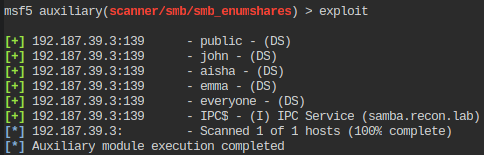

```bash
enum4linux -S 192.187.39.3
```

```bash
 ========================================= 
|    Share Enumeration on 192.187.39.3    |
 ========================================= 

   Sharename       Type      Comment
   ---------       ----      -------
   public          Disk      
   john            Disk      
   aisha           Disk      
   emma            Disk      
   everyone        Disk      
   IPC$            IPC       IPC Service (samba.recon.lab)
Reconnecting with SMB1 for workgroup listing.

   Server               Comment
   ---------            -------

   Workgroup            Master
   ---------            -------
   RECONLABS            SAMBA-RECON

[+] Attempting to map shares on 192.187.39.3
//192.187.39.3/public   Mapping: OK, Listing: OK
//192.187.39.3/john     Mapping: DENIED, Listing: N/A
//192.187.39.3/aisha    Mapping: DENIED, Listing: N/A
//192.187.39.3/emma     Mapping: DENIED, Listing: N/A
//192.187.39.3/everyone Mapping: DENIED, Listing: N/A
//192.187.39.3/IPC$     [E] Can't understand response:
NT_STATUS_OBJECT_NAME_NOT_FOUND listing \*
```

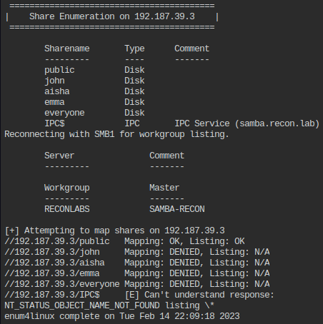

```bash
smbclient -L 192.187.39.3 -N
```

```bash
 Sharename       Type      Comment
 ---------       ----      -------
 public          Disk      
 john            Disk      
 aisha           Disk      
 emma            Disk      
 everyone        Disk      
 IPC$            IPC       IPC Service (samba.recon.lab)
Reconnecting with SMB1 for workgroup listing.

 Server               Comment
 ---------            -------

 Workgroup            Master
 ---------            -------
 RECONLABS            SAMBA-RECON
```

- Find domain groups on the samba server

```bash
enum4linux -G 192.187.39.3
```

```bash
 ============================== 
|    Groups on 192.187.39.3    |
 ============================== 

[+] Getting builtin groups:

[+] Getting builtin group memberships:

[+] Getting local groups:
group:[Testing] rid:[0x3f0]

[+] Getting local group memberships:

[+] Getting domain groups:
group:[Maintainer] rid:[0x3ee]
group:[Reserved] rid:[0x3ef]

[+] Getting domain group memberships:
enum4linux complete on Tue Feb 14 22:13:33 2023
```

```bash
rpcclient -U "" -N 192.187.39.3
```

```bash
rpcclient $> enumdomgroups
group:[Maintainer] rid:[0x3ee]
group:[Reserved] rid:[0x3ef]
```

> 📌 Available domain groups are `Maintainer`, `Reserved`

- Check if samba server is configured for printing

```bash
enum4linux -i 192.187.39.3
```

```bash
 ============================================= 
|    Getting printer info for 192.187.39.3    |
 ============================================= 
No printers returned.
```

> 📌 No printers returned.

```bash
smbclient //192.187.39.3/public -N
```

```bash
smb: \> ls
 .       D  0  Tue Feb 14 21:58:47 2023
 ..      D  0  Tue Nov 27 13:36:13 2018
 secret  D  0  Tue Nov 27 13:36:13 2018
 dev     D  0  Tue Nov 27 13:36:13 2018
# ls command
```

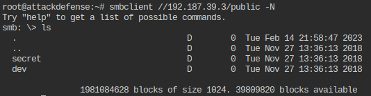

> 📌 There are 2 directories present inside `public` share: `secret` and `dev`

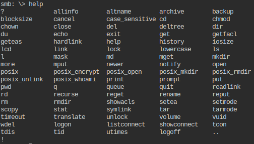

```bash
smb: \> cd secret
smb: \secret\> ls
  .     D   0  Tue Nov 27 13:36:13 2018
  ..    D   0  Tue Feb 14 21:58:47 2023
  flag  N  33  Tue Nov 27 13:36:13 2018
  1981084628 blocks of size 1024. 39614508 blocks available
  
smb: \secret\> get flag
getting file \secret\flag of size 33 as flag (32.2 KiloBytes/sec) (average 32.2 KiloBytes/sec)
smb: \secret\> exit

root@attackdefense:~# cat flag 
```

<details>
<summary>Reveal Flag:  🚩</summary>

`03ddb97933e716f5057a18632badb3b4`

</details>

------

## Lab 6

>  🔬 [Samba Recon: Dictionary Attack](https://attackdefense.pentesteracademy.com/challengedetails?cid=556)
>
>  - Target IP: `192.174.58.3`
>  - Linux SMB detailed enumeration using `word lists`

`Word lists` are lists of already known and used passwords, some of them leaked from breached websites or other services. Those passwords can be used as part of the attack via brute force tools.

In Kali Linux [wordlists](https://www.kali.org/tools/wordlists/) can be found inside `/usr/share/wordlists` directory.

```bash
gzip -d /usr/share/wordlists/rockyou.txt.gz
# Unzip rockyou.txt list
```

```bash
ip -br -c a
```

```bash
eth0@if108486    UP             10.1.0.4/16 
eth1@if108489    UP             192.174.58.2/24
```

- Target IP is `192.174.58.3`

```bash
nmap 192.174.58.3
```

```bash
139/tcp open  netbios-ssn
445/tcp open  microsoft-ds
```

- Use [`smb_login`](https://www.rapid7.com/db/modules/auxiliary/scanner/smb/smb_login) metasploit module to bruteforce *jane*'s password

```bash
msfconsole
```

```bash
use auxiliary/scanner/smb/smb_login 
set PASS_FILE /usr/share/wordlists/metasploit/unix_passwords.txt
set SMBUser jane
set RHOSTS 192.174.58.3
exploit
```

```bash
[*] 192.174.58.3:445      - 192.174.58.3:445 - Starting SMB login bruteforce
[-] 192.174.58.3:445      - 192.174.58.3:445 - Failed: '.\jane:admin',
[!] 192.174.58.3:445      - No active DB -- Credential data will not be saved!
[-] 192.174.58.3:445      - 192.174.58.3:445 - Failed: '.\jane:123456',
[-] 192.174.58.3:445      - 192.174.58.3:445 - Failed: '.\jane:12345',
[-] 192.174.58.3:445      - 192.174.58.3:445 - Failed: '.\jane:123456789',
[-] 192.174.58.3:445      - 192.174.58.3:445 - Failed: '.\jane:password',
[-] 192.174.58.3:445      - 192.174.58.3:445 - Failed: '.\jane:iloveyou',
[-] 192.174.58.3:445      - 192.174.58.3:445 - Failed: '.\jane:princess',
[-] 192.174.58.3:445      - 192.174.58.3:445 - Failed: '.\jane:1234567',
[-] 192.174.58.3:445      - 192.174.58.3:445 - Failed: '.\jane:12345678',
[+] 192.174.58.3:445      - 192.174.58.3:445 - Success: '.\jane:abc123'
[*] 192.174.58.3:445      - Scanned 1 of 1 hosts (100% complete)
```


> 📌 Jane's password is `abc123`

### hydra

- Use [`hydra` tool](https://www.kali.org/tools/hydra/) to find *admin* user password

> [**`hydra`**](https://github.com/vanhauser-thc/thc-hydra) - tool to guess/crack valid login/password pairs

```bash
hydra -l admin -P /usr/share/wordlists/rockyou.txt 192.174.58.3 smb
```

```bash
[DATA] max 1 task per 1 server, overall 1 task, 14344399 login tries (l:1/p:14344399), ~14344399 tries per task
[DATA] attacking smb://192.174.58.3:445/
[445][smb] host: 192.174.58.3   login: admin   password: password1
1 of 1 target successfully completed, 1 valid password found
```

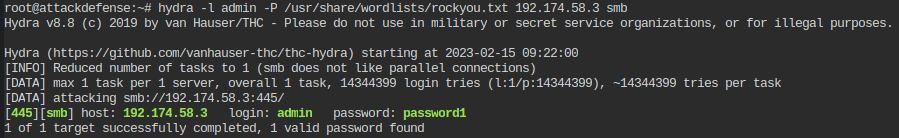

> 📌 admin's password is `password1`

- Find `smb shares` using found credentials

```bash
smbmap -u admin -p password1 -H 192.174.58.3
```

```bash
[+] Finding open SMB ports....
[+] User SMB session establishd on 192.174.58.3...
[+] IP: 192.174.58.3:445        Name: target-1                                          
   Disk     Permissions
   ----     -----------
   shawn    READ, WRITE
   nancy    READ ONLY
   admin    READ, WRITE
   IPC$     NO ACCESS
```

> 📌 *Read-only* share is `nancy`

```bash
smbclient -L 192.28.157.3 -U jane
# Use "abc123" password
```

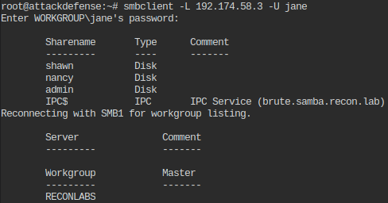

```bash
smbclient //192.174.58.3/jane -U jane
```

```bash
smb: \> ls
  .      D  0  Tue Nov 27 19:25:12 2018
  ..     D  0  Tue Nov 27 19:25:12 2018
  admin  D  0  Tue Nov 27 19:25:12 2018
  logs   D  0  Tue Nov 27 19:25:12 2018
  flag   D  0  Tue Nov 27 19:25:12 2018
  1981084628 blocks of size 1024. 48016456 blocks available
smb: \> pwd
Current directory is \\192.174.58.3\jane\
```

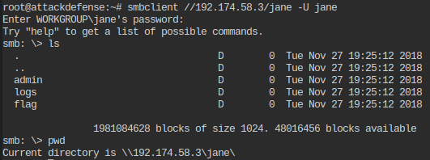

> 📌 *jane*'s share is not browsable but it exists.

```bash
smbclient //192.174.58.3/admin -U admin
# Use "password1" password
```

```bash
smb: \> ls
smb: \> cd hidden
smb: \hidden\> ls
smb: \hidden\> get flag.tar.gz 
smb: \hidden\> exit

root@attackdefense:~# tar -xf flag.tar.gz 
root@attackdefense:~# cat flag
```

```bash
smb: \> cd secret
smb: \secret\> ls
  .     D   0  Tue Nov 27 13:36:13 2018
  ..    D   0  Tue Feb 14 21:58:47 2023
  flag  N  33  Tue Nov 27 13:36:13 2018
  1981084628 blocks of size 1024. 39614508 blocks available
  
smb: \secret\> get flag
getting file \secret\flag of size 33 as flag (32.2 KiloBytes/sec) (average 32.2 KiloBytes/sec)
smb: \secret\> exit

root@attackdefense:~# cat flag 
```

<details>
<summary>Reveal Flag:  🚩</summary>

`2727069bc058053bd561ce372721c92e`

</details>

- A [named pipe](https://learn.microsoft.com/en-us/openspecs/windows_protocols/ms-wpo/4de75e21-36fd-440a-859b-75accc74487c) is a logical connection between a client and server involved in a SMB connection, similar to an open TCP port.
- Use [`pipe_auditor`](https://www.rapid7.com/db/modules/auxiliary/scanner/smb/pipe_auditor) metasploit module to enumerate the named pipes

```bash
msfconsole
```

```bash
use auxiliary/scanner/smb/pipe_auditor 
set SMBUser admin
set SMBPass password1
set RHOSTS 192.174.58.3
exploit

[+] 192.174.58.3:139      - Pipes: \netlogon, \lsarpc, \samr, \eventlog, \InitShutdown, \ntsvcs, \srvsvc, \wkssvc
[*] 192.174.58.3:         - Scanned 1 of 1 hosts (100% complete)
```

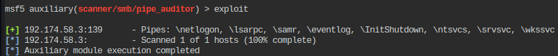

> 📌 Named pipes available over SMB are `netlogon`, `lsarpc`, `samr`, `eventlog`, `InitShutdown`, `ntsvcs`, `srvsvc`, `wkssvc`

- List users' SID by performing RID cycling.

```bash
enum4linux -r -u "admin" -p "password1" 192.174.58.3
```

```bash
[+] Enumerating users using SID S-1-22-1 and logon username 'admin', password 'password1'
S-1-22-1-1000 Unix User\shawn (Local User)
S-1-22-1-1001 Unix User\jane (Local User)
S-1-22-1-1002 Unix User\nancy (Local User)
S-1-22-1-1003 Unix User\admin (Local User)
```

> 📌 shawn SID is `S-1-22-1-1000`
>
> 📌 jane SID is `S-1-22-1-1001`
>
> 📌 nancy SID is `S-1-22-1-1002`
>
> 📌 admin SID is `S-1-22-1-1003`

------

