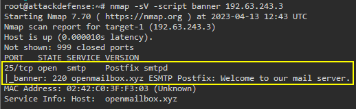
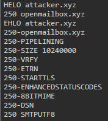
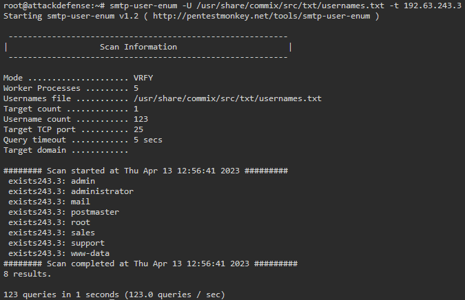
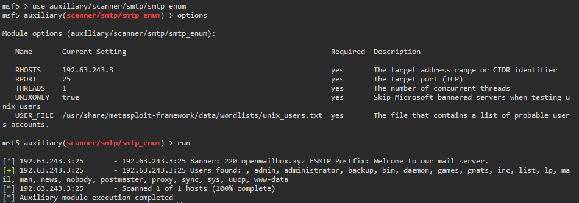
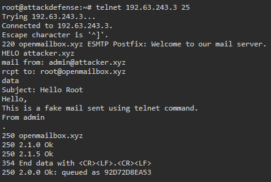
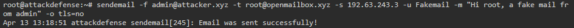

# 🔬SMTP Enum

**`SMTP`** (**S**imple **M**ail **T**ransfer **P**rotocol) - a communication protocol used for the *transmission of email*.

Default SMTP TCP port is **`25`**.

```bash
sudo nmap -p25 -sV -sC -O <TARGET_IP>
```

## Lab 1

>  🔬  [SMTP - Postfix Recon: Basics](https://www.attackdefense.com/challengedetails?cid=516)
>
>  - Target IP: `192.63.243.3`
>  - Enumeration of [Postfix](https://www.postfix.org/) server

```bash
ip -br -c a
	eth1@if130369 UP 192.63.243.2/24
```

- Target IP is `192.8.3.3`

```bash
nmap -sV -script banner 192.63.243.3
```

```bash
25/tcp open  smtp    Postfix smtpd
|_banner: 220 openmailbox.xyz ESMTP Postfix: Welcome to our mail server.
MAC Address: 02:42:C0:3F:F3:03 (Unknown)
Service Info: Host:  openmailbox.xyz
```



> 📌 SMTP server name and banner are:
>
> Server: `Postfix`
>
> Banner: `openmailbox.xyz ESMTP Postfix: Welcome to our mail server.`

- Fetch the hostname using `nc`(`netcat`)

```bash
nc 192.63.243.3 25
```

```bash
220 openmailbox.xyz ESMTP Postfix: Welcome to our mail server.
```

> 📌 SMTP server hostname is `openmailbox.xyz`

- Check if `admin` and `commander` user exists

```bash
nc 192.63.243.3 25
```

```bash
VRFY admin@openmailbox.xyz
	252 2.0.0 admin@openmailbox.xyz
# Yes "admin" exists
```

```bash
VRFY commander@openmailbox.xyz
	550 5.1.1 <commander@openmailbox.xyz>: Recipient address rejected: User unknown in local recipient table
# No "commander" doesn't exist
```

- Check supported commands/capabilities using `telnet`

```bash
telnet 192.63.243.3 25
```

```bash
HELO attacker.xyz
	250 openmailbox.xyz
EHLO attacker.xyz
    250-openmailbox.xyz
    250-PIPELINING
    250-SIZE 10240000
    250-VRFY
    250-ETRN
    250-STARTTLS
    250-ENHANCEDSTATUSCODES
    250-8BITMIME
    250-DSN
    250 SMTPUTF8
```

> 📌 Supported commands/capabilities are
>
> 

### [smtp-user-enum](https://pentestmonkey.net/tools/user-enumeration/smtp-user-enum)

> **`smtp-user-enum`** - tool for enumerating OS-level user account via the SMTP service

- Use **`smtp-user-enum`** to find common usernames from specified wordlist

```bash
smtp-user-enum -U /usr/share/commix/src/txt/usernames.txt -t 192.63.243.3
```



> 📌 There are `8` users present on the server, from the above wordlist:
>
> `admin`
>
> `administrator`
>
> `mail`
>
> `postmaster`
>
> `root`
>
> `sales`
>
> `support`
>
> `www-data`

- Use `msfconsole` to find common usernames from specified wordlist

```bash
service postgresql start && msfconsole -q
```

```bash
search type:auxiliary name:smtp
use auxiliary/scanner/smtp/smtp_enum
options
set RHOSTS 192.63.243.3
exploit
```

```bash
[+] 192.63.243.3:25 - 192.63.243.3:25 Users found: , admin, administrator, backup, bin, daemon, games, gnats, irc, list, lp, mail, man, news, nobody, postmaster, proxy, sync, sys, uucp, www-data
```

> 📌 There are `20` users present on the server, from the `/usr/share/metasploit-framework/data/wordlists/unix_users.txt` wordlist.



- Connect to SMTP service using telnet and send a fake mail to root user.

```bash
telnet 192.63.243.3 25
```

```bash
HELO attacker.xyz
mail from: admin@attacker.xyz
rcpt to: root@openmailbox.xyz
data
Subject: Hello Root
Hello,
This is a fake mail sent using telnet command.
From admin
.
```



### [sendmail](https://www.postfix.org/sendmail.1.html)

- Send a fake mail to root user using **`sendemail`** command

```bash
sendemail -f admin@attacker.xyz -t root@openmailbox.xyz -s 192.63.243.3 -u Fakemail -m "Hi root, a fake mail from admin" -o tls=no
```



------

