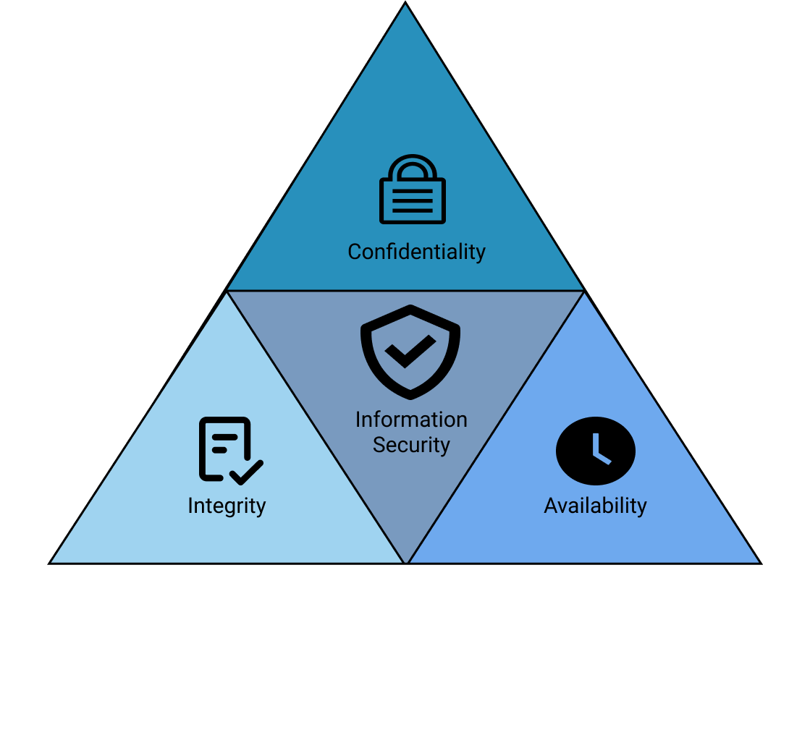

# Auditing Fundamentals

> #### ⚡ Prerequisites
>
> * Basic networks concepts
>
> #### 📕 Learning Objectives
>
> * Describe cyber security and explain cyber maturity
> * Identify common frameworks and governing regulations
> * Perform network auditing
>
> ❗ _**Authorization is required to conduct systems auditing.**_ ❗

## Cybersecurity Basics

🗒️ **Cybersecurity**, or **I**nformation **T**echnology Security, *is the process of protecting systems, networks, programs, devices and data by preventing, detecting and responding to digital attacks*. It aims to lower the risk of cyberattack and protect against the unauthorized and improper use of the involved technology.

Protected information can be:

- **PII** (**P**ersonally **I**dentifiable **I**nformation)
- Healthcare Information
- Financial Data
- Intellectual Property
- Business Secrets
- Business Operations

Data must be secured from:

- Criminals
- Competitors
- Insider Threats
- Malicious Actors

### CIA Triad

🗒️ The **CIA** Triad (**C**onfidentiality, **I**ntegrity and **A**vailability) *is a guiding model used to describe information security*, also useful for managing the products and data of research.

Policies and security controls that reduce threats to these three vital components are a part of a comprehensive *information security plan* and are balanced to meet business needs.

|      CIA Triad      | Description                                                  |
| :-----------------: | ------------------------------------------------------------ |
| **Confidentiality** | *Protecting information from unauthorized access*            |
|    **Integrity**    | *Data is trustworthy, complete, accurate and have not been accidentally altered or modified by an unauthorized user* |
|  **Availability**   | *Data is accessible when needed*                             |

### Defense in Depth

🗒️ The **Defense-in-Depth** is *a strategy that uses multiple layers of security protection* and helps reducing vulnerabilities, containing threats and mitigating risks.

Depending on *what* and *how* an organization need to secure, the strategy have to be shaped, considering a risk management plan.

🗒️ **Risk management** is *the process of identifying, assessing and controlling financial, legal, strategic and security risks to an organization’s **capital** and earnings*. It plays the ultimate factor in an organization.

## Compliance

🗒️ **Cybersecurity Compliance** *involves meeting various controls to protect the confidentiality, integrity, and availability of data*.

Compliance requirements (usually established by a regulatory authority, law, or industry group) typically involve using an array of specific organizational processes and technologies to safeguard data. Controls come from a variety of Cybersecurity frameworks and regulations, such as:

- [PCI DSS](https://www.pcisecuritystandards.org/) (Payment Card Industry Data Security Standard )
  - mandated by card brands, created to increase controls around cardholder data
  - reduce card fraud
- [GDPR](https://gdpr.eu/) (General Data Protection Regulation)
  - Data protection and privacy law in the EU (European Union) and EEA (European Economic Area)
- [HIPAA](https://www.hhs.gov/hipaa/index.html) (Health Insurance Portability and Accountability Act)
  - United States regulations for the use and disclosure of **PHI** (**P**rotected **H**ealth **I**nformation)
  - Administrative, physical, technical safeguards
- [CPPA](https://leginfo.legislature.ca.gov/faces/codes_displayText.xhtml?lawCode=CIV&division=3.&title=1.81.5.&part=4.&chapter=&article=) (California Consumer Privacy Act.)
  - enhance privacy rights and consumer protection for California (USA) residents

> 📖 [Cybersecurity Compliance: A Comprehensive Guide - Celerium](https://www.celerium.com/cyber-security-compliance-a-comprehensive-guide)

## Frameworks and Maturity

🗒️ [Cybersecurity **Frameworks**](https://www.celerium.com/cybersecurity-frameworks-a-comprehensive-guide) are *sets of controls that represents a fully functional cybersecurity program when met*.

- [NIST Cybersecurity Framework](https://www.nist.gov/cyberframework) (National Institute of Standards and Technology)
  - Identify, Protect, Detect, Respond, Recover - best practices
  - Applies to any organization
  - [NIST 800-53](https://csrc.nist.gov/Projects/risk-management/sp800-53-controls/release-search) disegned to apply to U.S. Federal Government agencies.
- [ISO/IEC 27001](https://www.iso.org/isoiec-27001-information-security.html) (International Organization for Standardization and the International Electrotechnical Commission)
  - Information security management systems - Requirements
  - [ISO/IEC 27002](https://www.iso.org/standard/75652.html) - Code of practice for information security controls
- [COBIT by ISACA](https://www.isaca.org/resources/cobit)
  - business and generic IT management focused
- [CIS](https://www.cisecurity.org/) (Center for Information Security)
  - 18 CIS Controls for mitigate the most known cyber attacks
- [CMCC](https://dodcio.defense.gov/CMMC/) (Cybersecurity Maturity Model Certification)
  - Simplifies compliance by allowing self-assessment for some requirements
  - Applies priorities for protecting Department of Defense (DoD) information
  - Reinforces cooperation between the DoD and industry in addressing evolving cyber threats
- [ASD Essential 8](https://www.upguard.com/blog/essential-eight) (Australian Signals Directorate)

## Auditing

