# 🔬Burp Suite Basics - Directory Enumeration

The Kali OS GUI instance is web hosted on the INE website, where:

* The bWAPP web application is accessible at `demo.ine.local` domain.
  * Info on bWAPP insecure web app [here](http://www.itsecgames.com/index.htm).

> 📌 Another deliberately vulnerable open-source web app is [Mutillidae II](https://github.com/webpwnized/mutillidae). INE provides another similar lab with Mutillidae II to test and learn Burp Suite.

_Objective_: User Burp Suite and explore its different functionalities as Site Map, Proxy history, scope, Repeater, basic directory enumeration attack with Intruder.

_**Tools**_ used:

* **`Burp Suite`**
* A web browser
* Wordlist: `/usr/share/wordlists/dirb/common.txt`

## SOLUTION

* Check if the provided machine is reachable:
  * **`ping demo.ine.local`**
* Scan for open ports:
  * **`nmap demo.ine.local`**

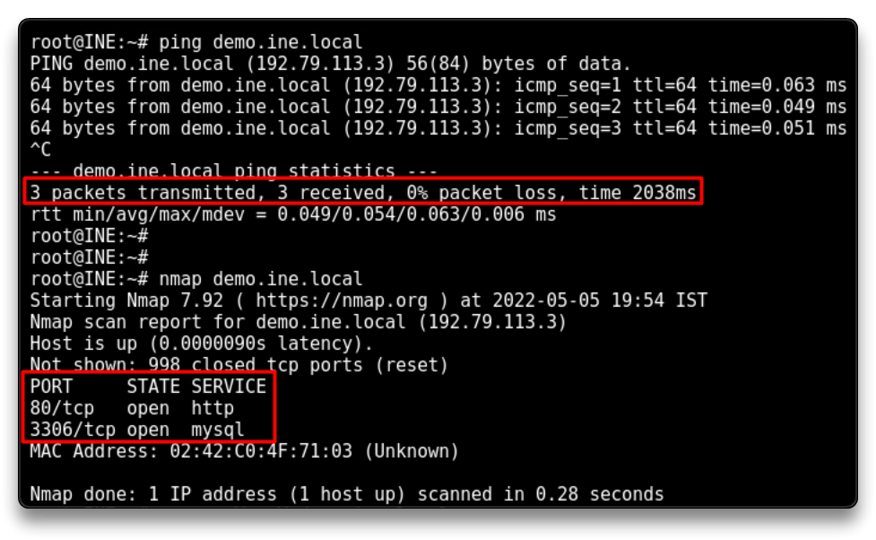

*   For a more advanced scan:

    * **`nmap -sC -sV demo.ine.local`**

    ```shell
    root@INE:~# nmap -sC -sV demo.ine.local
    Starting Nmap 7.92 ( https://nmap.org ) at 2022-05-05 19:55 IST
    Nmap scan report for demo.ine.local (192.79.113.3)
    Host is up (0.0000080s latency).
    Not shown: 998 closed tcp ports (reset)
    PORT     STATE SERVICE VERSION
    80/tcp   open  http    Apache httpd 2.4.7 ((Ubuntu))
    | http-git: 
    |   192.79.113.3:80/.git/
    |     Git repository found!
    |     Repository description: Unnamed repository; edit this file 'description' to name the...
    |     Remotes:
    |_      https://github.com/fermayo/hello-world-lamp.git
    | http-cookie-flags: 
    |   /: 
    |     PHPSESSID: 
    |_      httponly flag not set
    | http-robots.txt: 5 disallowed entries 
    |_/ /admin/ /documents/ /images/ /passwords/
    | http-title: bWAPP - Login
    |_Requested resource was login.php
    |_http-server-header: Apache/2.4.7 (Ubuntu)
    3306/tcp open  mysql   MySQL 5.5.47-0ubuntu0.14.04.1
    | mysql-info: 
    |   Protocol: 10
    |   Version: 5.5.47-0ubuntu0.14.04.1
    |   Thread ID: 10
    |   Capabilities flags: 63487
    |   Some Capabilities: ODBCClient, InteractiveClient, IgnoreSigpipes, SupportsCompression, DontAllowDatabaseTableColumn, LongColumnFlag, ConnectWithDatabase, Speaks41ProtocolOld, SupportsTransactions, FoundRows, LongPassword, SupportsLoadDataLocal, Support41Auth, Speaks41ProtocolNew, IgnoreSpaceBeforeParenthesis, SupportsMultipleStatments, SupportsMultipleResults, SupportsAuthPlugins
    |   Status: Autocommit
    |   Salt: AsA)Gjb.[aT`hhRB4|54
    |_  Auth Plugin Name: mysql_native_password
    MAC Address: 02:42:C0:4F:71:03 (Unknown)
    
    Service detection performed. Please report any incorrect results at https://nmap.org/submit/ .
    Nmap done: 1 IP address (1 host up) scanned in 6.74 seconds
    ```

Ports **80** (HTTP) and **3306** (MySQL) are open.

### Burp Proxy

* Start BurpSuite via the GUI or via terminal (`burpsuite`) and create a temporary project with default configurations.
* Configure Proxy listener inside **Proxy - Options** window.

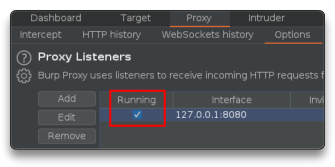

* Turn Intercept mode on from the **Proxy - Intercept** window.
  * Use the Burp's embedded browser or configure external browser to use the Burp proxy (FoxyProxy plugin used in this case)

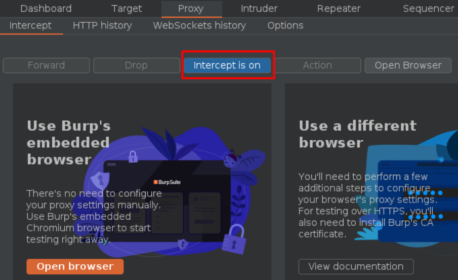

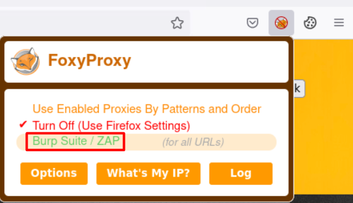

* Browse to `http://demo.ine.local/`
  * The page doesn't load, because the request is forwarded to the Burp proxy listener.
  * **Proxy - Intercept** tabs are marked with orange. The proxy is waiting for an action.

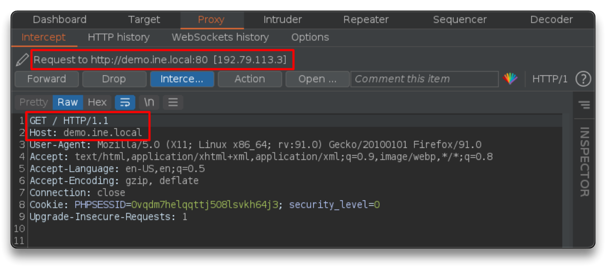

1. **`Forward`** option - send the request as is
2. **`Drop`** option - drop the intercepted request
3. **`Action`** option - tamper with the request

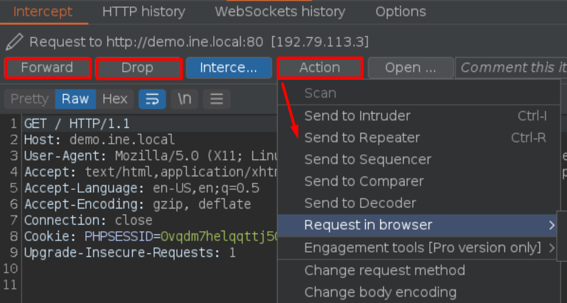

* _Forwarding_ this request, other `GET /portal.php HTTP/1.1` and `GET /login.php HTTP/1.1` request are being made, until the webpage is shown.

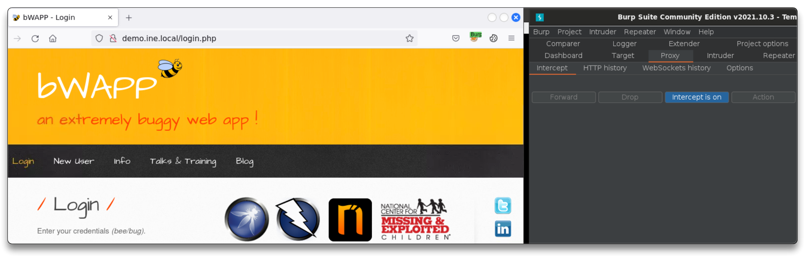

* Turn off intercept mode by clicking on the **`Intercept is on`** button, the web page will load without interception.
* Since Burp proxy is enabled in the browser, every request still get logged in the **Proxy - HTTP history** tab.
  * other Firefox requests are listed, use the Host column to sort the list.

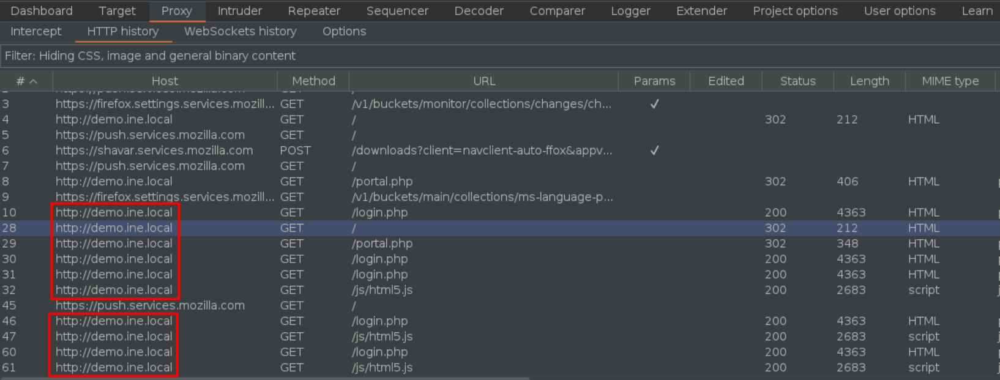

### Burp Target

> 📕 _The_ [_site map_](https://portswigger.net/burp/documentation/desktop/tools/target/site-map) _aggregates all of the information that Burp has gathered about applications. You can filter and annotate this information to help manage it, and also use the site map to drive your testing workflow._

* A site map is built when Burp proxy intercepts the requests, check it in the **Target - Site map** tab.
  * targets
  * list of resources
  * requests & responses for those resources

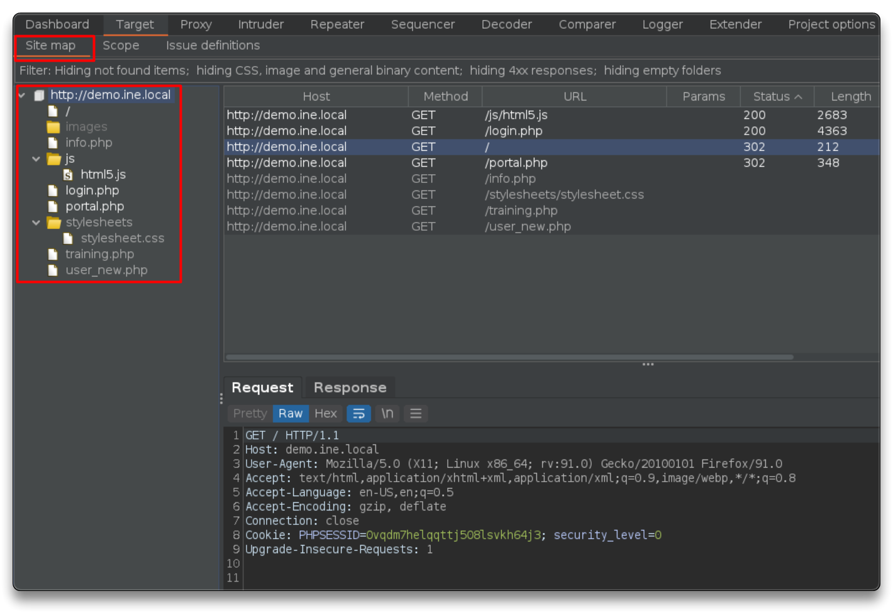

* Interested target web app can be configured in the **Target - Scope** tab.
  * Add the URL to the target scope via the `Add` button or by right-clicking + `Add to scope` option in the Site Map list.

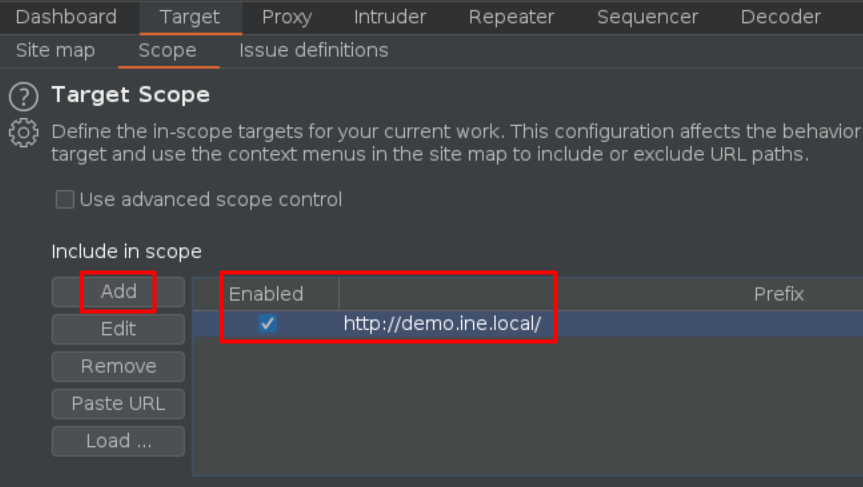

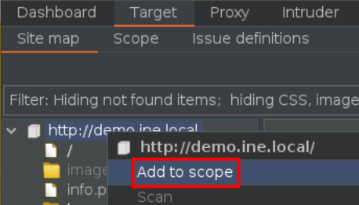

* _Out-of-scope Proxy traffic is disabled_, so URLs with different prefix than the target are not logged in the HTTP history.

### Burp Intruder

* Burp intruder can be configured to launch a _**Directory Enumeration** attack_.
  * Right click a request in the HTTP history tab and send it to the Intruder (**`CTRL+I`**).
  * Target fields are already been set.
  * Clean Payload Position with **`Clear §`** button in the **Intruder - Positions** tab, removing all the § markers from the payload.

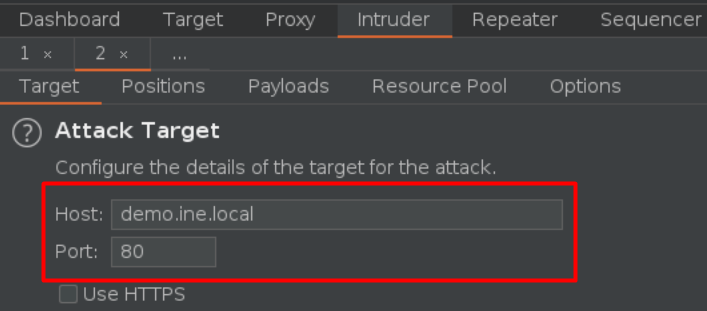

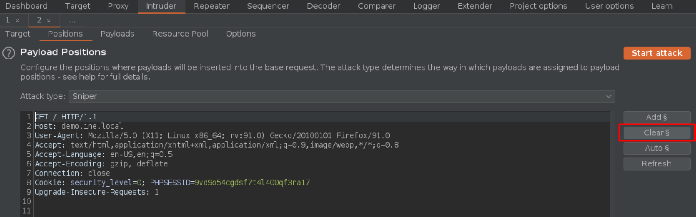

* Modify the payload by setting a `§path§` variable with the **`Add §`** button.
  * This will make the Intruder send GET requests to many locations, supplied next with a wordlist.

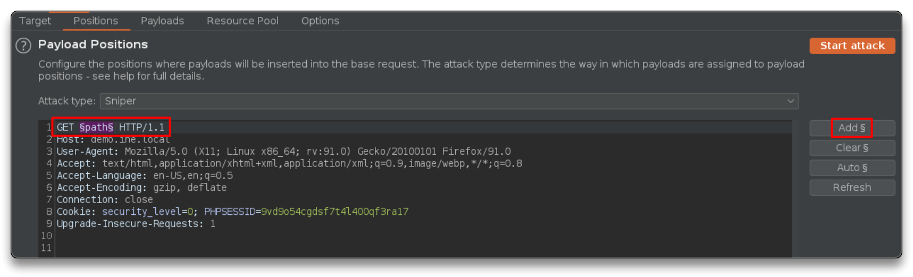

*   Specify the wordlist in the **Intruder - Payloads - Payload Options** section:

    * BurpSuite Community Edition = time throttled attacks!
    * Enter the next new items, some knownd words (e.g. from the _`http://demo.ine.local/robots.txt`_ file):

    > admin documents images passwords

    * Load a wordlist using the `Load ...` button - **/usr/share/wordlists/dirb/common.txt**

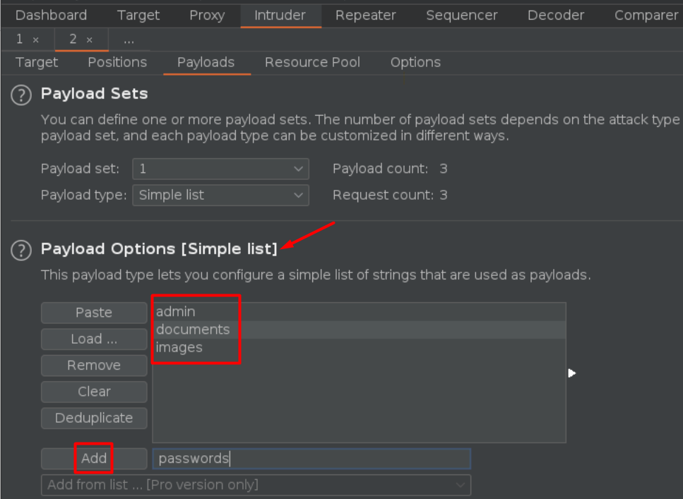

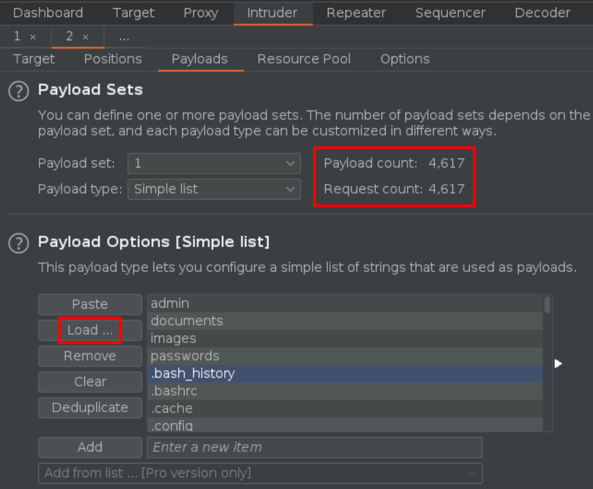

* Add a **Payload Processing** rule, in this case prepending a forward slash (**/**) to all the accessed resources.

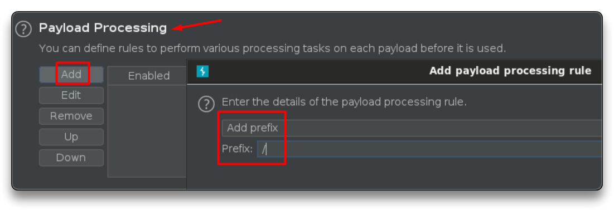

* Uncheck **`URL-encode ...`** in the **Payload Encoding** to make Burp not encode the payload (including the **/**).

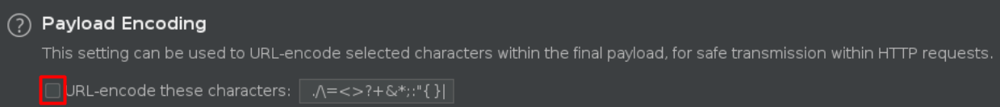

* From the **Intruder - Options - Redirection** section, configure the intruder to _always follow redirections_.

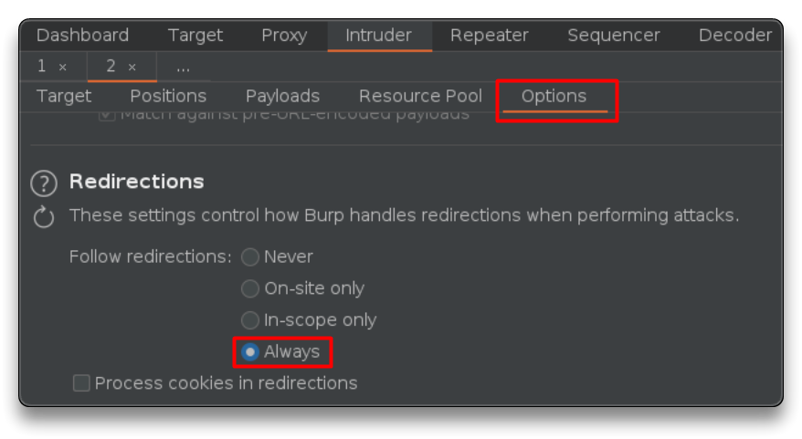

* Launch the attack with the **Start attack** button, a new windows will appear with the attack results/progress.
  * Sort the list by Status.
  * For the _robots.txt entries_ there are 2 requests/responses because of the redirection.
    * Response 1 = `HTTP/1.1 301 Moved Permanently`
  * Every entry can be double-clicked to have the result in a separate window.

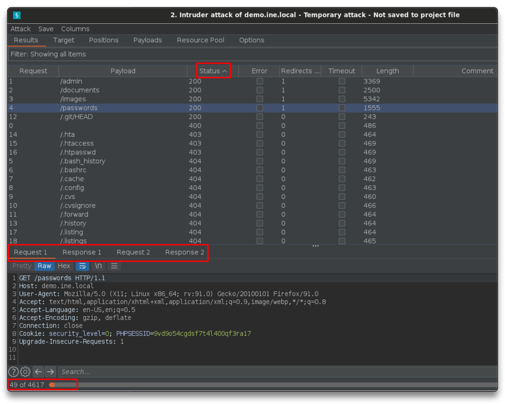

### Burp Repeater

* Select the `/passwords` Payload and send it to the Repeater (**`CTRL+R`**) for tampering with the request.
  * Meanwhile, Intruder attack can be stopped by closing its window.
* **`Send`** the request in the Repeater and use the `Follow redirection` button to get the _200 OK_ status code.

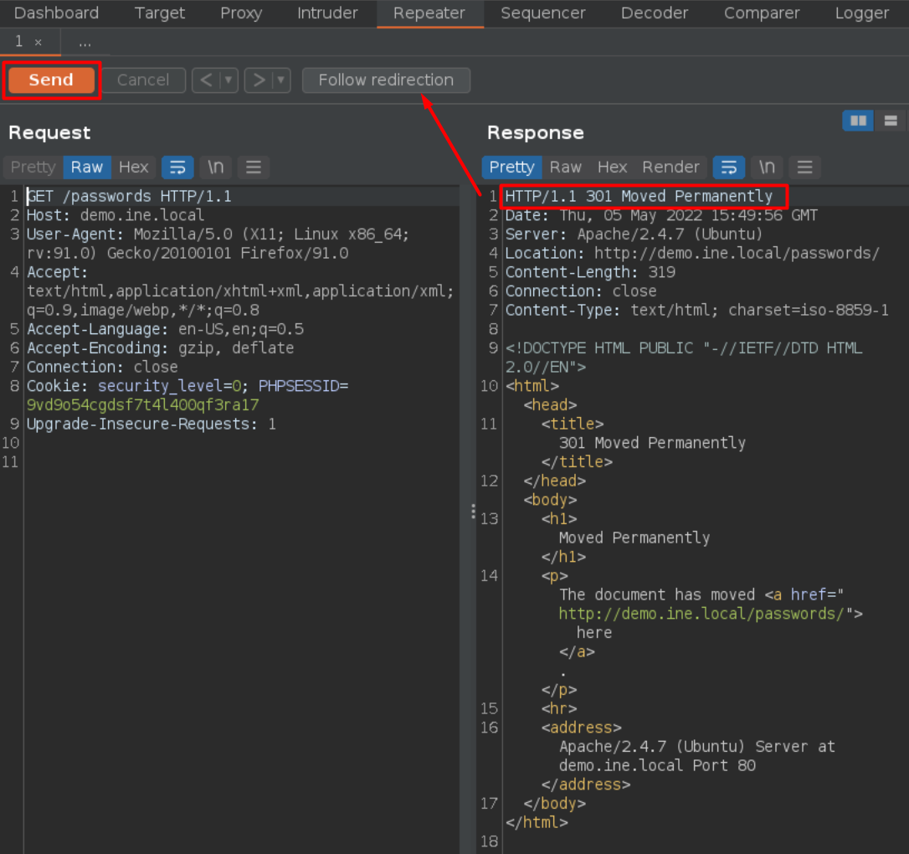

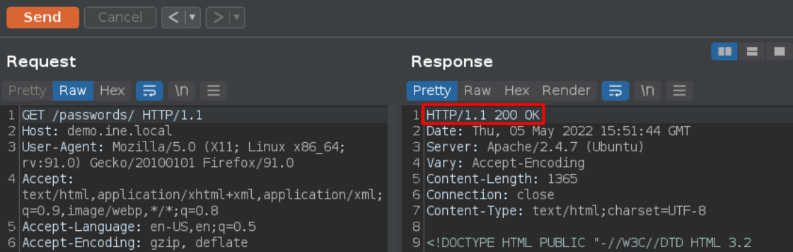

* Right click on the Response body and copy its URL with the `Show response in browser` button.

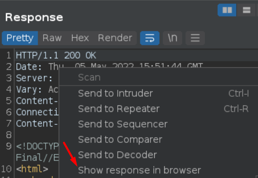

* Paste the copied URL in the browser and check the response:

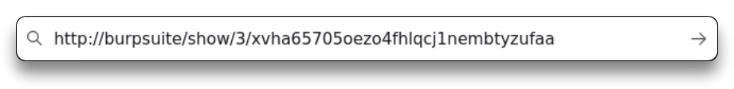

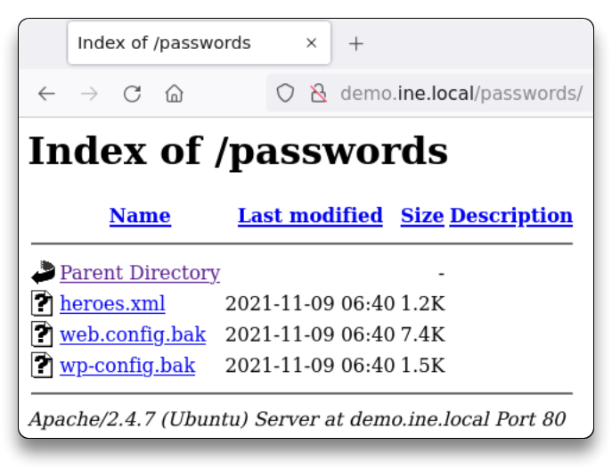

* From the Repeater, send a request to fetch `wp-config.bak`

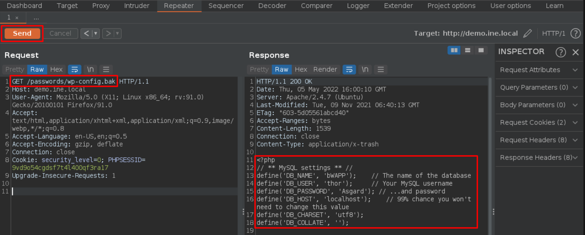

* Repeater issued requests can be _navigated_ back and forth with the arrow buttons.

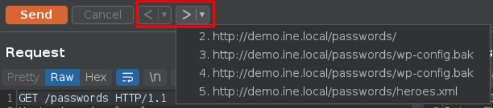

> 📍 Lab done!
