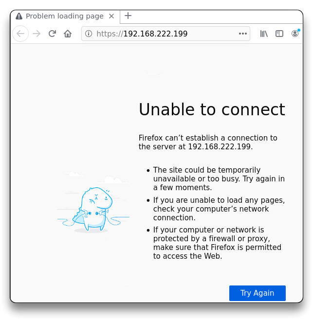

# 🔬Find the Secret Server

The Kali OS GUI instance is web hosted on the INE website, where:

* `10.175.34.0/24` - is the network the Kali instance is connected to.
* `172.16.88.81` - Company web server inside network 172.16.88.0/24.
* `192.168.222.199` - Secret web server inside network 192.168.222.0/24.
* `192.168.241.12` - Test web server inside network 192.168.241.0/24.

_Objective_: Configure the routes on the Kali machine to reach all the hosts in the networks.

## SOLUTION

*   Check Kali instance current routes and Kali's IP address:

    * **`route`**
    * **`ip -br -c a`**

    ```shell
    └─# route
    Kernel IP routing table
    Destination     Gateway         Genmask         Flags Metric Ref    Use Iface
    default         10.1.0.1        0.0.0.0         UG    0      0        0 adlab0
    10.1.0.0        0.0.0.0         255.255.255.0   U     0      0        0 adlab0
    10.175.34.0     0.0.0.0         255.255.255.0   U     0      0        0 eth1
    172.16.88.0     10.175.34.1     255.255.255.0   UG    0      0        0 eth1
    192.168.241.0   10.175.34.1     255.255.255.0   UG    0      0        0 eth1
    └─# ip -br -c a
    lo               UNKNOWN        127.0.0.1/8 ::1/128 
    adlab0           UP             10.1.0.5/24 fe80::a00:27ff:fef9:76b6/64 
    eth1             UP             10.175.34.140/24 fe80::a00:27ff:fed4:ee5d/64 
    eth2             UP 
    ```

    * `10.175.34.1` is the _default gateway_ to reach other networks outside the 10.175.34.0/24 network.
    * The last 2 routes are used for communications to the Company and Test web servers, reachable via HTTP.
    * Tried **`ping`** and access the secret webserver at `http://192.168.222.199`, with no response:

    ```shell
    └─# ping 192.168.222.199
    PING 192.168.222.199 (192.168.222.199) 56(84) bytes of data.
    From 10.1.0.5 icmp_seq=1 Destination Host Unreachable
    From 10.1.0.5 icmp_seq=2 Destination Host Unreachable
    ^C
    --- 192.168.222.199 ping statistics ---
    7 packets transmitted, 0 received, +7 errors, 100% packet loss, time 7151ms
    pipe 4
    ```



*   Secret server is not accessible at `192.168.222.199`. Manually add one more route in order to access its network `192.168.222.0/24` through Kali's gateway `10.175.34.1`.

    * **`ip route help`** - `ip route` command help
    * **`ip route add 192.168.222.0/24 via 10.175.34.1 dev eth1`**
    * **`route`** - check current routes
    * **`ping 192.168.222.199`** - check pinging the web server, should be working (not necessary, ICMP protocol)

    ```shell
    └─# ip route
    default via 10.1.0.1 dev adlab0 onlink 
    10.1.0.0/24 dev adlab0 proto kernel scope link src 10.1.0.5 
    10.175.34.0/24 dev eth1 proto kernel scope link src 10.175.34.140 
    172.16.88.0/24 via 10.175.34.1 dev eth1 
    192.168.241.0/24 via 10.175.34.1 dev eth1 
    
    └─# ip route add 192.168.222.0/24 via 10.175.34.1 dev eth1
    
    └─# route           
    Kernel IP routing table
    Destination     Gateway         Genmask         Flags Metric Ref    Use Iface
    default         10.1.0.1        0.0.0.0         UG    0      0        0 adlab0
    10.1.0.0        0.0.0.0         255.255.255.0   U     0      0        0 adlab0
    10.175.34.0     0.0.0.0         255.255.255.0   U     0      0        0 eth1
    172.16.88.0     10.175.34.1     255.255.255.0   UG    0      0        0 eth1
    192.168.222.0   10.175.34.1     255.255.255.0   UG    0      0        0 eth1
    192.168.241.0   10.175.34.1     255.255.255.0   UG    0      0        0 eth1
    
    └─# ping 192.168.222.199                                  
    PING 192.168.222.199 (192.168.222.199) 56(84) bytes of data.
    64 bytes from 192.168.222.199: icmp_seq=1 ttl=63 time=1.70 ms
    64 bytes from 192.168.222.199: icmp_seq=2 ttl=63 time=0.857 ms
    ```
* After the route was successfully added, navigate to `http://192.168.222.199` in the web browser:


> 📍 Lab solved!
