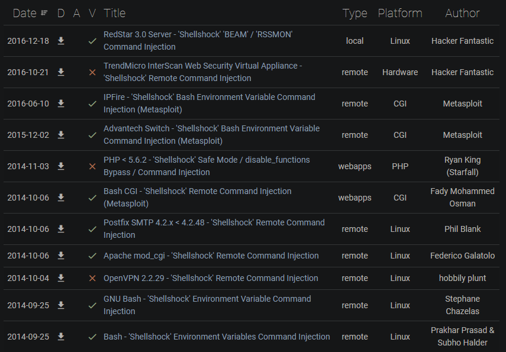

# 🐧 Linux Attacks

## Linux Vulnerabilities

**[GNU/Linux](https://www.gnu.org/home.en.html)** is a free and open source operating system, combination of the Linux kernel and the GNU toolkit software collection, developed by Richard Stallman.

- Linux kernel is the core of the O.S.
- Linux distributions are variants of the same O.S.
- Typically deployed as a **server** O.S.
  - Linux server services and protocols can provide with an access vector that an attacker can use

| Protocol/Service                                             | Ports          | Purpose                                                      |
| ------------------------------------------------------------ | -------------- | ------------------------------------------------------------ |
| [**Apache Web Server**](https://httpd.apache.org/)           | TCP `80`/`443` | Open source cross-platform web server                        |
| [**SSH**](https://en.wikipedia.org/wiki/Secure_Shell) (Secure Shell) | TCP `22`       | Cryptographic remote access protocol, used for operating network services securely over an unsecured network. Secure successor of `telnet` |
| [**FTP**](https://en.wikipedia.org/wiki/File_Transfer_Protocol) (File Transfer Protocol) | TCP `21`       | Communication protocol used for file sharing between a server and a client, over TCP |
| [**SAMBA**](https://www.samba.org/samba/what_is_samba.html)  | TCP `445`      | Open source implementation of the `SMB` protocol. Enabled Unix machines to communicate with Windows machines in a network |

## Linux Exploitation

### Apache - ShellShock

- [CVE-2014-6271](https://nvd.nist.gov/vuln/detail/CVE-2014-6271)

> GNU Bash through 4.3 processes trailing strings after function definitions in the values of environment variables, which allows remote attackers to ***execute arbitrary code** via a crafted environment, as demonstrated by vectors involving the ForceCommand feature in **OpenSSH** sshd, the mod_cgi and mod_cgid modules in the **Apache HTTP Server**, scripts executed by unspecified DHCP clients, and other situations in which setting the environment occurs across a privilege boundary from Bash execution*, aka **ShellShock**.
>
> - `Bash` shell since v.1.3
> - The `Bash` mistakenly exectutes trailing commands after a series of characters
> - Apache web servers that run CGI or `.sh` scripts are also vulnerable

🗒️ [**Bash**](https://www.gnu.org/software/bash/) - **Nix* shell part of the GNU project and default shell for most Linux distros.

🗒️ **CGI** (**C**ommond **G**ateway **I**nterface) - Apache executes arbitrary commands on the Linux system and the output displayed on the web server.

#### ShellShock Exploitation

1. Locate a script or input vector (legitimate Apache CGI scripts) to communicate with Bash
2. Input special characters within the HTTP headers (e.g. `user-agent`)
3. When CGI is executed, the web server will run it with Bash in a new process

The exploitation can be done manually and automatically.

> 🔬 Check the [Bash - ShellShock Lab here](linux-attacks/bash-shell.md)

### FTP

🗒️ [**FTP**](https://en.wikipedia.org/wiki/File_Transfer_Protocol) (File Transfer Protocol) - facilitate file sharing between a server and clients. Used for transfering files to and from a web server (`e.g.` CPanel or FTP credentials).

- Port: **`21`** (TCP) - default
- *User Authentication* -  `username` & `password`
  - ***anonymous*** access may be configured on FTP - no credentials needed

#### FTP Exploitation

1. Credentials can be **brute-forced** on the FTP server
2. Exploit inherent vulnerability within FTP service

> 🔬 Check the [FTP Brute force Lab here](linux-attacks/ftp-unix.md)

### SSH

🗒️ [**SSH**](https://en.wikipedia.org/wiki/Secure_Shell) (**S**ecure **Sh**ell) - cryptographic remote administration protocol, tipically used for servers remote access

- Port: **`22`** (TCP) - default
- SSH Authentication:
  - *User Authentication* -  `username` & `password`
  - `Key` based, 2 key pairs (**public** and **private** keys) - no username and password

#### SSH Exploitation

1. Credentials can be **brute-forced** on the SSH
2. With SSH legitimate credentials the attacker gain access to a full shell, with the utilized user account's privileges

> 🔬 Check the [SSH Brute force Lab here](linux-attacks/ssh-unix.md)

### SAMBA

🗒️ [**SAMBA**](https://www.samba.org/samba/what_is_samba.html) - network file sharing protocol, for file and peripherals sharing on a LAN. It is the Linux implementation of SMB

- Port: **`445`** (TCP)
- Not pre-packed, not a common running service
- *User Authentication* -  `username` & `password`

#### SAMBA Exploitation

1. Credentials can be **brute-forced**
2. Use SMBMap or `smbclient` to retrieve information

> 🔬 Check the [SAMBA Brute force Lab here](linux-attacks/samba-unix.md)

## Linux Privilege Escalation

## Linux Credential Dumping

