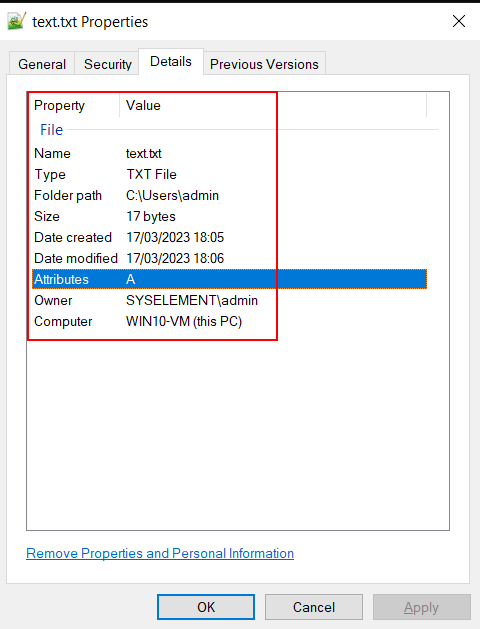
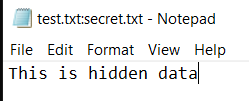
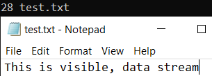
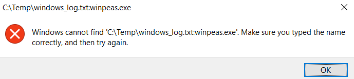
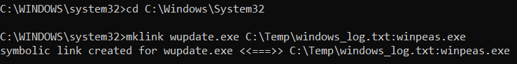

# 🔬Alternate Data Stream

## Lab 1 (Extra)

> 🔬 **Home Lab**
>
> I will use a *Windows 10 Virtual Machine* for this demonstration

- Open a Command Prompt (`cmd`)

```bash
notepad text.txt
```

- Check the Resource Stream (metadata) of the file




```bash
notepad test.txt:secret.txt
# secret.txt contains the Resource Stream

notepad test.txt
# normal Data Stream
```





`e.g.` - Download latest [winPEASx64_ofs.exe](https://github.com/carlospolop/PEASS-ng/releases/tag/20230312) (*Antivirus may block the file*), rename it to `payload.exe` and move it to `C:\Temp` directory

- Using the `type` command, redirect the output into a new legitimate text file, passing in the actual executable into the text file resource stream.

```bash
type payload.exe > windows_log.txt:winpeas.exe
del payload.exe
```

- `windows_log.txt` file can be filled with legitimate logs data to make it as realistic as possible
- Start the hidden executable

```bash
start windows_log.txt:winpeas.exe
```



- Open an elevated `cmd` and create a symbolic link

```bash
cd C:\Windows\System32
mklink wupdate.exe C:\Temp\windows_log.txt:winpeas.exe
```



- Run `wupdate.exe` to launch the `winpeas.exe` payload from the Resource stream of the windows_log.txt file

```bash
wupdate
```

> 📌 Same as above procedure can be done with a malicious `msfvenom` payload.

------

