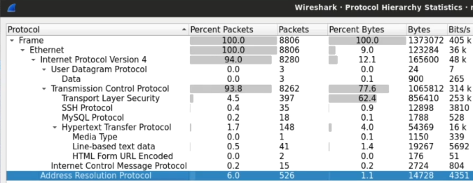

# Network Based Attacks

> #### ⚡ Prerequisites
>
> * Basic Cybersecurity & Network Concepts
>
> #### 📕 Learning Objectives
>
> * Describe service related **Network Attacks**
> * Identify network traffic and perform packet analysis
> * Perform **MITM (Man in the Middle)** attacks
>
> #### 🔬 Training list - PentesterAcademy/INE Labs
>
> `subscription required`
>
> - [Tshark Traffic Analysis](https://attackdefense.com/listing?labtype=traffic-analysis&subtype=tshark-basics)
> - [WIFI Traffic Analysis](https://attackdefense.com/listing?labtype=wifi-security-basics&subtype=wifi-security-basics-traffic-analysis)

🗒️ **Network based attacks** are attacks targeted towards specific network traffic and services.

- ARP
- DHCP
- SMB
- FTP
- Telnet
- SSH

🗒️ **MITM** (**M**an **I**n **T**he **M**iddle) is a type of cybersecurity attack that *allows the attacker to eavesdrop/listen on the legitimate communication between two targets*.

`e.g.`

- [**ARP Poisoning**](https://medium.com/geekculture/understanding-arp-poisoning-mitm-attack-7b12a3b061bd) - intercept communication through broadcasting ARP packets and waiting for answers from other machines.
- **Promiscuous mode** - listen to all the traffic on a network

> 🔬 Check some `Wireshark` traffic sniffing in [this lab](../exam-preparation-labs/p.t.-prerequisites-labs/http-s-traffic-sniffing.md)

- `e.g.` Capture a `nmap` scan traffic with  **`Wireshark`**
  - Check the interface before beginning the capture
  - Protocol Hierarchy Statistics

